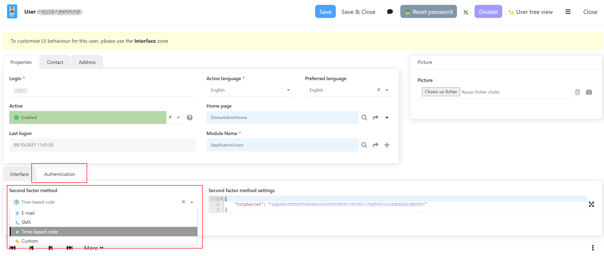
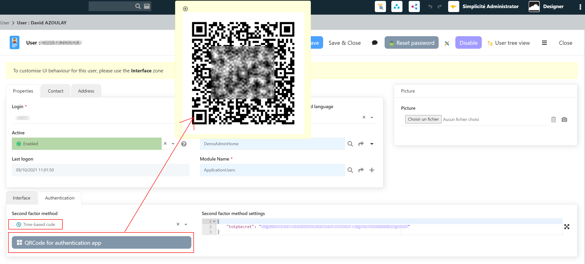

Internal authentication tips and tricks
=======================================

Second authentication factor (2FA)
----------------------------------

As of **version 5.2** it is possible to configure a second authentication factor
on the internal authentication.

### Configurable 2FA

Configurable 2FA options are:



- Email OTP: a one time code is sent on the user's email address (this requires that a SMTP service is configured on your instance)
- SMS OTP: a one time code is sent by text message on the user's mobile phone number (this require that a SMS service is configured on your instance)
- TOTP: a time-based one time password is provided by an authentication application. The QR-code to configure the authentication application can be displayed from the user's form.



### Custom 2FA

A custom 2FA mode is implementable using the dedicated `initMFA` and `checkMFA` platform hooks.

- `initMFA` allow you to initialize a second factor (e.g.: generate a one time code for the entered login and send it by an appropriate canal)
- `checkMFA` allow you to check the second factor against what has been generated

Anti brute-force attacks
------------------------

As of **version 5.1** it is possible to implement a logic for blocking/limiting "brute force" attacks
or any abusive number of attempts to log in using the internal authentication.

A typical implementation relies on the `preAuth` and `postAuth` platform hooks.

The simple example bellow quarantines a login for a configurable number of minutes after
a configurable number of failed login:

```java
package com.simplicite.commons.TestJava;

import java.util.Date;

import com.simplicite.util.AppLog;
import com.simplicite.util.Grant;
import com.simplicite.util.Tool;

public class PlatformHooks extends com.simplicite.util.engine.PlatformHooksInterface {
	private static final int NB_FAILURES = 3;
	private static final int NB_MINUTES = 5;
	
	private class Quarantine {
		public int count;
		public long date;

		public Quarantine(int count) {
			this.count = count;
			this.date = new Date().getTime();
		}
		
		public Quarantine(String q) {
			String[] qs = q.split(";");
			count = Tool.parseInt(qs[0]);
			date = Tool.parseLong(qs[1]);
		}
		
		@Override
		public String toString() {
			return count + ";" + date;
		}
	}

	private static final String QUARANTINE = "LOGIN_QUARANTINE_";

	private Quarantine getQuarantine(Grant sys, String login) {
		String q = sys.getParameter(QUARANTINE + login); // non persistent
		//String q = sys.getSystemParam(QUARANTINE + login); // persistent
		return Tool.isEmpty(q) ? null : new Quarantine(q);
	}

	private void setQuarantine(Grant sys, String login, Quarantine quarantine) {
		// Store as a private system parameter
		sys.setParameter(QUARANTINE + login, quarantine.toString()); // non persistent
		//sys.setSystemParam(QUARANTINE + login, quarantine.toString(), true, false, false); // persistent
	}

	private void delQuarantine(Grant sys, String login) {
		sys.removeParameter(QUARANTINE + login); // non persistent
		//sys.setSystemParam(QUARANTINE + login, null); // persistent
	}

	@Override
	public String preAuth(Grant sys, String provider, String login, String password) {
		Quarantine q = getQuarantine(sys, login);
		// If the number of failures has reached the limit...
		if (q != null && q.count >= sys.getIntParameter("LOGIN_QUARANTINE_NB_FAILURES", NB_FAILURES)) {
			// ...and the quarantine delay is not expired...
			int nbMin = sys.getIntParameter("LOGIN_QUARANTINE_NB_MINUTES", NB_MINUTES);
			if (new Date(q.date + nbMin * 60000).after(new Date()))
				// ...reject auth request
				return "Too many failures, try again in " + nbMin + " minutes";
			else
				// ...de-quarantine
				delQuarantine(sys, login);
		}	
		return null;
	}

	@Override
	public String postAuth(Grant sys, String provider, String login, boolean success) {
		// In case of failure...
		if (!success) {
			// ...count nb of failures...
			Quarantine q = getQuarantine(sys, login);
			setQuarantine(sys, login, new Quarantine(q == null ?  1 : q.count + 1));
		} else {
			// De-quarantine in case of success
			delQuarantine(sys, login);
		}
		return null;
	}
}
```

During the first erroneous sign in attempts, the usual message indicating a
credentials check failure is returned.

Then after a configured number of erroneous sign in attempts, no further credential
check is done for the configured next number of minutes and a custom message is returned.
