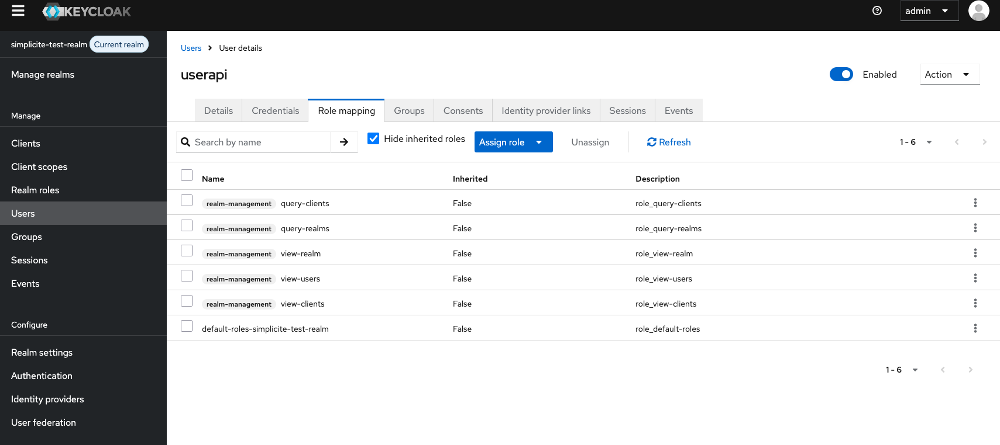
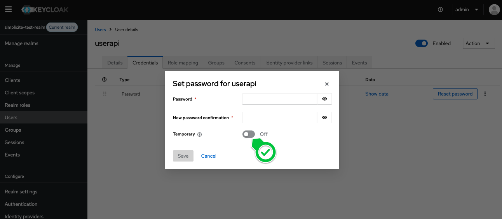
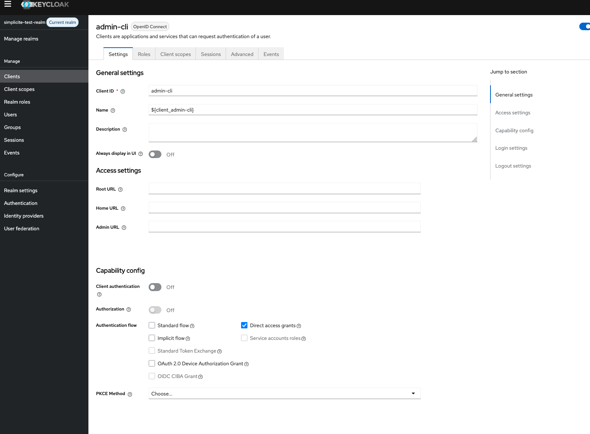

KeyCloak&reg; integration
=========================

Keycloak server installation
----------------------------

:::warning

This install section is provided for testing purposes only, and is **not suitable for production**. To install properly please refer to the [Official Keycloak docs](https://www.keycloak.org)

:::

This is an example of docker compose + Traefik deployment (ideal for a [Portainer server](/docs/operation/portainer) or similar)

```yaml
services:
  keycloak:
    image: quay.io/keycloak/keycloak:latest
    command: start-dev
    environment:
      KC_BOOTSTRAP_ADMIN_USERNAME: <admin_user>
      KC_BOOTSTRAP_ADMIN_PASSWORD: <admin_pwd>
      KC_HOSTNAME: "https://<keycloak_url>"
      KC_HTTP_ENABLED: "true"
    labels:
      - "traefik.enable=true"
      - "traefik.http.routers.keycloak.rule=Host(`<keycloak_url>`)"
      - "traefik.http.routers.keycloak.entrypoints=websecure"
      - "traefik.http.routers.keycloak.tls.certresolver=leresolver"
      - "traefik.http.services.keycloak.loadbalancer.server.port=8080"
    networks:
      - proxy
networks:
  proxy:
    name: proxy
    external: true
```

Then follow the basic setup steps:
1. create a `simplicite-test-realm` realm
2. create a `simplicite-app` client in that realm (see [oidc idp docs](/docs/authentication/oauth2#idp))
	- redirect URIs : `https://<instance_url>/oauth2callback`
	- post logour URIs : `https://<instance_url>/logoutconfirm`
	- other access URIs : `https://<instance_url>`
	- client authentication **ON** (standard flow)
	- the rest as is...
3. copy the client secret from the credentials tab
4. access `https://<keycloak_url>/realms/master/.well-known/openid-configuration` to get configuration urls

OpenIDConnect configuration
---------------------------

The authentication providers are to be configured in the `AUTH_PROVIDERS` system parameter as defined in the [OIDC doc](/docs/authentication/oauth2#in-simplicité).

In addition of the common `AUTH_PROVIDERS` OIDC settings, **Keycloak Authentication supports two extra `userinfo_mappings`** :
- `groups`: optional list of paths to specify where the user's responsibilities are listed
- `whitelist`: optional list of allowed groups (to exclude all other groups from user-info), syntax supports the wildcard `*`

For instance, `"groups": [ "realm.roles", "groups", "group.name" ]` means that userinfo contains:
- path within objects: `"realms": { "roles": [ "PROFILE1", "PROFILE2" ] }`
- array of groups `"groups": [ "GROUP1", "GROUP2" ]`
- or a single name `"group": { name: "GROUP3" }`

The `groups` mapping rulse indicates a list of path in the userinfo containing a group or a list of groups to add to user's responsibilities.
When this `groups` rule is specified, the user synchronization through API will not be used, so the userinfo must contains all the granted groups on each logon.

**`AUTH_PROVIDERS` example:**

```json
[
	{
		"name": "simplicite",
		"type": "internal"
	},
	{
		"name": "keycloak",
		"type": "oauth2",
		"label": "Sign in with Keycloak OAuth2 IdP",
		"visible": true,
		"client_id": "<client_id>",
		"client_secret": "<client_secrets>",
		"authorize_url": "https://<keycloak_url>/realms/<myrealm>/protocol/openid-connect/auth",
		"token_url":     "https://<keycloak_url>/realms/<myrealm>/protocol/openid-connect/token",
		"userinfo_url":  "https://<keycloak_url>/realms/<myrealm>/protocol/openid-connect/userinfo",
		"logout_url":    "https://<keycloak_url>/realms/<myrealm>/protocol/openid-connect/logout",
		"sync": true,
		"userinfo_mappings": {
			"login":     "preferred_username",
			"firstname": "given_name",
			"lastname":  "family_name",
			"email":     "email",
			"address":   { "field": "usr_address1" },
			"myfield":   { "field": "myUserField" },
			"myparam":   { "param": "APP_MYPARAM" },
			"title":     { "field": "usr_title", "transform": { "M.":"MR", "Mme":"MRS", "Mlle":"MS" } },
			"unit":      { "field": "myUserUnit", "param": "APP_USER_UNIT" },
			"groups":    [ "realm.roles", "groups", "group.name" ],
			"whitelist": [ "GROUP1", "GROUP2", "MYPREFIX_*", "MYAPP_*" ]
		}
	}
]
```

Roles and groups synchronization
--------------------------------

A cron job can synchronize periodically through the Keycloak REST API the users/roles/groups from Keycloak to local users/responsibilities/groups.

It is done by :
1. configuring the REST API access in Keycloak and Simplicité
2. configuring the synchronization options through a `KEYCLOAK_SYNC` system param
3. configuring the periodical synchronization task through a CRON in Simplicité

### REST API Access

#### In Keycloak

Keycloak must define a user with credential to access the API:

- The API user needs at least the right to read users, groups, roles, clients and realm.
- In `role mapping` section ensure that the client roles `realm-management` has the following records:
    - query-clients
    - query-realms
    - view-clients
    - view-realm
    - view-users



Make sure to create a credential with a non-temporary password:



The client `admin-cli` must be enabled and with the protocol `openid-connect` as follow:



If the `access type` is set to `confidential`, the `client_secret` must be added to the parameters of `KEYCLOAK_API`. This parameter is not used for `public` access.

The API can be tested with `curl` before connecting through Simplicite (see the [Keycloak REST API docs](https://www.keycloak.org/docs-api/latest/rest-api/index.html)):

- Get an access_token:

```
curl -d 'grant_type=password' -d 'client_id=admin-cli' -d 'username=userapi' -d 'password=userapi' https://<keycloak_url>/realms/<myrealm>/protocol/openid-connect/token
```

- List users (note the `/admin` in the URL):

```
curl -X GET https://<keycloak_url>/admin/realms/<myrealm>/users \
	-H "Accept: application/json" \
	-H "Authorization: Bearer <token>"
```

#### In Simplicité

The `KeycloakTool` requires the system parameter `KEYCLOAK_API` to connect the Keyclock REST API.

```json
{
	"url": "https://<keycloak_url>",
	"service_root": "/admin/realms",
	"realm": "<my realm name>",
	"client_id": "admin-cli",
	"username": "<my user api>",
	"password": "<my user password>",
	"debug": false
}
```

- Clearing the cache is required to reset the stored parameters.
- Turn `debug` to `true` to see in logs during your integration tests:
	- all requests and responses: token, user, group search...
	- re-connection with the refresh_token when the API session has expired

:::warning

The API does not support special characters, spaces or accents in name of groups and roles.

:::

### Synchronization options

#### KEYCLOAK_SYNC system parameter

Create a system parameter `KEYCLOAK_SYNC` that specifies the list of Keycloak roles and groups to synchronize:

- search: define the users to search in groups, roles and/or clients names
	- groups: optional list of groups
	- roles: optional list of realm roles
	- clients: optional list of clients
- import:
	- `groups`: true to synchronize users's groups
	- `realmRoles`: true to synchronize users's realm roles
	- `clientRoles`: true to synchronize users's client roles
	- `prefix` will be added to the synchronized group or role to be identified against local group names

```json
{
	"search": {
		"groups": [ "GROUP_USER", "GROUP_ADMIN" ],
		"roles": [ "APPLI_SIMPLICITE_DEMO_ADMIN", "APPLI_SIMPLICITE_DEMO_ADMIN" ],
		"clients": [ "my-app-name" ]
	},
	"import": {
		"groups": true,
		"realmRoles": true,
		"clientRoles": true,
		"prefix": "KEYCLOAK_"
	}
}
```

#### Local user/group mapping

| Parameter                | Value                                                                             | Description                                                                |
|--------------------------|-----------------------------------------------------------------------------------|----------------------------------------------------------------------------|
| USER_SYNC                | `true`                                                                            | Synchronize the user and responsibilities on new session with SESSION_INFO |
| USER_SYNC_DEFAULTS       | `{ "usr_lang":"FRA", "usr_minrows":"20", "usr_maxrows":"50", "viw_name":"Home" }` | Default values during a user synchronization with the external repository  |
| USER_SYNC_GROUPS_INCLUDE | `["APPLI_SIMPLICITE_*"]`                                                          | List of groups to include in responsibilities (accept wildcard *)          |
| USER_SYNC_GROUPS_EXCLUDE | `["ADMIN", "GRANT_ADMIN", "SOCIAL_ADMIN", "KEYCLOAK_*"]`                          | List of local groups to preserve in user responsibilities (accept wildcard *) |
| USER_SYNC_GROUPS_FORCED  | `["SOCIAL_USER"]`                                                                 | List of local groups to add in user responsibilities                       |

- The names of Keycloak groups or roles have to be set into `USER_SYNC_GROUPS_INCLUDE`, and must be configured as local Group (or group profile).
- It is strongly recommended to prefix all roles and groups with an application name (MYAPP_ADMIN, MYAPP_USER...) to simplify the mapping
- Local rights to preserve (local admin, designer...) must be added into `USER_SYNC_GROUPS_EXCLUDE`, otherwise it will be removed
- And `USER_SYNC_GROUPS_FORCED` can add common groups but unknown from Keycloak

Example:

- Keycloak has a role "SALES_MANAGER" and Simplicité a group "APP_SALES_MANAGER" with granted functions
- All users must have the social features
- Paul is a local ADMIN to manage all the platform

The platform must define:

- a group "SALES_MANAGER" with profile "APP_SALES_MANAGER"
- at least "SALES_MANAGER" in `USER_SYNC_GROUPS_INCLUDE` = `["SALES_MANAGER", "SALES_USER"...]`
- add social features with `USER_SYNC_GROUPS_FORCED` = `["SOCIAL_USER" ...]`
- the administrators must keep their local rights: `USER_SYNC_GROUPS_EXCLUDE` = `["ADMIN", "GRANT_ADMIN", "SOCIAL_ADMIN", "KEYCLOAK_*"]`

### Synchronization scheduling

A synchronization task must be added to your `Crontab` to launch periodically the following action:

- Function name: `KEYCLOAK_SYNC`
- Related action: `KEYCLOAK_SYNC`
- Related object: `Group`

The run-as user must be granted to this function, by default `ADMIN` has the right to launch this action.

This action is also accessible individually on UI through the Groups list if the user is granted to the function.

Multiple Keycloak provider configuration
----------------------------------------

:::note

Available starting Simplicité v5.3

:::

If multiple Keycloak providers are required, use the following adaptations:
1. in the `AUTH_PROVIDERS`, configure multiple providers that start with the word `keycloak` (eg `keycloak-internal` & `keycloak-external`)
2. decline `KEYCLOAK_API` into multiple `KEYCLOAK_API <provider name>`  (eg `KEYCLOAK_API keycloak-internal` & `KEYCLOAK_API keycloak-external`)
3. decline `KEYCLOAK_SYNC` into multiple `KEYCLOAK_SYNC <provider name>` (eg `KEYCLOAK_SYNC keycloak-internal` & `KEYCLOAK_SYNC keycloak-external`)