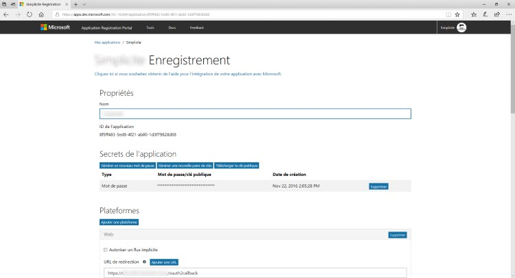

OAuth2 Authentication
============================

Providers
---------

The following table indicates OAuth2/OpenIDConnect providers supports per Simplicité version:

| Provider      | v3  | v4      | v5      | v6      |
|---------------|-----|---------|---------|---------|
| OpenIDConnect | No  | Yes     | Yes     | Yes     |
| Google        | Yes | Yes     | Yes     | Yes     |
| Microsoft     | No  | Yes     | Yes     | Yes     |
| LinkedIn      | No  | Yes     | Yes     | Yes     |
| FranceConnect | Yes | Yes (1) | Yes (1) | Yes (2) |
| KeyCloak      | No  | Yes (2) | Yes     | Yes     |

(1) FranceConnect being an OpenIDConnect-compliant provider, it should rather be configured as a generic OpenIDConnect provider instead.

(2) Only as a generic OpenIDConnect provider.

Configuration
---------------

### Webapp prerequisites

Your application's URL **must** be exposed over HTTPS, SSL encryption is **mandatory** for any OAuth2/OpenIDConnect based authentication.

<details>
<summary>Skip this if you are using a standard Simplicité Docker image</summary>

If you are using our standard Docker images or our instance templates these changes are already done.

In other case, it might be necessary to :
- Remove all realm-related settings in `WEB-INF/web.xml` (security-constraint, login-config and security-role tags)
- Optionally remove also the realm definition in `META-INF/context.xml`

> **Warning**: Before doing these changes, **make sure** that you will still be able to login with a user having at least a responsibility on the `ADMIN` group.

</details>

### In the Identity Provider {#idp}

The callback URL (redirect URI) to configure **in your OAuth2/OpenIDConnect identity provider** for your instance is `<base URL>/oauth2callback`.

If needed, the logout URL to configure in your OAuth2/OpenIDConnect IdP for your instance is `<base URL>/logout`
or `<base URL>/logoutconfirm` (for displaying just a logout confirmation page).

### In Simplicité

All OAuth2/OpenIDConnect providers requires **at least** the following settings:

- `name` : a unique name for your provider
- `type`: `oauth2`
- `client_id`: your instance's client ID
- `client_secret`: your instance's client secret

Example `AUTH_PRODIDERS` configuration (refer to the [auth providers doc](auth-providers) if necessary):

```json
[
	{
		"name": "google",
		"type": "oauth2",
		"sync": true,
		"client_id": "",
		"client_secret": ""
	},
	{
		"name": "microsoft",
		"type": "oauth2",
		"sync": false,
		"client_id": "",
		"client_secret": ""
	},
	{
		"name": "linkedin",
		"type": "oauth2",
		"sync": false,
		"client_id": "",
		"client_secret": ""
	},
	{
		"name": "franceconnect",
		"type": "oauth2",
		"client_id": "",
		"client_secret": ""
	},
	{
		"name": "myoidc",
		"type": "oauth2",
		"label": "Sign in with your private IdP",
		"sync": true,
		"client_id": "",
		"client_secret": ""
	}
	{
		"name": "oidc-with-all-params",
		"type": "oauth2",
		"label": "Sign in with MyProvider",
		"sync": true,
		"visible": true,
		"client_id": "<my client ID>",
		"client_secret": "<my client secret>",
		"redirect_url": "<instance_url>/oauth2callback",
		"base_url": "https://<idp_url>",
		"authorize_url": "<base_url>/authorize",
		"token_url": "<base_url>/token",
		"userinfo_url": "<base_url>/userinfo",
		"logout_url": "<base_url>/logout",
		"tokeninfo_url": "<base_url>/tokeninfo",
		"tokeninfo_mappings": {
			"login": "user_id"
		},
		"client_credentials_mode": "authheader|params",
		"scopes": "additional_scope",
		"userinfo_mappings": {
			"login":     "username",
			"firstName": { "field": "usr_first_name" },
			"lastName":  { "field": "usr_last_name" },
			"email":     { "field": "usr_email" },
			"address":   { "field": "usr_address1" },
			"myfield":   { "field": "myUserField" },
			"myparam":   { "param": "APP_MYPARAM" },
			"title":     { "field": "usr_title", "transform": { "M.":"MR", "Mme":"MRS", "Mlle":"MS" } },
			"unit":      { "field": "myUserUnit", "param": "APP_USER_UNIT" }
		},
		/* OR
		"jwt_claims_mappings": {
			"login": "username"
			(...)
		},*/
		"jwt_issuer": "<url>",
		"jwt_secret": "",
		"jwt_check_nonce": true
	}
	(...)
]
```

:::warning

For historical reasons the names `google`, `microsoft` and `linkedin` are **reserved** as they correspond to dedicated connectors.
To use the **generic** OpenIDConnect connector you must use another name (such as the `myoidc` of the above example).

The FranceConnect provider is a OIDC-compliant provider, its management as a dedicated provider has been kept till version 5
for backward compatibility but it **should** now be rather configured as a generic OIDC provider. It has been removed in version 6.

:::

OpenIDConnect
-------------

:::info

To learn more about OpenIDConnect (and its relationship with OAuth2), pleaser refer [its documentation](https://openid.net/developers/how-connect-works/).

:::


### Settings

Beyond the common OAuth2 settings, there are some additional system parameters that needs to be configured for the OIDC providers :

| **Setting** | **Required** | **Comments** | **Availability** |
|---|---|---|---|
| `base_url` | **required**, unless `authorize_url`, `token_url` and `userinfo_url` are defined |  | v4.0 |
| `authorize_url` | **required**, unless `base_url` is defined | defaults to `base_url/authorize` | v4.0 |
| `token_url` | **required**, unless `base_url` is defined | defaults to `base_url/token` | v4.0 |
| `userinfo_url` | **required**, unless `base_url` is defined | defaults to `base_url/userinfo` | v4.0 |
| `redirect_url` | optional | defaults to `instance_url/oauth2callback` | v4.0 |
| `client_credentials_mode` | optional | defaults to `authheader` for Basic (Authorization header), should be `params` for HTTP POST method | v4.0 |
| `userinfo_mappings` | optional | user info fields to use as instead of standard fields defined by the OIDC standards, the value is a JSON object (e.g. `{ "login": "uid", "firstname": "first_name", "lastname": "last_name", "email": "email_address", "phone": "mobile_phone, "lang": "preferred_language"}` to map the defaults which are respectively `sub`, `given_name`, `family_name`, `email`, `phone_number` and `locale`) | v4.0 |
| `tokeninfo_mappings` | optional | Same as above but for a custom token info endpoint | v5.3 |
| `jwt_claims_mappings` | optional | Same as above but for ID token claims | v5.3 |
| `pkce_challenge_method` | optional | to enable PKCE flow, possible values are `S256` or `plain` (if absent PKCE is disabled) | v5.2.30 |
| `pkce_code_verifier_length` | optional | to define the length of the PKCE code verifier, defaults to `64` | v5.2.30 |
| `non_ssl_urls_allowed` | optional | to allow using non SSL URLs (Note that this does not comply with OAuth2/OpenIDConnect standards, it should never be used unless absolutely required) | v5.2.32 |

### Default scopes

By default the OIDC OAuth2 implementation uses by default the `openid` and `profile` scopes when calling user info endpoint.

Only **additional** scopes need to be configured using the `OAUTH2_SCOPES` system parameter or`scopes` attribute in `AUTH_PROVIDERS`if needed.

If for some **very specific** reasons you need other default scopes, you can use the `OAUTH2_DEFAULT_SCOPES` system parameter  or `default_scopes` attribute in `AUTH_PROVIDERS`.

In both cases the syntax for multiple scopes is space-separated.

### User info mappings

By default, the relevant user info fields defined by the OIDC standards are used to update corresponding user field (e.g. `given_name` for first name, `family_name`, etc.).
As for any OAuth2 provider it is possible to do a custom parsing of user info response in the `postLoadGrant` grant hook as described above.

For instance here is a _Keycloak_ integration configuration for `AUTH_PROVIDERS`:

```json
{
	"name": "keycloak",
	"type": "oauth2",
	"label": "Sign in with Keycloak OAuth2 IdP",
	"sync": true,
	"visible": true,
	"client_id": "<my client ID>",
	"client_secret": "<my client secret>",
	"authorize_url": "https://<host:port>/auth/realms/<myrealm>/protocol/openid-connect/auth",
	"token_url": "https://<host:port>/auth/realms/<myrealm>/protocol/openid-connect/token",
	"userinfo_url": "https://<host:port>/auth/realms/<myrealm>/protocol/openid-connect/userinfo",
	"logout_url": "https://<host:port>/auth/realms/<myrealm>/protocol/openid-connect/logout",
	"userinfo_mappings": {
		"login":     "username",
		"firstname": "firstName",
		"lastname":  "lastName",
		"email":     "email"
	}
}
```

`userinfo_mappings` is used to map simple fields during synchronization (when global system parameter `USER_SYNC` is enabled), as of version 5
it is possible to specify additional mappings hints:

- `field`: optional to set a User's field with the userinfo value
- `transform`: optional to change the value with a local code of List of values
- `param`: optional to add a user's system parameter

Example:

```json
	"userinfo_mappings": {
		"login":     "username",
		"firstName": { "field": "usr_first_name" },
		"lastName":  { "field": "usr_last_name" },
		"email":     { "field": "usr_email" },
		"address":   { "field": "usr_address1" },
		"myfield":   { "field": "myUserField" },
		"myparam":   { "param": "APP_MYPARAM" },
		"title":     { "field": "usr_title", "transform": { "M.":"MR", "Mme":"MRS", "Mlle":"MS" } },
		"unit":      { "field": "myUserUnit", "param": "APP_USER_UNIT" }
	}
```

As of version 5, it is possible to proceed with additional JWT token processing using `jwt_*` settings described bellow.

Token validation
-----------------

As of version 5, it is possible to use external authentication tokens on the API endpoint. Some additional configuration is required in the `AUTH_PROVIDERS` system parameter
depending on the (exclusive) validation method of the token:

### JWT validation

JWT token validation is enabled by adding the following attributes:

- `jwt_issuer`, **required**: JWT token issuer
- `jwt_secret`, **optional**: JWT token signature secret
- `jwt_claims_mappings`, **optional**:": JWT token's payload claims mappings (e.g. `{ "login": "preferred_username" }`)
- `jwt_check_nonce`, **optional**:": Check JWT token's nonce, defaults to `false`

### Token info URL validation

Token validation using token info URL is enabled by adding the following attributes:

- `tokeninfo_url`, **required**: Token info URL
- `tokeninfo_mappings`, **optional**: Token info result mappings (e.g. `{ "login": "preferred_username" }`)

### Custom token validation

Token validation using the `getAuthTokenInfo` hook in `PlatformHooks`.

With the following provider added to `AUTH_PROVIDERS` :

```JSON
{
	"name":"my_custom_provider", "type":"oauth2", "visible":false,
	"tokeninfo_mappings" : {
		"login": "my_mapped_login",
		"expiry": "my_mapped_expiry",
		"valid": "my_mapped_valid"
	}
}
```

The following example performs an HTTP call to get the token info :

```java
@Override
public String getAuthTokenInfo(String token) {

	String url = "validation.url"

	String[] headers = new String[] {
		"Content-Length: 157",
		"Content-Type: application/x-www-form-urlencoded"
	};

	Map<String, String> p = new HashMap<>();
	p.put("client_id", "my_client_id");
	p.put("client_secret", "my_client_secret");
	p.put("token", token);

	try {
		String res = Tool.readUrl(url, null, null, "POST", p, headers, "UTF-8");
		// ...
		// handle result
		// ...
		return res; // containing the mapped attributes login, expiry, valid

	}
	catch (Exception e) {
		AppLog.error(e, null);
		return null;
	}
}
```

Specific providers
-------------------

### Google

Register a new client ID on the [Google Developers Console](https://console.developers.google.com) for the application:


Activate the **required** _Google+ API_ on Google Developers Console and, optionally, activate any other Google API that you would like to call with the auth token your users get from Google authentication.

Optionally set `OAUTH2_SCOPES <Google provider name>` with additional OAuth2 scopes you may need (e.g. drive scopes, calendar scopes, ...)
see Google documentation for the values of the possible scopes, if you have several scopes use space as separator.

In `AUTH_PROVIDERS` just add Google settings as follow, for example to add consent to access User's drive files:

```json
{
  "name": "google",
  "type": "oauth2",
  "label": "Sign in with Google",
  "client_id": "xxxxx.apps.googleusercontent.com",
  "client_secret": "xxxxx",
  "scopes": "https://www.googleapis.com/auth/drive.file",
  "sync": true,
  "visible": true
}
```

> **Notes**:
> - By default the Google OAuth2 implementation uses the `profile` and `email` scopes when calling the user info endpoint.
>   Only additional scopes needs to be configured.
> - In 3.x versions you have a unique provider so the `<Google provider name>` suffix must not be set

### Microsoft LiveID

Register a new client ID on the [Microsoft LiveID application portal](https://apps.dev.microsoft.com) for the application (the OAuth2 callback URL will be `<url>/oauth2callback`):



Activate the **required** _User.Read_ on the portal and, optionally, activate any other Microsoft API that you would like to call with the auth token your users get from Microsoft authentication.

Optionally set `OAUTH2_SCOPES <Microsoft LiveID provider name>` with additional OAuth2 scopes you may need
see Microsoft LiveID documentation for the values of the possible scopes, if you have several scopes use space as separator.

### LinkedIn

```json
{
  "name": "linkedin",
  "type": "oauth2",
  (...)
}
```

### KeyCloak

```json
{
  "name": "keycloak-1",
  "type": "oauth2",
  (...)
}
```

The name of KeyCloak does not necessary have to be `keycloak`, it just has to **start** with that string. This is so there can be multiple keycloak providers.

This provider adds specific KeyCloak functionality like user info group mapping,  users/roles/groups synchronization, etc.

Refer to the [dedicated Keycloak documentation](keycloak) for details.

Grant hooks
-----------

If needed you can implement additional business logic in the `GrantHooks` Java class or Rhino script.

The following **example** checks and removes the domain part of the account name in the `parseAuth` hook
and creates/updates the corresponding application user with responsibilities on `MYAPP_GROUP1` and `MYAPP_GROUP2` groups
on the fly in the `preLoadGrant` hook:

```Java
@Override
public String parseAuth(Grant sys, SessionInfo info) {
	if (AuthTool.useOAuth2()) {
		// Example of domain verification
		String domain = Grant.getSystemAdmin().getParameter("MY_OAUTH2_DOMAIN", "");
		String auth = info.getLogin();
		if (!Tool.isEmpty(domain)) {
			AppLog.info("OAuth2 account = " + auth, sys);
			if (Tool.isEmpty(auth) || !auth.matches("^.*@" + domain + "$")) {
				AppLog.info("OAuth2 error: Invalid domain for " + auth, sys);
				return ""; // ZZZ must return empty string, not null, to tell the auth is rejected
			}
			AppLog.info("OAuth2 valid domain for " + auth + " = " + domain, sys);
		}
		/* //and/or
		// Example of user verification
		String uid = Grant.getSystemAdmin().simpleQuery("select row_id from m_user where usr_login = '" + auth + "' and usr_active = '1'");
		if (Tool.isEmpty(uid)) {
			AppLog.info("OAuth2 error: No active user for " + auth, sys);
			return ""; // ZZZ must return empty string, not null, to tell the auth is rejected
		}
		AppLog.info("OAuth2 active user ID for " + auth + " = " + uid, sys);
		*/
	}
	return super.parseAuth(sys, info);
}

@Override
public void preLoadGrant(Grant g) {
	if (AuthTool.useOAuth2() &&  (!Grant.exists(g.getLogin(), false))){
		// Example of business logic to create users on the fly
		ObjectDB usr = null;
		try {
			// Create user if not exists
			// ZZZ An isolated object **MUST** be explicitly destroyed in the finally block (see bellow) ZZZ
			usr = Grant.getSystemAdmin().getIsolatedObject("User");
			usr.setRowId(ObjectField.DEFAULT_ROW_ID);
			usr.resetValues(true);
			usr.setStatus(Grant.USER_ACTIVE);
			usr.getField("usr_login").setValue(g.getLogin());
			new BusinessObjectTool(usr)/* or usr.getTool() in version 5+ */.validateAndCreate();

			// Get module in which user has been created (default module for users)
			String module = usr.getFieldValue("row_module_id.mdl_name");
			AppLog.info("OAuth2 user " + g.getLogin() + " created in module " + module,g);
			// Force a random password to avoid the change password popup

			usr.invokeMethod("resetPassword", null, null);

			// Add responsibilities on designated groups
			String[] groups = { "MYAPP_GROUP1", "MYAPP_GROUP2"};
			for(String group : groups){
				Grant.addResponsibility(usr.getRowId(), group, Tool.getCurrentDate(-1), "", true, module);
				AppLog.info("Added user " + group + " responsibility for OAuth2 user " + g.getLogin(),g);
			}
		} catch (MethodException | CreateException | ValidateException e) {
			AppLog.error(e, g);
		} finally {
			// ZZZ An isolated object **MUST** always be explicitly destroyed ZZZ
			if (usr != null)
				usr.destroy();
		}
	}
	super.preLoadGrant(g);
}
```

Customizing the login screen
----------------------------

If you want to change the top logo you can create a `OAUTH2_LOGO` **image** resource (ideal type = SVG and ideal dimension = 120x120 px)

If you wat to change some of the styles of the login screen you can add a `OAUTH2_STYLES` **CSS** resource, for instance for a dark scheme:

```css
.auth-signin { background-color: #152935; }
.auth-signin-with img, .auth-signin button { border: none 0; box-shadow: 5px 5px 10px #3A3A3A; }
.auth-signin-form { background-color: #394b54; box-shadow: 5px 5px 10px #131b21; border: solid 1px #152935; }
.auth-signin-version { color: #C0C0C0; }
.auth-signin-fp a { color: #D0D0D0; }
```

For each OAuth2 provider you can create a custom `OAUTH2_SIGNIN_<uppercase provider name, e.g. MYPROVIDER>` **image** resource.