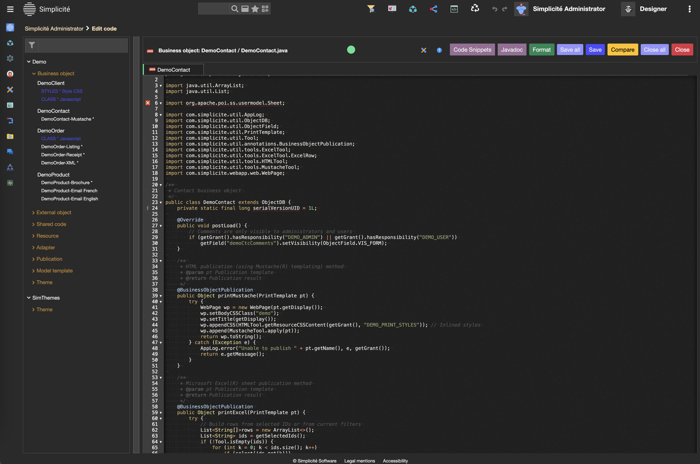
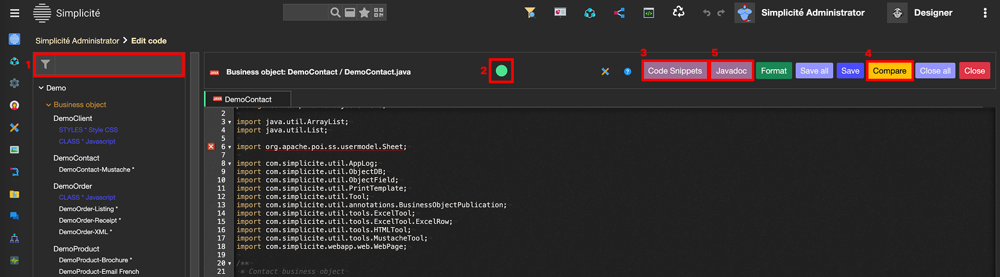
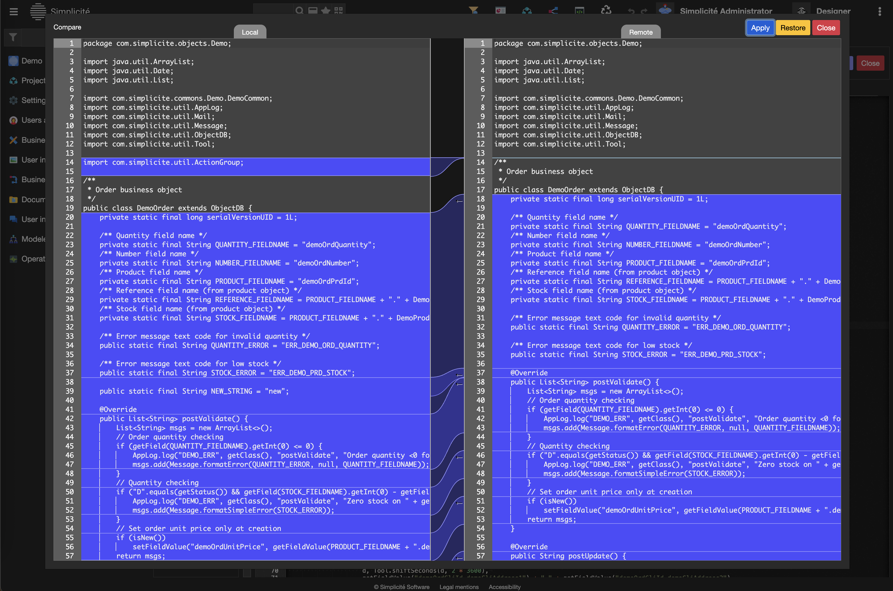
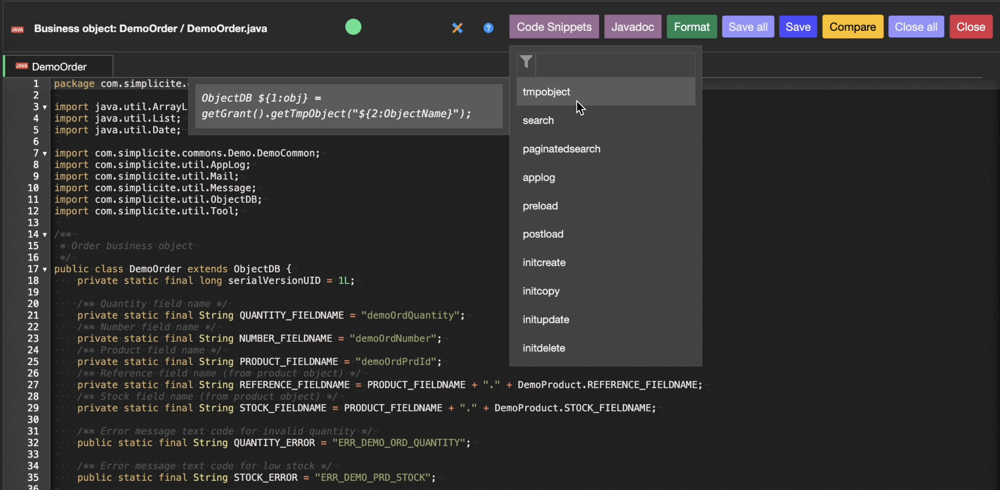
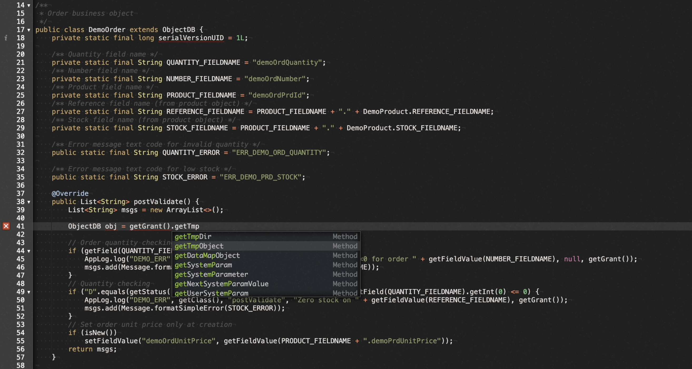
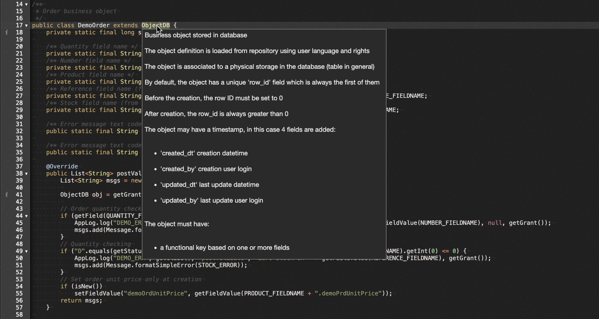
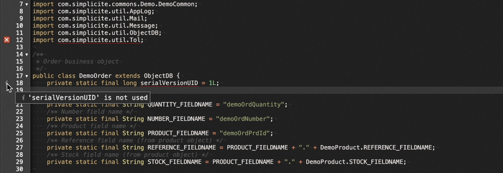

Code Editor
===========

## Introduction

In Simplicité, you have access to an integrated code editor, through which you can modify the default code of your objects (java, web, sql, ...).

Such editor contains many features that allow you to not go back & forth between your instance and an external IDE, although **it is completely possible to use your favorite IDE** the use of this integrated one offers a quicker & simpler development process for your applications !

:::info

If you are using VS Code, you can refer to [this doc](docs/docs/devops/external-editor.md) in order to seamlessly interact with Simplicité's development environment.
:::

## Features list

1. **File search :** possibility to search by *name* or *extension* inside the scripts treeview.
2. **Smart features :** several smart-editing features, adapted for Simplicité-specific programming.
3. **Code snippets :** large amount of good-to-go snippets to either discover how to program common behaviors, or understand what are Simplicité's good practices.
4. **Git compare :** allows you to compare the code you have with the remote one in case of git issues.
5. **Accessible doc:** context-accurate documentation if you need to easily access a wider spectrum of information about Simplicité's programming libs.

## Environment features

Those feature aren't directly related to the core programming experience, but they help you in your developing journey within Simplicité's environment. 

### File search

Inside the files' treeview, you can by default see all types of scripts (java, javascript, html, css, sql, ...) from many types of objects (business objects, external objects, dispositions, resources, ...), and when dealing with many modules & objects, you might need to narrow down the amount of objects to only a few, or maybe you just need to find one specific file.

In such case, you can use the treeview's search bar in few ways in order to find what you need:

- Search by file/folder name
- Search by file extension

### Git compare

When working on an application that exists on github, and thus might be modified by others, it can be helpful at some point to check what changes between your local file & the remote one (simple `git compare`). For that you can use the **compare** button to see those changes:

From this you can also decide to either **Apply** your local changes or **Restore** the remote changes, as you would do with `git` commands.

### Accessible doc

Those are the two buttons that will lead you directly to either one of **Javadoc** or **JsDoc** depending on the extension of your opened tab.

Furthermore, the opened documentations will be up-to-date with your instance's version, thus you can directly see what's currently available to use !

## Coding experience

The following features are meant to be used/seen while writing your code, matter of fact they will both fasten & ease your programming experience.

### Code snippets

The code snippets are a list of contextual code examples, they can serve both to discover possibilities within the current script (available hooks, common operations, ...) or to know how to efficiently write code for the intended behaviors.

:::info

The visible snippets are calculated regarding the **context** of the script you currently have opened, Simplicité having different & unique snippets for; &nbsp; *business-objects* | *external-objects* | *dispositions* | *adapters* | ...
:::

There are two ways to trigger the code snippets feature:

1. Clicking the **Code snippets** button
2. Using the keyboard shortcut **Control-Q**

But both are based on the same workflow:

1. Use your cursor's position & current line to pre-fill the search
2. Suggest the matching snippets by name & context
3. Navigating the snippet list either using mouse & scroll or directional arrows
4. Copy any snippet to your clipboard by clicking on it in the list
5. Directly pasting the current snippet at your cursor's initial position by using the **Enter** key
   - In this case you'll be able to *navigate* the pasted code snippet at the predefined tabs-stops ([TextMate standards](https://macromates.com/textmate/manual/snippets)).

### Smart features

:::warning

This is still an **experimental** feature that only is made available for **designer** users in `v6.3`, and shall be enabled through the `FEATURE_FLAGS` system parameter by setting `"java_language_server": true`.
:::

From the version 6.3, a Java-Language-Server was added & linked to Simplicité, offering smart-editing features like *live auto-completion*, *signature help on hover* or *live linting*.

**Live auto-completion**

**Signature help on hover**

**Linting on file-change**

The new interactions related to those features are:

- **Control-Space** to ask for "explicit" completion.
- **Hover** on code elements to get the signatures, or on linting elements to get informations.

And in order to keep track of the features' progression & execution, a colored indicator was added in the editor's header, indicating the current state of the Java-Language-Server and thus the progression of the various requests:

| Color | State |
|-------|-------|
| `grey` | Off |
| `orange` | Initialization |
| `red` | Error |
| `blue` | Processing |
| `green` | Ready/Done |