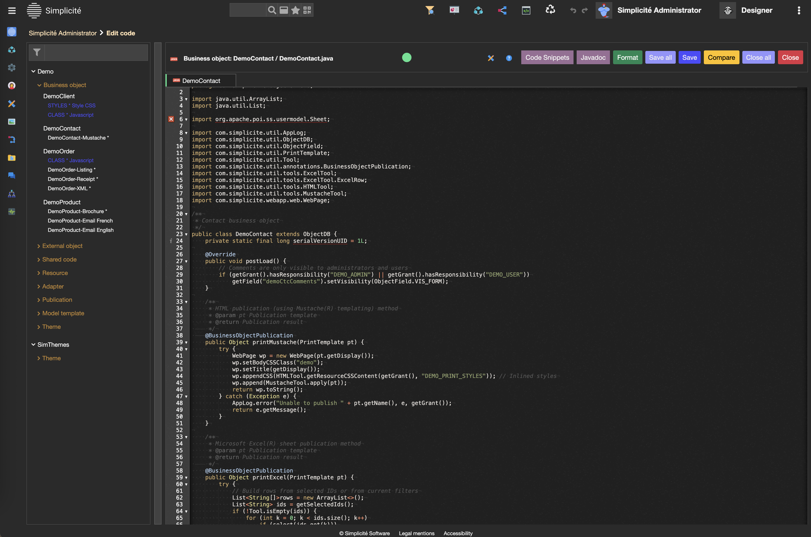
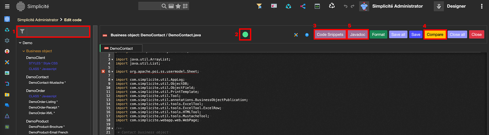
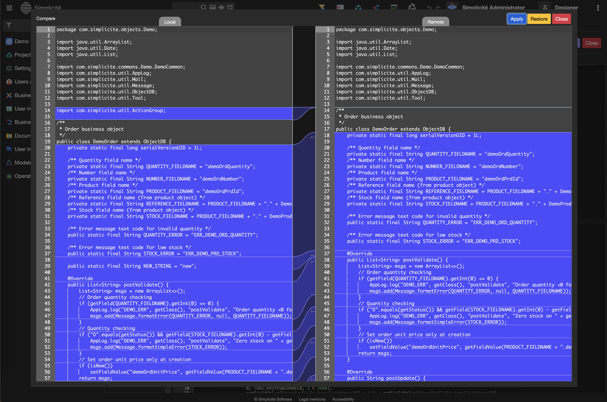
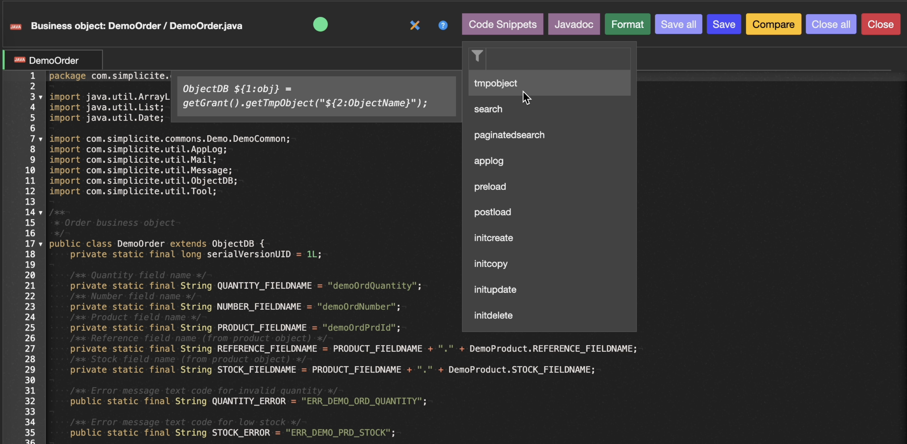
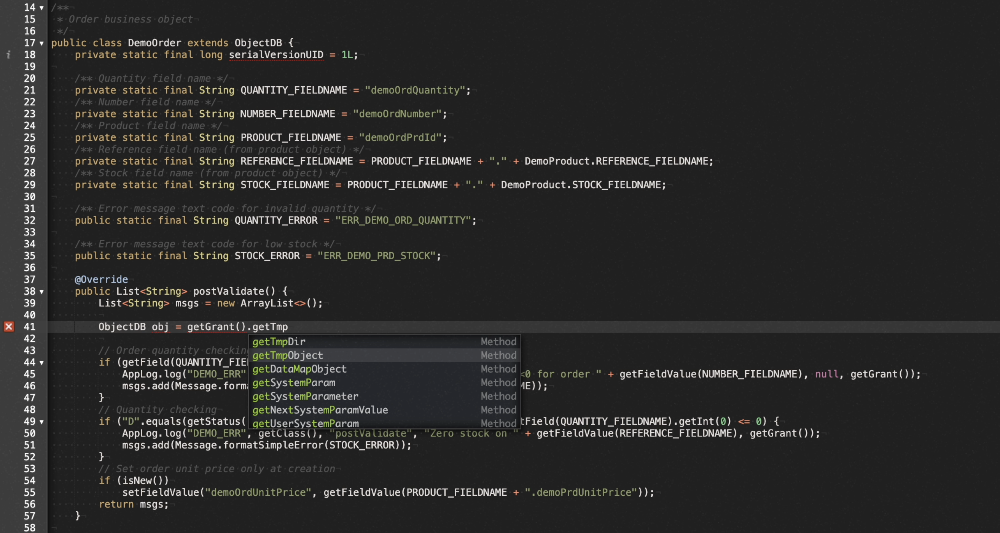
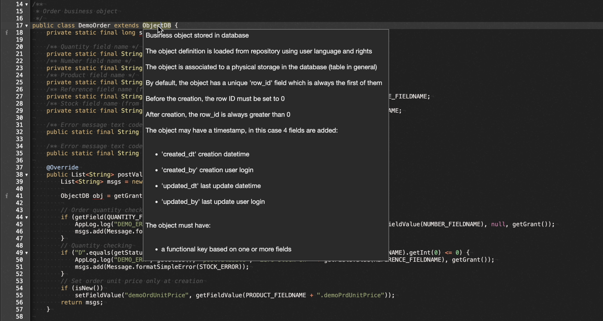
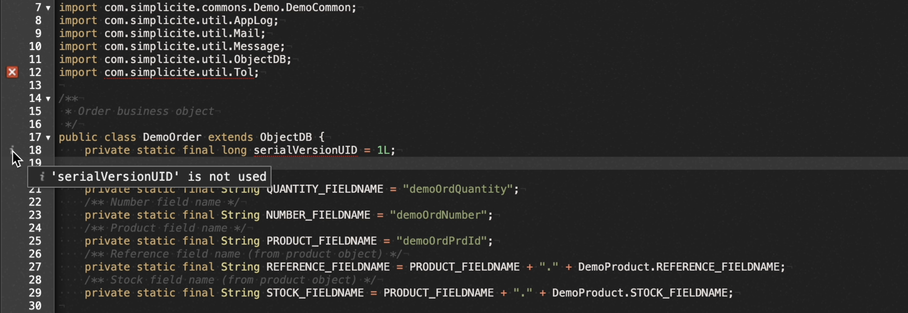

Code Editor
===========

Introduction
------------

An integrated code editor is available in Simplicité, it is designed to write code for configuration objects directly in the platform without
the need to use an external IDE.

The integrated code editor provides numerous features that reduce the need to switch between the platform and an external IDE.
While external IDEs remain fully supported, the integrated editor streamlines and accelerates the development process.

:::info
For seamless interaction with Simplicité's development environment from Visual Studio Code, refer to [this documentation](docs/docs/devops/external-editor.md).
:::

Features list
-------------

1. **File search :** search by _name_ or _extension_ inside the scripts tree view.
2. **Smart features :** several smart-editing features, adapted for Simplicité-specific programming.
3. **Code snippets :** large amount of good-to-go snippets to either discover how to program common behaviors,
   or understand Simplicité's programming best practices.
4. **Git compare :** enables comparison between the local code and the remote repository to resolve potential git discrepancies.
5. **Accessible doc:** context-accurate documentation to easily access a wider spectrum of information about Simplicité's programming libraries.

Environment features
--------------------

### File search

The files tree view displays all script types (Java, JavaScript, HTML, CSS, SQL, etc.) associated with various objects such as
business objects, external objects, dispositions, and resources.
When working with numerous modules and objects, the displayed list can be narrowed to a specific subset or a particular file as needed.

In these situations, the tree view's search bar offers several methods for locating required files or folders:

- Search by file/folder name
- Search by file extension

### Git compare

For modules hosted on GitHub and potentially modified by multiple contributors,
it is often necessary to identify differences between local and remote files.
The **compare** button enables the comparison of local changes with those present in the remote repository.

It is possible to either **apply** the local changes or **restore** the remote changes, replicating functionality similar to `git` commands.

### Accessible doc

Two buttons allow direct access to either **Javadoc** or **JsDoc**, depending on the file extension of the active tab.

The accessed documentation is synchronized with the version of the current Simplicité instance,
ensuring the availability of the most relevant and up-to-date information.

Coding experience
-----------------

The following features are designed to streamline and enhance the programming process during code development.

### Code snippets

Code snippets provide contextual code examples that illustrate available hooks, common operations, and recommended practices for implementing specific
behaviors within the current script.

:::info

Visible snippets are determined based on the **context** of the currently opened script.
Simplicité offers distinct and specialized snippets for _business-objects_, _external-objects_, _dispositions_, _adapters_, and others.

:::

There are two ways to trigger the code snippets feature:

1. Clicking the **Code snippets** button
2. Using the keyboard shortcut <kbd>Ctrl</kbd>+<kbd>Q</kbd>

But both are based on the same workflow:

1. The cursor position and current line are used to pre-fill the search field.
2. Matching snippets are suggested by name and context.
3. The snippet list can be navigated using either the mouse and scroll function or directional arrow keys.
4. Any snippet can be copied to the clipboard by clicking on it in the list.
5. The current snippet can be directly pasted at the initial cursor position by pressing the **Enter** key.
   - Predefined tab-stops within the pasted code snippet are available for navigation, following [TextMate standards](https://macromates.com/textmate/manual/snippets).

### Smart features

:::warning

This is still an **experimental** feature that only is made available for **makers** in `v6.3`,
and can be enabled through the `FEATURE_FLAGS` system parameter by setting `"java_language_server": true`.

:::

As of version 6.3, Simplicité includes integration with a **Java Language Server**,
providing smart editing features such as live auto-completion, signature help on hover, and live linting.

**Live auto-completion**

**Signature help on hover**

**Linting on file-change**

The following interactions are provided:

- **Control-Space** initiates explicit code completion.
- **Hovering** over code elements displays signatures or linting information.

A colored indicator in the editor header displays the current status of the Java Language Server and the progress of related requests.

| Color    | State          |
|----------|----------------|
| `grey`   | Off            |
| `orange` | Initialization |
| `red`    | Error          |
| `blue`   | Processing     |
| `green`  | Ready/Done     |
