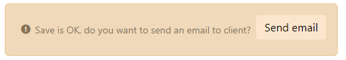

Custom action examples
======================

Please refer to [basic code examples](/docs/core/basic-code-examples) document for naming conventions and logging strategies.

Server-side custom action
--------------------------

A server-side action corresponds to an action with a value in the _method_ field.

This _method_ field contains the name of a server-side **Java** method.

For instance if you set `myCustomAction` as action _method_ and if you grant this action to the `MyObject` business object,
the platform will look for the server-side **Java** method called `MyObject.myCustomAction()` and will run it.

```simplicite-java
public String myCustomAction() {
	String rowId = getRowId();
	return Message.formatSimpleInfo("Using instance " + getInstanceName() + (!Tool.isEmpty(rowId) ? " and row ID " + rowId : ""));
}
```

On responsive UI (using ajax services) the action can return:

- a textual message to be displayed in a UI dialog box (error and warning) or in a UI toast box (info)
- a client-side **JavaScript** statement (a string prefixed with `javascript:`)
- an HTTP redirect URL statement (a string prefixed with `redirect:`)

Examples:

- `return Message.formatSimpleError("It is not permitted");` to simply return an error message
- `return this.javascript("$ui.displayForm(null, 'myObject', " + myRowId + ", {nav:'add'})");`
   or `return this.redirect(HTMLTool.getFormURL("myObject", "the_ajax_myObject", myRowId, "nav=add"));` to redirect to the form of another object's record
- `return $ui.displayPrint(null, 'MyPublication', obj, obj.getRowId());` to apply a publication on the current record of the object
t etc.

> **Note**: These server-side custom actions are available through the webservices APIs.

Confirmation with custom fields
-------------------------------

The action supports fields in the confirmation dialog:

- If the field belong also to the object: the value is read only (to confirm a value or to preview a document)
- If the field is standalone: the input field is updatable and will be sent to the server side as a String

Previous V4 syntax supports only `String` values through a `Map<String,String>`:

```java
public String myCustomAction(Map<String,String> params) {
	String myActionField = params!=null ? params.get("myActionField") : null;
	// ...
}
```

This syntax is deprecated but still compatible with V5 and simple fields.
Now V5 syntax supports `ObjectField` directly to manipulate value or document:

```java
public String myCustomAction(Action action) {
	// String field (text, date...)
	String param = action.getConfirmField("myStringField").getValue();
	// Document field
	ObjectField myDocField = action.getConfirmField("myDocField");
	DocumentDB doc = myDocField!=null ? myDocField.getDocument() : null;
	AppLog.info(getClass(), "myCustomAction", "DOCUMENT " + doc, getGrant());
	if (doc!=null) {
		// Uploaded tmp file from UI
		java.io.File file = doc.getUploadFile();
		AppLog.info(getClass(), "myCustomAction", "DOCUMENT FILE " + file, getGrant());
		// do something with the document...
		// Example import the file through Adapter
		Message res = new Integration().importADP(getGrant(), "MyAdapterName", new FileInputStream(file), "Imported from UI myCustomAction", null);
		// You must remove the file from /tmp directory when used
		file.delete();
		// ...
	}
}
```

Call to action with the returned message
----------------------------------------

`Message.formatCallToAction` is available since V5.3.

Custom `Action` can be added to the returned message (ex postSave) to ask the user to do something

- action type must be hidden to be used only in this context
- action is displayed only if the user is granted through a function
- action will call the front javascript or the back-end method

```java
// Single action
ObjectDB obj = this;
Action action = obj.getAction("MyAction_SendEmail");
return Message.formatCallToAction("WARNING", "Save is OK, do you want to send an email to client?", Message.WARN, null, obj, action);

// Or with several actions
List<Action> list = new ArrayList<>();
list.add(obj.getAction("MyAction_OptionA");
list.add(obj.getAction("MyAction_OptionB");
return Message.formatCallToAction("MYCODE", "What is the best option?", Message.WARN, null, obj, list);
```



State transition with parameters
--------------------------------

When the action is a transition, there is no method invoked but confirmation fields are passed through an object's parameter named `ActionFields`.
This parameters can be read in all common hooks during the state transition (validate / save / update).

**Previous V4 implementation:**

Java

```java
public String postSave() {
	HashMap<String,String> params = (HashMap<String,String>)geObjectParameter("ActionFields");
	String myActionField = params!=null ? params.get("myActionField") : null;
	...
}
```

**V5 implementation:**

"ActionFields" has been removed from object parameters, the current transition and its Action can be accessed to read values and documents:

```java
public String postSave() {
	// Save has been called from a transition ?
	FieldStateTransition tran = getCurrentTransition();
	Action action = tran!=null ? tran.getAction() : null;
	if (action!=null) {
		String param = action.getConfirmField("myField").getValue();
		DocumentDB doc = action.getConfirmField("myDocField").getDocument();
		File file = doc!=null ? doc.getUploadFile() : null;
		...
	}
	...
}
```

The Action fields can also been accessed in the callback `method` of transition with this syntax:

```simplicite-java
public String myTransitionCallback(Action action) {
	if (action!=null) {
		String param = action.getConfirmField("myField").getValue();
		DocumentDB doc = action.getConfirmField("myDocField").getDocument();
		File file = doc!=null ? doc.getUploadFile() : null;
		// ...
		// Return a message to UI
		if ("value1".equals(param))
			return Message.formatSimpleInfo(getGrant().T("MY_MESSAGE"));
		// Redirect to other form
		if ("value2".equals(param)) {
			String url = HTMLTool.getFormURL("myObject", "the_ajax_myObject", "123", null);
			return HTMLTool.redirectStatement(url);
		}
	}
	return null; // OK
}
```

The callback `method`:

- can be set on the `Transition` or on the related `Action` (but not both)
- will be executed after the DB commit (new status is correctly stored in table) and before the hook `postUpdate` of object
- can return a message (info, warning, error) or a statement (redirect, javascript)

Client-side custom action
-------------------------

A client-side action corresponds to an action with a value in the _URL_ field.

### Plain URL

When _URL_ contains a plain URL (that can be either absolute or relative),
the platform UI will call this URL appending the `object`, `inst` and `row_id` URL parameters.

### JavaScript statement pseudo-URL

When _URL_ contains a client-side **JavaScript** statement pseudo-URL (starting with `javascript:`), the platform will run this JavaScript statement after
having substituted the `[object]`, `[inst]` and `[row_id]` tags.

For instance, let's say you have created the default client JavaScript resources `SCRIPT` resource for your `MyObject` business object like this:

```javascript
var MyObject = (function() {
	function test(inst, row_id) {
		return $ui.alert({ content: "Using instance " + inst + (row_id ? " and row ID " + row_id : "") });
	}
	return { myCustomAction: test };
})();
```

Then you can configure a custom action for `MyObject` to call this `myCustomAction` function with this value in the _URL_ field:

```javascript
javascript:return [object].myCustomAction('[inst]', [row_id])
```

Attention, due to the way the UI runs the JavaScript statement, you **must** only use simple quotes `'` in it
(this limitation does not apply to the content of the `SCRIPT` resource).

The javascript statement also supports front parameter `app`, `grant` and `obj` when the server side substitution is not required:

```javascript
javascript:return obj.getName().myCustomAction(obj.getInstanceName(), obj.getRowId())
```

:::note
These client-side custom actions are **not available** through the webservices APIs.
:::

Asynchronous action launched by the UI with tracking
-------------------------

Since 6.0 the method signature can get a new parameter to implement the tracking:

```simplicite-java
public String myAction(Action action, AsyncTracker tracker) {
	try {
		// Already running ?
		if (tracker.isRunning())
			return null;

		// Can close the dialog on UI
		tracker.setCloseable(true);
		// Can minify the dialog on UI
		tracker.setMinifiable(true);
		// Not minimized on startup
		tracker.setMinified(false);
		// STOP button on UI
		tracker.setStoppable(true);
		// 0%
		tracker.setProgress(0);
		// limit tasks size in memory
		tracker.setDepth(50);

		// Start the tracking
		tracker.start();

		tracker.setTitle("Scanning data...")`
		tracker.add("MyAction has started");

		// Track the job 1
		tracker.push("Job 1");
		// ...
		tracker.message("doing something in job 1");
		// ...
		tracker.message("doing something else in job 1");
		tracker.error("something wrong");
		// ...
		tracker.pop("done");

		// Change the dialog title
		tracker.setTitle("Exporting data...")`

		// 20%
		tracker.setProgress(20);

		// Check running periodically
		if (!tracker.isRunning())
			return null;

		// 30%
		tracker.setProgress(30);

		// Track the job 2
		tracker.push("Job 2");
		// ...
		tracker.pop("done");

		// ...

		// Check running periodically
		if (!tracker.isRunning())
			return null;

		// ...

		tracker.setProgress(100);
		tracker.setTitle("Congratulation!")`
	}
	catch (Exception e) {
		// Assign the error on current task
		tracker.error(e.getMessage());
	}
	finally {
		// Stop tracking
		tracker.stop();
	}
	return null;
}
```

Or a synchronous action with internal asynchronous Job:

```java
/** Synchronous action launched by the UI with internal asynchronous Job */
public String myAction(Action action, AsyncTracker tracker) {
	// Already running ?
	if (tracker.isRunning())
		return null;
	tracker.start();

	JobQueue.push("myJob", new Runnable() {
		@Override
		public void run() {
			try {
				tracker.add("MyAction has started");
				tracker.push("Job 1");
				// ...
				tracker.message("doing something in job 1");
				// ...
				tracker.pop("job 1 done");
				// ...
			}
			catch (InterruptedException e) {
				tracker.message("Interrupted");
				Thread.currentThread().interrupt();
			}
			catch (Exception e) {
				// Assign the error on current task
				tracker.error(e.getMessage());
			}
			finally {
				tracker.stop();
			}
		}
	});
	return null;
}
```


