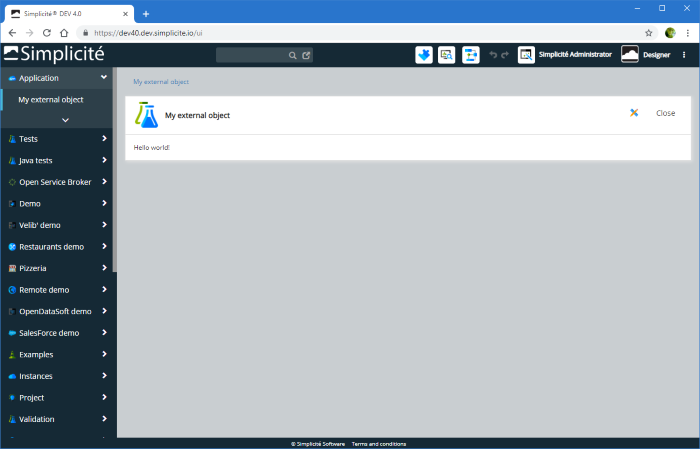
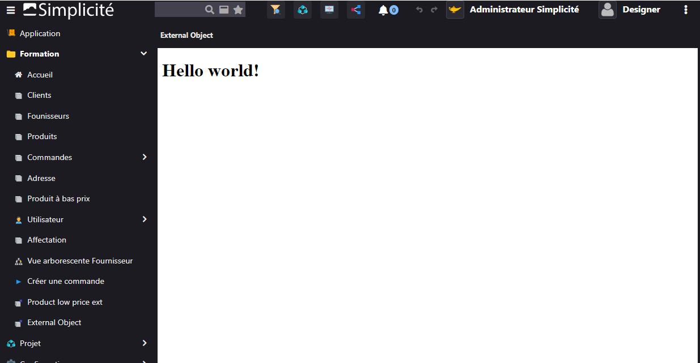

External object code examples
=============================

Principles
----------

An external object is basically a custom HTML page/component that can be made available into the generic web UI's authenticated zone or in the public zone.

By extension it can also be used to generate other type of files such as a PDF document or an image.
But this is not a typical use of external objects as there are other mechanisms for generating such contents (e.g. publication templates).

As of **version 3.1** external objects can also be used to provide custom web services (typically JSON/REST web services) on the API endpoint.
Please refer to [this document](/docs/integration/webservices/custom-services) for details.

The content of an external page is produced by the `display` method of its server side script.

Basic example
-------------

:::warning
Unless explicitly mentioned otherwise the following examples are only suitable for **standalone pages**
and/or for versions 3.x and 4.0 **legacy UI** (still available for backward compatibility).

For the 4.0 **responsive UI**'s single page custom components the implementation pattern is different,
please refer to the dedicated section below [Responsive UI pattern](/docs/core/externalobject-code-examples#responsive-ui).
:::

### Legacy UI

Let's configure a basic external object called `MyExtObj` and set the following server side script:
**Java**

```java
@Override
public Object display(Parameters params) {
	return "<h1>Hello world !</h1>";
}
```

Note that the `display` method is created in the `MyExtObj` namespace that corresponds to the name of the configured external object.

Once granted and made available from a main menu entry or a shortcut for instance, the page will render like this:



You can see that, by default, the page uses the standard UI page framework (title, navigation bar, ...).
To do so, the page includes all core JavaScript and CSS:

- jQuery&reg;
- General purpose tool APIS,
- UI APIstools
- Ajax APIs (and its legacy synchronous wrapper)

> **Note**: `jQuery` is aliased as `$` as of **version 4.0** (in previous versions the alias was `$j`)

If you just want to generate only a plain HTML content (e.g. to be embedded inside another page)
you need to set it explicitly as **non decorated** (meaning not using the default UI page framework):

```java
@Override
public Object display(Parameters params) {
	setDecoration(false); // Just a plain page
	return "<h1>Hello world !</h1>";
}
```

Then the plain page will render like this:



No script or HTML header is included, only what is explicitly added in the `display` method is generated,
so in that case the generated HTML is:

```html
<h1>Hello world !</h1>
```

If you want to generate a full custom HTML page, one of the following web helper classes should be used:

- Simple web page `com.simplicite.webapp.web.WebPage`
- Simple web page with jQuery&reg; `com.simplicite.webapp.web.JQueryWebPage`
- Simple mobile web page with jQuery&reg; mobile `com.simplicite.webapp.web.JQueryMobileWebPage`
  (**deprecated** as of version 3.2 and **removed** as of version 4.0)
- Simple responsive web page with jQuery&reg; and Bootstrap&reg; `com.simplicite.webapp.web.BootstrapWebPage`
- Etc.

E.g. of a simple jQuery&reg; page:

```java
@Override
public Object display(Parameters params) {
	setDecoration(false); // Just a plain page
	JQueryWebPage wp = new JQueryWebPage(params.getRoot(), this.getDisplay());
	wp.setReady("$('#hello').append('Hello world !');");
	wp.appendHTML("<h1 id=\"hello\"></h1>");
	return wp.toString();
}
```

The output is visually the same as above but the generated HTML is now:

```html
<!DOCTYPE html>
<html>
<head>
<meta charset="UTF-8"/>
<meta name="viewport" content="width=device-width, initial-scale=1"/>
<title>My external object</title>
<meta http-equiv="X-UA-Compatible" content="IE=edge"/>
<!--[if lt IE 9]>
<script type="text/javascript" src="/demo/scripts/ie/html5shiv.js"></script>
<script type="text/javascript" src="/demo/scripts/ie/css3-mediaqueries.js"></script>
<![endif]-->
<script type="text/javascript" src="/demo/scripts/jquery/jquery.js"></script>
<script type="text/javascript">
$(document).ready(function() { $('#hello').append('Hello world !'); });
</script>
</head>
<body>
<h1 id="hello"></h1>
</body>
</html>
```

In this document, **standard** pages do not use web helper classes, while **non-standard** pages do.

#### Responsive UI

The simple page above equivalent for version **4.0 responsive** UI (using Java) is:

```java
package com.simplicite.extobjects.MyModule;

import com.simplicite.util.tools.Parameters;

public class MyExtObject extends com.simplicite.util.ExternalObject {
	private static final long serialVersionUID = 1L;

	@Override
	public Object display(Parameters params) {
		setHTML("Hello world!");
		return javascript("");
	}
}
```

The responsive UI requires a JavaScript statement (even empty like above) to be returned by the `display` method to render as a **responsive page**.


> **Note**: If you return a plain string it will be rendered as a **legacy page** (displayed in an iframe for backward compatibility).

See [this section](/docs/core/externalobject-code-examples#responsive-ui) for other examples dedicated to the responsive UI.

Using resources and custom HTML/JavaScript/CSS
----------------------------------------------

If resources are associated to an external object, they are automatically processed as follows:

- HTML resources are generated as the content (after the content generated by the `display` method if any)
- JavaScript and CSS resources are included as HTML header includes

On **standard** standalone pages (in the 3.x web UI or 4.0 **legacy** web UI), several methods allows to
add custom JavaScript/CSS includes or fragments when required:

```java
@Override
public Object display(Parameters params) {
	appendCSSInclude("http://url/of/a/file.css");
	String[] urls ={"http://url/of/a/file1.css", "http://url/of/a/file2.css"};
	appendCSSIncludes(urls);
	appendJSInclude("http://url/of/a/file.js");
	String[] urlsJS ={"http://url/of/a/file1.js", "http://url/of/a/file2.js" };
	appendJSIncludes(urlsJS);

	return "<p>Hello world !</p>"
		+ HTMLTool.jsBlock("console.log('Hello again !');")
		+ HTMLTool.cssBlock("p { color: red; }");
}
```

The `com.simplicite.util.tools.HTMLTool` helper class provides methods that can be used to get the URLs
of packaged third party components' JavaScript/CSS (for use in the `append*` methods described above):

- jQplot&reg; charts: `HTMLTool.jqplotCSS()` and `HTMLTool.jqplotJS()`
- TinyMCE&reg; HTML editor: `HTMLTool.htmleditorCSS()` and `HTMLTool.htmleditorJS()`
- Ace&reg; code editor: `HTMLTool.aceJS()`
- Fullcalendar&reg;: `HTMLTool.fullcalendarCSS()` and `HTMLTool.fullcalendarJS(this.getGrant().getLang())`
- Etc.

Other methods can be used to get the URL of global resources (i.e. disposition-level resources):

- JavaScript resource: `HTMLPage.getResourceJSURL(this.getGrant(), "MYGLOBALJS")`
- CSS resource: `HTMLPage.getResourceCSSURL(this.getGrant(), "MYGLOBALCSS")`

On **non standard** pages, the web helper classes offers methods for similar inclusions, please refer to the JavaDoc of these classes.
With `wp`being an instance of a sub classes of `com.simplicite.webapp.web.WebPage` the following snippets can be used:

```javascript
wp.appendCSSInclude("http://url/of/a/file.css");
wp.appendCSSIncludes([ "http://url/of/a/file1.css", "http://url/of/a/file2.css" ]);
wp.appendJSInclude("http://url/of/a/file.js");
wp.appendJSIncludes([ "http://url/of/a/file1.js", "http://url/of/a/file2.js" ]);
wp.appendHTML("<p>Hello world !</p>");
wp.appendCSS("p { color: red; }");
wp.appendJS("function myfct() { ... }");
```

Using HTTP parameters
---------------------

The `display` method takes a single `params` argument which is a populated instance
of `com.simplicite.webapp.util.ServletParameter`.

This let you access all HTTP parameters (including file parameters), please refer to JavaDoc for more details.

You can get the page URL by calling `params.getLocation()`.
This can be used, for instance, by self links and self form submissions.

For example you can write a traditional form posted to server
(you should really consider using the Ajax APIs instead of doing this kind of things ;-):

```Java
@Override
	public Object display(Parameters params) {
		String name = params.getParameter("myname", "");
		if (!Tool.isEmpty(name)) return "Hello " + name + " !";
		return "<form action=\"" + params.getLocation() + "\" method=\"post\">"
			+ "Your name: <input type=\"text\" name=\"myname\"/>"
			+ "<input type=\"submit\"/>"
			+ "</form>";
	}
```

When used inside the generic web UI authenticated zone with navigation (i.e. by adding the URL parameter `nav=add`
to the page URL), you can get the previous page URL by calling `params.getBackLocation()`. This can be used,
for instance, by a close button.

Using many instances of a same external object on a same page
-------------------------------------------------------------

The container `.external-content` must be passed thru the rendering function and its body don't have to have an unique id.

Back side reuse the `ctn` parameter of front scope:

```java
@Override
public Object display(Parameters params) {
	return javascript("MyExtObj.render(ctn);");
}
```

Front SCRIPT:

```java
var MyExtObj = (function() {
function render(ctn) { // ctn = div.extern-content
	var div = $('<div class="myextdiv"/>').html("Hello world");
	$(ctn).html(div); // ZZZ do not use a $('#something') that is unique in page
}
return { render: render };
})();
```

Using other features
--------------------

### Ajax APIs

Most external pages are using the Ajax APIs to interact with Simplicité services instead of doing full page request/responses to the server.

As indicated above, the Ajax APIs JavaScripts are included by default in the **standard** decorated pages. In other cases they must be explicitly included:

- using `appendJSIncludes(HTMLTool.ajaxJS())` in **standard** non decorated pages
- using dedicated APIs of the web helper classes in **non standard** pages, e.g. using `wp.appendAjax()`
  where `wp` is an instance of a sub class of `com.simplicite.webapp.web.WebPage`

The usage of the Ajax APIs itself is described in details in another [document](/docs/integration/libraries/ajax-api).
Here is just a simple **standard** page example:

```Java
@Override
public Object display(Parameters params) {
	setHTML("<div id=\"hello\"></div>");
	return javascript("new Simplicite.Ajax().getGrant(function(g) { $('#hello').append('Hello ' + g.login); });");
}
```

### Legacy UI tools (deprecated)

Decorated standard pages includes the UI tools by default (non standard page need to include it explicitly, e.g. using `wp.appendUITools()`
where `wp` is an instance of a sub class of `com.simplicite.webapp.web.WebPage`).

The usage of the UI tools APIs itself is described in details in another [document](/docs/core/ui-tools-code-examples).
Here is just a simple **standard** page example:

```javascript
MyExtObj.display = function(params) {
	return HTMLTool.jsBlock("Simplicite.UI.popup({ content: "<h1>Hello world !</h1>" });");
};
```

:::warning
These legacy UI tools are not available in the responsive UI, see [this document](/docs/ui/responsive)
for details on the responsive UI JavaScript API.
:::

### jQPlot&reg; charts

#### Responsive UI

Typical usage (using Java) as a standalone **standard** page for version **4.0 responsive UI** is something like:

```java
package com.simplicite.extobjects.MyModule;

import com.simplicite.util.tools.Parameters;
import com.simplicite.util.tools.HTMLTool;

public class MyExtObj extends com.simplicite.util.ExternalObject {
	private static final long serialVersionUID = 1L;

	@Override
	public Object display(Parameters params) {
		appendCSSIncludes(HTMLTool.jqplotCSS());
		appendJSIncludes(HTMLTool.jqplotJS());
		setHTML("<div id=\"mychart\" style=\"width: 400px; height: 300px;\"></div>");
		return javascript("$.jqplot('mychart', [[['Europe', 25],['Americas', 14],['Asia', 7]]], { seriesDefaults: { renderer: $.jqplot.PieRenderer }, legend:{ show: true } });");
	}
}
```

Note that for simple charts you can also use the `Simplicite.UI` jQplot&reg; wrappers APIs.

For both legacy and responsive UI please refer to [jQPlot&reg; examples](http://www.jqplot.com/examples/) for details on usage.

### Google Maps&reg;

#### Responsive UI

Typical usage (using Java) as a standalone **standard** page for version **4.0+ responsive UI** is something like:

```java
package com.simplicite.extobjects.MyModule;

import com.simplicite.util.tools.Parameters;
import com.simplicite.util.tools.HTMLTool;

public class MyExtObj extends com.simplicite.util.ExternalObject {
	private static final long serialVersionUID = 1L;

	@Override
	public Object display(Parameters params) {
		appendJSIncludes(HTMLTool.gmapJS());
		setHTML("<div id=\"mymap\" style=\"width: 400px; height: 400px;\"></div>");
		return javascript("Simplicite.Gmap.simpleDisplay('mymap', 8.8566667, 2.3509871, 15);");
	}
}
```

The above example uses the `Simplicite.Gmap` wrapper but the Google Maps&reg; API can also be directly used
(check the [Google Maps&reg; API documentation](https://developers.google.com/maps) for details on usage).

### TinyMCE&reg; HTML editor

#### Responsive UI

Typical usage (using Java) as a standalone **standard** page for version **4.0+ responsive UI** is something like:

```java
package com.simplicite.extobjects.MyModule;

import com.simplicite.util.tools.Parameters;
import com.simplicite.util.tools.HTMLTool;

public class MyExtObj extends com.simplicite.util.ExternalObject {
	private static final long serialVersionUID = 1L;

	@Override
	public Object display(Parameters params) {
		appendCSSIncludes(HTMLTool.htmleditorCSS());
		appendJSIncludes(HTMLTool.htmleditorJS());
		setHTML("<textarea id=\"myeditor\" style=\"width: 100%; height: 200px;\">Hello world!</textarea>");
		return javascript("tinymce.init({ selector: '#myeditor' });");
	}
}
```

For both legacy and responsive UI check the [TinyMCE&reg; documentation](https://www.tiny.cloud/docs-4x/) for details on usage.

### Ace&reg; code editor

#### Responsive UI

Typical usage (using Java) as a standalone **standard** page for version **4.0 responsive UI** is something like:

```java
public Object display(Parameters params) {
	return "<div style=\"position: relative;\">" +
			"<div id=\"myeditor\" style=\"width: 400px; height: 300px;\"></div>" +
		"</div>" +
		HTMLTool.jsBlock("onload_functions.push(function() {" +
			"var e = ace.edit('myeditor');" +
			"e.getSession().setMode('ace/mode/html');" +
			"e.getSession().setValue('<p>Hello world !</p>');" +
		"});") +
		HTMLTool.jsIncludes(HTMLTool.aceJS(), "UTF-8"); // Must be done like this and here!
};
```

For both legacy and responsive UI check the [Ace&reg; documentation](http://ace.c9.io) for details on usage.

### Fullcalendar&reg;

#### Responsive UI

Typical usage (using Java) as a standalone **standard** page for version **4.0+ responsive UI** is something like:

```java
package com.simplicite.extobjects.MyModule;

import com.simplicite.util.tools.Parameters;
import com.simplicite.util.tools.HTMLTool;

public class MyExtObj extends com.simplicite.util.ExternalObject {
	private static final long serialVersionUID = 1L;

	@Override
	public Object display(Parameters params) {
		setHTML("<div id=\"mycalendar\" class=\"calendar\"></div>");
		return javascript(
			"$ui.loadCalendar(function() {" +
				"$('#mycalendar').fullCalendar({ defaultView: 'agendaWeek', timezone: 'local', editable: false });" +
			"});"
		);
	}
}
```

For both legacy and responsive UI check the [Fullcalendar&reg; documentation](http://arshaw.com/fullcalendar/) for details on usage.

Typical usage (using Rhino script) as a standalone **standard** page for version **4.0 legacy UI** (or for versions 3.x UI) is something like:

```java
package com.simplicite.extobjects.MyModule;

import com.simplicite.util.tools.Parameters;
import com.simplicite.util.tools.HTMLTool;

public class MyExtObj extends com.simplicite.util.ExternalObject {
	private static final long serialVersionUID = 1L;

	@Override
	public Object display(Parameters params) {

	appendCSSIncludes(HTMLTool.fullcalendarCSS());
	appendJSIncludes(HTMLTool.fullcalendarJS(this.getGrant().getLang()));
	return "<div id=\"mycalendar\"></div>" +
		HTMLTool.jsBlock(onload_functions.push(function() { $('#mycalendar').fullCalendar({ defaultView: 'agendaWeek', timezone: 'local', editable: false });});");
};
}
```

If you plan to use this external object **also** as a part of a view (in this case you get the `embedded` parameter) you should write the code like this:

```java
public class MyExtObj extends com.simplicite.util.ExternalObject {
	boolean embedded = params.getBooleanParameter("embedded");
	if (!embedded) {
		appendCSSIncludes(HTMLTool.fullcalendarCSS());
		appendJSIncludes(HTMLTool.fullcalendarJS(getGrant().getLang()));
	}
	return "<div id=\"mycalendar\"></div>" +
		(embedded ? HTMLTool.cssIncludes(HTMLTool.fullcalendarCSS()) + HTMLTool.jsIncludes(HTMLTool.fullcalendarJS(getGrant().getLang())) : "") +
		HTMLTool.jsBlock(
			(embedded ? "" : "onload_functions.push(function() {") +
				"$('#mycalendar').fullCalendar({ defaultView: 'agendaWeek', timezone: 'local', editable: false });" +
			(embedded ? "" : "});")
		);
};
```

#### Field completion

The field completion API allows to add completion capabilities on a text input using a **granted** business object field.

Typical usage as a standalone **standard** page (in the 3.x web UI or 4.0 **legacy** web UI) is something like:

```java
public class MyExtObj extends com.simplicite.util.ExternalObject {
	appendJSInclude(HTMLTool.completionJS()); // Single JavaScript include
	return "<input type=\"text\" id=\"myloginfield\"/>" +
		HTMLTool.jsBlock("onload_functions.push(function() { Simplicite.FieldCompletion.fcomp.register('myloginfield', 'usr_login', 'User'); });");
};
```

Public usage
------------

The basic thing to do if you want your external object to be available in the public zone (i.e. without authentication)
is to grant it to the public user (either by granting it to the `PUBLIC` group or, better, by giving a responsibility
on a dedicated group to the `public` user).

The other thing to to is to call `setPublic(true)` in the `display` method.

Most of the time, this kind of public external object does not need to use the default UI layout. This can be achieved by
calling `setDecoration(false)` in the `display` method as described above.

Redirects
---------

Sometime an external object only redirects to another page after having applied some business logic.

```java
public class RedirectExample extends ExternalObject {
	private static final long serialVersionUID = 1L;

	@Override
	public Object display(Parameters params) {
		try {
			setPublic(true);
			return sendHttpRedirect(params, "https://simplicite.fr");
		} catch (Exception e) {
			AppLog.error(null, e, getGrant());
			// return an internal server HTTP error
			try { return sendHttpError(params, 500); } catch (IOException ie) { return "Unexpected error"; }
		}
	}
}
```

To guarantee backward compatibility you are **strongly encouraged** to use the methods provided by
the `com.simplicite.util.tools.HTMLTool` helper class to get URLs (see JavaDoc)
instead of hard coding the URLs that may change in the future.

:::note
If the external object is a component dedicated only to display within the version 4.0 **responsive UI**,
a redirect statement to display another component (e.g. form, list, ...)
is an **anti-pattern** you should instead return a client-side JavaScript statement using the
appropriate client-side JavaScript function to display the target component
(e.g. `return this.javascript("$ui.displayForm(...)");`

Redirect statements are however **partially** supported for backward compatibility by the responsive UI.
They may still make sense though in standalone pages outside of the responsive UI.
:::

Other types
-----------

Example of an external object generating a PDF document (using the iText&reg; library wrapper 2.1.7 version):

For more information on itext 2.1.7 available on [the Javadoc](https://coderanch.com/how-to/javadoc/itext-2.1.7).

```java
public Object display(Parameters params) {
	setMIMEType(HTTPTool.MIME_TYPE_PDF); // Must force the MIME type
	ByteArrayOutputStream bos = new java.io.ByteArrayOutputStream();
	com.lowagie.text.Document pdf = PDFTool.open(bos);
	pdf.add(new Phrase("Hello world !"));
	PDFTool.close(pdf);
	return bos.toByteArray();
};
```

Example of an external object generating a Microsoft Excel&reg; document (using the POI&reg; library through its wrapper tool):

```java

public Object display(Parameters params) {
	setMIMEType(HTTPTool.MIME_TYPE_XLS); // Must force the MIME type
	ExcelTool xls = new ExcelTool(true);
	/* or as of version 4.0
	setMIMEType(HTTPTool.MIME_TYPE_XLSX); // Must force the MIME type
	ExcelPOITool xls = new ExcelPOITool(true); // the true argument means using XLSX format
	*/
	try{
		Sheet s = xls.addSheet("My Simple sheet");
		ExcelTool.ExcelRow r = new ExcelTool.ExcelRow(0);
		r.add(new ExcelTool.ExcelCell(0,"Hello"));
		r.add(new ExcelTool.ExcelCell(1,"world !"));
		xls.addRow(s,r);
		return xls.generateToByteArray();
	}catch(Exception e){
		AppLog.error("Excel generation error", e, getGrant());
		return null;
	}
};
```

Example of a web service external object:

```java
public class MyCustomWebservice extends RESTServiceExternalObject {

	@Override
	public Object get(Parameters params) throws HTTPException {
		return error(400, "Call me in POST please!");
	}

	@Override
	public Object post(Parameters params) throws HTTPException {
		try {
   		 	return new JSONObject().put("hello", "world");
		}catch (Exception e) {
			return error(e);
		}

};
```

which renders as:

```json
{"hello":"world"}
```

> **Note**: for a more coprehensive description on how to write custom webservices please refer to [this document](/docs/integration/webservices/custom-services)

Responsive UI pattern
---------------------

The **version 4.0 responsive UI** is a single page UI, so the implementation of custom components is using a different
pattern than the standalone page pattern of the above examples.

The use of client-side JavaScript is mandatory, a typical UI external objet will return a JavaScript statement and will rely on HTML/CSS/JavaScript resources.

:::note
This JavaScript-focused implementation logic is also applicable with 4.0 legacy UI (but not with 3.x UI)
as longs as you don't use the JavaScript UI API
(but note that by testing wether you are on the responsive UI or the legacy UI in your
client-side JavaScript using `var responsive = !!window.ui;` you can handle
both responsive UI and legacy UI cases).
:::

### Basic example

#### HTML resource

```html
<div id="myextobject"></div>
```

#### CSS resource

```less
#myextobject {
	p {
		color: red;
	}
	p > span {
		color: green;
	}
}
```

#### Client-side JavaScript resource

```javascript
var MyExtObject = (function() {
	function render(data) {
		$("#myextobject").html($("<p/>").append(data.greetings).append(" ").append($("<span/>").append(data.name)));
	}
	return { render: render };
})();
```

#### Server-side code

```java
	@Override
	public Object display(Parameters params) {
		JSONObject data = new JSONObject()
		.put("greetings", "Hello")
		.put("name", "Bob");
		return javascript(getName() + ".render(" + data.toString() + ");");
};
```

> **Note**: For a dynamic HTML part you can also use `setHTML()` instead of a static HTML resource,
> in the above case it would be `setHTML('<div id="myextobject"></div>')`.

As of version 4.0.P24 in Java it is preferable to use the higher level helper class `com.simplicite.webapp.web.ResponsiveExternalObject`
which, by default, calls a client-side `<external object name>.render(params)` function passing it the request parameters as a JSON object.

In most cases it is sufficient to make the external object's class extend the above helper class:

```java
public class MyExtObject extends com.simplicite.webapp.web.ResponsiveExternalObject {
}
```

The HTML body being an HTML resource and the client-side JavaScript being something like:

```javascript
var MyExtObject = (function() {

	function render(params) {
		// do something on client-side
	}

	return { render: render };
})();
```

If you need to **dynamically** interact with the server with a custom service you can implement the `service`
method **and call it in POST** from your client-side code, e.g.:

```java
@Override
public Object service(Parameters params) {
	return new JSONObject().put("date", new Date().toString());
}
```

If you need to build, on the server side, a custom **static** JSON data structure passed to the client's `render` function (as its second argument)
you need to implement the `getData` hook, e.g.:

```java
@Override
public JSONObject getData(Parameters params) {
	return new JSONObject().put("hello", "world");
}
```

If you need to generate a dynamic HTML content instead of a static HTML resource you can implement the `content` method, example:

```java
@Override
public String content(Parameters params) {
	return "<div>Hello " + getGrant().getLogin() + " world!</div>";
}
```

### Mustache example

This example is the same as above but using a Mustache&reg; template.

#### HTML resource

```html
<template id="myextobject-template">
	<p>{{greetings}} <span>{{name}}</span></p>
</template>
<div id="myextobject"></div>
```

#### CSS resource

Same as above

#### Client-side JavaScript resource

Not needed in this case

#### Server-side script

```Java
@Override
public Object display(Parameters params) {
	addMustache();
	JSONObject data = new JSONObject()
		.put("greetings", "Hello")
		.put("name", "Bob");
	return javascript("$('#myextobject').html(Mustache.render($('#myextobject-template').html(), " + data.toString() + "));");
}
```

### Submitting and returning dynamic data

#### HTML resource

```html
Your name: <input id="myextobject-name" type="text">Bob</input>
<button id="myextobject-ok">OK</button>
<div id="myextobject"></div>
```

#### CSS resource

Same as above

#### Client-side JavaScript resource

```javascript
var MyExtObject = (function() {
	var url;
	function submit() {
		$.ajax({ url: url, data: { name: $("#myextobject").val() }, type: "post", dataType: "json" }).done(render);
	}
	function render(data) {
		$("#myextobject").html($("<p/>").append(data.greetings).append(" ").append($("<span/>").append(data.name)));
	}
	function init(params) {
		url = params.baselocation;
		$("#myextobject-ok").click(submit);
	}
	return { init: init };
})();
```

#### Server-side script

```Java
@Override
public Object display(Parameters params) {
	if (params.isPost()) {
		setJSONMIMEType();
		return new JSONObject()
			.put("greetings", "Hello")
			.put("name", params.getParameter("name").trim());
	}
	return javascript(getName()+".init(" + params.toJSON() + ");");
}
```
