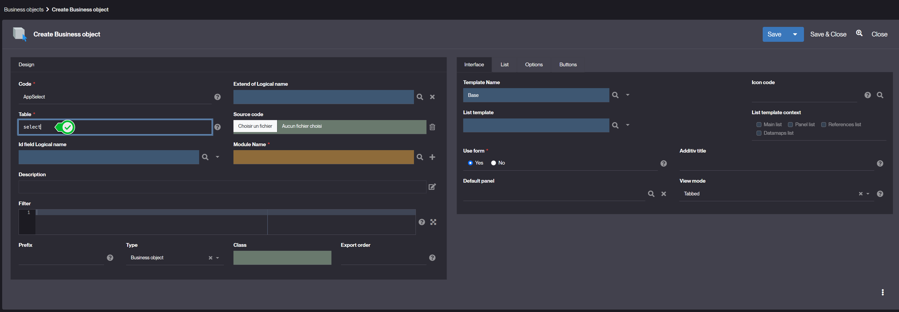

Select object
====================

### What is a Select object ?

A **Select Object** is an object whose table content is based on the result of an SQL query.  
It is considered as a [business object](/make/businessobjects/business-objects) by the platform and therefore benefits from the same functionalities (search, list, form, cross tables, publication, etc.). 

### How to create a Select object ?

To create a select object follow the steps below :
1. create an [business object](/tutorial/getting-started/object) whose table name is set to the special word `select`  
   
2. set the SQL query either:
   - in the **Filter** attribute of the object
   - in the `postLoad` hook of the object with the [setSearchSpec method](https://platform.simplicite.io/current/javadoc/com/simplicite/util/ObjectCore.html#setSearchSpec(java.lang.String))
3. create attributes for the object, corresponding to the columns of the query
4. set the **Timestamp** attribute of the object to the "None" value *(or, alternatively, adding attributes for the timestamp values)*

> Select objects were not designed with modifiability in mind, so you should only give reading rights on them.

> The mapping between the object's fields and the query's columns is determined by the order of the ObjectFields and the order of the columns of the query. 
> The naming of the columns of the query with the SQL's `AS` keyword is only taken into account in the select object's crosstable context.

