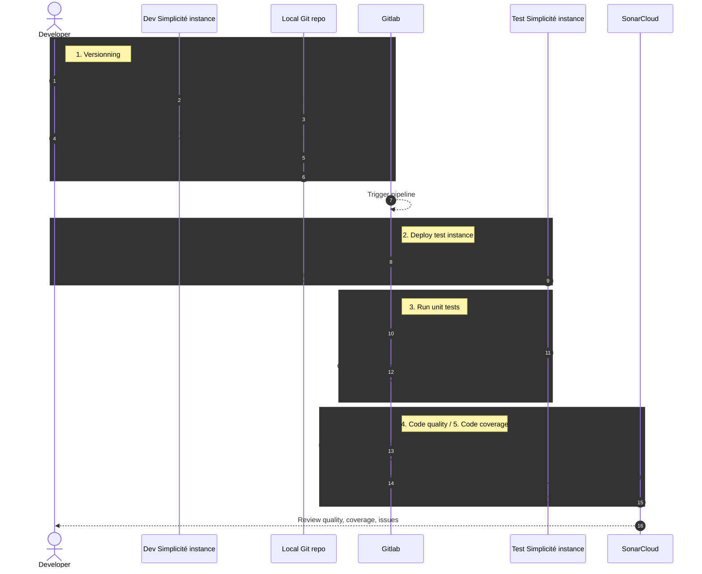
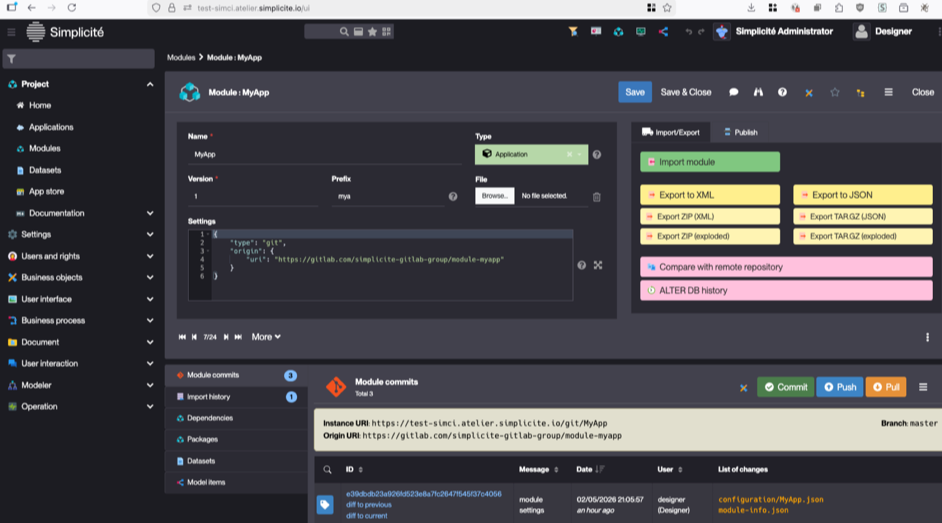
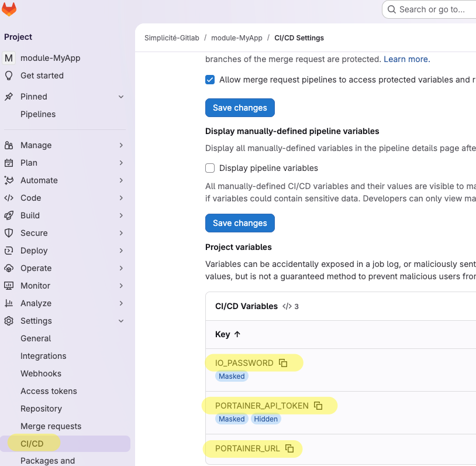
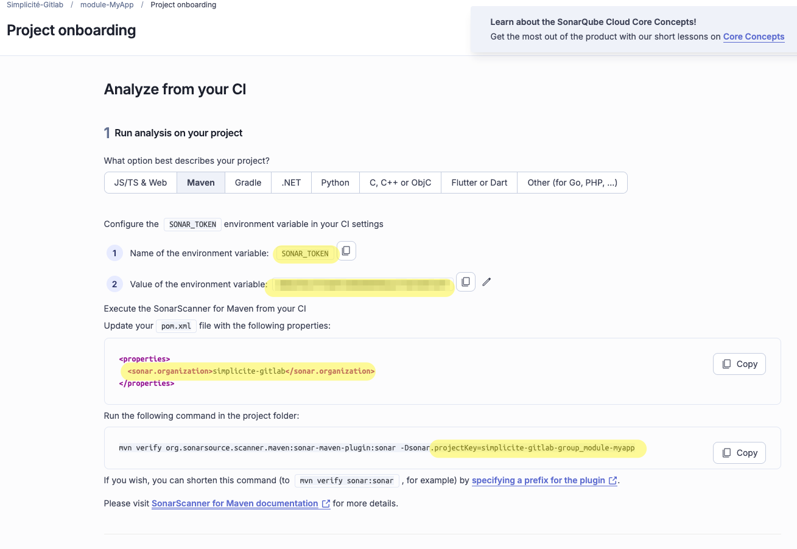

CI/CD
=====

**Objectives:** demonstrate initialization of a Simplicité module and setup of a Continuous Integration pipeline, with:

- **JUnit** unit tests check
- **Jacoco** unit tests code coverage
- **Sonar** code quality check

This document focuses on an example based on a **Gitlab + Portainer** infrastructure,
but is easily portable to other code versioning and orchestration tools (Github, Kubernetes, SIM, etc.).



Prerequisites
--------------

:::info
SonarQube Cloud does **not** support linking an organization to more than one DevOps platform at a time.
If the user's mail is already part of a Sonarcloud organization linked to GitHub, then Github should be used instead of Gitlab.
Alternatives include deploying a SonarQube instance, using another code analyzer, etc.
:::

- a Portainer instance with access to Simplicité images
- git installed locally
- a gitlab.com account, configured for access from local repositories
- a sonarcloud account

1- Versionning
-----------------

This section initializes the project, setting up a developpement instance and the gitlab repo

### Gitlab

1. create blank public project/repository
2. copy repository URL

### Simplicité

1. deploy a developpement Simplicité instance from Portainer `myapp-dev.my.domain`
2. create an empty module, and configure the settings field like specified below
3. create an init commit (prefer json exploded export type)
4. copy repository URL

```json
{
	"type": "git",
	"origin": {
		"uri": "https://gitlab.com/simplicite-gitlab-group/module-myapp"
	}
}
```

### Local repository

Clone the Simplicité repo and push it to gitlab:

```shell
git clone https://myapp-dev.atelier.simplicite.io/git/MyApp
cd MyApp
git remote add gitlab https://gitlab.com/simplicite-gitlab-group/module-myapp
git push -u gitlab master
```

2- Deploy test instance
-----------------------

For most of the steps of the CICD, a clean slate with Simplicité and the app's configuration is needed.
The DevOps platform (Gitlab, Github, etc), thus needs to instruct an orchestrator to deploy just that.
A set of CLI tools interacting with portainer allows to do various operations on the CLI.
Let's install the tools, test them locally, then configure the devops platform to deploy a test instance at each commit.

### Simplicité CI Tooling

Download the [Simplicite CI tooling](https://github.com/simplicitesoftware/simci) in the `./others` directory of the server:

```shell
mkdir others
cd others
curl -o myapp-compose.yml https://raw.githubusercontent.com/simplicitesoftware/resources/refs/heads/master/public/portainer_templates/demo-tmp.yml
curl -O https://raw.githubusercontent.com/simplicitesoftware/simci/refs/heads/main/simci
chmod +x simci
```

Adapt the docker compose file (`myapp-compose.yml`) to the project's values. For a blank project, it should mainly be the importspec:

```yaml
[...]
MODULES_IMPORT_SPEC: |
  title: "${COMPOSE_PROJECT_NAME}"
  modules:
    - name: "MyApp"
      git: 
        uri: "https://gitlab.com/simplicite-gitlab-group/module-myapp"
[...]
```

Create a `.env` file with the correct values for local testing:

```shell
IO_PASSWORD="change-me_more-than-32-chars"
PORTAINER_SERVER="top-domain"
PORTAINER_API_TOKEN="get-the-token-in-portainer"
STACK_NAME="test-simci"
```

Create and run an executable `test-simci.sh` file

```shell
#!/bin/bash

set -a
source .env
set +a

./simci portainer-stack-deploy -f myapp-compose.yml $STACK_NAME $PORTAINER_SERVER
```

You should get some information in return, and after a while, a "healthy container" message in the CLI.

Connect to the app and check that the module was correctly pre-installed:



:::warning
If any of the following apply, investigate before going any further:

- the instance is not accessible at the expected URL
- the module is not pre-installed, with the init commit effectively present
- HTTPS is not functional

:::

Now that the tooling is properly installed and functional, let's commit the changes:

```shell
git commit etc etc
```

### Gitlab pipeline

Create `.gitlab-ci.yml` with a simple "build" stage and a single "deploy-test job":

```yaml
stages:
  - build

deploy-test:
  stage: build
  script:
    - export PORTAINER_API_TOKEN="${PORTAINER_API_TOKEN}"
    - export IO_PASSWORD="${IO_PASSWORD}"
    - ./others/sim-cicd/simci portainer-stack-delete gitlab-test-myapp $PORTAINER_URL
    - ./others/sim-cicd/simci portainer-stack-deploy -f ./others/myapp-compose.yml gitlab-test-myapp $PORTAINER_URL
```

In Gitlab (Project > Settings > CI/CD > CI/CD Variables), set the corresponding variables for the project (they should have the values used in the `.env`)



Finally, commit, push to gitlab (and you dev instance which is now behind), and check that the pipeline runs and deploys the test instance properly.

2- Unit tests
--------------

### Simplicité

1. add a unit tests shared code that tests a **java shared code** in the module
2. commit & pull changes locally

### Gitlab

The `simci simplicite-run-unit-tests` command calls the `/io` service
(with the IO password conveniently set up through the compose template at the deploy stage)
to instruct Simplicité to execute the unit tests of this module.

```yaml
stages:
  - build
  - test # Add the "test" stage

[...]

unit-tests: # Add the "unit-test" stage
  stage: test
  script:
    - export PORTAINER_API_TOKEN="${PORTAINER_API_TOKEN}"
    - export IO_PASSWORD="${IO_PASSWORD}"
    - ./others/simci simplicite-run-unit-tests MyApp gitlab-test-myapp $PORTAINER_URL
```

Commit & push to gitlab (and the dev instance...), verify that unit tests execute properly.

:::tip
Remember, if debugging of `simci` is ever needed, use local executiong with `test-simci.sh`
instead of gitlab runners for quicker testing.
:::

3- Sonar & Code quality
---------------------

### Sonar

Connect to Sonar, it should detect your project.
Select "With other CI Tools", then "Maven" and get the following values:

- `SONAR_TOKEN`
- organization
- projectKey



### Simplicité

Configure Maven in the module settings:

```json
{
	"type": "git",
	"origin": {
		"uri": "https://gitlab.com/simplicite-gitlab-group/module-myapp"
	},
	"maven": {
		"eslint": true,
		"stylelint": true,
		"jshint": true,
		"checkstyle": true,
		"repositoryUrl": "https://platform.simplicite.io/6.3/maven"
	},
	"sonar": {
		"projectKey": "<replace with sonar proj",
		"organization": "<replace with sonar organization name>",
		"host.url": "https://sonarcloud.io"
	}
}
```

Commit the change.

Pull locally and run `mvn validate` to check the code.

### Gitlab

#### Sonar token

Set the `SONAR_TOKEN` variable in the Gitlab UI

#### Pipeline

Pull the maven changes from the dev instance, then update `.gitlab-ci.yml` to add:

- a `SONARCLOUD_ENABLED` variable (analysis can take some time, it's usefull to be able to skip it)
- a code-quality stage with a sonacloud-check job:

```yaml
variables:
  SONARCLOUD_ENABLED: "true"

stages:
  - build
  - test
  - code-quality

[...]

sonarcloud-check:
  image: maven:3.9-eclipse-temurin-21-alpine
  stage: code-quality
  dependencies:
    - unit-tests
  cache:
    key:
      files:
        - pom.xml
      prefix: "${CI_JOB_NAME}"
    paths:
      - .sonar/cache
      - .m2/repository
  variables:
    MAVEN_OPTS: "-Dmaven.repo.local=.m2/repository"
  script:
    - apk update && apk add nodejs npm
    - ls -halt
    - mvn verify org.sonarsource.scanner.maven:sonar-maven-plugin:sonar
  rules:
    - if: '$SONARCLOUD_ENABLED'
```

:::info
Sometimes, on first analysis, Sonarcloud can set the "main branch" a something different than you actual main branch (usually `master`).
It's problematic on the free tier where Sonarcloud will only analyze that branch.
If that happens, delete the project on Sonarcloud, recreate it, update the token, and run another analysis.
:::

4- Jacoco code coverage
------------------------

### Simplicité

Update module settings, and add the following line to the `sonar` section:

```json
"coverage.exclusions": "resources/**.js"
```

Commit (and pull changes locally)

### Docker configuration

Add the following data to the docker compose file, to generate a jacoco XML file during app usage (aka unit tests):

- `JACOCO_MODULES` environment variable
- a `jacoco-data` volume mounted at the specified path

```yaml
services:
  simplicite:
	[...]
    environment:
      [...]
      JACOCO_MODULES: "MyApp"
	  [...]
    volumes:
      - jacoco-data:/usr/local/tomcat/webapps/ROOT/WEB-INF/dbdoc/content/jacoco
volumes:
  jacoco-data:
networks:
  proxy:
    name: proxy
    external: true
```

### Pipeline configuration

- call `portainer-stack-get-coverage` at the end of unit test execution job
- instruct Gitlab to keep the jacoco file after unit tests have run
- attach that file to the sonar run with `-Dsonar.coverage.jacoco.xmlReportPaths=jacoco.xml`

```yaml
unit-tests:
  [...]
    - ./others/simci portainer-stack-get-coverage -v gitlab-test-myapp $PORTAINER_URL
  artifacts:
    paths:
      - jacoco.xml
    expire_in: 1 hour

sonarcloud-check:
  script:
    [...]
    - mvn verify [...] -Dsonar.coverage.jacoco.xmlReportPaths=jacoco.xml
  rules:
```

Final configuration
-------------------

:::warning
Do not attempt to just copy this final configuration files in an existing module.
This is given as a reference, but the CI/CD functionnalities should be implemented step by step as described here.
Each step requires coordination between the various components (instance, git, gitlab, sonar, etc), and doing everything
at the same time will probably result in painful debug analysis.
:::

### Module structure

```text
tree -a -I \.git
.
├── .checkstyle-configuration
├── .eslint-configuration
├── .gitattributes
├── .gitignore
├── .gitlab-ci.yml
├── .jshint-configuration
├── .stylelint-configuration
├── BUILD.md
├── configuration
│   ├── MyApp.json
│   └── Script
│       ├── MyappTests.json
│       └── MyAppTool.json
├── module-info.json
├── MyApp-openapi-3.0.2.yml
├── MyApp-swagger-2.0.yml
├── MyApp.md
├── others
│   ├── .env
│   ├── myapp-compose.yml
│   ├── simci
│   └── test-simci.sh
├── package-lock.json
├── package.json
├── pom.xml
├── README.md
├── resources
│   └── .gitkeep
├── src
│   └── com
│       └── simplicite
│           └── commons
│               └── MyApp
│                   └── MyAppTool.java
└── test
    └── src
        └── com
            └── simplicite
                └── tests
                    └── MyApp
                        └── MyappTests.java

15 directories, 26 files
```

### Module settings

```json
{
	"type": "git",
	"origin": {
		"uri": "https://gitlab.com/simplicite-gitlab-group/module-myapp"
	},
	"maven": {
		"eslint": true,
		"stylelint": true,
		"jshint": true,
		"checkstyle": true,
		"repositoryUrl": "https://platform.simplicite.io/6.3/maven"
	},
	"sonar": {
		"projectKey": "simplicite-gitlab-group_module-myapp",
		"organization": "simplicite-gitlab",
		"host.url": "https://sonarcloud.io",
		"coverage.exclusions": "resources/**.js"
	}
}
```

### Docker compose file

```yaml
services:
  simplicite:
    image: registry.simplicite.io/platform:6.3
    restart: unless-stopped
    container_name: ${COMPOSE_PROJECT_NAME}-app
    environment:
      IO_PASSWORD: "${IO_PASSWORD}" # Ignored unless 32 chars. Define through environment variable.
      DEV_MODE: true
      SIMPLICITE_SYSPARAM_USE_IO: "yes"
      SIMPLICITE_SYSPARAM_USE_IO_TESTER: "yes"
      MODULES_IMPORT_SPEC: |
        title: "${COMPOSE_PROJECT_NAME}"
        modules:
          - name: "MyApp"
            git: 
              uri: "https://gitlab.com/simplicite-gitlab-group/module-myapp"
      JACOCO_MODULES: "MyApp"
    volumes:
      - jacoco-data:/usr/local/tomcat/webapps/ROOT/WEB-INF/dbdoc/content/jacoco
    networks:
      - proxy
    labels:
      - "traefik.enable=true"
      - "traefik.http.routers.${COMPOSE_PROJECT_NAME}-app.entrypoints=websecure"
      - "traefik.http.routers.${COMPOSE_PROJECT_NAME}-app.tls.certresolver=leresolver"
      - "traefik.http.services.${COMPOSE_PROJECT_NAME}-app.loadbalancer.server.port=8443"
      - "simplicite.subdomain=${COMPOSE_PROJECT_NAME}"
volumes:
  jacoco-data:
networks:
  proxy:
    name: proxy
    external: true
```

### Gitlab pipeline config

```yaml
variables:
  SONARCLOUD_ENABLED: "true"

stages:
  - build
  - test
  - code-quality

deploy-test:
  stage: build
  script:
    - export PORTAINER_API_TOKEN="${PORTAINER_API_TOKEN}"
    - export IO_PASSWORD="${IO_PASSWORD}"
    - ./others/simci portainer-stack-delete gitlab-test-myapp $PORTAINER_URL
    - ./others/simci portainer-stack-deploy -f ./others/myapp-compose.yml gitlab-test-myapp $PORTAINER_URL

unit-tests:
  stage: test
  script:
    - export PORTAINER_API_TOKEN="${PORTAINER_API_TOKEN}"
    - export IO_PASSWORD="${IO_PASSWORD}"
    - ./others/simci simplicite-run-unit-tests MyApp gitlab-test-myapp $PORTAINER_URL
  artifacts:
    paths:
      - jacoco.xml
    expire_in: 1 hour

sonarcloud-check:
  image: maven:3.9-eclipse-temurin-21-alpine
  stage: code-quality
  dependencies:
    - unit-tests
  cache:
    key:
      files:
        - pom.xml
      prefix: "${CI_JOB_NAME}"
    paths:
      - .sonar/cache
      - .m2/repository
  variables:
    MAVEN_OPTS: "-Dmaven.repo.local=.m2/repository"
  script:
    - apk update && apk add nodejs npm
    - ls -halt
    - mvn verify org.sonarsource.scanner.maven:sonar-maven-plugin:sonar -Dsonar.projectKey=simplicite-gitlab-group_module-myapp -Dsonar.coverage.jacoco.xmlReportPaths=jacoco.xml
  rules:
    - if: '$SONARCLOUD_ENABLED'
```
