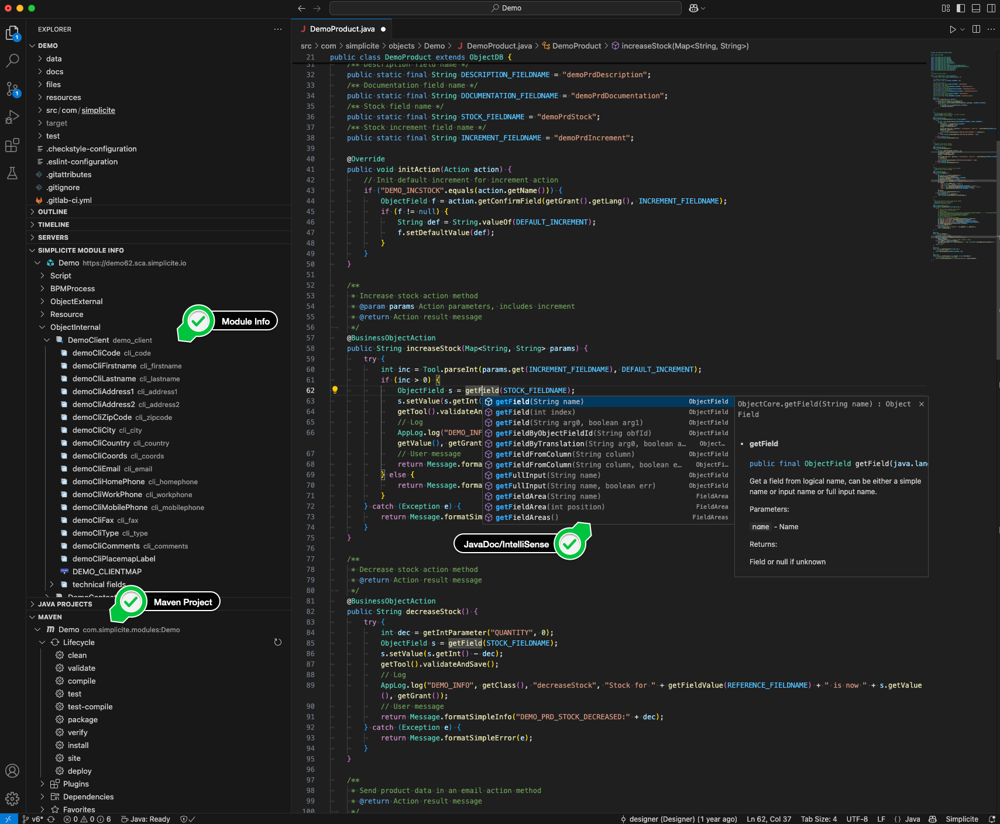

External code editor
=====================

The code editor included in Simplicité does not have all the tooling and possibilities offered by an IDE.

Simplicité modules are published as Git repositories, so you can easily clone them locally and work on the sources.
Refer to the [Git documentation](/docs/integration/webservices/git-repositories#export) to see how to clone the module's Git repository.

Typically, you would:

1. do some configuration on Simplicité
2. commit on Simplicité
3. pull the changes from Simplicité
4. do some coding locally
5. commit those changes locally
6. push the changes to Simplicité

VS Code
-------

To work with VSCode (and affiliates), it is useful to add the [Extension Pack for Java](https://marketplace.visualstudio.com/items?itemName=vscjava.vscode-java-pack)
to get IntelliSense and Java debugging tools. Given that Simplicité modules are in fact exported as Maven projects,
the extension will do all the necessary work when opening the project, for example to provide the necessary JavaDocs to get useful autocompletion.

### Simplicité Extension

The [Simplicite VSCode tools extension](https://marketplace.visualstudio.com/items?itemName=SimpliciteSoftware.simplicite-vscode-tools)
is **optional**. It requires signing in to the app in the extension, but is useful to avoid "technical" git commits, as its main usage is to
push code directly to the instance. Detailed documentation is available in the marketplace's README.

:::warning
You must activate the `DEV_MODE` system parameter for this extension to work.
:::

