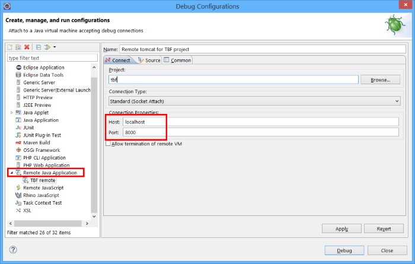

Remote debugging
================

Server side <span id="server"></span>
-------------------------------------

> **Warning**: starting your server in remote debug mode (JPDA with default socket connection mode) has a **very** significant negative
> impact on its performances. Make sure to do is only in development and to disable it when you don't use it.

### Docker <span id="docker"></span>

When using our standard images you can (re)start your container with JPDA enabled by adding
`-e JPDA=true -p <port, e.g. 8000 or 12345>:8000` to your `docker run` command.

See [this document](/docs/operation/docker) for details.

### Simplicité Instances Manager (SIM) <span id="sim"></span>

When using a SIM server, to restart an instance in debug mode you have to stop Tomcat `sim tomcat-stop` and restart it in JPDA mode `sim tomcat-debug`.

The exposed JPDA port is specific to each instance (it is only opened when the instance is running in debug mode) and is available in the `JPDA_ADDRESS` environment variable.
 
### Tomcat <span id="tomcat"></span>

When using a "traditional" deployments of Tomcat 9.x servers you can (re)start Tomcat in JPDA mode by doing the following change
in the startup script `startup.sh` (the change is to add the keyword `jpda` before `start`):

```bash
(...)
exec "$PRGDIR"/"$EXECUTABLE" jpda start "$@"
```

By default the listening port is `8000` but you can change it to any port by setting the `JPDA_ADDRESS` environment variable
to another value:

```
JPDA_ADDRESS=12345
export JPDA_ADDRESS
```

Alternatively you can add following option to JVM arguments:

```
-agentlib:jdwp=transport=dt_socket,server=y,address=8000,suspend=n
```

Debugger side <span id="debugger"></span>
-----------------------------------------

The server's debug port must be accessible from the local machine running the debugger. For remote instances, this can be achieved by either opening the port in the server's firewall or, preferably, by setting up an SSH tunnel to securely forward the port.

For instance:

```bash
ssh -L 8000:localhost:12345 <user>@<server>
```

will make the remote `12345` port available locally on local port `8000`.

> **Note**: Such tunnels can also easily be configured using SSH GUIs clients like PuTTY.

Then you can configure a **remote debug configuration** in your IDE pointing to `localhost:8000`
(or directly on `<server>:12345` if you have chosen to open the remote port thru the server firewall).

Then , provided that you have a copy of your modules' code locally in the IDE you will be able to define
breakpoints, do step by step debugging, etc.

### VSCode <span id="vscode"></span>

Configure your `launch.json` like this:

```json
{
    "version": "0.2.0",
    "configurations": [
        {
            "type": "java",
            "name": "My instance",
            "request": "attach",
            "hostName": "<server>", (e.g. localhost or your server's hostname or IP address)
            "port": <port> (e.g. 8000 or 12345)
        },
        (...)
    ]
}
```

### Eclipse <span id="eclipse"></span>

Configure and launch a "Remote Java Application":


