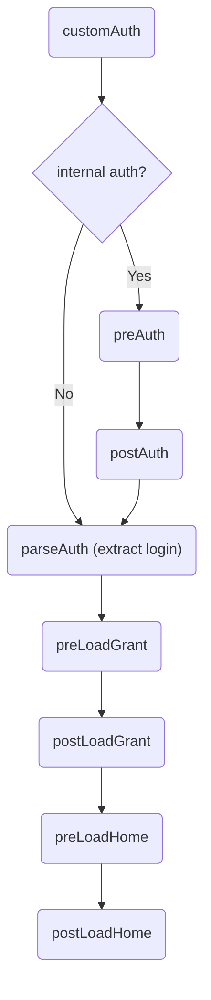

Platform hooks
==============

This document describes the hooks that can be implemented to put some **additional** business logic at user session level.

> **Important**: As of version 5.0, static grant hooks are **deprecated**, they are replaced by the platform hooks singleton with same methods.
> **Rhino** scripting language is no longer supported in Simplicité version 6.0+.

> This document describes `PlatformHooks` implementation examples but it can be directly transposed to legacy `GrantHooks`.

> None of these hooks **needs** to be implemented. You can implement one or several of these hooks if you want to apply out some dynamic business logic that goes beyond what can be configured.

> These hooks are located in the singleton shared code named `PlatformHooks`.

Platform init hook
-------------------

The `postPlatformInit` (version 4.0+) platform hook can be used to do some unique processing after the platform instance startup.

For instance you can use it to read and use some **immutable** settings passed to the instance using an environment variable or a JVM argument, e.g.

```java
@Override
public String postPlatformInit(Grant sys) {
	String setting = System.getenv("SOME_ENV");
	if (!Tool.isEmpty(setting)) {
		sys.setSystemParam("MY_SETTING", setting); // set it in database
		sys.setParameter("MY_SETTING", setting); // set it in memory for current system user singleton
		return "MY_SETTING has been set from the SOME_ENV env var";
	}
	return "SOME_ENV env var is not set";
}
```
> **Note** This initialization-related platform hook is called only once, it is not re-called after a clear cache

Authentication hooks
--------------------

The `customAuth` (version 3.2+), `parseAuth` (version 3.0+) and `postAuth` (version 4.0+) platform hooks can be used to implement/customize authentication flows.



Check:

- [JavaDoc](https://platform.simplicite.io/current/javadoc/com/simplicite/util/PlatformHooks.html)
- [this document about custom authentication](/docs/authentication/customauth),
- [this document about OAuth2 authentication](/docs/authentication/oauth2)
- [this document about SAML authentication](/docs/authentication/saml) for details.

Custom start page hook
----------------------

The `customStartPage` (version 5.0+) platform hook allows to implement a custom low-level start page `/` instead of the default start page that only redirects to `/ui/`.

Note that similar start page customization can also be achieved at a higher level by implementing the `displayPublic` hook of a disposition associated to the `public` user.

Custom authentication page hook
-------------------------------

As of version 5.0, the `customAuthPage` platform hooks allows to implement a custom authentication/page.

For more details  [refer to this documentation](/docs/authentication/custom-page)

Custom health check hook
------------------------

The `customHealthCheck` (version 6.2+) platform hook allows to implement e custom health check, e.g.:

```java
@Override
public void customHealthCheck(HttpServletRequest request, HttpServletResponse response, boolean minimal) throws Exception {
	AppLog.info("Custom health check called from " + request.getRemoteAddr());

	ServletTool.success(request, response, new JSONObject()
		.put("status", "OK")
		.put("date", Tool.toDatetime(new Date())));
}
```

User loading hooks
------------------

### `preLoadGrant` &amp; `postLoadGrant`

These two platform hooks can be used to dynamically customize the user profile and rights.

The `preLoadGrant` is called **before** actually loading the user rights (at that stage the user is authenticated and the platform only knows its login).

Example:

**Java**

```Java
@Override
public void preLoadGrant(Grant g) {
	String login = g.getLogin();
	// e.g. load custom responsibilities and user profile
	super.preLoadGrant(g);
}
```

The `postLoadGrant` is called **after** the user rights are loaded (responsibilities, system parameters...).

Example:

**Java**

```Java
@Override
public void postLoadGrant(Grant g) {
	AppLog.info("Hello " + g.getFirstName() + "!",g);
	// e.g. add custom rights...
	super.postLoadGrant(g);
}
```

There are also some **finer** hooks that are **enclosed** between the above `pre/postLoadGrant`:

- `preLoadSystemParams` &amp; `postLoadSystemParams` called before and after loading the user's system parameters
- `preLoadProfile` &amp; `postLoadProfile` called before and after loading the main user's settings (e.g. names, language, timezone, ...)
- `preLoadResponsibilities` &amp; `postLoadResponsibilities` called before and after loading the user's responsibilities
- `preLoadMenu` &amp; `postLoadMenu` called before and after loading the user's menu entries

The `preLoadHome` &amp; `postLoadHome` hooks are called before and after loading the user's home page, which appends after the user loading above,
but also each time the user changes its scope (a scope being associated to a home page)

Menu hooks
----------

### `isMenuEnable`

This hook can be used to dynamically disable a menu item.

It is called for each granted menu item for considered user.

Example:

**Java**

```Java
@Override
public boolean isMenuEnable(Grant g, String domain, String item) {
	// Example to hide to group SIMPLE_USER the Product in the Marketing domain.
	return !(g.hasResponsibility("SIMPLE_USER") && "DomainMarketing".equals(domain) && "Product".equals(item));
}
```

Fulltext search hooks
---------------------

### `preSearchIndex` &amp; `postSearchIndex`

These hooks change the result of a fulltext search. The `rows` argument is a `Vector` of `SearchItem`.

Example:

**Java**

```Java
@Override
public List<SearchItem> postSearchIndex(Grant g, List<SearchItem> rows) {
	// Access to the default result
	for (SearchItem item : rows) {
		// Change anything to display here...
		AppLog.info("score "+item.score,g);   // Optional scoring
		AppLog.info("object "+item.object,g); // Optional object name
		AppLog.info("row_id "+item.row_id,g); // Optional row_id
		AppLog.info("key "+item.key,g);   // Item unique key
		AppLog.info("ukey "+item.ukey,g); // Default user key to display
		AppLog.info("data "+item.data,g); // Default payload or summary to display
		if (!Tool.isEmpty(item.values)) {
			// Optional object values as a List of String
		}
	}

	// Sample to add an item on top
	SearchItem item = new SearchItem();
	item.score = "1000";
	item.ukey = "The best item";
	item.data = "This item is always returned...";
	if (!Tool.isEmpty(rows)) rows.add(0,item);
	return rows;
}
```

Other hooks
-----------

### `validatePassword`

This platform hook is called when a password change is attempted, it can be used to implement custom rules for password fomat validation:


**Java**

```Java
@Override
public List<String> validatePassword(Grant g, String pwd) {
	List<String> msgs = super.validatePassword(g, pwd);
	if (msgs==null) msgs = new ArrayList<String>();
	if (pwd.indexOf("_") < 0)
		msgs.add(Message.formatError("ERR_SYN_CASE_SUGGESTION", "A good password must include an underscore!", null));
	return msgs;
}
```

It can returns either a single error message (like in the example above) or an array of error messages.
An error message can either be a hard-coded label (like in the example above)
or, better, the code of a configured static text (so as it is displayed in the user's language).
Otherwise, it must either return nothing (like in the example above) or an explicit `null` value to indicate that the password is accepted.

The default system-level implementation for password validation is that a password must have at least 8 digits.
The error(s) returned by the above hooks are **added** to the default error message returned when password length is less than 8 digits.

### `logout`

This platform hook is called when an explicit or implicit logout occurs (it is called just before the session is dropped)

**Java**

```Java
@Override
public void logout(Grant g) {
	AppLog.info("Bye bye " + g.getLogin() + "!", g);
	super.logout(g);
}
```

### `downloadDocument`

This platform hook is called when a document download has been requested and has been successfully checked (versions 3.2+):

**Java**

```Java
@Override
public void downloadDocument(Grant g, DocumentDB doc) {
	if ("MyObject".equals(doc.getObjectRef()))
		AppLog.info("The doc " + doc.getId() + " from object " + doc.getObjectRef() + " has been downloaded by " + g.getLogin(), g);
	super.downloadDocument(g, doc);
}
```

