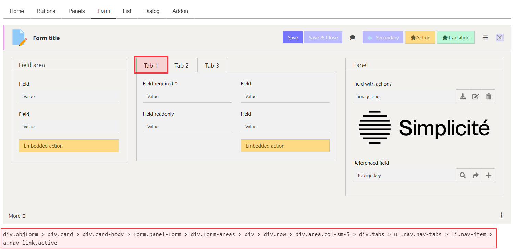
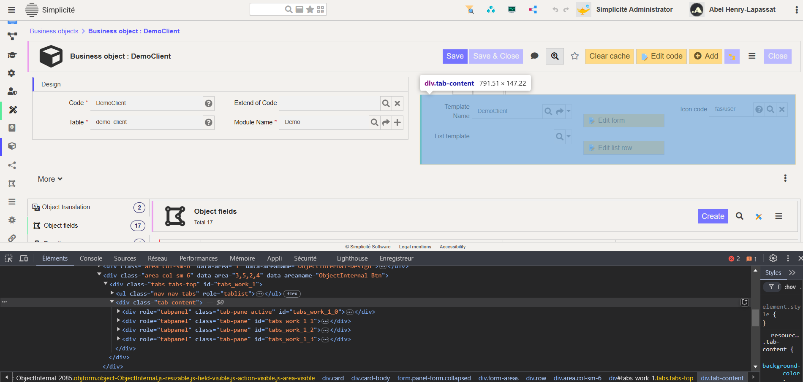

Complementary Theme Styles
==========================

<div class="warning">
    This lesson is a part of the <b>Frontend Development</b> category, which is meant to guide you through the frontend development within Simplicité. Thus it might be a bit longer and more verbosed than other lessons you will find in the <b>Simplicité Configuration Object</b> category.
</div>

This document outlines how to enhance and refine your custom or the pre-existing themes using the *addon.less* file.

The *addon.less* file enables you to override or fine-tune the styles defined in the foundational files, *constants.less* and *theme_gen.css*. By leveraging this approach, you can create more dynamic and cohesive designs while maintaining flexibility and ease of management.

> **What is Less ?**
> Leaner CSS (Less), is a dynamic preprocessor style sheet language that extends the capabilities of CSS. It introduces features like variables, nesting, mixins and functions. Thus making style sheets more maintainable, customizable and easier to scale.

## Less Overview

### What is Less ?

Leaner CSS (Less), is a dynamic preprocessor style sheet language that extends the capabilities of CSS. It introduces features like variables, nesting, mixins and functions. Thus making style sheets more maintainable, customizable and easier to scale.

### Key Features

*Variables:* Store reusable values for colors, fonts or dimensions:
<details>
<summary>Code Snippet</summary>

```less
@primary-color: #3498db;
body {
    color: @primary-color;
}
```
</details>

*Nesting:* Write styles in a structured & hierarchical way. Allowing to specify depending on contexts when it's needed. Below are shown two ways to use nesting, and shows a use case where items with same class have different styles depending on their parent:
<details>
<summary>Code Snippet</summary>

```less
.container {
    .header {
        .box {
            background-color: red;
        }
    }
    .body > .box {
        background-color: blue;
    }
}
```
</details>

*Interactions Nesting:* Same way as nesting works for children elements or contexts, yo ucan use it to dynamically handle different type of interactions for your elements:
<details>
<summary>Code Snippet</summary>

```less
body {
    .container {
        .box {
            background-color: yellow;
            transition: background-color 0.5s ease;

            &:hover {
                background-color: orange;
            }
            &:active {
                background-color: red;
            }
        }
    }
}
```
</details>

*Mixins:* Define reusable style blocks for consistency:
<details>
<summary>Code Snippet</summary>

```less
.rounded-corners(@radius: 0.5rem) {
    border-radius: @radius;
}
div {
    .rounded-corners(1rem);
}
```
</details>

*Functions:* Perform calculations and color operations directly in your styles:
<details>
<summary>Code Snippet</summary>

```less
@primary-color: #3498db;
body {
    color: darken(@primary-color, 16%);
}
```
</details>

Combining all the available customization features in Simplicité allows for *extensive control* over your **UI**. However, while the *addon.less* file is a powerful tool for adding specific design elements, its use should be reserved for cases where *built-in customization* options are *insufficient*. Over-reliance on addon.less can lead to complex code, making future maintenance more challenging for developers.

## Use Case for addon.less

The **addon.less** file should be employed to address highly specific design needs that cannot be achieved through standard Simplicité configurations. For example, *Simplicité's brand identity* incorporates distinctive vertical and horizontal colored lines, which we decided to integrate into one of our custom themes. 

This serves as a *practical illustration* of how addon.less can introduce unique visual elements to enhance theme aesthetics.

> ***Warning:*** Simplicité provides a robust set of tools to modify various aspects of your interfaces, applications, and themes. Before resorting to addon.less, ensure that you have fully explored Simplicité's native customization features. This approach minimizes unnecessary code and promotes cleaner, more maintainable designs.

### Process Overview

Such process can be divided in several steps:
1) Finding the elements & their DOM path.
2) Identifying the precise context for our style to be applied
3) Implementing the style in the file

### 1. Finding the element

Before applying additional styles, clearly define the visual modifications you want to implement. This requires identifying the *specific UI element* you intend to modify. There are two main approaches to achieve this:

**Option 1:** If the element is part of the *Theme Editor - Preview* or *Home* section, utilize the *Theme Editor - Path in DOM* feature to directly locate the path to the target element.

**Option 2:** If the element lies outside of the Theme Editor, use your *browser's inspector* tool to manually locate the desired element within Simplicité's UI. While slightly more manual, this method still provides accurate identification and contextual insights.

**Example:** In our case, we aimed to style *Panels*, *Sub-Panels*, *Tabs* and *List*. By using the **Theme Editor - Path in DOM**, we identified the following paths:

- *Panels:* THe primary element for panels is `div.card`, typically organized into 3 parts:
    - `div.card-header`, the *header section* of the panel card, where the name of the panel and all sort of buttons are displayed.
    - `div.card-body`, the *content section* of the panel card, where all of it's content is displayed (static and dynamic).
    - `div.card-footer`, the *footer section* of the panel card, often used to contain some context-specific features.

- *Sub-Panels:* Share the same structure as panels using the `div.card` element, difference is that it's embedded and usually don't have a *footer section*.

- *Tabs:* Those are implemented through the `div.tabs` element. Their layout can be further specified using additional classes specifying how the `li.nav-item` (tab headers within `ul.nav.nav-tabs`) are displayed compared to the `div.tab-pane.active` (tab content contained in `div.tab-content`).:
    - `div.tabs.tabs-top`, where they are displayed *vertically on top*.
    - `div.tabs-bottom`, where they are displayed *vertically below*.
    - `div.tabs-left`, where they are displayed *horizontaly before*.
    - `div.tabs-right`, where they are displayed *horizontaly after*.

To provide a better understanding, here is the organizarion of tabs as it is visible in a *.less* file:
```less
div.tabs.tabs-top {
    ul.nav.nav-tabs {
        li.nav-item
        // . . .
    }
    div.tab-content {
        div.tab-pane.hidden // content of an unselected nav-item
        div.tab-pane.active.show // currently displayed content
    }
}
```

- *Lists:* This item is another core one of Simplicité, and its architecture is similar but slightly more complex than the ones seen before, first of all it is represented using the `<table>` html element, furthermore it is only placed within panels for more clarity. So here is what it looks like:

```less
div.card-body { //panel body containing the list element
    div.container-table {
        table.table {
            thead { // Table Header (for headers, categories, fields, etc)
                tr { // table row
                    th.col-action { } // this is an unique cell (the first one) that contains specific actions
                    th { }
                    // as many headers as needed ...
                }
                // as many table row within the header section ...
            }
            tbody { // Table Body  (containing content rows)
                tr.list-clickable { // table row (clickable)
                    td.col-action { } // this is an unique cell (the first one) that contains specific actions  
                    td { }
                    // as many cells as needed (usually as many as headers above) ...
                }
            }
            tfoot { // Table Footer (usually for totals and other results)
                tr { // table row
                    td.col-actions { }
                    td { }
                    // as many cells as needed results (usually not all are used)
                }
            }
        }
    }
}
```

> ***Note:*** For our specific style needs, our primary goal was to target the headers of each element. Understanding the organization and hierarchy of different components is essential to ensure precision in applying styles. Targeting incorrect elements or misunderstanding their structure may lead to unintended styling across various UI components.





## 2. Identifying the context

Once an element is identified, ensure that you thoroughly *understand the context* in which the style will be applied. Failing to grasp the full scope can result in styles unintentionally *affecting other parts* of the UI. This is particularly crucial when using the browser's inspector (Option 2) since multiple UI elements often share the same classes.

To mitigate this, carefully document the target element's classes, as well as the classes of its parent containers and related elements. This ensures that your styles are isolated to the intended component.

> This part is especially needed when you are going for the second options in the previous step, as classes are shared by many objects, you need to really be careful while adding new styles.

**Example:** For our 3 targeted elements, which are core items of every Simplicité's UI, we had to make sure that the style was applied properly, especially for the differentiation between *Panels* and *Sub-Panels*, that are both referenced as `card` in the HTML.

## 3. Implement the style

After identifying the *DOM path* and *context*, proceed to implement the desired styles by writing the appropriate code in the *addon.less* file. This ensures the applied styles are scoped to the correct elements, preventing unwanted side effects in other parts of the interface.

**Example:** within the *addon.less* file, we'll apply the identified path to precisely target our element:

```less
// Colors variables
@border-pink: #EC9DED;
@border-blue: #5451FF;
@border-green: #58EC9B;
@border-red: #FB3640;

// Targetting Panels and Sub-Panels
div.card {
    div.card-header { //this is the header of PANELS
        border-left: solid 0.2rem @border-pink;
    }
    div.panel-card > div.card {
        div.card-header { //this is the header of SUB-PANELS
            border-left: solid 0.2rem @border-blue;
        }
    }
}

// Targetting Tabs (top layout)
div.tabs-top {
    div.nav-tabs > div.nav-link.active {
        border-left: solid 0.2rem @border-green;
    }
    div.tab-pane.active {
        border-left: solid 0.2rem @border-green;
    }
}

// Targetting Lists
div.container-table > table {
    thead {
    	border-left: solid 0.2rem @border-red;
    }
}
```

> **Careful**
> If the style you are adding doesn't appear at first (even after clearing cache), consider adding *!important* on it so you make sure it is applied.

Now to see if your new styles has been applied, make sure to apply your theme to the wanted *Home Page* view in the *User Interface > Views > Home Pages*:


Then make sure to clear your cache to update the styles, and you should see the result !

### (Optional) Make it interactive !

To extend the previous example, let's add a customization for interactive behaviors. Specifically, we will modify the appearance of selected rows in a list element. By default, selecting a row slightly darkens it. Our goal is to enhance this by adding a left-side line to the selected row, preserving the theme's identity.

When a row is selected in a list, the associated `tbody.tr.list-clickable` element receives the *selected* class. This triggers the default darkening effect and ticking of box in the .

Once the behavior is understood, update the *addon.less* file to add the left-side line:

```less
@border-red: #FB3640;
@border-yellow: #FFD166;

div.container-table > table {
    thead {
    	border-left: solid 0.2rem @border-red;
    }
    tbody > tr.list-clickable {
        border-left: solid 0.25rem transparent; // preventing any movement when border will be visible
        &.selected {
            border-left-color: @border-yellow;
        }
    }
}
```

This modification applies the desired effect without interfering with other interface elements.