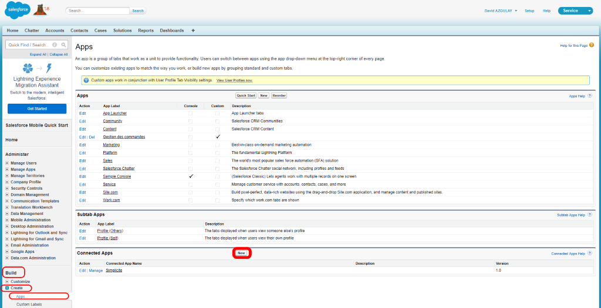
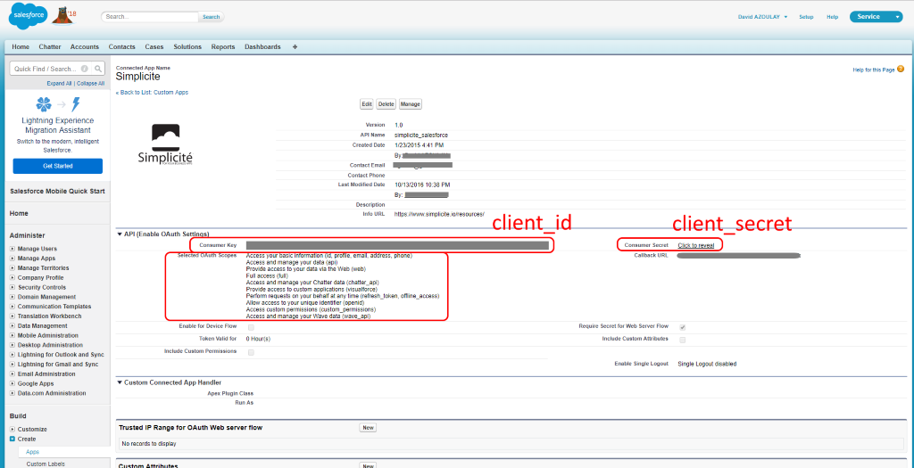

SalesForce objects
==================

This document applies to version 3.0 MAINTENANCE 20 and above.

It describes how to configure and use remote [SalesForce&reg;](http://www.salesforce.com/) objects.

Configuration
-------------

To configure a remote SalesForce&reg; business object the _Table_ field value must be `service-salesforce`.

The configuration of the remote SalesForce&reg; business object is then set in the _Filter_ field as JSON:

```json
{
	"name": "<SalesForce object name, e.g. Account>",
	"credentials": "<name of the parameter containing the credentials>",
	<additional configuration items>
}
```

Nothing else needs to be configured, except rights, as the remote SalesForce&reg; object configuration is dynamically processed to build the local Simplicité  business object.

However, the optional `<additional configuration items>` allow some advanced configuration to be added:

- `mappings: [<array of { <Simplicité field name>: <SalesForce field name>}>]` allows to define explicit mappings between
explicitly or implicitly configured Simplicité fields, by default the list is `[{"row_id", "Id"},{"created_by", "CreatedById"},{"created_dt", "CreatedDate"},{"updated_by", "LastModifiedById"},{"updated_dt", "LastModifiedDate"}]`
- `ignored: [<array of SalesForce field names>]` allows to define a list of fields that are not taken into account on Simplicité side,
by default the list is: `["IsDeleted", "OwnerId", "SystemModstamp", "MasterRecordId"]`.

Credentials
-----------

The credentials, that can be shared among several business objects of the same remote SalesForce&reg; instance are configured as JSON in a system parameter (either a global server parameter or a user server parameter):

```json
{
	"client_id": "<SalesForce OAuth2 client ID>",
	"client_secret": "<SalesForce OAuth2 client secret>",
	"username": "<SalesForce user name>",
	"password": "<SalesForce user password>",
	"encoding": "<encoding (optional) defaults to UTF-8>",
	"http_timeout": "<HTTP requests timeout in milliseconds (optional) defaults to 30000>"
}
```

> **Note**: multiple credentials can also be configured if you need to access to several remote SalesForce&reg; instances.

The client ID and client secret are the one defined for a **Connected App** in SalesForce admin UI.

You can create a new connected app in the _Build_ > _Create_ > _Apps_ menu and then clicking on the _New_ button of the _Connected Apps_ section:



Once created you can get the client ID and client secret in the _API_ section:



Make sure you have selected the appropriate scopes to get access to the APIs you need.

The username and password are the one you use to signin SalesForce.