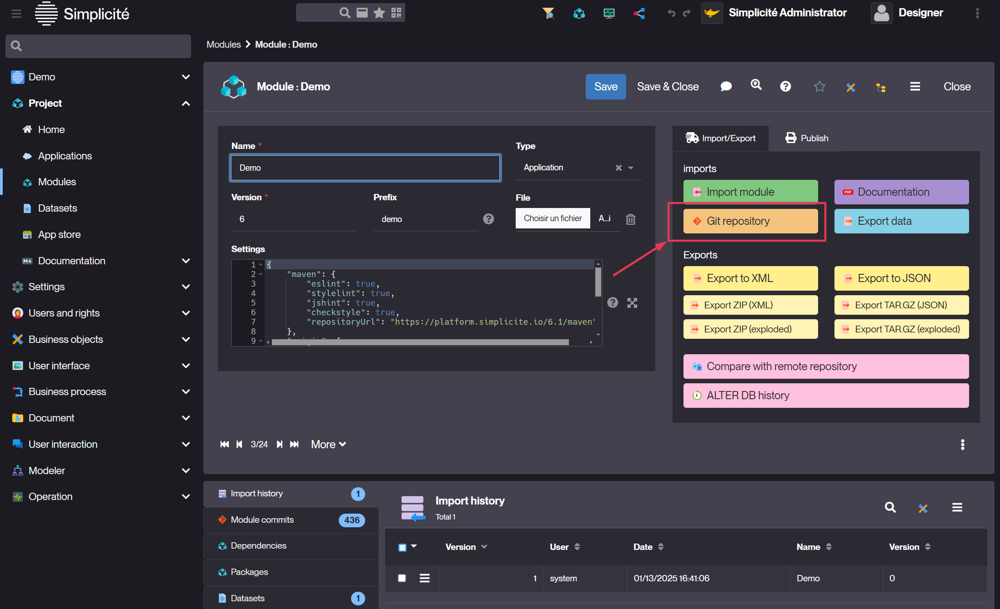

# Git repositories (`/git`)

The `/git` endpoint is dedicated to export/import modules using [Git](https://git-scm.com/) over HTTP(S).

This feature relies on the Eclipse [JGit](https://github.com/eclipse-jgit/jgit) library.

> **Warning**: In production this Git endpoint's URL should be restricted only to allowed origins e.g. using URL filtering on request's origin IP address or similar approaches.

## Configuration {#config}

The Git repositories are stored on the server file system.

Due to the way the JGit library is designed, the base folder in which these repositories will be located **must** be passed to the application server as a **system property**.

This can be done either:

- by passing a JVM argument `-Dgit.basedir=<path>` when starting the application server
- by setting it in the `application.properties` file of your application

Then you also need to set the `USE_GIT` system parameter to `yes`.

## Export {#export}

To export the `MyModule` module as a Git repository the first thing to do is to create or update the module's repository
using the dedicated action on the _Module_ object:



Then you can clone the module's repository by:

```shell
git clone http(s)://<host name>[/<app context root>]/git/<module name>
```

The credentials you have to use in this case are the same as the one you can use for the I/O interface.

## Import {#import}

Any `git push [origin]` on the cloned module's repository triggers a module import (e.g. after having made some local changes or to upgrade another instance by pushing on another remote).

## Import from an origin remote

It is possible to configure a module that is linked to an external Git repository by adding following settings to your module:

E.g. from another instance's module repository:

```json
{
  "type": "git",
  "origin": {
    "uri": "http(s)://<instance host name>[/<instance app context root>]/git/<module name>",
    "username": "<I/O user's login>",
    "password": "<I/O user's password>"
  }
}
```

Any call to the _Import module_ action will then result in either a clone or a pull on the configured remote Git repository.

> Typical use case is to link a "secondary" instance to a "primary" instance. In such a case there are 2 possible ways to export/import a module from the "primary" to the "secondary" instance:
>
> - Directly use the _Import module_ action from the "secondary" instance (that will be pulling last commit(s) from the "primary" instance)
> - Use a clone of the "primary" instance Git repository configured with an additional remote that points to the "secondary" instance.
>   Then `git pull` will pull from the "primary" instance and `git push <remote name>` will push to the "secondary" instance.

E.g. from a **public** GitHub repository:

```json
{
  "type": "git",
  "origin": {
    "uri": "https://github.com/<profile>/<repository>.git"
  }
}
```

> **Note**: if you plan to push on this public GitHub repository you must add a username and password.

As of version 5.2, you can set the JVM properties (`remote.git.username/password`) or the environment variables (`REMOTE_GIT_USERNAME/PASSWORD`)
if you want to avoid configuring username/password credentials in your module's settings. A **much better approach** being to use a SSH URI with configured SSH public/private keys.

## Advanced {#advanced}

The Git repositories created/cloned by Simplicité:

- Are **non bare** repositories, the local worktree is needed by the export/import processes
- Have the following configuration set by default in `.git/config` file to allow read-write access over HTTP(S):

```
[http]
        uploadpack = true
        receivepack = true
```

If you manually create/clone repositories used by Simplicité (which is not supposed to be done except for very specific needs)
make sure to create/clone **non bare** repositories and make sure to have these two options activated (which is not the case by default).

### Branches {#branches}

You can specify the branch to use in the origin definition (or in the remotes definitions, see bellow):

```json
{
  "type": "git",
  "origin": {
    (...)
  },
  "branch": "<branch, defaults to 'master'>"
}
```

### Other remotes {#remotes}

You can specify additional remotes:

```json
{
  "type": "git",
  "origin": {
    (...)
  }
  "remotes": {
    "remote1": {
       (...)
    },
    (...)
    "remoteN": {
       (...)
    },
  }
}
```

Each remote definition use the same syntax as the origin definition.

### Maven settings {#maven}

If required, you can specify additional settings to change the Maven settings generated in the `pom.xml`.

```json
{
  "maven": {
    "name": "<alternative name>",
    "description": "<alternative description>",
    "javaVersion": "<alternative Java version>",
    "url": "<alternative instance URL>",
    "repositoryUrl": "<alternative Maven repository URL>",
    "checkstyle": <true to execute the CheckStyle verification at build>,
    "jshint": <true to execute the JSHint check at build>,
    "eslint": <true to execute the ESLint check at build>,
    "stylelint": <true to execute the StyleLint check at build>,
    "dependencies": [
      {
        "groupId": "<additional dependency's group ID>",
        "artifactId": "<additional dependency's artifact ID>",
        "version": "<additional dependency's version>"
      },
      (...)
    ]
  }
}
```

### SonarQube&reg; settings {#sonar}

If required, you can specify additional settings to change the SonarQube&reg; configuration generated in the `pom.xml`.

```json
{
  "sonar": {
    "projectKey": "<alternative project key>",
    "projectName": "<alternative project name>",
    "projectVersion": "<alternative project version>",
    "<custom name>": "<additional custom setting, will be prefixed by 'sonar.'>"
  }
}
```

### Linting settings {#linting}

#### Checkstyle&reg; settings {#checkstyle}

If required, you can specify additional settings to change the Checkstyle&reg; configuration generated in the `pom.xml`.

```json
{
  "checkstyleConfig": "<default|google|<XML resource name>>",
  "checkstyleReportFile": "<report file>"
}
```

#### JSHint&reg; settings {#jshint}

If required, you can specify additional settings to change the JSHint&reg; configuration.

```json
{
  "jshintConfig": "<default|<JSON resource name>>"
}
```

#### ESLint&reg; settings {#eslint}

If required, you can specify additional settings to change the ESLint&reg; configuration.

```json
{
  "eslintConfig": "<default|<Javascript resource name>>"
}
```

#### StyleLint&reg; settings {#stylelint}

If required, you can specify additional settings to change the StyleLint&reg; configuration.

```json
{
  "stylelintConfig": "<default|<JSON resource name>>"
}
```

### GPG signature {#gpg}

As of version 5.3 it is possible to enable GPG signature of commits.

This uses the `GIT_GPG_SIGNATURE_KEYID` system parameter which denotes the GPG key ID to use for signature.

> **Note**: THis system parameter can be overridden on a per-user base.
