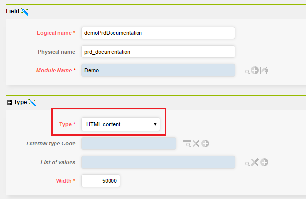
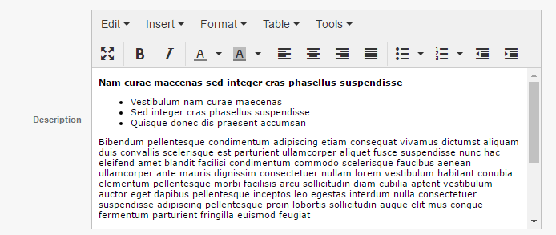

HTML type Object Field
======================

This document explains the HTML type object field configuration capabilities.

HTML Field
----------

You can define a field as an `HTML content` type.

The field appears as a web editor on form and on editing list.

TinyMCE
-------
The web editor used is an external tool, `TinyMCE`. It is highly configurable. You will find all documentation and how to configure it on <a href="https://www.tinymce.com/" target="_blank">TinyMCE website</a>.

Those are the default options:

	plugins: ['advlist autolink charmap code fullscreen image link media paste save searchreplace table textcolor'],
	toolbar: 'fullscreen | bold italic | forecolor backcolor | alignleft aligncenter alignright alignjustify | bullist numlist outdent indent',
	menubar: 'edit insert format table tools',
	statusbar: false

System Parameters
-----------------

You can overload default options thanks to system parameter `HTML_EDITOR_PARAMS`. It is not available by default so you may need to create it.

