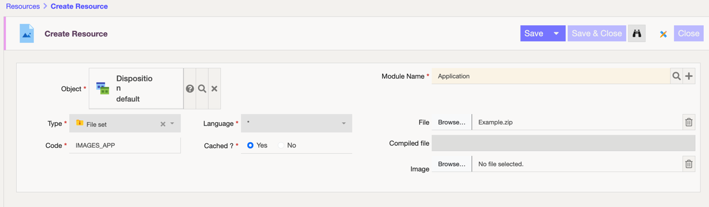
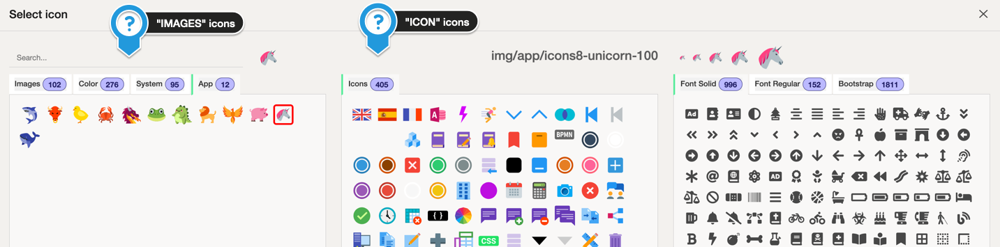

Icons
=====

## Custom icons

By default, Simplicité ships with a set of icons composed of:
- a selection of the [icon8.com color style pack icons](https://icons8.com/icons/color)
- a selection of Font Awesome solid & regular icons
- a selection of Bootstrap icons

:::tip

For for accessibility and aesthetics reasons, we ship and recommend to use only `.svg` icons to avoid pixellation when zooming, even though the platform also supports `.png`.

:::

To add your own icons : 
1. pack your `.svg` or `.png` icon set in a `.zip` archive
2. create a new **Resource**
    - **Object**: `default` disposition object
    - **Module**: your app
    - **Type**: File set
    - **Language**: *
    - **File**: your zip file
    - **Code**: a code prefixed with `IMAGES_` or `ICONS_` (ex: `ICONS_MYAPP`)



3. use your icons in the tab created for your specific set in the icon selector tool



## Theme icons

It is possible to override the default icon sets, which can be usefull if you are building a specific designer theme for example.

In this case, use the **Icons set** field of the Theme to specify your recource. Call it `IMAGES_COLOR` if you want to override the color set.

## Javascript API

To use an icon in your JS code, use the following API:

```javascript
// insert image
$ui.view.icon("img/1min30/myicon", "icon").appendTo(div);
// insert icon
$ui.view.icon("icon/1min30/myicon", "icon").appendTo(div);
````

