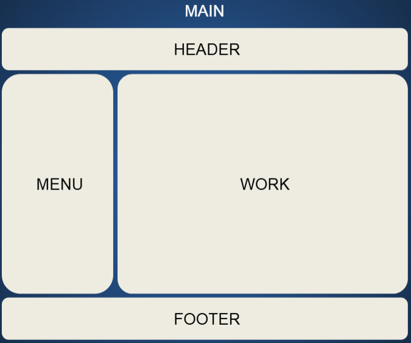

Frontend Development
====================

Simplicité supports two distinct frontend development scenarios. Understanding which one applies
to your project determines which tools, APIs, and pages are relevant.

The two scenarios
-----------------

### In-platform customization

You are working inside a Simplicité instance — customizing its interface, building components embedded in views,
or creating pages backed by the platform's backend.

This covers:

- Theming and visual identity (Theme Editor, complementary styles)
- Custom components and pages built as External Objects (HTML, CSS, JavaScript resources + optional Java class)
- The in-platform JavaScript API (`$app`, `$ui`, `$view`) for interacting with the backend from resources

Relevant pages: [Theme Editor](/docs/front/theme), [Complementary Styles](/docs/front/styles),
[In-platform Development](/docs/front/platform-dev), [Ajax Library](/docs/front/lib-ajax),
[Custom Components & Pages](/docs/front/custom-components)

### NPM library projects

You are building an application that connects to a Simplicité backend from outside the platform —
standalone frontends, server-side integrations, or framework-based projects (Vue.js, React, Angular, etc.).

This covers:

- Authentication and session management via the NPM package
- CRUD operations on Business Objects
- Standalone project setup

Relevant pages: [NPM Library](/docs/front/npm-lib)

---

Both scenarios share the same underlying JavaScript API. The [NPM package](https://www.npmjs.com/package/simplicite)
and the in-platform Ajax library expose the same core interface — the context of use differs, not the API itself.

UI structure
------------

When customizing within the platform, Simplicité's interface is organized into four zones:

| Zone | Role |
| ---- | ---- |
| **HEADER** | Global navigation, search, shortcuts, user info |
| **MENU** | Application sections, sub-menus, domains |
| **WORK** | Main content area — forms, lists, External Objects |
| **FOOTER** | Static footer. Accepts an optional `FOOTER_ADDON` resource for custom content |

Related
-------

- [External Objects](/make/userinterface/externalobjects/basic)
- [NPM JavaScript API reference](https://simplicitesoftware.github.io/javascript-api/)
- [JSDoc](https://platform.simplicite.io/current/jsdoc/global.html)
- [Responsive UI](/docs/ui/responsive)
