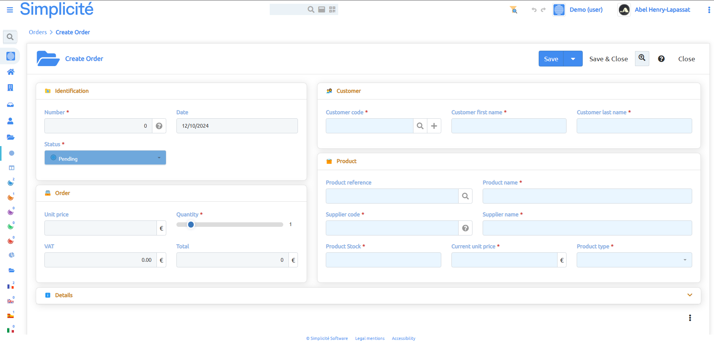

Introduction to Frontend Dev
============================

:::warning
This documentation is part of the **Frontend Development** category, designed to guide you through frontend customization within Simplicité.
:::

This guide covers Simplicité's tools for customizing UIs and implementing custom designs while maintaining access to all back-office features.

## Target Users

These functionalities are primarily for **web designers** and **frontend developers** who need to address requirements beyond Simplicité's default interface. The concepts involve:
- **HTML**, **CSS**, and **JavaScript**
- Web frameworks and CSS preprocessors

## Use Cases

### Visual Identity & Design Guidelines

When integrating Simplicité into systems with distinct design guidelines (e.g., government DSFR standards), you can customize the UI to ensure familiarity and compliance.

### Client-Oriented Interfaces

For client-facing solutions, create custom frontends tailored to end-users. For example:
- Product catalogs with video previews
- Custom ordering interfaces
- Minimalist user-friendly pages

### Specific Web Technologies

If your team uses specific frameworks (Vue.js, Mustache, etc.), Simplicité allows you to design interfaces using your preferred tools.

## UI Structure

Simplicité's interface consists of four main sections:

- **HEADER**: Global navigation, search, shortcuts, and user info
- **MENU**: Application sections with sub-menus and categories
- **WORK**: Main content area for forms, lists, and dynamic content
- **FOOTER**: Legal mentions and accessibility features

## Documentation Structure

This documentation follows a progressive learning path:

1. [Theme Editor](/docs/front/theme) - Customize themes and styles
2. [Complementary Styles](/docs/front/styles) - Advanced theme customization with addon.less
3. [JavaScript Development](/docs/front/javascript-dev) - NPM Library and External Objects
4. [Ajax Library](/docs/front/lib-ajax) - Core functions for navigating Simplicité concepts
5. [Custom UI Components](/docs/front/ui-component) - Create custom widgets
6. [External Webpages](/docs/front/web-page) - Build standalone pages communicating with Simplicité

### Related Resources

- [External Objects Tutorial](/tutorial/enhancing/external-object.md)
- [Responsive UI](/docs/ui/responsive)
- [Custom Disposition](/docs/core/disposition-code-examples)
- [Core JavaScript](/docs/core/javascript-code-examples)
- [NPM JavaScript API](https://simplicitesoftware.github.io/javascript-api/)