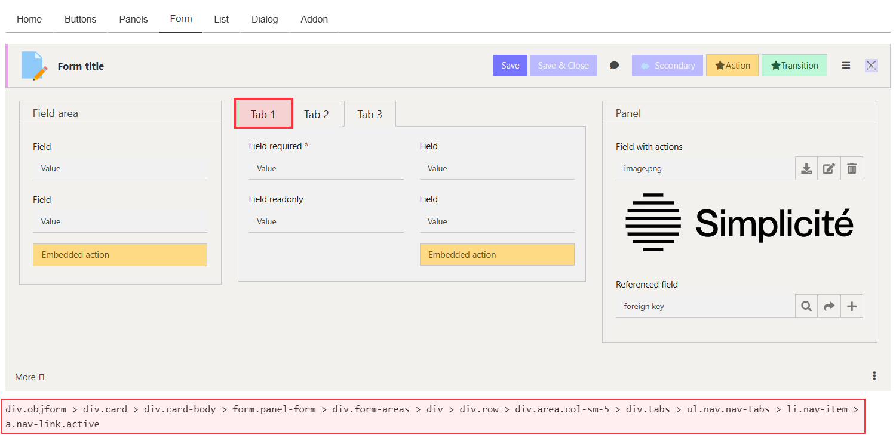
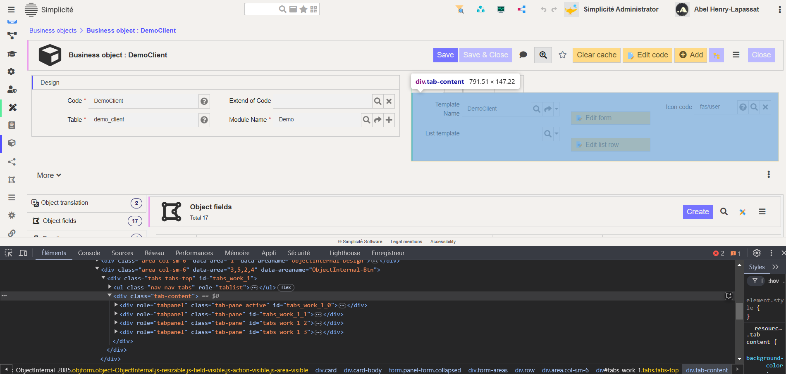
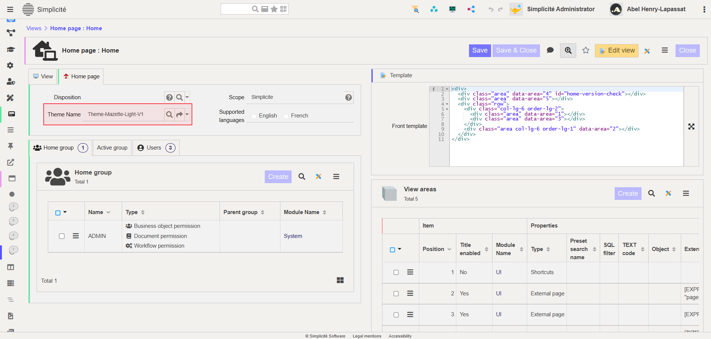

Complementary Theme Styles
==========================

:::warning

This documentation is part of the **Frontend Development** category, designed to guide you through frontend customization within Simplicité.

:::

This guide covers advanced theme customization using the **addon.less** file to extend or override styles defined in **constants.less** and **theme_gen.css**.

What is Less?
-------------

**Less** (Leaner CSS) is a CSS preprocessor that extends CSS with:

- **Variables**: Reusable values:

```less
@primary-color: #3498db;
body { color: @primary-color; }
```

- **Nesting**: Hierarchical styles:

```less
.container {
  .header {
    .box { background-color: red; }
  }
  .body > .box { background-color: blue; }
}
```

- **Interaction States**:

```less
.box {
  background-color: yellow;
  &:hover { background-color: orange; }
  &:active { background-color: red; }
}
```

- **Mixins**: Reusable style blocks:

```less
.rounded-corners(@radius: 0.5rem) {
  border-radius: @radius;
}
div { .rounded-corners(1rem); }
```

- **Functions**: Dynamic calculations:

```less
@primary-color: #3498db;
body { color: darken(@primary-color, 16%); }
```

:::warning

Only use **addon.less** when Simplicité's built-in customization options are insufficient. Overusing it can complicate maintenance.

:::

When to Use addon.less
-----------------------

Use **addon.less** only for requirements that cannot be fulfilled through:

- Theme Editor settings
- Standard CSS properties
- Simplicité's native customization features

**Common use case**: Adding custom colored borders to UI elements for brand compliance.

Customization process
---------------------

### 1. Locate DOM Elements

Use one of these methods:

**Method 1**: Theme Editor's **Path in DOM** feature for elements in the Preview

**Method 2**: Browser inspector for elements outside Theme Editor




### 2. Identify Context

Document the element's:

- Classes
- Parent containers
- Related elements

This prevents unintended styling of other UI components.

### 3. Implement Styles

Add styles to **addon.less**:

```less
// Define color variables
@border-pink: #EC9DED;
@border-blue: #5451FF;
@border-green: #58EC9B;
@border-red: #FB3640;

// Target panels and sub-panels
div.card {
  div.card-header {
    border-left: solid 0.2rem @border-pink;
  }
  div.panel-card > div.card {
    div.card-header {
      border-left: solid 0.2rem @border-blue;
    }
  }
}

// Target tabs
div.tabs-top {
  div.nav-tabs > div.nav-link.active {
    border-left: solid 0.2rem @border-green;
  }
}

// Target lists
div.container-table > table {
  thead {
    border-left: solid 0.2rem @border-red;
  }
}
```

:::tip

If styles don't appear immediately, add `!important` to ensure they override default styles. Remember to clear your cache.

:::

Example: Interactive list rows
------------------------------

Add visual feedback for selected rows:

```less
@border-red: #FB3640;
@border-yellow: #FFD166;

div.container-table > table {
  thead {
    border-left: solid 0.2rem @border-red;
  }
  tbody > tr.list-clickable {
    border-left: solid 0.25rem transparent;
    &.selected {
      border-left-color: @border-yellow;
    }
  }
}
```

Applying your theme
-------------------

1. Navigate to **User Interface > Views > Home Pages**
2. Select your view
3. Apply your custom theme
   
4. Clear cache to see changes
