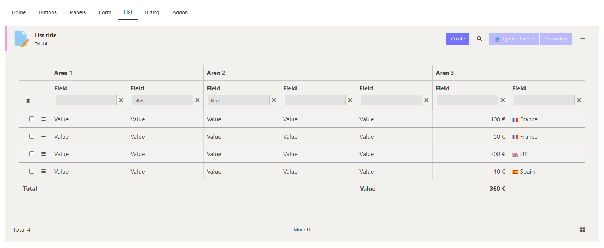
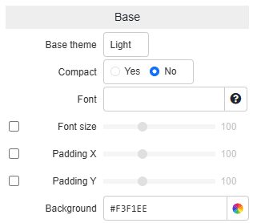
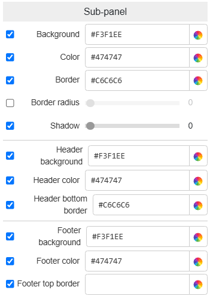
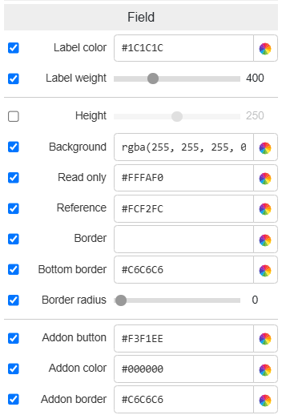

Theme Editor: Presentation and Overview
======================================

    This lesson is a part of the <b>Frontend Development</b> category, which is meant to guide you through the frontend development within Simplicité. Thus it might be a bit longer and more verbosed than other lessons you will find in the <b>Simplicité Configuration Object</b> category.

This document introduces Simplicité’s **Theme Editor**, a tool designed for *customizing the visual identity of your instance*, whether for the designer interface or the user interface. The Theme Editor provides the *flexibility* to align your instance’s appearance with personal preferences, organizational branding guidelines, or specific design requirements.

Through this document, we will provide an understanding of how the tool works, its *key features*, and the *extensive customization* options available. We’ll explore how you can leverage it to enhance both *functionality* and *aesthetics*, ensuring an optimized and cohesive user experience.

## Tool Overview

The Theme Editor is accessible from the themes list located under **User Interface > Themes** To begin using it, select an existing theme and click the **Preview** button.

This tool enables you to *manage and customize* the overall design of your instance with a *global scope*, offering complete control over the styles of **every UI element**. Whether you aim to create a dark, light, or specialized theme, the **Theme Editor** allows you to apply consistent design elements across your platform.

**Examples of Default Themes:**: Simplicité includes several predefined themes as part of its default solution:

*ThemeAdmin*: a primary theme for *administrators*, created from the `Dark Base`. It is mainly used by administrators or designer users who prefer a dark mode interface.

ThemeAdmin Overview

*ThemeDesign*: built from the `Light Base`, this theme mirrors the *ThemeAdmin* in functionality but caters to those who prefer a *lighter mode*.

ThemeDesign Overview

*ThemeEtat*: designed following the *DSFR* (French government) *design norms*. It adheres to strict rules of **contrast**, **spacing**, and **accessibility** to meet public sector guidelines.

ThemeEtat Overview

> ***Coming Soon:*** Two new themes (Dark & Light) aligned with Simplicité’s brand new look and identity !

"Mondrian" Themes Overview

## Theme Creation

Creating a theme begins with clicking the **Create** button from the **User Interface > Themes** section, then continues by selecting a *base theme* and choosing a *name* and *module*. Each base theme serves as a foundation, offering essential styles that you can override to craft your custom design:

- **Dark Base:** a minimalistic dark mode foundation with core styles that can be easily overridden.

- **Light Base:** a foundational light mode theme, simple and adaptable for your customizations.

- **Default Base:** similar to the **Light Base**, but slightly more refined, offering a versatile starting point.

> ***Warning:*** These base themes are not intended for direct use. Instead, they serve as building blocks to create new, fully customized themes.

## Simplicité's Styles Organization

After creating and saving your themes, the styles are compiled, and you can see that files were added to your theme object, they serve to apply your styles through all selected interfaces, there are 3 of them:

1) `constants.less`: this file is the result of what you applied in the *Theme Editor*, it basically contains all the values you defined as *less constants*.
2) `addons.less`: allows you to either override the existing styles, or to add new ones if wanted (further developed in [this lesson](/docs/front/styles).
3) `themeName_gen.css`: contains all the compiled styles from both `constants` and `addons` less files. It is the final results of all the theming work done before.

## Organization

The **Theme Editor** interface is divided into *three main sections*, each providing a key functionality. Understanding how these sections work is essential for effectively using the tool:

1) **Interface Preview:** A live preview of your theme in action, helping you visualize changes in real-time.
2) **Values Menu:** The control panel where you define and adjust style variables such as colors, fonts, and spacing.
3) **DOM Path:** A detailed view that highlights the structural elements of the interface, enabling precise customizations.

### Interface Preview

The **Preview** section of the **Theme Editor** provides a *live visualization* of your themes and their applied styles. This feature allows you to see the *results of your customizations* in real time, making it easier to refine your designs. With the tabbed menu, you can navigate through various elements of Simplicité’s interface, ensuring that your custom styles work as intended across all contexts.

#### Preview Tabs Overview

**Home**: displays the primary shared elements of Simplicité’s UI, such as the header and main menu. The menu highlights multiple states and hierarchies, including sub-menus and active domain indicators.

Home Preview

**Buttons**: a unique tab that gives access to customization for button elements and their style options. It showcases all button types available in Simplicité, allowing you to customize the following properties: `background-color`, `text-color` or `icon-color`, `border-radius`, and `border-width` for each of the predefined button types:
1) ***Primary:*** represents the main actions shared across various contexts.
2) ***Secondary:*** displays secondary or less critical actions with text labels.
3) ***Action:*** specific to the current object or context.
4) ***Transition:*** used for state-switching handlers within business objects or fields.
5) ***Icon:*** represents actions visually using icons instead of text.

Buttons Preview

**Panels**: focuses on the structural elements that form Simplicité’s interface:
1) ***Panels:*** found in the `WORK` section, these display the content of selected menus or objects.
2) ***Sub-Panels:*** nested within Panels, typically containing fields for displayed objects.
3) ***Tabs:*** organize fields into sections, offering four layout options: *Left*, *Right*, *Top*, and *Bottom*. The layout determines the placement of tab navigation.

Panels Preview

**Form**: showcases essential UI components that combine *Panels*, *Sub-Panels*, and Tabs to organize fields and inputs.
1) ***Field:*** standard text input within object forms.
2) ***Readonly:*** non-editable fields displaying static information.
3) ***References:*** editable links to other objects or data.

Form Preview

> ***Note:*** Other input types, such as *radio buttons*, *dropdown menus*, are not directly customizable within the Theme Editor but inherit styles from the selected base theme.
> - Code editors for example are customizable through your theme's object form, in which you can modify the monokai based theme (light, dark).

**List**: a core element of Simplicité’s UI, Lists display rows of data in table format and can be extensively styled for consistency and readability.

List Preview

**Dialog**: represents pop-up interfaces used for confirmations, alerts, or additional inputs. Styled similarly to Panels and Sub-Panels, Dialogs are designed for clear and concise communication with easily accessible actions.

Dialog Preview

**Addons**: supports the customization of more advanced or precise customizations. Those being defined in the `addon.less` file, ensure that additional functionalities align visually with the core theme.

### Styles Values Menu

The Styles Menu is where you define the visual properties of the elements displayed in the Preview. This section is organized by categories corresponding to the Preview’s tabs, making it intuitive to locate and adjust styles within a specific context.

Adjust style variables accorss elements and contexts:
1) ***Background:*** Set the `color` and `opacity` of elements' backgrounds.
2) ***Text:*** Customize `font-size`, and `font-color`, as well as the `font-weight` of some text elements.
3) ***Border:*** Determine whether a border is displayed (sets as `none` or not), then define its `border-color`, `opacity`, `border-radius`, and in some cases, `border-width` or specifications on location (`border-top`, `border-bottom`, ...).
4) ***Hover:*** Modify the appearance of some interactive elements when hovered, including `background-color` and `text-color`.

Here is a detailled list of the menu's sub-section and the specific elements they cover:

**Base**: defines fundamental styles such as the main background color, global font, and shared spacing parameters, ensuring consistency across all elements.

| Element            | Style Value            | Value Range / Description                                                                                                                                              |
|--------------------|------------------------|------------------------------------------------------------------------------------------------------------------------------------------------------------------------|
| Theme              | Base Theme             | `{ Light, Dark, Default }`: defines the base constants and variables on which your whole theme will be based on                                                          |
| Theme              | 'Compact'              | Yes/No: defines wether the space on screen is spread or restrained.                                                                                                    |
| Font               | Font Family            | Name of a Google Font or another font resource. Applied to all texts.                                                                                                  |
| Font & Icons       | Size                   | [50;200]: defines the base size of these elements throughout the UI.                                                                                                   |
| Contents           | Padding X              | [0;300]: defines the padding-left of all elements displayed in different containers (texts, sub-panels, ...), without affecting container's width.                     |
| Contents           | Padding Y              | [0;300]: defines the padding-top & padding-bottom of all elements displayed in different containers (texts, sub-panels, ...), thus modifying container's height.       |
| Background         | Color                  | Any: defines the color of your whole background, noticeable mainly on the `WORK` part of the UI.                                                                       |

**Main**: configures the permanent UI elements, including the header, footer, and navigation breadcrumb.

| Element               | Style Value            | Value Range / Description                                                                                                                                              |
|-----------------------|------------------------|------------------------------------------------------------------------------------------------------------------------------------------------------------------------|
| Header Logo           | Image File             | Any: this will be the image placed at the very left of your Simplicité's header bar.                                                                                   |
| Header Logo           | Color Invert           | Yes/No: says if the logo shall be inverted or not.                                                                                                                     |
| Navigation Breadcrumb | Background Color       | Any: defines the background color of your navigation breadcrumb (top-left of your **WORK** UI section).                                                                  |
| Navigation Breadcrumb | Text Color             | Any: defines the colors of the texts composing your navigation breadcrumb.                                                                                             |
| Header Bar            | Background Color       | Any: defines the color of your header's background only (rendered on top of the general background), header is full width of your window.                              |
| Header Bar            | Text Color             | Any: defines the colors of the texts composing your header section (all the text within).                                                                              |
| Header Bar            | Border Color           | Any: defines the colors & display of the `border-bottom` for your whole header, can be hidden by unticking the value.                                                  |
| Header Bar Searchbox  | Background Color       | Any: defines the colors of the input part for your header's searchbox (not the items aside it).                                                                        |
| Footer Bar            | Background Color       | Any: defines the color of your footer's background only (rendered on top of the general background), footer is full width of your window.                              |
| Footer Bar            | Text Color             | Any: defines the colors of the texts composing your footer section (links in it).                                                                                      |
| Footer Bar            | Border Color           | Any: defines the colors & display of the `border-top` for your whole footer, can be hidden by unticking the value.                                                     |

**Menu**: allows you to style the main menu (typically located on the left), including states for embedded, active, and hovered items.

| Element              | Style Value            | Value Range / Description                                                                                                                                              |
|----------------------|------------------------|------------------------------------------------------------------------------------------------------------------------------------------------------------------------|
| Main Menu            | Background Color       | Any: will define the background color for your menu, which is the bottom layer in this element.                                                                        |
| Inactive Menu Domain | Background Color       | Any: will define the **inactive** background color of all the domains in your main menu.                                                                                 |
| Inactive Menu Domain | Text Color             | Any: will define the **inactive** color of the text for all the domains in your main menu.                                                                               |
| Active Menu Domain   | Background Color       | Any: will define the **active** background color of all the domains in your main menu.                                                                                   |
| Active Menu Domain   | Text Color             | Any: will define the **active** text color of all the domains in your main menu.                                                                                         |
| Inactive Sub-Menu    | Background Color       | Any: will define the **inactive** background color of all the items in your domains. Which are referenced as 'sub-menus' but in fact are the items you add in a domain.  |
| Inactive Sub-Menu    | Text Color             | Any: will define the **inactive** text color of all the items in your domains. Which are referenced as 'sub-menus' but in fact are the items you add in a domain.        |                                                                                  |
| Active Sub-Menu      | Background Color       | Any: will define the **active** background color of all the items in your domains. Which are referenced as 'sub-menus' but in fact are the items you add in a domain.    |
| Active Sub-Menu      | Text Color             | Any: will define the **active** text color of all the items in your domains. Which are referenced as 'sub-menus' but in fact are the items you add in a domain.          |
| Status Menu          | Background Color       | Any: will define the **inactive** background color for the status items held in the sub-menus.                                                                           |
| Status Menu          | Text Color             | Any: will define the **inactive** textcolor for the status items held in the sub-menus.                                                                                  |

**Panel**: focuses on the overarching style of *top-level Panels*, which can be previewed in the ***Panels*** section of the Preview.

| Element            | Style Value            | Value Range / Description                                                                                                                                                                         |
|--------------------|------------------------|---------------------------------------------------------------------------------------------------------------------------------------------------------------------------------------------------|
| Panel Container    | Background Color       | Any: defines the background of your whole panel container, these elements are rendered on top of the `WORK` part of your UI. But on first layer for this element.                                 |
| Panel Container    | Text Color             | Any: defines the color of all texts within your Panel but not contained by another element.                                                                                                       |
| Panel Container    | Border Radius          | [0;200]: defines the border radius of your Panel, so modifies the following corner; `top-left` & `top-right` from `panel-header`, and `bottom-left` & `bottom-right` from `panel-footer`.         |
| Panel Container    | Box Shadows            | [0;100]: defines the `box-shadow` value for panel items, with the following relation; 0 ~ `box-shadow: none`, 50 ~ `box-shadow: .125rem .125rem 1rem` and 0 ~ `box-shadow: .125rem .125rem 2rem`. |
| Panel Header       | Background Color       | Any: defines the background color of your panel's header, renderer on top of the background defined at first layer for this element.                                                              |
| Panel Header       | Text Color             | Any: defines the color of all texts within the header of your panel, excluding for the ones of buttons.                                                                                           |
| Panel Header       | Bottom Border          | Any: defines the color of the header's `bottom-border`, if you want to hide the border then simply untick the value.                                                                              |
| Panel Footer       | Background Color       | Any: defines the background color of your panel's footer, renderer on top of the background defined at first layer for this element.                                                              |
| Panel Footer       | Text Color             | Any: defines the color of all texts within the footer of your panel, excluding for the ones of buttons.                                                                                           |
| Panel Footer       | Bottom Border          | Any: defines the color of the footer's `top-border`, if you want to hide the border then simply untick the value.                                                                                 |

**Sub-panel**: similar to *Panels* but specific to nested panels embedded within higher-level panels.

| Element                | Style Value            | Value Range / Description                                                                                                                                                                              |
|------------------------|------------------------|--------------------------------------------------------------------------------------------------------------------------------------------------------------------------------------------------------|
| Sub-Panel Container    | Background Color       | Any: defines the background of your whole sub-panel container, first layer for this element.                                  |
| Sub-Panel Container    | Text Color             | Any: defines the color of all texts within your Sub-Panel but not contained by another element.                                                                                                        |
| Sub-Panel Container    | Border Radius          | [0;200]: defines the border radius of your Panel, so modifies the following corner; `top-left` & `top-right` from `sub-panel-header`, and `bottom-left` & `bottom-right` from `sub-panel-footer`.      |
| Sub-Panel Container    | Box Shadows            | [0;100]: defines the `box-shadow` value for sub-panel items, with the following relation; 0 ~ `box-shadow: none`, 50 ~ `box-shadow: .125rem .125rem 1rem` and 0 ~ `box-shadow: .125rem .125rem 2rem`.  |
| Sub-Panel Header       | Background Color       | Any: defines the background color of your sub-panel's header, renderer on top of the background defined at first layer for this element.                                                               |
| Sub-Panel Header       | Text Color             | Any: defines the color of all texts within the header of your sub-panel, excluding for the ones of buttons.                                                                                            |
| Sub-Panel Header       | Bottom Border          | Any: defines the color of the header's `bottom-border`, if you want to hide the border then simply untick the value.                                                                                   |
| Sub-Panel Footer       | Background Color       | Any: defines the background color of your sub-panel's footer, renderer on top of the background defined at first layer for this element.                                                               |
| Sub-Panel Footer       | Text Color             | Any: defines the color of all texts within the footer of your sub-panel, excluding for the ones of buttons.                                                                                            |
| Sub-Panel Footer       | Bottom Border          | Any: defines the color of the footer's `top-border`, if you want to hide the border then simply untick the value.                                                                                      |

**Tabs**: controls the style of Tabs, which organize information into sections within the same placeholder. Tabs often appear alongside Sub-Panels.

| Element            | Style Value            | Value Range / Description                                                                                                                                                      |
|--------------------|------------------------|--------------------------------------------------------------------------------------------------------------------------------------------------------------------------------|
| Tabs Container     | Background Color       | Any: defines the background color of the first layer for this element.                                                                                                         |
| Navigation Links   | Background Color       | Any: defines the background color for the navigation links above/below or aside the tabs content.                                                                              |
| Navigation Links   | Text Color             | Any: defines the color for all text within the navigation links, so the categories' names.                                                                                     |
| Navigation Links   | Border Color           | Any: defines the color of the whole border for each navigation link, if you wanna hide it then untick the value.                                                               |
| Navigation Links   | Bottom Border Color    | Any: defines the color of the border separating the navigation links part and the content, untick to hide.                                                                     |
| Navigation Links   | Bottom Border Radius   | [0;200]: defines the value for the navigation links `border-radius`, but only for the corners not linked to the content.                                                       |
| Active Link        | Background Color       | Any: defines the background color of the active navigation link, the one that has its content displayed.                                                                       |
| Active Link        | Text Color             | Any: defines the color of the text within the active navigation link.                                                                                                          |
| Active Link        | Border Color           | Any: defines the color of the single border, if you wanna hide it then untick the value.                                                                                       |
| Active Link        | Bottom Border Color    | Any: defines the color of the border separating the active navigation link and the content, untick to hide.                                                                    |
| Tabs Content       | Background Color       | Any: defines the background color for the `tab-content` part only, rendered on very last layer.                                                                                |
| Tabs Content       | Text Color             | Any: defines the color of all informative texts within the `tab-content`, doesn't apply to buttons or text within other elements, is overridden by `text-color` from **Fields** |
| Tabs Content       | Border Color           | Any: defines the color of the border of the whole content part, untick to hide.                                                                                                |
| Tabs Content       | Shadow                 | [0;100]: defines the `box-shadow` style for the tab-content (not nav-links!), with the following range; 0 ~ `none`, 50 ~ `solid .125rem .125rem 1rem #e0e0e0`, 100 ~ `solid .125rem .125rem 2rem #e0e0e0` |

**Field**: configures styles for displayed fields within Sub-Panels and Tabs.

| Element            | Style Value            | Value Range / Description                                                                                                                                              |
|--------------------|------------------------|------------------------------------------------------------------------------------------------------------------------------------------------------------------------|
| Label              | Text Color             | Any: defines the `text-color` of all fields' labels. |
| Label              | Font Weight            | [200;900]: per hundreds, defines the `font-weight` for all fields' labels. |
| Input              | Height                 | [100;400]: defines the `height` of all fields' inputs part. |
| Readonly Field     | Background Color       | Any: defines the `background-color` for all the fields with `readonly` class. |
| Reference Field    | Background Color       | Any: defines the `background-color` for all the fields with `reference` class. |
| Input              | Border Color           | Any: defines the `border-color` of all fields' inputs, no value (empty) will apply  `border: none`. |
| Input              | Border-Bottom Color    | Any: defines the `bottom-border-color` of all fields' inputs, no value (empty) will apply `border-bottom: none`. |
| Input              | Border-Bottom Radius   | [0;100]: defines the `border-radius` of all fields' inputs. |
| Field Buttons      | Background Color       | Any: defines the background color for all the fields' addons buttons. |
| Field Buttons      | Icon Color             | Any: defines the color of the *icons* for all the fields' addons buttons. |
| Field Buttons      | Border Color           | Any: defines the border color for all the fields' addons buttons, no value (empty) will apply `border: none`. |

> ***Note:*** Input fields provided by the Bootstrap library are not directly customizable but adapt to the selected base theme. Use the `addon.less` file for advanced overrides.

**List**: provides extensive customization options for one of Simplicité’s most critical UI components. Careful styling ensures both functionality and aesthetics.

| Element            | Style Value            | Value Range / Description                                                                                                                                              |
|--------------------|------------------------|------------------------------------------------------------------------------------------------------------------------------------------------------------------------|
| Container Border   | Border Color           | Any: defines the color of the whole container border, no value (empty) sets `border: none`. |
| Table Header       | Background Color       | Any: defines the `background-color` of the table header, rendered on top of the panel element. |
| Table Header       | Text Color             | Any: defines `color`, the color of any text within the table header only (area titles). |
| Field Header       | Background Color       | Any: defines the `background-color` of the `tr.head` inside the table header (field area), rendered on same layer as area header. |
| Field Header       | Text Color             | Any: defines `color`, the color of any field name within the table header only (field titles). |
| Field Header       | Top Border Color       | Any: defines the top `border-top-color` for the field header section (right below area headers), no values (empty) defines `none` or `transparent`. |
| Filters            | Background Color       | Any: defines the `background-color` for all the input fields below the fields header, no values (empty) defines `none` or `transparent`. |
| Filters            | Text Color             | Any: defines `color`, the color of any texts within the input part, cannot be empty. |
| Filters            | Top Border Color       | Any: defines the top `border-top-color` for the field input section (right below field headers), no values (empty) defines `none` or `transparent`. |
| Content (~body)    | Background Color       | Any: defines the `background-color` of the list's "even" rows in the content part (table body). |
| Content (~body)    | Background Color (odd) | Any: defines the `background-color` of the list's "odd" rows in the content part (table body). |
| Content (~body)    | Text Color             | Any: defines the `color` of all rows text (even & odd). |
| Content (~body)    | Top Border Color       | Any: defines the `border-top-color` of all rows containers (`tr.list-clickable`). |
| Content (~body)    | Hover Background Color | Any: . |
| Content (~body)    | Hover Text Color       | Any: . |
| Table Footer       | Background Color       | Any: defines the background color of the table footer, rendered on top of the panel element. |
| Table Footer       | Background Color       | Any: defines the `background-color` of the table footer, rendered on top of the panel element. |
| Table Footer       | Text Color             | Any: defines `color`, the color of any text within the table footer only (mostly results). |
| Table Footer       | Top Border Color       | Any: Any: defines the top `border-top-color` of table's footer, no values (empty) defines `none` or `transparent`. |

**Dialog**: syles `modal` dialogs that appear over the UI (with a `z-index = 1055`). These overlays dim the rest of the interface for focus and clarity.

| Element            | Style Value            | Value Range / Description                                                                                                                                              |
|--------------------|------------------------|------------------------------------------------------------------------------------------------------------------------------------------------------------------------|
| Container          | Background Color       | Any: defines the `background-color` for the whole dialog container. |
| Container          | Text Color             | Any: defines the `color` of all text within the `modal-body` part of dialog item only. |
| Container          | Border Radius          | [0;200]: defines the `border-radius` value of the whole container for dialog item, *0* defines it as `0`, 100 as `1rem` and 200 as `2rem`. |
| Header             | Background Color       | Any: defines the `background-color` of the `modal-header` part of the dialog item. |
| Header             | Text Color             | Any: defines the `color` of all text within the `modal-header` part of dialog item only. |
| Header             | Bottom Border Color    | Any: defines the `border-bottom-color` for the `modal-header` dialog item part, no values (empty) sets `border-bottom: none`. |
| Footer             | Background Color       | Any: defines the `background-color` of the `modal-footer` part of the dialog item. |
| Footer             | Text Color             | Any: defines the `color` of all text within the `modal-footer` part of dialog item only. |
| Footer             | Top Border Color       | Any: defines the `border-top-color` for the `modal-footer` dialog item part, no values (empty) sets `border-top: none`. |

### DOM Path Viewer

This section of the Theme Editor is an essential tool for developers and designers aiming to understand the structure and organization of Simplicité's user interface. This feature allows you to locate and analyze the placement of interface elements within the DOM (Document Object Model) of your instance. By visualizing the hierarchy and layout of shared UI components, you can gain valuable insights into how elements are defined and interconnected.

This section provides a clear representation of the structural organization of every shared element across Simplicité’s interfaces. It is particularly useful for:
- *Understanding Layouts:* Quickly grasp how elements are nested and structured within the DOM.
- *Defining Custom Styles:* Identify the exact DOM paths for elements you wish to customize using LESS or CSS files.
- *Optimizing Consistency:* Ensure that styles applied to elements in one section, such as the Home, Form, or List tabs in the Preview, are consistent across all instances of those elements throughout the UI.

The DOM Path Viewer is closely integrated with the *Preview* sections like *Home*, *Form*, and *List*, as these sections display elements that are shared across all Simplicité interfaces. This coupling ensures that you can identify and style elements accurately, regardless of their context.

#### How to use

To use the DOM Path Viewer, simply navigate to the Preview section and hover over any UI element; as you do, the DOM path for the element will be displayed in the format it would appear in a LESS file. This path can then be copied and used to define or override styles in your theme’s LESS files, such as `constants.less` or `addons.less`.

Below a quick overview of what are the main locations for elements as displayed in a LESS file:

* *Home common path;* `div.main > div.simplicite.wrapper > ... > **element.class**`.

* *Form common path;* `div.objform > div.card > ... > **element.class**`.

* *List common path;* `div.objlist > div.card.panel-list > ... > **element.class**`.