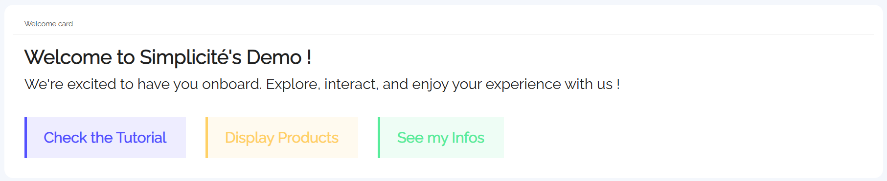
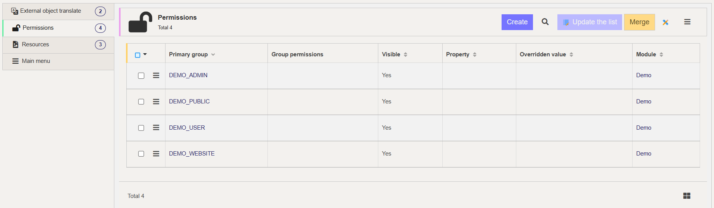
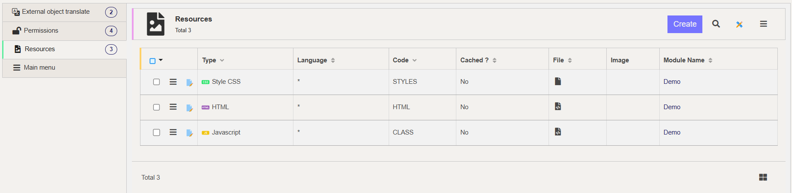
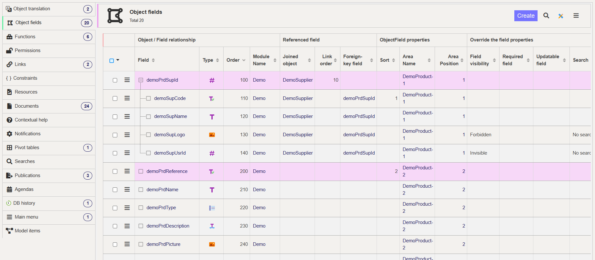
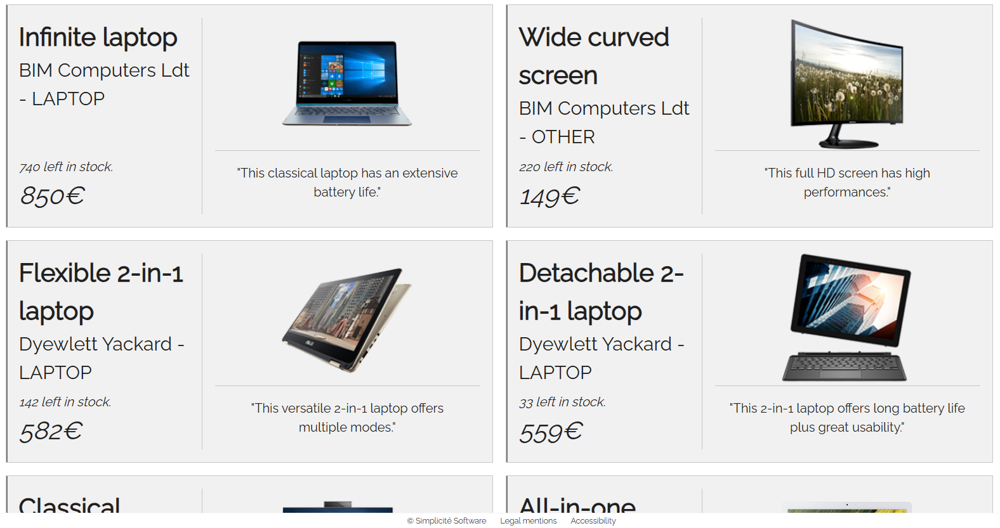

UI Component
============

<div class="warning">
    This lesson is a part of the <b>Frontend Development</b> category, which is meant to guide you through the frontend development within Simplicité. Thus it might be a bit longer and more verbosed than other lessons you will find in the <b>Simplicité Configuration Object</b> category.
</div>

This document outlines the process of using **External Objects** to design and implement custom widgets from scratch. It covers the essential steps for creating interactive objects, addressing the *creation*, *integration*, and *implementation* processes.

This guide explores how to make widgets dynamic by incorporating *interactive behaviors* and seamless communication with Simplicité's backend and features.

## Use Case Scenarios

The need for custom widgets typically arises when existing Simplicité components do not fully meet your requirements. These scenarios may include the need to display information in a particular format, implement specific functionalities that are incompatible with the desired UI, or combine features in ways that the default options do not support.

> ***Note:*** Such requirements are often niche. Most technical operations can already be accomplished using Simplicité's core functionalities. Consequently, the primary purpose of creating custom widgets is to address unique visualization needs, enabling you to embed tailored styles and feature combinations within a custom interface.

### Example: Welcome Card



It is a *highly customizable* element that can be styled to align with the platform's visual identity, offering users an engaging entry point. Depending on the context, its design can include specific elements to match your graphic identity, or interactive icons to reflect the application's tone or purpose.

For instance, a business-oriented platform might feature a professional and minimalist style, while a creative application might opt for bold, vibrant visuals to set an energetic tone. It can also integrate unique ways of calling objects, such as clickable shortcuts or personalized greetings.

## Implementation (Welcome Card)

The creation process is straightforward, as it involves instantiating a new external object with specific values and then implementing the content and styles for the desired widget.

### External Object Creation


Start by creating an **External Object**, and make sure it is of nature *UI page or component*, and of class `com.simplicite.webapp.web.widgets.ResponsiveExternalObject`. Also make sure that the *UI widget* field is set to *Yes*.

Another important step is to grant the widget the rights of the module and view where it will be embedded. This prevents integration issues with the application. Navigate to the object's tab, in the *Permissions* section, and add all required permissions.



### Creating Resources

Use the *Create Resources* action button and click *Yes*. This adds 3 files to the object's *Resources* (visible in the bottom tab section "Resources"):

- **HTML**: The HTML file for defining object content. By default, it contains `<div id="ext-obj"></div>` where custom styles can be applied.

- **STYLES**: The CSS file that serves as a stylesheet for the object. No default styles are defined, only an empty bracket `#ext-obj { /* Custom styles */ }`.

- **CLASS**: The JavaScript script used in subsequent sections. 



> ***Note:*** Resources are organized as standard web elements to facilitate integration and creation by designers and frontend developers.

For the next steps, there are several ways to conceive your object:

1) **Dynamic Instantiation** *(recommended)*

When fetching data and dynamically creating HTML elements (for example, retrieving an object and using its data within a div), it is more efficient to instantiate all HTML directly from the *CLASS* resource file using JavaScript.
This approach is recommended by Simplicité for creating External Objects, as they remain lightweight in the DOM and are mostly embedded in existing Simplicité interfaces. This method minimizes loading time through lighter HTML and simplifies the workflow between the *CLASS* and *HTML* resource files.

This approach keeps the *HTML* resource file lightweight, containing only 'anchors' that indicate where and how to instantiate different elements. The *CLASS* file, by contrast, will be slightly larger and more complex. The following examples show the basic setup for *DemoWelcomeCard* using this instantiation type:

```html
<div id="demowelcomecard">
	<!-- Basically this is left empty at creation -->
    <div id="demowelcomecard-header"></div>
    <div id="demowelcomecard-actions"></div>
    <div id="demowelcomecard-productlist"  hidden></div>
</div>
```

```javascript
Simplicite.UI.ExternalObjects.DemoWelcomeCard = class extends Simplicite.UI.ExternalObject {
	async render(params, data = {}) {
		$('#demowelcomecard').append('Hello world!');
	}
}
```

* A class with the name of the External Object is declared within the `Simplicite.UI.ExternalObjects` module, extending the `Simplicite.UI.ExternalObject` to properly access any method from it.
* Only the `render(params, data)` function is declared, as it is called inside the server-side Java code resource `com.simplicite.webapp.web.ResponsiveExternalObject`.
* A "Hello world!" text is dynamically instantiated to test that the connection and basic instantiation are enabled using `$('#demowelcomecard').append(...)`.

The *HTML* remains the same during this lesson (for this instantiation), while the *CLASS* will be modified and explained further later.

> ***WARNING:*** The JavaScript code snippet is available from V6.1.19. If using an outdated version, the JavaScript resource file might be named *SCRIPT*. Refer to the code presented at the end of this document, which uses a more general and fully working setup: `var DemoWelcomeCard = DemoWelcomeCard || (function(){ ... })(jQuery);`.
<details>
<summary>V5 Default Javascript</summary>

```javascript
var CustomWelcomeCard = CustomWelcomeCard || (function($) {
	function render(url) {
		$('#customwelcomecard').append('Hello world!');
	}

	return { render: render };
})(jQuery);
```
</details>

2) **Static Instantation**

Some use cases may require a static setup (i.e., longer HTML), for example, when fetching minimal data and having everything achievable from HTML or static functions. This approach is not recommended compared to the previous version, as it is slightly less effective when coexisting within Simplicité's solution.
With this method, the setup remains the same for the *CLASS* file, but a more complete structure may be set up for the *HTML*:

```html
<div id="customwelcomecard">
	<span class="welcome-title">Welcome User</span>
    <span class="welcome-text">
        Welcome to Simplicité's solution! The team is excited to have you onboard. Explore, interact, and enjoy your experience!
    </span>
    <div class="welcome-buttons">
        <button class="welcome-btn tuto" onclick="goToSimpliciteDoc()">Get Started (Tutorial)</button>
        <button class="welcome-btn prd-nav" onclick="displayProductsWithin()">Products List</button>
        <button class="welcome-btn info" onclick="goToUserInfos()">My Informations</button>
    </div>
    <div id="welcome-list" hidden></div>
</div>
```

The different features and functions are not actually instantiated, but they can be included to demonstrate how they would be integrated. The presented scripts are not final and will be modified with explanations later in this lesson.

> ***Note:*** Both techniques work fine in Simplicité and depend on preference. The main examples focus on the first technique, but similar code that works with the second technique is provided at the end.

## Integration (Welcome Card)

The process of integrating the created widget is straightforward. Navigate to *User Interface > Views > Show All*, select a view of type *Home Page*, and click the *Edit View* action button:

1) Add a new **Sub-View**.
2) Make it of type **External Page**.
3) Select *External Object* as Source.
4) Fill the *External Object* field with the name of your widget (for the welcome-card use **CustomWelcomeCard**).
5) Save it, and you shall see a preview of your object integrated within the view.

> ***Warning:*** Ensure that rights are granted for the external object.
> - If encountering *External object ____ not granted*, first try clearing the cache.
> - If clearing the cache does not resolve the issue, check the object's rights and ensure they match those of the application.

Creating an object's behavior and interaction within a Simplicité application involves creating its content and styles. This requires understanding how Simplicité is organized and how to communicate properly and access information.

## Implementation (Welcome Card)

The first step is to ensure that the object can be aware of the Simplicité system it is part of. This is achieved using the *JavaScript* resources of the External Object: **CLASS**.

> ***Note:*** The **CLASS** resource file name is automatically assigned at creation from v6.1.19. In earlier versions, the JavaScript resource file might be named **SCRIPT**. The internal workflow remains similar.

### File structure

The default *CLASS* should be organized in a specific way during development. It is important to understand its structure and how to navigate through it:

```javascript
Simplicite.UI.ExternalObjects.DemoWelcomeCard = class extends Simplicite.UI.ExternalObject {
	async render(params, data = {}) {
		$('#demowelcomecard')
			.append($('<h1>').addClass("custom-header-title").text("Hello World!"))
			.append($('<h3>').addId("custom-result-text").text("none"))
			.append($('<button/>').addClass("custom-btn-big").text("Click Me").on("click", this.foo()))
			.append($('<button/>').addClass("custom-btn-small").text("click me").on("click", () => { $('#custom-result-text').text("Clicked on the small button") }))
	}

	foo()
	{
		$('#custom-result-text').text("Clicked on the BIG button");
	}
}
```

1) **Dynamically instantiate HTML:**
When dynamically creating all HTML content, the recommended syntax is illustrated above: `$(target).append(content)` with content usually being `$(selector)` to add an empty div. This expression performs several functions:
- `$()` is a shorthand for `jQuery()`, allowing selection of a target element in the DOM by its 'id'. `$('#container')` will select the `<div id="container></div>` element (which may be something other than a div).
- `.append()` inserts specified content as the last child of the selected element, thus modifying the DOM.

Attributes of appended elements can be specified using several simple methods:
- `.attr("attr", "name")` specifies any attribute of the element (id, style, ...) as `<div attr="name"></div>`.
- `.addClass("class0 class1")` specifies different classes (may be single) of the element, here `<div class="class0 class1"></div>`.
- `.text("txt")` inputs a given string (possibly not static) to the element, from the example `<div>txt</div>`.
- `.on("event", function)` defines an *eventListener* for the element, first providing a string naming the event, then specifying the function to call when this event occurs (events can come from several interacting sources such as mouse, forms, keyboard, documents, and even touch).

With this approach, passing variables and methods is straightforward and intuitive, as everything happens within the *CLASS* JavaScript resource file. Elements of the *HTML* content file can be linked to specific functions and features implemented in the *CLASS* JavaScript file. Nothing needs to be implemented in the *HTML*, just anchors to dynamically instantiate elements from the *CLASS* file.

2) ***Alternative "Hybrid" Script Structure***

If elements with associated features need to be statically instantiated within the *HTML* file, there is a slightly different approach to structure the code. A reference or entry point to JavaScript methods is needed, achieved through an actual *instance* of the class that can be declared as follows:

```javascript
Simplicite.UI.ExternalObjects.DemoWelcomeCard = class extends Simplicite.UI.ExternalObject {
	async render(params, data = {}) {
		// do whatever you need/want here
	}

	foo()
	{
		$('#custom-result-text').text("Clicked on the static button :)");
	}
}

const demowelcomecard = new Simplicite.UI.ExternalObjects.CustomExternalObjectTest();
window.demowelcomecard = demowelcomecard;
```

Then using function from statically instantiated elements can be done as:

```html
<div id="demowelcomecard">
	<h1 class="custom-header-title">Hello World !</h1>
	### none
	<button onclick="demowelcomecard.foo()">Click me</button>
</div>
```

3) ***Previous Script Structure***

For older *SCRIPT* versions, the structure is more straightforward, as the entire object's script is declared as an *Immediately Invoked Function Expression*. Everything is contained within it, and for proper organization, refer to the following script:
```javascript
var CustomWelcomeCard = CustomWelcomeCard || (function($){
	let app = $ui.getApp();
	let login = $ui.getGrant().login;
	let product = app.getBusinessObject("DemoProduct");

	function foo()
	{
		console.log("Hello There !");
	}

	function asyncFoo()
	{
		product.search( function(){
			// access and manipulate the "DemoProduct" BusinessObject's instances here
		}, null { inlineDocs: true });
	}

	return {
		foo: foo,
		asyncFoo: asyncFoo,
	};
})(jQuery);
```

With this structure, the `render(params, data)` method does not need to be called, and variables can be declared as in a regular function. The only requirement is to return all functions and variables to access them in the *HTML*.

Accessing the returned methods in the *HTML* is done similarly to the code snippet below:

```html
<div id="customwelcomecard">
	<h1 id="dynamic-title"></h1>
	<button onclick="CustomWelcomeCard.foo()">Casual Foo</button>
	<button onclick="CustomWelcomeCard.asyncFoo()">Asynchronous Foo</button>
</div>
```

> ***Note:*** With this method, variables or constants cannot be passed statically, so fetched data must still be added dynamically.

### Manipulating Business Objects

As Business Objects are core elements of any Simplicité application, it is important to know how to retrieve and use them properly within any **External Object**. First, declare the app: `let app = $ui.getApp();`, then use the method `getBusinessObject(string name)` to fetch all Business Objects with the specified `name`. 

This returns a variable of type `[object Object]`, organized as follows:
```json
{
	"count": <INT>, // count of BusinessObjects with this name & applied filters
	"crosstabdata": {},
	"filters": {}, // applied filters in the 'search' call
	"item": {},
	"list": [<OBJECT>...], // array of all the BusinessObject
	"locals": {},
	"maxpage": <INT>,
	"metadata": {
		"name": <STRING>, // BusinessObject's name
		"instance": <STRING>, // Instance where object is located
		"rowidfield": <STRING>, // Id of the object within the Database
	},
	"page": <INT>,
	"selectedIds": <ARRAY>,
	"_app": {
		// specific parameters of your app
		"_errorActive": <BOOL>, "_warningActive": <BOOL>, "infoActive": <BOOL>, "_debugActive": <BOOL>, "_approot": <STRING>, // ...
	}
}
```

> This is the example organization for the **DemoProduct** Business Object, some things might defer from one object to another, but still it is roughly the same for all.

The next step is to fetch the different instances of the business object, which are stored in the `list` array of the Business Object. To manipulate objects this way, use the `search()` method from the BusinessObject class. This method searches through the declared Business Object, and related code is declared within this method:

```javascript
businessObject.search( function() {
    for (let i=0; i<businessObject.list.Length; i++)
    {
        const objectInstance = businessObject.list[i];

        // manipulate your object here
    }
});
```

The final step to access different objects is to understand how they are organized. This can be done within Simplicité's designer UI, as when declaring an object, each field and attribute follows specific naming rules: 
- A Business Object from the module *Demo* with the name *Product* and Prefix *prd* will always have its fields start with **demoPrd**.
- If there are links between Business Objects, for example, if *DemoProduct* has several fields from *DemoSupplier* using the key **demoPrdSupId**, these fields will be accessible from JavaScript using `demoPrdSupId__*` where `*` is the name of the field (for example, **demoSupName**).

> ***Note:*** To access this without having to think of possible names, or if unsure about fields, check them from a *designer* scope by going to **Business Objects > Your Object** and then in the bottom tabs, select *Object Fields* to see the list of all fields and possible links (example below).



The following example shows how to implement a simple product fetching and display function within the **CustomWelcomeCard** External Object using the previously explained methods. Inside the `BusinessObject.search(function(){ ... })` call, use the following code snippet:

```javascript
for (let i=0; i<product.count; i++)
{
    const prd = product.list[i];
    const imageSource = `data:${prd.demoPrdPicture.mime};base64,${prd.demoPrdPicture.content}`;
            
    let productDiv = $('<div>').addClass("demowelcomecard-product-card").on("click", () => {
    	// triggers an error but still saves & runs ...
    	$ui.displayForm(null, "DemoProduct", prd.row_id, {
			nav: "add",
			target: "work"
		});
    });
    let cardLeft = $('<div>').addClass("dwc-product-card-left");
        
    let cardLeftHeader = $('<div>').addClass("dwc-product-card-left-header");
    let cardLeftHeaderTitle = $('<span>').addClass("dwc-product-card-left-header-title").text(prd.demoPrdName);
    let cardLeftHeaderSubtitle = $('<span>').addClass("dwc-product-card-left-header-subtitle").text(prd.demoPrdSupId__demoSupName+" - "+prd.demoPrdType);
            
    cardLeftHeader
        .append(cardLeftHeaderTitle)
        .append(cardLeftHeaderSubtitle);
            
	let cardLeftFooter = $('<div>').addClass("dwc-product-card-left-footer");
    let cardLeftFooterStock = $('<span>').addClass("dwc-product-card-left-footer-stock").text(prd.demoPrdStock+" left in stock.");
    let cardLeftFooterPrice = $('<span>').addClass("dwc-product-card-left-footer-price").text(prd.demoPrdUnitPrice+"€");
            
    cardLeftFooter
    	.append(cardLeftFooterStock)
    	.append(cardLeftFooterPrice);
            
    cardLeft
    	.append(cardLeftHeader)
    	.append(cardLeftFooter);
            
    let cardRight = $('<div>').addClass("demowelcomecard-product-card-right");
    
    let cardRightImage = $('').addClass("dwc-product-card-right-image").attr("src", imageSource).attr("alt", prd.demoPrdName);
    let cardRightText = $('<span>').addClass("dwc-product-card-right-description").text('"'+prd.demoPrdDescription+'"');
            
            
    cardRight
    	.append(cardRightImage)
    	.append(cardRightText);
    productDiv
    	.append(cardLeft)
    	.append(cardRight);
            
    $("#demowelcomecard-productlist").append(productDiv);
}
    
$("#demowelcomecard-productlist").attr("hidden", "true"); // hiding by default
```



Additionally, create the corresponding styles for the product card being dynamically added:

<details>
<summary>CSS styles</summary>

```css
.demowelcomecard-product-card {
    position: relative;
    display: flex;
    flex-direction: row;
    box-sizing: border-box;
    padding: 16px;
    width: 40vw; /* fix this later on */
    border: solid 1px #C6C6C6;
    background: rgba(198, 198, 198, 0.25);
    & .dwc-product-card-left {
        display: flex;
        flex-direction: column;
        justify-content: space-between;
        width: 50%;
        text-align: left;
        & .dwc-product-card-left-header {
            display: flex;
            flex-direction: column;
            & .dwc-product-card-left-header-title {
                font-size: 32px;
                font-weight: 600;
            }
            & .dwc-product-card-left-header-subtitle {
                font-size: 24px;
            }
        }
        & .dwc-product-card-left-footer {
            display: flex;
            flex-direction: column;
            & .dwc-product-card-left-footer-stock {
                font-size: 16px;
                font-style: italic;
            }
            & .dwc-product-card-left-footer-price {
                font-size: 32px;
                font-style: italic;
            }
        }
    }
    & .demowelcomecard-product-card-right {
        display: flex;
        flex-direction: column;
        justify-content: center;
        align-items: center;
        padding-left: 16px;
        width: 50%;
        text-align: center;
        border-left: solid 1px #C6C6C6;
        transition: all 0.33s ease;
        & .dwc-product-card-right-image {
            display: flex;
            justify-content: center;
            align-items: center;
            width: 75%;
            height: auto;
        }
        & .dwc-product-card-right-description {
            border-top: solid 1px #C6C6C6;
            display: flex;
            justify-content: center;
            align-items: center;
            padding: 16px;
            font-size: 16px;
        }
    }
    &::before {
        content: '';
        position: absolute;
        top: 0;
        left: 0;
        width: 2px;
        height: 100%;
        border-left: solid 2px #777777;
        transition: all 0.33s ease-in;
    }
    &:hover {
        background: rgba(198, 198, 198, 0.5);
        &::before {
            border-left-width: 6px;
        }
    }
    &:active {
        background: rgba(251,54,64, 0.25);
        &::before {
            border-left-width: 6px;
            border-left-color: #FB3640;
        }
    }
}
```
</details>
    
> ***Note:*** The method for inputting HTML from JavaScript is a matter of choice. This approach was chosen to facilitate understanding from an external perspective.

### Displaying Content

Another interesting possibility is to implement custom shortcuts from widgets to redirect to any display Business Object's form, or even redirect to more general parts of the solution.

Such interactions can be done using the `BusinessObject.displayForm()` or `BusinessObject.displayList()` methods. The use case for displaying **Products' Form** is pretty straightforward:

```javascript
$ui.displayForm(null, "DemoProduct", prd.row_id, {
	nav: "add",
	target: "work"
});
```

The `display*` methods available for **Business Objects** are all working as follows; specify the name of the Business Object, the `row_id` of the specific instance of this object, and then some options as `nav` --that defines the behavior regarding the navigation element (breadcrumb)-- or `target` --that specifies the UI area in which the form will be displayed (`"work"` is the only appropriate for forms, lists etc)--.

### Getting User Infos

Following the idea of redirecting users, implement a slightly different interaction: displaying the current user's form. This feature requires retrieving the currently logged user. Here is a simple script workflow:

```javascript
let grant = $ui.getGrant(); // can be removed if using $grant
let currentUserLogin = grant.login; // equivalent: $grant.login

let user = app.getBusinessObject("User");
```

The following script uses the previously fetched information to properly display the currently logged user's form:

```javascript
user.search( function(){
	const usr = user.list.find(u => u.usr_login === currentUserLogin);
	
	if (usr && usr.row_id) {
		$ui.displayForm(null, "User", usr.row_id, {
			nav: "add",
			target: "work"
		});
	} else {
		console.error("User not found.");
	}
}, null, {});
```

## Final Welcome-Card (V6.1.19)

After completing these steps, the implementation of the customized Welcome-Card widget should be complete. The 3 resource files should look like this:

***HTML*** resource file:
```html
<div id="demowelcomecard">
    <div id="demowelcomecard-header"></div>
    <div id="demowelcomecard-actions"></div>
    <div id="demowelcomecard-productlist"></div>
</div>

```

***CLASS*** resource file (script):
```javascript
Simplicite.UI.ExternalObjects.DemoWelcomeCard = class extends Simplicite.UI.ExternalObject {
    async render(params, data = {})
    {
        let app = $ui.getApp();
        let product = app.getBusinessObject("DemoProduct");
        let user = app.getBusinessObject("User");
        let login = $ui.getGrant().login;
        

        $("#demowelcomecard-header")
            .append($('<h1>').text("Welcome to Simplicité's Demo !"))
            .append($('<h3>').text("The team is excited to have you onboard. Explore, interact, and enjoy your experience!"));

        $("#demowelcomecard-actions")
            .append($('<button/>').text("Check the Tutorial").attr("id", "tutorial").addClass("demowelcomecard-btn").on("click", () => { window.open("https://docs.simplicite.io/", "_blank"); } ))
            .append($('<button/>').text("Display Products").attr("id","products").addClass("demowelcomecard-btn").on("click", () => {
            	console.log("HELLO MISTER USER");
            	let b = document.getElementById("demowelcomecard-productlist").hidden;
            	document.getElementById("demowelcomecard-productlist").hidden = !b;
            } ))
            .append($('<button/>').text("See my Infos").attr("id","user-infos").addClass("demowelcomecard-btn").on("click", () => {
            	user.search( function(){
					const usr = user.list.find(u => u.usr_login === login);
					
					if (usr && usr.row_id) {
						$ui.displayForm(null, "User", usr.row_id, {
							nav: "add",
							target: "work"
						});
					} else {
						console.error("User not found.");
					}
		        }, null, {});
            } ));
		
        product.search(function() {
            for (let i=0; i<product.count; i++)
            {
                const prd = product.list[i];
                const imageSource = `data:${prd.demoPrdPicture.mime};base64,${prd.demoPrdPicture.content}`;
                
                let productDiv = $('<div>').addClass("demowelcomecard-product-card").on("click", () => {
                	// triggers an error but still saves & runs ...
                	$ui.displayForm(null, "DemoProduct", prd.row_id, {
					nav: "add",
					target: "work"
				});
                });
   
                let cardLeft = $('<div>').addClass("dwc-product-card-left");
                
                let cardLeftHeader = $('<div>').addClass("dwc-product-card-left-header");
                let cardLeftHeaderTitle = $('<span>').addClass("dwc-product-card-left-header-title").text(prd.demoPrdName);
                let cardLeftHeaderSubtitle = $('<span>').addClass("dwc-product-card-left-header-subtitle").text(prd.demoPrdSupId__demoSupName+" - "+prd.demoPrdType);
                
                cardLeftHeader
                	.append(cardLeftHeaderTitle)
                	.append(cardLeftHeaderSubtitle);
                
                let cardLeftFooter = $('<div>').addClass("dwc-product-card-left-footer");
                let cardLeftFooterStock = $('<span>').addClass("dwc-product-card-left-footer-stock").text(prd.demoPrdStock+" left in stock.");
                let cardLeftFooterPrice = $('<span>').addClass("dwc-product-card-left-footer-price").text(prd.demoPrdUnitPrice+"€");
                
                cardLeftFooter
                	.append(cardLeftFooterStock)
                	.append(cardLeftFooterPrice);
                
                cardLeft
                	.append(cardLeftHeader)
                	.append(cardLeftFooter);
                
                let cardRight = $('<div>').addClass("demowelcomecard-product-card-right");
                
                let cardRightImage = $('').addClass("dwc-product-card-right-image").attr("src", imageSource).attr("alt", prd.demoPrdName);
                let cardRightText = $('<span>').addClass("dwc-product-card-right-description").text('"'+prd.demoPrdDescription+'"');
                
                
                cardRight
                	.append(cardRightImage)
                	.append(cardRightText);

                productDiv
                	.append(cardLeft)
                	.append(cardRight);
                
                $("#demowelcomecard-productlist").append(productDiv);
            }
            
            $("#demowelcomecard-productlist").attr("hidden", "true"); // hiding by default
            
        }, null, { inlineDocs: true });
	}
};
```

***STYLES*** resource file (stylesheet):
```css
#demowelcomecard {
    display: flex;
    flex-direction: column;
}

#demowelcomecard-header {
    display: flex;
    flex-direction: column;
    text-align: left;
    gap: 4px;
    width: 100%;

    & h1 { 
        font-size: 32px;
        font-weight: 600;
    }
    & h3 {
        font-size: 24px;
    }
}

#demowelcomecard-actions {
    display: flex;
    flex-direction: row;
    justify-content: start;
    align-items: center;

    box-sizing: border-box;
    margin-top: 32px;
    gap: 32px;

    & .demowelcomecard-btn {
        position: relative;
        font-size: 24px;
        font-weight: 600;
        padding: 16px 32px;
        border: none;

        &::before {
            content: '';
            position: absolute;
            top: 0;
            left: 0;
            width: 4px;
            height: 100%;
            border-left: solid 4px transparent;
            transition: all 0.33s ease-in;
        }

        &:hover {
            &::before {
                border-left-width: 16px;
            }
        }
        &:active {
            &::before {
                border-left-width: 64px;
            }
        }
    }

    & #tutorial {
        background-color: rgba(84, 81, 255, 0.1);
        color: #5451FF;

        &::before {
            border-color: #5451FF;
        }
    }
    & #products {
        background-color: rgba(255, 209, 102, 0.1);
        color: #FFD166;

        &::before {
            border-color: #FFD166;
        }
    }
    & #user-infos {
        background-color: rgba(88, 236, 155, 0.1);
        color: #58EC9B;

        &::before {
            border-color: #58EC9B;
        }
    }
}

#demowelcomecard-productlist {
    display: flex;
    flex-direction: row;
    flex-wrap: wrap;
    justify-content: start;
    align-items: center;

    box-sizing: border-box;
    margin-top: 16px;
    padding: 32px;
    gap: 16px;

    & .demowelcomecard-product-card {
        position: relative;
        display: flex;
        flex-direction: row;
        box-sizing: border-box;
        padding: 16px;
        width: 40vw; /* fix this later on */
        border: solid 1px #C6C6C6;
        background: rgba(198, 198, 198, 0.25);

        & .dwc-product-card-left {
            display: flex;
            flex-direction: column;
            justify-content: space-between;
            width: 50%;
            text-align: left;

            & .dwc-product-card-left-header {
                display: flex;
                flex-direction: column;

                & .dwc-product-card-left-header-title {
                    font-size: 32px;
                    font-weight: 600;
                }
                & .dwc-product-card-left-header-subtitle {
                    font-size: 24px;
                }
            }

            & .dwc-product-card-left-footer {
                display: flex;
                flex-direction: column;

                & .dwc-product-card-left-footer-stock {
                    font-size: 16px;
                    font-style: italic;
                }
                & .dwc-product-card-left-footer-price {
                    font-size: 32px;
                    font-style: italic;
                }
            }
        }

        & .demowelcomecard-product-card-right {
            display: flex;
            flex-direction: column;
            justify-content: center;
            align-items: center;
            padding-left: 16px;
            width: 75%;
            text-align: center;
            border-left: solid 1px #C6C6C6;
            transition: all 0.33s ease;

            & .dwc-product-card-right-image {
                display: flex;
                justify-content: center;
                align-items: center;
                width: 50%;
                height: auto;
            }
            & .dwc-product-card-right-description {
                border-top: solid 1px #C6C6C6;
                display: flex;
                justify-content: center;
                align-items: center;
                padding: 16px;
                font-size: 16px;
            }
        }

        &::before {
            content: '';
            position: absolute;
            top: 0;
            left: 0;
            width: 2px;
            height: 100%;
            border-left: solid 2px #777777;
            transition: all 0.33s ease-in;
        }

        &:hover {
            background: rgba(198, 198, 198, 0.5);
            &::before {
                border-left-width: 6px;
            }
        }
        &:active {
            background: rgba(251,54,64, 0.25);
            &::before {
                border-left-width: 6px;
                border-left-color: #FB3640;
            }
        }
    }
}
```

## Final Welcome-Card (Alternative Code)

Another approach, using techniques and logic that are not specifically recommended (but overall similar and still working), is to have more complete HTML and work with a namespace and instance of the JavaScript object.

This is not the best approach as it contains some flaws (explained earlier) and is not an optimized way to proceed within Simplicité's logic and concepts:

***HTML*** resource file:
```html
<div id="customwelcomecard">
	<span class="welcome-title">Welcome User</span>
    <span class="welcome-text">
        Welcome to Simplicité's solution! The team is excited to have you onboard. Explore, interact, and enjoy your experience!
    </span>
    <div class="welcome-buttons">
        <button class="welcome-btn tuto" onclick="CustomWelcomeCard.goToSimpliciteDoc()">Get Started (Tutorial)</button>
        <button class="welcome-btn prd-nav" onclick="CustomWelcomeCard.displayProductsWithin()">Products List</button>
        <button class="welcome-btn info" onclick="CustomWelcomeCard.goToUserInfos()">My Informations</button>
    </div>
    <div id="welcome-list" hidden></div>
</div>
```

***CLASS*** resource file (script):
```javascript
var CustomWelcomeCard = CustomWelcomeCard || (function(){
	let app = $ui.getApp();
	let grant = $ui.getGrant();
	let productdBusinessObject = app.getBusinessObject("DemoProduct");
	let userBusinessObject = app.getBusinessObject("User");
	let currentUserLogin = grant.login;
	
	function goToSimpliciteDoc() {
		window.open("https://docs.simplicite.io/", "_blank");
	}
	
	function displayProductsWithin() {
		productdBusinessObject.search( function() {
			document.getElementById("welcome-list").hidden = false;
			
			console.dir(productdBusinessObject);
			
			for (let i=0; i<productdBusinessObject.list.length; i++)
			{
				const prd = productdBusinessObject.list[i];
				console.log(`prd_${i}:\n${JSON.stringify(prd)}`);
				
				document.getElementById("welcome-list").insertAdjacentHTML(
			        'beforeend',
			        `<div class="welcome-product-card" onclick="CustomWelcomeCard.goToProductForm(${prd.row_id})">
			        	<div class="welcome-prd-card-left">
			        		<div class="prd-card-left-header">
			        			<div class="prd-card-left-header-texts">
			        				<span class="card-left-header-prd-name">${prd.demoPrdName}</span>
			        				<span class="card-left-header-prd-type">${prd.demoPrdType}</span>
			        			</div>
			        			<span class="card-left-header-prd-price">${prd.demoPrdUnitPrice}</span>
			        		</div>
			        		<div class="prd-card-left-body">
			        			<span class="card-left-body-prd-descr">${prd.demoPrdDescription}</span>
			        		</div>
			        	</div>
			        </div>`
			    );}
		}, null, {});
	}
	
	function goToUserInfos() {
		userBusinessObject.search( function(){
			const user = userBusinessObject.list.find(u => u.usr_login === currentUserLogin);
			
			if (user && user.row_id) {
				$ui.displayForm(null, "User", user.row_id, {
					nav: "add",
					target: "work"
				});
			} else {
				console.error("User not found.");
			}
        }, null, {});
	}
	
	function goToProductForm(prdRowId) {
		$ui.displayForm(null, "DemoProduct", prdRowId, {
			nav: "add",
			target: "work"
		});
	}
	
	return {
        goToSimpliciteDoc: goToSimpliciteDoc,
        displayProductsWithin: displayProductsWithin,
        goToUserInfos: goToUserInfos,
        goToProductForm: goToProductForm,
    };
})();
```

***STYLES*** resource file (stylesheet):
```css
#customwelcomecard {
    display: flex;
    flex-direction: column;

    width: 100%;
    padding: 1rem 2rem;

    justify-content: start;
    align-items: center;
}
.welcome-title {
	width: 100%;
    color: #303030;
    text-align: center;
	font-size: 3.5rem;
    border-right: solid 0.25rem #5451FF;
}
.welcome-text {
	padding: 0rem 1.5rem;
    color: #474747;
    text-align: left;
	font-size: 2rem;
    margin-bottom: 1rem;
    border-right: solid 0.25rem #58EC9B;
}

/*
	GENERIC BUTTON STYLES
                           */
.welcome-buttons {
    display: flex;
    flex-direction: row;
    width: 100%

    justify-content: center;
    align-items: center;
    gap: 3rem;
    margin-top: 2rem;
}
.welcome-btn {
    position: relative;
    padding: 1.5rem 3rem;
    border: none;
    color: #303030;
    background-color: transparent;
    overflow: hidden;
    cursor: pointer;
    text-align: center;
    font-size: 2rem;
}
.welcome-btn::before {
    content: "";
    position: absolute;
    top: 0;
    left: 0;
    width: 0.25rem;
    height: 100%;
    background-color: transparent;
    border-left: solid 0.25rem transparent;
    border-bottom: solid 0.125rem transparent;
    transition: all 0.5s ease;
}
.welcome-btn:hover::before {
	border-left-width: 1.5rem;
}
.welcome-btn:active {
	&::before {
		border-left-width: 3rem;
	}
}

/*
	SPECIFIC BUTTONS STYLES
                              */

.tuto {
	background-color: #FFF6E0;
	transition: all 0.25s ease;
	&:active {
		background-color: darken(#FFF6E0,4%);
	}
}
.info {
	background-color: #FBEBFB;
	transition: all 0.25s ease;
	&:active {
		background-color: darken(#FBEBFB,4%);
	}
}
.prd-nav {
	background-color: #FED7D9;
	transition: all 0.25s ease;
	&:active {
		background-color: darken(#FED7D9,4%);
	}
}
.tuto::before {
    border-color: #FFD166;
}
.info::before {
    border-color: #EC9DED;
}
.prd-nav::before {
	border-color: #FB3640;
}


#welcome-list {
	display: flex;
	flex-direction: row;
	flex-wrap: wrap;
	
	justify-content: center;
	align-items: center;
	
	width: calc(100%-2rem);
	
	margin-top: 2rem;
	padding: 2rem;
	gap: 2rem;
}

/*
	PRODUCT CARDS STYLES
                           */
.welcome-product-card {
	display: flex;
	flex-direction: row;
	width: 25%;
	gap: 1rem;
	padding: 2rem;
	font-size: 2rem;
	background-color: rgba(226, 226, 226, 0.24);
	border-left: solid 0.125rem #E2E2E2;
	box-shadow: none;
	
	transition: all 0.33s ease-in;
}
.welcome-product-card:hover {
	transform: scale(1.05);
	box-shadow: 0rem 0rem 0.5rem rgba(0,0,0,0.25);
	border-left: solid 0.125rem #777777;
}
.welcome-prd-card-left {
	display: flex;
	flex-direction: column;
}
.prd-card-left-header {
	display: flex;
	flex-direction: row;
	justify-content: space-between;
	align-items: start;
	margin-bottom: 0.5rem;
}
.prd-card-left-header-texts {
	display: flex;
	flex-direction: column;
	text-align: left;
}
.card-left-header-prd-name {
	font-size: 1.25rem;
	font-weight: bold;
}
.card-left-header-prd-type {
	font-size: 0.6rem;
	font-style: italic;
}
.card-left-header-prd-price {
	font-size: 0.75rem
	text-align: right;
}
.prd-card-left-body {
	text-align: left;
	font-size: 1rem;
}
```