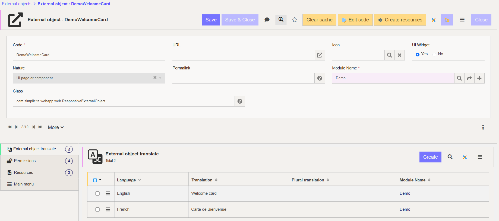

UI Component
============

:::warning
This documentation is part of the **Frontend Development** category, designed to guide you through frontend customization within Simplicité.
:::

This guide covers creating custom widgets using **External Objects** for interactive, embedded components.

When to Use Custom Widgets
--------------------------

Create custom widgets when:

- Existing components don't meet your visualization needs
- You need specific feature combinations
- Default UI doesn't support your design requirements

:::tip
Most technical operations can be accomplished with Simplicité's core features. Custom widgets primarily address unique visualization needs.
:::

Example: Welcome Card
---------------------


A customizable entry point featuring:

- Personalized greetings
- Brand-aligned design
- Interactive shortcuts
- Dynamic content

Creating a Widget
-----------------

### 1. Create External Object



1. Create new **External Object**
2. Set **Nature**: UI page or component
3. Set **Class**: `com.simplicite.webapp.web.widgets.ResponsiveExternalObject`
4. Enable **UI widget**: Yes
5. Grant permissions matching your module/view


### 2. Create Resources

Click **Create Resources** to generate three files:


- **HTML**: Content structure (`<div id="ext-obj"></div>`)
- **STYLES**: CSS stylesheet
- **CLASS**: JavaScript functionality

### 3. Choose Implementation Approach

**Dynamic Instantiation (Recommended)**:

- HTML contains only anchor elements
- JavaScript creates content dynamically
- Lighter DOM, faster loading

```html
<div id="demowelcomecard">
  <div id="demowelcomecard-header"></div>
  <div id="demowelcomecard-actions"></div>
  <div id="demowelcomecard-productlist" hidden></div>
</div>
```

```javascript
Simplicite.UI.ExternalObjects.DemoWelcomeCard = class extends Simplicite.UI.ExternalObject {
  async render(params, data = {}) {
    $('#demowelcomecard').append('Hello world!');
  }
}
```

**Static Instantiation**:

- More complete HTML structure
- Less JavaScript manipulation
- Use when minimal dynamic data needed

Integration
-----------

1. Navigate to **User Interface > Views > Show All**
2. Select a **Home Page** view
3. Click **Edit View**
4. Add new **Sub-View**:
   - Type: **External Page**
   - Source: **External Object**
   - External Object: Your widget name
5. Save and preview

:::warning

Ensure proper permissions. If you see "External object not granted", clear cache and verify rights match your application.

:::

Implementation Example
----------------------

### Accessing Simplicité

```javascript
async render(params, data = {}) {
  let app = $ui.getApp();
  let product = app.getBusinessObject("DemoProduct");
  let user = app.getBusinessObject("User");
  let login = $ui.getGrant().login;

  // Build your UI
}
```

### Fetching Business Objects

```javascript
product.search(function() {
  for (let i = 0; i < product.count; i++) {
    const prd = product.list[i];
    const imageSrc = `data:${prd.demoPrdPicture.mime};base64,${prd.demoPrdPicture.content}`;

    // Create and append elements
    let productDiv = $('<div>').addClass("product-card");
    // ... add content ...
    $("#product-list").append(productDiv);
  }
}, null, { inlineDocuments: ['demoPrdPicture'] });
```

### Accessing Fields

Field naming follows patterns:

- Object fields: `demoPrdName`, `demoPrdPrice`
- Linked fields: `demoPrdSupId__demoSupName`


Check **Business Objects > Your Object > Object Fields** for all available fields.

### Displaying Forms

```javascript
$ui.displayForm(null, "DemoProduct", prd.row_id, {
  nav: "add",
  target: "work"
});
```

### Getting User Info

```javascript
let grant = $ui.getGrant();
let currentUserLogin = grant.login;
let user = app.getBusinessObject("User");

user.search(function() {
  const usr = user.list.find(u => u.usr_login === currentUserLogin);
  if (usr && usr.row_id) {
    $ui.displayForm(null, "User", usr.row_id, {
      nav: "add",
      target: "work"
    });
  }
}, null, {});
```

Complete Example Structure
--------------------------

<details>
<summary>Full HTML</summary>

```html
<div id="demowelcomecard">
  <div id="demowelcomecard-header"></div>
  <div id="demowelcomecard-actions"></div>
  <div id="demowelcomecard-productlist"></div>
</div>
```

</details>

<details>
<summary>Full JavaScript</summary>

```javascript
Simplicite.UI.ExternalObjects.DemoWelcomeCard = class extends Simplicite.UI.ExternalObject {
  async render(params, data = {}) {
    let app = $ui.getApp();
    let product = app.getBusinessObject("DemoProduct");
    let login = $ui.getGrant().login;

    // Build header
    $("#demowelcomecard-header")
      .append($('<h1>').text("Welcome to Simplicité!"))
      .append($('<h3>').text("Explore and enjoy your experience!"));

    // Build actions
    $("#demowelcomecard-actions")
      .append($('<button/>').text("Tutorial")
        .on("click", () => window.open("https://docs.simplicite.io/", "_blank")))
      .append($('<button/>').text("Products")
        .on("click", () => $("#demowelcomecard-productlist").toggle()));

    // Load products
    product.search(function() {
      for (let i = 0; i < product.count; i++) {
        const prd = product.list[i];
        let card = $('<div>').addClass("product-card");
        // Build card content
        $("#demowelcomecard-productlist").append(card);
      }
      $("#demowelcomecard-productlist").hide();
    }, null, { inlineDocuments: true });
  }
};
```

</details>

Legacy Approach (V5)
--------------------

For older versions, use namespace pattern:

```javascript
var CustomWelcomeCard = CustomWelcomeCard || (function($) {
  let app = $ui.getApp();

  function render(url) {
    // Implementation
  }

  return { render: render };
})(jQuery);
```
