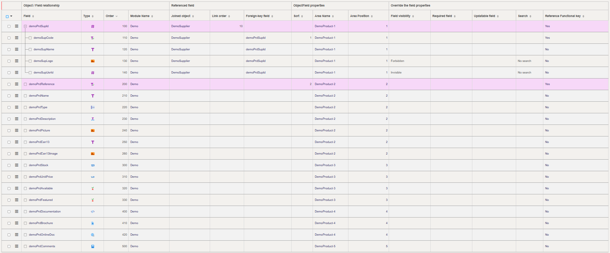
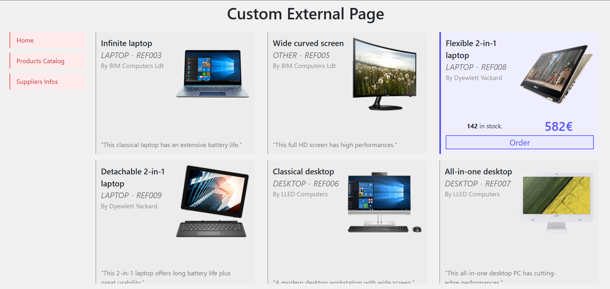
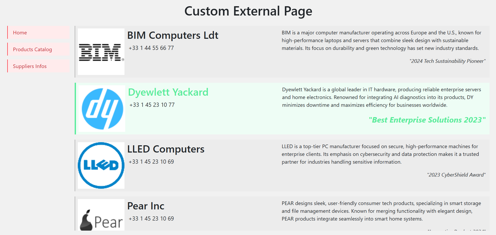
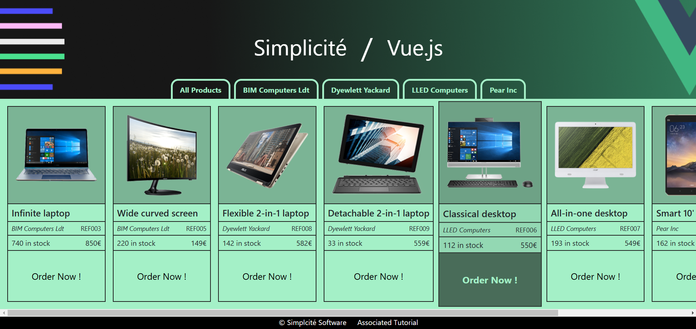

External Custom Web Pages
=========================

<div class="warning">
    This lesson is a part of the <b>Frontend Development</b> category, which is meant to guide you through the frontend development within Simplicité. Thus it might be a bit longer and more verbosed than other lessons you will find in the <b>Simplicité Configuration Object</b> category.
</div>

This document explains how to use Simplicité's **External Objects** to create web pages that operate independently from the Simplicité application interface. Thus, these objects are rendered as custom web pages rather than being embedded within Simplicité's standard UI.

# Native webpages

This section describes the process of creating a custom webpage from scratch. The resulting page functions as a dedicated front-end that interacts with Simplicité's back-office. As an example, the **DemoWebPage** will be recreated and analyzed (see screenshots below). This demonstration page provides a simple yet fully functional interface, enabling clients to view the product catalog, place orders, access supplier information, and utilize various resources related to the Simplicité solution.


The presented web-pages are an "in-between" the complete external pages created using the **NPM Library** explained [here](/docs/front/javascript-dev), and the *UI Component* that you can create as shown in [this lesson](/docs/front/javascript-dev). Although such objects will be rendered at the `"/ext/"` of your Simplicité's instance URL (`https://<name>.demo.simplicite.io`), but still you can decide either to set this page public or private, thus requesting or not for credentials' validation before accessing it at the given URL.

## Object Creation

Simplicité provides the ability to extend your External Objectsoutside* of the core application, enabling you to build ***custom web pages***. The process is quite similar to creating **custom widgets** but with a few key differences:

* When defining your object, ensure that its nature is set to **Basic**.

* Make sure to include all *necessary resources* (this applies particularly when developing a native web page).

## Java "Server" code

To implement and deploy an external webpage using a Simplicité **External Object**, one primary distinction from embedded components or views is the need to create a custom Java server-side script --from the *Code* field of the external object:

```java
package com.simplicite.extobjects.Training;

import org.json.JSONObject;

import com.simplicite.util.AppLog;
import com.simplicite.util.ExternalObject;
import com.simplicite.util.Tool;
import com.simplicite.util.tools.HTMLTool;
import com.simplicite.util.tools.Parameters;
import com.simplicite.webapp.web.BootstrapWebPage;

/**
 * Web site custom frontend UI
 */
public class MyExternalObject extends ExternalObject {
	private static final long serialVersionUID = 1L;

	/**
	 * Display method
	 * @param params Request parameters
	 */
	@Override
	public Object display(Parameters params) {
		try {
			setDecoration(false);

			BootstrapWebPage wp = new BootstrapWebPage(params.getRoot(), getDisplay());

			wp.appendAjax();
			wp.appendJSInclude(HTMLTool.getResourceJSURL(this, "CLASS"));
			wp.appendCSSInclude(HTMLTool.getResourceCSSURL(this, "STYLES"));
			wp.appendHTML(HTMLTool.getResourceHTMLContent(this, "HTML"));

			wp.setReady(this.getName() + ".render({});");

			return wp.toString();
		} catch (Exception e) {
			AppLog.error(getClass(), "display", null, e, getGrant());
			return e.getMessage();
		}
	}
}
```

The *core class* that allows and facilitates the creation and management of custom web pages is **BootstrapWebPage**, found in the `com.simplicité.webapp.web.BootstrapWebPage` package. This class, which extends `JQuery` and utilizes `Bootstrap`, enables the instantiation and rendering of objects defined within Simplicité.

The primary methods to utilize are as follows:

- `setDecoration(false)`: Disables embedding the object within a container (such as a panel or card). This option is set to false to enable a full-page layout.

- `appendAjax()`: Integrates Ajax functionality into the page, allowing asynchronous communication with Simplicité's back-office.

- `appendJSInclude()`, `appendCSSInclude()`, `appendHTML()`: These methods load the required Resource Files and associate them with the External Object for rendering.

- `setReady()`: Inherited from `com.simplicité.webapp.web.JqueryWebPage`, this method ensures the jQuery document is fully initialized and ready for JavaScript execution (e.g., `render()` or `main()`).

> For more information on the **BootstrapWebPage** class, refer to the [official documentation](https://platform.simplicite.io/current/javadoc/com/simplicite/webapp/web/BootstrapWebPage.html) and the [Javadoc](https://platform.simplicite.io/current/javadoc/).


### Page Access

As explained before, such objects can be declared either as public or private using the `setPublic()` method from the `com.simplicite.webapp.web.ResponsiveExternalObject` package. By default `isPublic()` returns `true` (at least for the provided examples). Objects that are declared as public are thus gonna be rendered in what's called the *public zone* and accessible by anyone who has the right URL, while object with `isPublic() == false` are gonna be rendered in the *private zone*, which means only in your Simplicité's instance (UI components).

You can also create sort of "hybrid" objects that can be rendered in both zones by specifying to create or not a `BootstrapWebPage` in the *Java Code* of your object:
```java
@Override
public Object display(Parameters params) {
    try {
        boolean pub = isPublic();

        if (pub)
		{
            BootstrapWebPage wp = new BootstrapWebPage(params.getRoot(), getDisplay());
			// then proceed to add all needed resources and elements to your object.
            wp.setReady(render);

            return wp.toString();

        }
		else return javascript(render);

    } catch (Exception e) {
        AppLog.error(getClass(), "display", null, e, getGrant());
        return e.getMessage();
    }
}
```

* If your object is meant to be public, then you have to instantiate a `new BootstrapWebPage(...);`, add all the needed resources (HTML, STYLES, CLASS or other files), and finally initiate the link with the front-script *CLASS* using the `.setReady()` with the proper *render* variable.

* Otherwise if your object is meant to be private, then you simply have to execute the javascript locally with `javascript()` with the proper *render* variable.

In both case you wanna return the object to display (either BootstrapWebPage or embedded element), and to properly set your `String render` value.

## Web "Client" code

Creating an external page involves defining a web component inside a `<div>` with the object's name as the ID; external object named *CustomExternalObject* will be defined within `<div id="customexternalobject"></div>`. This `<div>` will be rendered in the following html context:

```html
<html>
<head>
	<title>External Object</title>
	<meta charset="UTF-8">
	<meta name="viewport" content="width=device-width, initial-scale=1, maximum-scale=5, user-scalable=yes">
	<!-- bunch of other <link> <script> elements -->
	<script type="text/javascript">
		jQuery(document).ready(function() { ExternalObject.render({}); });
	</script>
</head>

<body>
	<div id="bs-main" class="container"><div id="externalobject">
		<!-- Content of your Object -->
	</div>
</body>
</html>
```

The subsequent sections break down the *structure* and key *elements* of our custom webpage.

### Setup and prerequisites

To *display* the external object, initialize the application as a `new Simplicité.Ajax` instance. Indeed this setup depends on the *specific parameters* of your use case:

```javascript
// Basic content of the javascript at creation of resources
class MyExternalPage extends Simplicite.UI.ExternalObject {
    async render(params, data = {}) {
        $('#myexternalpage').append('Hello world!');
    }
}
```

```javascript
// Namespace-based approach (recommended)
var MyExternalPage = (function($){
    function render(params)
    {
        app = new Simplicite.Ajax("", "uipublic");
    }

    return { render: render }
})(jQuery);
```

The *namespace-based* approach is recommended because it simplifies the *organization* of functions and reduces the *naming confusions* and *conflicts* with Simplicité’s global objects and methods.

When first created, the *HTML resource* is empty and does not display any content:
```html
<div id="myexternalobject">
	<!-- Your content here -->
</div>
```

Initially, the object is *not displayed at full width* because it inherits *layout constraints* from Simplicité's UI. To achieve a **full-page view**, apply the following CSS:
```css
/* This is the very base you wanna add to your custom page in order for it to be properly rendered in 'full page' */
#myexternalpage {
	position: absolute;
	top: 0;
	left: 0;
	width: 100vw;
	height: 100vh;
}
```

### Javascript

#### Code Organization

When developing the **Client-Side** script using the *namespace pattern* (as demonstrated above, using `var MyExternalPage = ( function($){...} )(jQuery);`), keep the following practices in mind:

- Define all necessary functions inside the `return {}` block of the namespace to ensure *proper encapsulation*.

- When triggering methods from HTML (e.g., buttons), reference the namespace explicitly. For example: `<button onclick="MyExternalPage.clickButton()">Click me</button>`.

#### Accessing Business Objects

Accessing Simplicité’s **Business Objects** follows the same approach outlined in the [UI Component](/docs/front/ui-component) and [JS Development](/docs/front/javascript-dev) lessons. Below is an example demonstrating how to *query* and *manipulate* Business Objects using  `$app.getBusinessObject()` and `BusinessObject.search()` methods:

```javascript
let app = new Simplicite.Ajax(params.root, "uipublic"); // params.root or ""

let product = app.getBusinessObject("DemoProduct");

product.search(function() {
	let prd;

	for (let i=0; i<product.count; i++)
	{
		prd =
	}
}, null, {});
```

In the code snippet right above, the `product.search()` method opens a connection to the *"DemoProduct"* table in the database, allowing to access all the different instances of this Business Object. If trying to access those instances outside, you might encounter issues due to outdated or inexistent data.

Also keep in mind that all Business Object have a similar architecture, and are of type `[object Object]`:
```json
{
	"count": <INT>, // count of BusinessObjects with this name & applied filters
	"crosstabdata": {},
	"filters": {}, // applied filters in the 'search' call
	"item": {},
	"list": [<OBJECT>...], // array of all the BusinessObject instances
	"locals": {},
	"maxpage": <INT>,
	"metadata": {
		"name": <STRING>, // BusinessObject's name
		"instance": <STRING>, // Instance where object is located
		"rowidfield": <STRING>, // Id of the object within the Database
	},
	"page": <INT>,
	"selectedIds": <ARRAY>,
	"_app": {
		// specific parameters of your app
		"_errorActive": <BOOL>, "_warningActive": <BOOL>, "infoActive": <BOOL>, "_debugActive": <BOOL>, "_approot": <STRING>, // ...
	}
}
```

And accessing the instances of the targeted object is done through the `BusinessObject.list` field, using either a `for(...){...}` loop to parse them all, or the `BusinessObject.get(string rowId)` method to get one precise instance using it's row id in the given BusinessObject table in database. Moreover the Business Objects' instances are also of type `[object Object]` with their accessible fields listed:

```json
//this is the specific DemoProduct instances example
demoPrdAvailable: true
demoPrdBrochure: {name: 'brochure.pdf', mime: 'application/pdf', id: '16081', path: 'DemoProduct/demoPrdBrochure/0/1/brochure.pdf', size: 235498, …}
demoPrdComments: null
demoPrdDescription: "This classical laptop has an extensive battery life."
demoPrdDocumentation: ""
demoPrdEan13: "9780201379617"
demoPrdEan13Image: {name: '9780201379617.png', mime: 'image/png', id: '16084', path: 'DemoProduct/demoPrdEan13Image/0/1/9780201379617.png', size: 761, …}
demoPrdFeatured: false
demoPrdName: "Infinite laptop"
demoPrdOnlineDoc: "1drv.ms/w/s!AvyyaruRKtdYhtUx-AbO5vwUmJvfNw"
demoPrdPicture: {name: 'laptop.png', mime: 'image/png', id: '16083', path: 'DemoProduct/demoPrdPicture/0/1/laptop.png', size: 47828, …}
demoPrdReference: "REF003"
demoPrdStock: 740
demoPrdSupId: "1"
demoPrdSupId__demoSupCode: "BIM"
demoPrdSupId__demoSupName: "BIM Computers Ldt"
demoPrdSupId__demoSupUsrId: "5"
demoPrdType: "LAPTOP"
demoPrdUnitPrice: 850
row_id: "1"
```

The accessible fields are the ones declared and visible in the *Business Object > Object Fields* list, accessible within the Simplicité UI:



#### Creating Business Objects

When *creating a Business Object instance* from a specific front, it is essential to generate the instance directly from the object. This can be achieved by implementing a straightforward business object creation script, utilizing the `BusinessObject.getForCreation()` and `BusinessObject.create()` methods. Both methods rely on the `BusinessObject.item` variable field, which functions similarly to a *temporary placeholder* (akin to the common "tmp" variable used in programming).

To ensure the *proper creation* of a Business Object, you must first gather all the *necessary fields*. In the case of a **DemoOrder** object, the following fields are required:

- `demoOrdCliId`: represents the id of the associated *DemoClient* accessible through `demo_client.row_id`.
- `demoOrdCliId__demoCliCode`: this is the code of the *DemoClient* with the given `row_id`, accessible through `demo_client.demoCliCode`.
- `demoOrdPrdId`: refers to the id of the associated *DemoProduct* accessible through `demo_product.row_id`.
- `demoOrdPrdId__demoPrdReference`: the specific 'reference' field from the *DemoProduct* referenced by given `row_id`, accessible through `demo_product.demoPrdReference`.
- `demoOrdPrdId__demoPrdUnitPrice`: the specific 'price' field from the *DemoProduct* referenced by given `row_id`, accessible through `demo_product.demoPrdUnitPrice`.
- `demoOrdPrdId__demoPrdStock`: the specific 'stock' field from the *DemoProduct* referenced by given `row_id`, accessible through `demo_product.demoPrdStock`.

> **Note:** The structured use of `BusinessObject.item` helps maintain *data integrity*, preventing errors during object instantiation and ensuring a smooth workflow in managing creation (and thus other actions) of BusinessObject's intances.

Below a basic code example to create a new order with the mentionned fields:
```javascript
let order = app.getBusinessObject("DemoOrder");
let cli, prd; // dynamically fetch the DemoClient and DemoProduct you wanna associate to order

order.getForCreate(function() {
    order.item.demoOrdCliId = cli.row_id;
    order.item.demoOrdCliId__demoCliCode = cli.demoCliCode;

    order.item.demoOrdPrdId = prd.row_id
    order.item.demoOrdPrdId__demoPrdReference = prd.demoPrdReference
    order.item.demoOrdPrdId__demoPrdUnitPrice = prd.demoPrdUnitPrice;
    order.item.demoOrdPrdId__demoPrdStock = prd.demoPrStock;

    order.item.demoOrdQuantity = "1"; // you can dynamically set this
    order.item.demoOrdComments = `Order created from 'MyExternalPage'.`;

    order.create();
});
```

When implementing similar code, understanding the core mechanics is crucial. Here is a concise breakdown of how the process works:

* `BusinessObject.getForCreate( function(){...} )`: this method *initializes* the default `BusinessObject.item`, preparing it for creation. Equivalent `getFor*()` methods exist for other actions, such as *Copy*, *Create*, and *Update*. These methods guide the preparation phase by ensuring the object is *properly instantiated* before any operation begins.

* `BusinessObject.item`: this property serves as the *primary container* for any **Business Object**. It can either hold an *active instance* of the object or act as a *temporary placeholder* for upcoming actions like *creation*, *copying*, or *updating*. `BusinessObject.item` simplifies the creation management by maintaining a clear and accessible state of the object during the entire process (and still after if not overridden).

* `BusinessObject.create()`: this method *finalizes* the creation process by *generating and loading* the object. By default, it operates on the existing `BusinessObject.item` without requiring additional arguments. The standard approach involves instantiating the object via `getForCreate()` and subsequently invoking `create()`, ensuring a *straightforward* and *efficient* creation process.

### Specificities

#### Resource images

Certain actions cannot be performed *directly* or are **deprecated** when done *statically through HTML*. As a result, many tasks must be *handled dynamically* within the `render(params)` method. For instance, if you need to *pass images* sourced from your business object’s resources, this must first be facilitated through the `params` using a **Java server-side script**, as shown below:

```java
JSONObject p = params.toJSONObject()
	.put("myImage", HTMLTool.getResourceImageURL(this, "<name within resources>"));

wp.setReady(this.getName() + ".render(" + p.toString() + ");"); // instead of ".render({})"
```

Once the image is *passed through the params*, you can *retrieve* it in your **JavaScript code** by executing the following within the `render()` method:

```javascript
function render(params) {
    let resourceImage = params.myImage
    // now you can pass it as a 'src' or do whatever you want with it :)

    // rest of code ...
}
```

#### Database documents

A *common scenario* you may encounter involves *fetching* and *displaying* images from *business objects*. This can be achieved by leveraging **Business Object Fields**, as demonstrated in the following JavaScript snippet:

```javascript
productBO.search(function() {
	for (let i = 0; i < productBO.list.length; i++) {
	    let prd = productBO.list[i];

		let imageSrc = `data:${prd.demoPrdPicture.mime};base64,${prd.demoPrdPicture.content}`;

		let productImageHtml = ``;
	}
}, {});
```

However, by default, if you attempt this approach, the value of `prd.demoPrdPicture` will return as a string (e.g., `"16087"`), representing the **ID** of the image. This occurs because the `search()` method does *not inherently include document-type data*. To address this, you must explicitly specify the *required parameters* in the function’s params section:

```javascript
businessObject.search(function(){
	// ... your function ...
}, { inlineDocs = true });
```

Below is a *comprehensive list* of handled parameters and their corresponding functions, detailing what can be fetched and utilized through the `BusinessObject.search(cbk, filters, params)` method:

| Name                | Type                      | Description                                            |
|---------------------|---------------------------|--------------------------------------------------------|
| context             | number                    | Init context (normally one of Simplicite.Ajax.CONTEXT_LIST/PANELLIST/REFSELECT/DATAMAPSELECT/EXPORT/CROSSTAB/GRAPH/PRINTTMPL constant).  |
| metadata            | boolean                   | allow to update the metadata in context, and in items with `{meta:{...}, data:{...}}`. |
| page                | number                    | indicates the index of the page searched. |
| inlineDocs          | boolean/string/array      | includes the documents in the search, value can be `true`/`images`/`infos`/array of fields. |
| inlineThumbs        | boolean/array             | includes the thumbnails of documents (`true` or `array of fields`). |
| inlineObjs          | boolean                   | includes objects fields items. |
| parent              | Object                    | (optional) parent object `{name, inst, field, rowId}`. |
| view                | Object                    | (optional) view in `CONTEXT_LIST` as `{ name: viewname, item: position, home: boolean }`. |
| history             | boolean                   | getting rows histories. |
| totals              | boolean                   | getting field aggregations. |
| social              | boolean                   | getting posts count for each row. |
| visible             | boolean                   | getting only visible fields. |
| edit                | string                    | (optional) defines the edit list mode as `new`, `rows`, `upsert`. |
| searchId            | string                    | (optional) preset search to apply. |
| groupby             | boolean                   | getting the group by result. |
| partial             | boolean                   | getting result for lazy-loading (not changing object's data). |
| error               | function                  | CUstom error handler. |

> ***Note:*** By incorporating the appropriate parameters and dynamically handling images and other resources within the render method, you can ensure that your business objects are displayed accurately and efficiently.

#### Asynchronous database calls

Most of the functions you'll interact with in Simplicité's system are based on **Promises**, as they involve *fetching* data from *databases*. To avoid errors arising from synchronous code execution, it is essential to *manage promises* correctly and ensure that variables are *referenced asynchronously*.

Here’s a brief refresher on how to use `async` and `await`, as well as how to *encapsulate calls* within `new Promise((resolve, reject) => {...})` for greater control over *asynchronous operations*.

```javascript
let product = app.getBusinesssObject("DemoProduct");

let productNames = await getProductNames();

async function getProductNames() {
	// Wrap your database call within a promise:
	let result = await new Promise((resolve, reject) => {
	    product.search(function() {

	        let res = product.list.map(prd => prd.demoPrdName);

	        resolve(res);  // Resolve the Promise with the HTML content
	    }, (err) => {
	        console.error("Error during search", err);
	        reject(err);  // Reject the Promise if there's an error
	    }, { inlineDocuments: true, });
	});

	return result;  // Return the resolved HTML content
}
```

This approach ensures that your asynchronous operations are handled cleanly, reducing potential issues with undefined variables or race conditions. By implementing promise handling, you can create more reliable and maintainable code when working with Simplicité's system.

***How promises work in javascript:*** JavaScript promises operate on three primary states:
- **Pending -** The initial state; promise is neither fulfilled nor rejected yet.
- **Fulfilled -** The operation was successful, thus promise returns a result.
- **Rejected -** Operation failed, promise then returns an error.

***Key Points:***
- Use `async` before a function to ensure it returns a `[object Promise]`.
- `await` pauses the execution of the function (or statement) until the *promise resolves*.
- Wrapping asynchronous logic in `new Promise()` gives explicit control over resolving or rejecting the operation.

## Final Result




<details>
<summary>Java server-side Code</summary>

```java
package com.simplicite.extobjects.Training;

import org.json.JSONObject;

import com.simplicite.util.AppLog;
import com.simplicite.util.ExternalObject;
import com.simplicite.util.Tool;
import com.simplicite.util.tools.HTMLTool;
import com.simplicite.util.tools.Parameters;
import com.simplicite.webapp.web.BootstrapWebPage;

/**
 * Web site custom frontend UI
 */
public class MyExternalObject extends ExternalObject {
	private static final long serialVersionUID = 1L;

	/**
	 * Display method
	 * @param params Request parameters
	 */
	@Override
	public Object display(Parameters params) {
		try {
			boolean pub = isPublic();
			setDecoration(!pub);

			// Bootstrap page
			BootstrapWebPage wp = new BootstrapWebPage(params.getRoot(), getDisplay());

			wp.appendAjax(true);
			wp.appendJSInclude(HTMLTool.getResourceJSURL(this, "CLASS"));
			wp.appendCSSInclude(HTMLTool.getResourceCSSURL(this, "STYLES"));
			wp.appendHTML(HTMLTool.getResourceHTMLContent(this, "HTML"));

			JSONObject p = params.toJSONObject();
	        String websiteCoverURL = HTMLTool.getResourceImageURL(this, "WEBSITE");
	        String tutorialCoverURL = HTMLTool.getResourceImageURL(this, "TUTORIAL");
	        String forumCoverURL = HTMLTool.getResourceImageURL(this, "FORUM");
	        String platformCoverURL = HTMLTool.getResourceImageURL(this, "PLATFORM");

	        if (websiteCoverURL != null) {
	        	p.put("websiteImage", websiteCoverURL);
	        	p.put("tutorialImage", tutorialCoverURL);
	        	p.put("forumImage", forumCoverURL);
	            p.put("platformImage", platformCoverURL);
	        }

			wp.setReady(this.getName() + ".render(" + p.toString() + ");");

			return wp.toString();
		} catch (Exception e) {
			AppLog.error(getClass(), "display", null, e, getGrant());
			return e.getMessage();
		}
	}
}
```
</details>

```html
<div id="myexternalobject">
	<div id="myexternalobject-header">
		<h1>Custom External Page</h1>
	</div>
	<div id="myexternalobject-body">
		<ul id="myexternalobject-navigation-menu">
			<li class="myexternalobject-navigation-item" onclick="MyExternalObject.navigate('home')">Home</li>
			<li class="myexternalobject-navigation-item" onclick="MyExternalObject.navigate('prd')">Products Catalog</li>
			<li class="myexternalobject-navigation-item" onclick="MyExternalObject.navigate('sup')">Suppliers Infos</li>
		</ul>
		<div id="myexternalobject-content">
			<!-- Here put the "Home" content per default -->
		</div>
	</div>
	<div id="myexternalobject-footer">

	</div>
</div>
```

<details>
<summary>Javascript Code</summary>

```javascript
const MyExternalObject = (function($) {
    let app, productBO, supplierBO, clientBO, orderBO, contactBO, webClient;
    let currentContentId = 'home';
	let homeContent, productContent, supplierContent, orderContent;
	let content;

	// hardcoding WEBCLI fields because not figuring out how to fetch them...
	let cli = {
		demoCliCode: "WEBCLI",
		row_id: "5",
		demoCliFirstname: "Robert",
		demoCliLastname: "MORANE"
	};

    function render(params)
    {
    	console.log("render with params: "+JSON.stringify(params));

        app = new Simplicite.Ajax(params.root, "uipublic");

        productBO = app.getBusinessObject("DemoProduct");
        supplierBO = app.getBusinessObject("DemoSupplier");
        orderBO = app.getBusinessObject("DemoOrder");

        // Those are unused DUHUH
        clientBO = app.getBusinessObject("DemoClient");
        contactBO = app.getBusinessObject("DemoContact");

        content = document.getElementById("myexternalobject-content");

        let images = [
        	params.websiteImage,
        	params.tutorialImage,
        	params.forumImage,
        	params.platformImage
        ];

        homeContent = createHomeContent(images);

        changeContent(homeContent);
    }

    async function navigate(target)
    {
    	if (target == currentContentId) return;

    	let tmp = "";
    	switch (target)
    	{
    		case 'home':
    			tmp = (homeContent==null) ? createHomeContent() : homeContent;
    			break;
    		case 'prd':
    			tmp = (productContent==null) ? await createProductContent() : productContent;
    			break;
    		case 'sup':
    			tmp = (supplierContent==null) ? await createSupplierContent() : supplierContent;
    			break;
    		default: break;
    	}

    	changeContent(tmp, target);
    }

    function changeContent(newContent, newContentId)
    {

    	if (newContent=="") return;

    	content.innerHTML = "";
    	content.innerHTML = newContent;

    	currentContentId = newContentId;
    }

    function createHomeContent(images)
    {
    	let content = `
    	<div id="myexternalobject-home-content">
    		<div class="myexternalobject-home-card-grid">
    			<div class="myexternalobject-home-card website-card" onclick="MyExternalObject.goToPage('website')" style="background-image: url('${images[0]}');">
    				<h2>Simplicité's Website</h3>
	    		</div>
	    		<div class="myexternalobject-home-card tutorial-card" onclick="MyExternalObject.goToPage('tuto')" style="background-image: url('${images[1]}');">
	    			<h2>Our Tutorial</h3>
	    		</div>
	    		<div class="myexternalobject-home-card forum-card" onclick="MyExternalObject.goToPage('forum')" style="background-image: url('${images[2]}');">
	    			<h2>Community Forum</h3>
	    		</div>
	    		<div class="myexternalobject-home-card platform-card" onclick="MyExternalObject.goToPage('platform')" style="background-image: url('${images[3]}');">
	    			<h2>Platform Resources</h3>
	    		</div>
    		</div>
    	</div>
    	`;

    	homeContent = content;

    	return content;
    }

    async function createProductContent() {
	    let productsDiv = ``;

	    let content = await new Promise((resolve, reject) => {
	        productBO.search(function() {
	            for (let i = 0; i < productBO.list.length; i++) {
	                let prd = productBO.list[i];
					let imageSrc = `data:${prd.demoPrdPicture.mime};base64,${prd.demoPrdPicture.content}`;

	                let prdDiv = `
	                <div class="myexternalobject-product-card">
	                    <div class="product-card-upper">
	                        <div class="product-card-upper-infos">
	                            <span class="product-card-upper-name">${prd.demoPrdName}</span>
	                        	<span class="product-card-upper-reference">${prd.demoPrdType} - ${prd.demoPrdReference}</span>
	                            <span class="product-card-upper-supplier">By ${prd.demoPrdSupId__demoSupName}</span>
	                        </div>
	                        
	                    </div>
	                    <div class="product-card-lower">
	                        <div class="product-card-lower-infos">
	                        	<span class="product-card-lower-stock"><b>${prd.demoPrdStock}</b> in stock.</span>
	                        	<span class="product-card-lower-price">${prd.demoPrdUnitPrice}€</span>
	                        </div>
	                        <span class="product-card-lower-description">"${prd.demoPrdDescription}"</span>
	                        <button class="product-card-order-btn" onclick="MyExternalObject.orderProduct(${prd.row_id},'${prd.demoPrdReference}',${prd.demoPrdUnitPrice},${prd.demoPrdStock})">Order</button>
	                    </div>
	                </div>
	                `;
	                productsDiv += prdDiv;
	            }

	            let result = `
	            <div id="myexternalobject-product-content">
	                <div id="myexternalobject-product-list">
	                    ${productsDiv}
	                </div>
	            </div>
	            `;

	            resolve(result);  // Resolve the Promise with the HTML content
	        }, (err) => {
	            console.error("Error during search", err);
	            reject(err);  // Reject the Promise if there's an error
	        }, { inlineDocuments: true, });
	    });

		productContent = content;
	    return content;  // Return the resolved HTML content
	}

    async function createSupplierContent()
    {
    	let suppliersDiv = ``;

	    let content = await new Promise((resolve, reject) => {
	        supplierBO.search(function() {
	            for (let i = 0; i < supplierBO.count; i++) {
	                let sup = supplierBO.list[i];

					let logoSrc = `data:${sup.demoSupLogo.mime};base64,${sup.demoSupLogo.content}`;

					let award = sup.demoSupComments.split('\n')[1];
	                let supDiv = `
	                <div class="myexternalobject-supplier-row">
	                	<div class="supplier-row-left">
	                		
		                    <div class="supplier-row-infos">
		                    	<h2>${sup.demoSupName}</h2>
		                    	<span class="supplier-row-contact">${sup.demoSupPhone}</span>
		                    </div>
	                	</div>
	                    <div class="supplier-row-texts">
	                    	<span class="supplier-row-description">${sup.demoSupDescription}</span>
	                    	<span class="supplier-row-award">"${award}"</span>
	                    </div>
	                </div>
	                `;

	                suppliersDiv += supDiv;
	            }

	            let result = `
	            <div id="myexternalobject-supplier-content">
	                <div id="myexternalobject-supplier-list">
	                    ${suppliersDiv}
	                </div>
	            </div>
	            `;

	            resolve(result);  // Resolve the Promise with the HTML content
	        }, (err) => {
	            console.error("Error during search", err);
	            reject(err);  // Reject the Promise if there's an error
	        }, { inlineDocuments: true, });
	    });

    	supplierContent = content;

    	return content;
    }

    function goToPage(pageId)
    {
    	let windowURL = "";
    	switch (pageId)
    	{
    		case 'website':
    			windowURL = "https://www.simplicite.fr/";
    			break;
    		case 'tuto':
    			windowURL = "https://docs.simplicite.io/lesson/tutorial/welcome";
    			break;
    		case 'forum':
    			windowURL = "https://community.simplicite.io/";
    			break;
    		case 'platform':
    			windowURL = "https://platform.simplicite.io/";
    			break;
    		default: break;
    	}

    	if (windowURL!="")
    		window.open(windowURL, "_blank");
    }

    function orderProduct(prdId, prdRef, prdPrice, prdStock)
    {
		const date = getTodayFormattedDate();

    	orderBO.getForCreate(function() {
    		orderBO.item.demoOrdCliId = cli.row_id;
    		orderBO.item.demoOrdCliId__demoCliCode = cli.demoCliCode;

    		orderBO.item.demoOrdPrdId = prdId; // prd.row_id
    		orderBO.item.demoOrdPrdId__demoPrdReference = prdRef; // prd.demoPrdReference
    		orderBO.item.demoOrdPrdId__demoPrdUnitPrice =prdPrice; //  prd.demoPrdUnitPrice
    		orderBO.item.demoOrdPrdId__demoPrdStock = prdStock; // prd.demoPrStock

    		orderBO.item.demoOrdQuantity = "1"; //next step is to have a quick form to select this ...
    		orderBO.item.demoOrdComments = `Order created from 'MyExternalObject' on ${date}`;

    		orderBO.create();
    	});
    }

    function getTodayFormattedDate()
    {
    	const today = new Date();
		const day = String(today.getDate()).padStart(2, '0');
		const month = String(today.getMonth() + 1).padStart(2, '0');
		const year = today.getFullYear();

		return `${day}-${month}-${year}`;
    }

    return {
        render: render,
        navigate: navigate,
        goToPage: goToPage,
        orderProduct: orderProduct
    };
})(jQuery);
```
</details>

<details>
<summary>CSS Resource file</summary>

```css
html {
    scrollbar-width: none;
}
body::-webkit-scrollbar {
    display: none;
}

/*
	GLOBAL PAGE STYLES
*/
#myexternalobject {
	position: absolute;
	top: 0;
	left: 0;
	width: 100vw;
	height: 100vh;
	min-height: 100vh;
	display: flex;
	flex-direction: column;
	background-color: #F1F1F1;
	overflow: hidden;
}

/*
	HEADER STYLES
*/
#myexternalobject-header {
	display: flex;
	flex-direction: row;
	justify-content: center;
	align-items: center;
	padding-top: 0.5rem;
}

/*
	BODY STYLES
*/
#myexternalobject-body {
	display: flex;
	flex-direction: row;
	width: 100%;
	flex-grow: 1;
	display: flex;
	flex-direction: row;
	gap: 1rem;
	padding: 1rem 1.5rem;
	overflow: hidden; /* Keep horizontal overflow hidden */
}

#myexternalobject-navigation-menu {
	list-style-type: none;
	padding: 0;
	margin: 0;
	width: 15%;
	min-width: 10rem;
}
.myexternalobject-navigation-item {
	font-size: 1rem;
	padding: 0.5rem 1rem;
	margin-bottom: 0.75rem;
	background-color: #FFEBEC;
	border-left: solid 0.125rem #FB3640;
	transition: all 0.1s ease;
	cursor: pointer;
	color: #C92B33;
}
.myexternalobject-navigation-item:hover {
	font-weight: 600;
	padding-left: 0.875rem;
	border-left-width: 0.25rem;
}

#myexternalobject-content {
	flex-grow: 1;
	display: flex;
	justify-content: flex-start;
	align-items: flex-start;
    overflow-y: auto;
    overflow-x: hidden;
    max-height: 100%;
    width: 100%;
    scrollbar-width: none;
}

/* Specific HOME SECTION content styles */
#myexternalobject-home-content {
	display: flex;
	flex-direction: column;
	width: 100%;
	height: 100%;
	gap: 2rem;
	justify-content: space-around;
	align-items: center;
}
.myexternalobject-home-card-grid {
    display: grid;
    grid-template-columns: repeat(2, 1fr);
    grid-template-rows: repeat(2, 1fr);
    gap: 1rem;
    width: 90%;
    height: 100%;
    box-sizing: border-box;
}

.myexternalobject-home-card::before {
    content: '';
    position: absolute;
    top: 0;
    left: 0;
    width: 100%;
    height: 100%;
    background-color: rgba(255, 250, 240, 0.5);
    z-index: 1;
    pointer-events: none;
    background-filter: none;
    transition: all 0.25s ease;
}

.myexternalobject-home-card {
    position: relative;
    aspect-ratio: 16 / 9;
    display: flex;
    justify-content: center;
    align-items: center;
    text-align: center;
    width: 90%;
    height: auto;
    border-left: solid 0.125rem #FFD166;
    cursor: pointer;
    background-size: cover;
    background-position: start;
    background-repeat: no-repeat;
    transition: all 0.25s ease;
    overflow: hidden;
    padding: 0.75rem;
    transition: all 0.3s ease;
}

.myexternalobject-home-card:hover {
	border-left-width: 0.3rem;
}

.myexternalobject-home-card h2 {
	display: none;
	color: #FFD166;
    position: relative;
    z-index: 2;
}
.myexternalobject-home-card:hover h2 {
	display: block;
	transform: scale(1.1);
}

.myexternalobject-home-card:hover::before {
    background-color: rgba(255, 250, 240, 0.6);
    backdrop-filter: blur(8px);
}

/* Specific PRODUCT SECTION */
#myexternalobject-product-list {
    display: flex;
    flex-wrap: wrap;
    gap: 1rem;
    justify-content: space-around;
}

.myexternalobject-product-card {
    display: flex;
    flex-direction: column;
    justify-content: space-between;
    width: 25rem;
    box-sizing: border-box;
    padding: 0.75rem;
    transition: all 0.3s ease;
    background-color: rgba(226, 226, 226, 0.33);
    border-left: solid 0.125rem #ABABAB;
}

.myexternalobject-product-card:hover {
    border-left-width: 0.25rem;
    border-left-color: #5451FF;
    background-color: #EEEEFF;
}

.product-card-upper {
	width: 100%;
    display: flex;
    justify-content: space-between;
    align-items: start;
    overflow: hidden;
}
.product-card-upper-name {
	font-size: 1.25rem;
	font-weight: 600;
}
.product-card-upper-picture {
    width: 50%;
    height: auto;
}
.product-card-upper-reference {
	font-size: 1.25rem;
	font-style: italic;
	color: #777777;
}
.product-card-upper-supplier {
	color: #919191;
}

.product-card-upper-infos span,
.product-card-lower span {
    display: block;
    overflow: hidden;
}

.product-card-lower {
	width: 100%;
    display: flex;
    flex-direction: column;
    justify-content: space-between;
}

.product-card-lower-price {
	font-size: 2rem;
	font-weight: 600;
	color: #5451FF;
}

.product-card-lower-description {
    display: block;
    width: 100%;
    text-wrap: pretty;
    color: #777777;
}

.myexternalobject-product-card:hover .product-card-lower-description {
    display: none;
}

.product-card-lower-infos {
    opacity: 0;
}

.myexternalobject-product-card:hover .product-card-lower-infos {
	opacity: 1;
    display: flex;
    flex-direction: row;
    width: 100%;
    justify-content: space-around;
    align-items: center;
}

.product-card-order-btn {
    display: none;
}

.product-card-order-btn {
	background-color: rgba(221, 220, 255, 0.25);
	border: solid 0.125rem #5451FF;
	color: #5451FF;
	font-size: 1.25rem;
	transition: all 0.3s ease;
}
.product-card-order-btn:hover {
	background-color: #5451FF;
	border-color: transparent;
	color: #DDDCFF40;
	font-size: 1.25rem;
	font-weight: bold;
}

.myexternalobject-product-card:hover .product-card-order-btn {
    display: block;
}

/* Specific SUPPLIER SECTION */
#myexternalobject-supplier-list {
    display: flex;
    flex-direction: column;
    gap: 1rem;
}

.myexternalobject-supplier-row {
    display: flex;
    flex-direction: row;
    justify-content: space-between;
    padding: 0.5rem 0.75rem 0.5rem 0.5rem;
    height: 10rem;
    background-color: rgba(226, 226, 226, 0.33);
    border-left: solid 0.125rem #ABABAB;
    transition: all 0.3s ease;
}

.myexternalobject-supplier-row:hover {
	border-left-width: 0.25rem;
    border-left-color: #58EC9B;
    background-color: #EEFDF5;
}

.supplier-row-left {
	display: flex;
    flex-direction: row;
    gap: 0.5rem;
}

.supplier-row-logo {
	height: 100%;
	width: auto;
	aspect-ratio: 1/1;
}

.supplier-row-contact {
	font-size: 1.1rem;
	padding-left: 0.25rem;
}

.supplier-row-texts {
	width: 50%;
	display: flex;
	flex-direction: column;
	justify-self: end;
}

.supplier-row-award {
	width: 100%;
	text-align: right;
	font-size: 1rem;
	font-style: italic;
	transition: font-size 0.5s ease, font-weight 0.1s ease, color 0.1s ease;
}

.myexternalobject-supplier-row:hover .supplier-row-award {
	font-size: 1.5rem;
	font-weight: bold;
	color: #58EC9B;
}

.myexternalobject-supplier-row:hover h2 {
	color: #58EC9B;
}

/*
	FOOTER STYLES
*/
#myexternalobject-footer {
	width: 100%;
}
```
</details>

> The presented example only gives a simple front allowing clients to preview the products and suppliers, but also including links to some of Simplicité's resources.

# Webpages using frameworks

## Vue.js

In order to build custom webpages using the **Vue.js** web framework, you have two possible ways that are slightly different, you can either work with the **resource files** of your external object --with a subtle change in the architecture of those files-- or you can directly create a Vue.js project that you build and then use as a resource within your external object.

> ***Note:*** The two methods are working well but still aren't quite the same when it comes to your mindset and vision while developping them.

### Using resource files

The main specificities are to be considered when setting up your *server-side* code first, indeed you have to specify that you are gonna use **Vue.js** components in the rest of your resource files using the `BootstrapWebPage.appendVue()` function.

All code snippets and examples are taken from an external demonstration page. The complete source code for this page is provided at the end of the document.


#### Server-Side

For webpages developed with HTML, CSS, and JavaScript, a slightly modified Java implementation is required to initialize a *BootstrapWebPage*. This ensures proper webpage setup and generates the necessary JavaScript.

```java
public class MyCustomVuePage extends ExternalObject {
	private static final long serialVersionUID = 1L;

	/**
	 * Display method
	 * @param params Request parameters
	 */
	@Override
	public Object display(Parameters params) {
		try {
			setDecoration(false);

			BootstrapWebPage wp = new BootstrapWebPage(params.getRoot(), getDisplay());

			wp.appendAjax();
			wp.appendJSInclude(HTMLTool.getResourceJSURL(this, "CLASS"));
			wp.appendCSSInclude(HTMLTool.getResourceCSSURL(this, "STYLES"));
			wp.appendHTML(HTMLTool.getResourceHTMLContent(this, "HTML"));

			wp.setReady(this.getName() + ".render({});");

			return wp.toString();
		} catch (Exception e) {
			AppLog.error(getClass(), "display", null, e, getGrant());
			return e.getMessage();
		}
	}
}
```

Once this is done, you'll need to fine-tune it to add Vue to your page:
```java
public class MyCustomVuePage extends ExternalObject {
    private static final long serialVersionUID = 1L;

    @Override
    public Object display(Parameters params) {
        try {
            boolean pub = isPublic();
            setDecoration(!pub);
            String render = getName() + ".render(" + params.toJSONObject() + ");";

            if (pub) {
                BootstrapWebPage wp = new BootstrapWebPage(params.getRoot(), getDisplay());

                wp.appendAjax();
                wp.appendVue();

                wp.appendJSInclude(HTMLTool.getResourceJSURL(this, "SCRIPT"));
                wp.appendCSSInclude(HTMLTool.getResourceCSSURL(this, "STYLES"));
                wp.append(HTMLTool.getResourceHTMLContent(this, "HTML"));

                wp.setReady(render);
                return wp.toString();
            } else {
                appendVue();
                return javascript(render);
            }
        } catch (Exception e) {
            AppLog.error(getClass(), "display", null, e, getGrant());
            return e.getMessage();
        }
    }
}
```

**Modifications:**
Here’s a breakdown of the modifications made, along with explanations for why they were necessary for using Vue:
1) *Encapsulating within an if-else statement:* This is a precaution to handle cases where the external object may be displayed as either a standalone (public) or embedded (private) page. This ensures that a *BootstrapWebPage* isn’t instantiated inside Simplicité’s interface if the object is private.
2) *Initiating "render" before the statement:* Since the "render" string is used in both conditions, it makes sense to declare it in the global scope rather than repeating the declaration twice. This keeps the code cleaner and more efficient.
3) *Use of `appendVue()`:* When using Vue within Simplicité, the `com.simplicite.web.webapp.BootstrapWebPage` method must be used. This method declares the necessary variables and components to ensure the Vue application works correctly.

> ***Warning:*** This option only works for specific web frameworks that are available in the [BootstrapWebPage doc](https://platform.simplicite.io/current/javadoc/com/simplicite/webapp/web/BootstrapWebPage.html).

The available web-tools with this method are:
- Vue® with `BootstrapWebPage.appendVue()`, which allows you to use the framework’s components, workflows, and logic.
- Mustache® (Logic-less template) using `BootstrapWebPage.appendMustache()`, enabling the use of template components and logic.

It’s also possible to include other tools, as long as they don’t override the structure of your object or page.
| Tool Name     | Method                 | Tool documentation (official) |
|---------------|------------------------|-------------------------------|
| JQuery        | `appendJQuery()`       | JQuery [offical page](https://api.jquery.com/) |
| JQPlot        | `appendJQPlot()`       | JQPlot [documentation](http://www.jqplot.com/files/usage-txt.html) |
| Bootbox®      | `appendBootbox()`      | Bootbox [documentation](https://bootboxjs.com/docs.html) |
| Bootstrap®    | `appendBootstrap()`     | Bootstrap latest [documentation](https://getbootstrap.com/5.3/getting-started/introduction/) |
| ChartJS       | `appendChartjs()`      | ChartJs [page](https://www.chartjs.org/) |
| Markdown      | `appendMarkdown()`     | Markdown [guide](https://www.markdownguide.org/) |
| Moment®       | `appendMoment()`       | Moment [documentation](https://momentjs.com/) |
| FullCalendar® | `appendFullCalendar()` | Full Calendar [documentation](https://fullcalendar.io/docs) |

> ***Note:*** For any other frameworks you can refer to the second method **Building Project** seen in the next section. Or directly using the Simplicité NPM library, explored in [this lesson](/docs/front/javascript-dev).

#### Client-Side (setup)

The *JavaScript client-side* script for this setup is distinct from that used in *native custom webpages*. To implement a Vue *app/component*, the existing default code must be entirely replaced. For initial configuration, use the code provided below.

The JavaScript script is indeed very different, even if the overall structure is similar to previously seen examples, it is specific to Vue's features:
```javascript
var MyCustomVuePage = MyCustomVuePage || (() => {

	function render(params) {
		try {
			if (typeof Vue === 'undefined')
				throw 'Vue.js not available';

			const data = {};

			const app = typeof $ui !== 'undefined' ? $ui.getAjax() : new Simplicite.Ajax(params.root, 'uipublic');

			// creating Vue app & mounting it to resource html
			const vue = Vue.createApp({
				data() { return data; },
				methods: { }
			});

			vue.mount("#mycustomvuefront"); // mounting vue app on resource html

		} catch(e) {
			$('#mycustomvuepage').text(`Error: ${e.message}`);
		}
	}

	return { render: render };
})();
```

Understanding the differences in the script is crucial to grasp how Vue communicates and integrates with Simplicité:

1) **Declaration of object:** Instead of declaring the object as `var ExtObj = (function($){ ... })(jQuery);`, declare it as `var ExtObj = ExtObj || (()=>{ ... })();`. This approach ensures the object is only created if it doesn't already exist. The `||` operator checks if "ExtObj" exists and reuses it if it does, otherwise, it creates a new one.

2) **App declaration:** While app instantiation in native webpages typically looks like
`app = new Simplicite.Ajax(params.root, "uipublic");`. Extra precautions are added with `const app = typeof $ui !== 'undefined' ? $ui.getAjax() : new Simplicite.Ajax(params.root, 'uipublic');`. This checks if `$ui` (the main UI controller) is defined. If it is, the existing Ajax session is retrieved (`$ui.getAjax()`). If not, a new session is created with the "uipublic" parameter.

3) **Creating Vue App:** To initialize Vue, use `createApp()`, passing data and methods as:
```javascript
const appInstance = createApp({
  data() { return data; },
  methods: { ... }
});
```
This is key because:
- `data()` – Passes all the values and variables that the HTML resource file will use.
- `methods` – Defines the functions that can be called from the HTML file.

4) **Additional Precautions:** Before proceeding, it’s recommended to check if Vue is available and ready. This can be done by adding `if (typeof Vue === 'undefined') throw 'Vue.js not available';`. Place this at the beginning of the `try { ... }` block to catch any issues early on.


#### Specificities

The architecture and workflows are slightly different than in a regular Vue project, and also different than the one of a regular ExternalObject. The following sections overview the different aspects of Vue and ExternalObjects that are usable or not, or that need specific acknowledgments:

***VueJS features***
Indeed some of the Vue.js features are not accessible:
- `ref` & `onMounted` - as they usually are imported through `import { ref, onMounted } from 'vue` the `Component.vue` files, imports not being allowed within both the SCRIPT resource file and the `<script setup>` part of the component (as it's not *.vue*).
- `.vue` components - those are not acknowledged as Vue components by default, so their use within the resources is impossible.

While most of the other features from the Vue framework are accessible:
- `<style scoped>` style element; Allows for all the defined styles to be applied only to your current element, ensures that other elements outside of your page with the same id or class (mistakely) don't share the same styles.
- `<template>` html5 tag; Special wrapper used to define the structure of your component's html, it doesn't get rendered directly in the final output (so giving it class & styles is useless). Not vue-specific but Vue.js does make it an important element in its logic.
- `v-*` statements; Vue's directive are usable within your HTML resource file, it's one of Vue's core features.
<details>
<summary>Common Statement</summary>

| Vue Statement | Description                                                    |
|---------------|----------------------------------------------------------------|
| `v-if`        | Conditionally renders elements based on expression evaluation. |
| `v-else`      | Renders content when the preceding `v-if` condition is false.  |
| `v-else-if`   | Adds *else-if* condition to an existing `v-if` chain.          |
| `v-show`      | Toggles visibility by applying display CSS property.           |
| `v-bind`      | Dynamically binds attributes or properties to HTML elements.   |
| `v-on`        | Attaches event listeners to elements.                          |
| `v-for`       | Renders a list by iterating over an array or object.           |
</details>

***JavaScript specificities***

While implementing your SCRIPT resource file, there are a few important things to keep in mind to avoid errors and bugs:

1) **Order of Methods:**
The first thing to consider is the order in which you define your methods, as incorrect sequencing can lead to unnecessary issues. The proper order is:
* First instantiate your app with: `const app = typeof $ui !== 'undefined' ? $ui.getAjax() : new Simplicite.Ajax(params.root, 'uipublic');`, ensuring that the app is correctly set up before making any other calls.
* Then call `createApp()` to create the Vue application component. This step allows you to perform asynchronous calls such as `search()`.
* Finally, use `vue.mount()`. It's crucial that the mount occurs after the last search scope is set (as shown below). It ensures that the Vue app is properly bound to the right element after all necessary data has been fetched.

```javascript
function render(params) {
	try {
		const data = {};

		const app = typeof $ui !== 'undefined' ? $ui.getAjax() : new Simplicite.Ajax(params.root, 'uipublic');

		let product = app.getBusinessObject("DemoProduct");

		const vue = Vue.createApp({
			data() { return data; },
			methods: {}
		});

		// ... previous BusinessObject.search() calls ...

		product.search(function() {
			// manipulate data however you want
			data.products = product.list;
		}, null, { inlineDocs: true });

	} catch(err) {
		// error handling code here
	}
}
```

2) **Passing Values and Methods:**
As mentioned earlier, the methods, variables, and values you pass from the SCRIPT to the HTML should be declared within the `vue.createApp()` function like this:

* *For constants and variables;* You should pass all the values you want to share with the HTML inside a data constant, which you then provide to the Vue application. Make sure to name your variables clearly. In the SCRIPT, it should look like this: `data.varName = ...`.
In the HTML, you can simply refer to the variable as varName, as shown in the following example:
```javascript
function render(params) {
	const data = { // you can pass data at declaration if you want
		coverImage: params.coverUrl // the common example are the objects passed through 'params' from the java script
	};

	const vue = Vue.createApp({
		data() { return data; },
		methods: {}
	});

	// you can pass data statically
	data.integer = 42;
	data.string = "foo";

	product.search(function(){
		// but you can also pass data dynamically
		data.singleObject = product.list[0]; // first product as dummy example
	}, null, {});
}
```
```html
<!-- From the above JavaScript code, here is how the data elements can be accessed properly -->
<div class="example-container">
	<span>{{ string }}: {{ integer }}</span>
	<h1>Object is {{ singleObject.field }}</h1>
</div>
```
* *For methods;* Include your methods in the `methods: { ... }` section of the `createApp()` function. You can either define them directly within this scope or declare them outside (though declaring them outside is not recommended for database calls). Declaring them in the `methods` section ensures they are correctly linked to the Vue instance and available for use in the HTML, as shown in the example below.
```javascript
function render(params) {

	// previous part of code

	const vue = Vue.createApp({
		data() { return data; },
		methods: {
			fooInner(){
				console.log("foo from inside !");
			},
			fooOutter
		}
	});

	// next part of code
}

function fooOutter(){
	console.log("foo from outside !");
}
```
```html
<!-- The ways to use the declared functions are similar but still different -->
<button v-on:click="fooInner()">Inner Foo</button> <!-- '()' are mandatory if you want the function to actually be executed -->
<button v-on:click="fooOutter">Outter Foo</button> <!-- don't need the parenthesis if there are no argument (still not recommended) -->
```

If you want to explore these concepts further and understand how they coexist, here is the full code for the Custom Vue webpage that serves as an example:
<details>
<summary>CustomVueFront Full Code</summary>

**HTML Resource File Code**
```html
<template id="demovuejsfrontend-copy">
	<div id="vuefront-header" v-bind:style="{ backgroundImage: 'url(' + coverImage + ')' }">
		<div class="vuefront-header-title">
			<span class="vuefront-title-name" v-on:click="hello">Simplicité</span>
			<span class="vuefront-title-sign">/</span>
			<span class="vuefront-title-name">Vue.js</span>
		</div>

		<div class="vuefront-header-buttons">
			<!-- Here Dynamically input the different suppliers (clicking them lists only their items down below -->
			<button class="vuefront-suppplier-button" v-on:click="displayProducts(null)">
				All Products
			</button>
			<template v-for="sup in supList">
				<!-- Supplier Button for display options -->
				<button class="vuefront-suppplier-button" v-on:click="displayProducts(sup)">
					{{ sup.demoSupName }}
				</button>
			</template>
		</div>
	</div>

	<div id="vuefront-body">
		<div class="vuefront-product-list">
			<!-- Here Dynamically put the products (yet with no filter) -->
			<template v-for="prd in prdList">
				<!-- Product Card -->
				<div v-if="item==null || item.demoSupName==prd.demoPrdSupId__demoSupName" class="vuefront-product-card">
					
					<div class="vuefront-product-card-content">
						<span class="vuefront-product-name">{{ prd.demoPrdName }}</span>
						<div class="vuefront-product-card-infos">
							<span class="vuefront-product-supplier">{{ prd.demoPrdSupId__demoSupName }}</span>
							<span class="vuefront-product-reference">{{ prd.demoPrdReference }}</span>
						</div>
						<div class="vuefront-product-card-actions">
							<span class="vuefront-product-stock">{{ prd.demoPrdStock }} in stock</span>
							<span class="vuefront-product-price">{{ prd.demoPrdUnitPrice }}€</span>
						</div>
						<button v-bind:id=`order-${prd.row_id}` class="vuefront-product-card-order" v-on:click="orderProduct(prd)">Order Now !</button>
					</div>
				</div>
			</template>
		</div>
	</div>

	<div id="vuefront-footer">
		<p class="vuefront-footer-text">&copy; Simplcit&eacute; Software</p>
		<a href="https://docs.simplicite.io/docs/front/web-page" class="vuefront-footer-text">Associated Tutorial</a>
	</div>
</template>

<script setup>
console.log("<script setup>");
// works but without the 'ref' or 'onMounted' as import isn't doable
</script>

<style scope>
#vuefront-header {
	width: 100%;
	height: fit-content;
	background-size: cover;
	background-position-y: center;
	background-repeat: no-repeat;
	display: flex;
	flex-direction: column;
	justify-content: start;
	align-items: center;
	gap: 24px;
	padding-top: 56px;

	.vuefront-header-title {
		color: white;
		display: flex;
		align-items: center;
		gap: 32px;

		.vuefront-title-name {
			font-size: 48px;
		}
		.vuefront-title-sign {
			font-size: 64px;
		}
	}

	.vuefront-header-buttons {
		display: flex;
		gap: 8px;

		.vuefront-suppplier-button {
			background: none;
			color: #A4F0C7;
			border-radius: 16px 16px 0 0;
			border: solid 4px #A4F0C7;
			border-bottom: none;
			padding: 8px 16px;
			font-weight: bold;
			transition: all 0.25s ease;

			&:hover {
				background: rgba(164, 240, 199, 0.25);
			}
			&:active {
				background: rgba(164, 240, 199, 0.5);
				border-color: #4AE28F;
				color: #4AE28F;
			}
		}
	}
}

#vuefront-body {
	width: 100%;
	flex-grow: 1;
	display: flex;
	flex-direction: column;
}

.vuefront-product-list {
	width: 100%;
	flex-grow: 1;
	background: #A4F0C7;
	display: flex;
	flex-direction: row;
	gap: 16px;
	padding: 16px 16px;

	overflow-x: auto;
    overflow-y: hidden;
    white-space: nowrap;

	.vuefront-product-card {
	    display: flex;
	    flex-direction: column;
	    border: solid 2px #1F1F1F;

	    .vuefront-product-picture {
	    	background: rgba(0,0,0, 0.25);
	    	height: 50%;
	    	border-bottom: solid 2px #1F1F1F;
	    	padding: 16px;
	    }
	    .vuefront-product-card-content {
	    	display: flex;
	    	flex-direction: column;
	    	justify-content: start;
	    	align-items: center;
	    	height: 50%;
	    	width: 100%;

	    	.vuefront-product-name {
	    		width: 100%;
	    		font-size: 20px;
	    		font-weight: 500;
	    		padding: 4px 8px;
	    		border-bottom: solid 2px #1F1F1F;
	    	}

	    	.vuefront-product-card-infos {
	    		display: flex;
	    		justify-content: space-between;
	    		font-size: 14px;
	    		padding: 4px 8px;
	    		width: 100%;
	    		border-bottom: solid 2px #1F1F1F;

	    		.vuefront-product-supplier {
	    			font-style: italic;
	    		}
	    	}

	    	.vuefront-product-card-actions {
	    		display: flex;
	    		justify-content: space-between;
	    		padding: 4px 8px;
	    		width: 100%;
	    		border-bottom: solid 2px #1F1F1F;
	    	}

	    	.vuefront-product-card-order {
	    		border: none;
	    		background: none;
	    		width: 100%;
	    		height: 100%;
	    		transition: all 0.5s ease;
	    		font-size: 20px;

	    		&:hover {
	    			background: rgba(0,0,0, 0.5);
	    			font-weight: bold;
	    			color: #A4F0C7;
	    		}
	    	}
	    }

	    transition: all 0.33s ease;
	    &:hover {
	    	background: rgba(0,0,0, 0.1);
	    	transform: scale(1.05);
		}
	}
}

#vuefront-footer {
	display: flex;
	justify-content: center;
	width: 100%;
	color: white;
	height: 28px;
	font-size: 16px;

	a {
		margin-left: 24px;
		text-decoration: none;
		color: white;
		transition: all 0.25s ease;

		&:hover {
			opacity: 0.5;
		}
		&:active {
			opacity: 0.75;
			transform: scale(0.9);
		}
	}
}
</style>
```

**SCRIPT Resource File Code**
```javascript
/* global Vue */

var DemoVueJSFrontendCopy = DemoVueJSFrontendCopy || (() => {
	let supplier, product, order; // Casual BusinessObjects from Simplicité Demo
	let cli = {
		demoCliCode: "VUECLI",
		row_id: "6",
		demoCliFirstname: "Robert",
		demoCliLastname: "ROSS"
	};

	function render(params) {
		try {
			if (typeof Vue === 'undefined')
				throw 'Vue.js not available';

			const data = {
				coverImage: params.coverImage
			};
			console.log("Data Image: "+params.coverImage+" vs "+data.coverImage);

			const app = typeof $ui !== 'undefined' ? $ui.getAjax() : new Simplicite.Ajax(params.root, 'uipublic');

			// initializing & fetching Simplicité-related objects
			const supplier = app.getBusinessObject("DemoSupplier");
			const product = app.getBusinessObject("DemoProduct");
			const order = app.getBusinessObject("DemoOrder");

			supplierList = [];
			productList = [];

			// creating Vue app & mounting it to resource html
			const vue = Vue.createApp({
				data() { return data; },
				methods: {
					displayProducts(s){ this.item = s; },
					orderProduct(p){
						console.log("ordering product -> "+p.demoPrdName);

						const date = new Date();

				    	order.getForCreate(function() {
				    		order.item.demoOrdCliId = cli.row_id;
				    		order.item.demoOrdCliId__demoCliCode = cli.demoCliCode;

				    		order.item.demoOrdPrdId = p.row_id;
				    		order.item.demoOrdPrdId__demoPrdReference = p.demoPrdReference;
				    		order.item.demoOrdPrdId__demoPrdUnitPrice = p.demoPrdUnitPrice;
				    		order.item.demoOrdPrdId__demoPrdStock = p.demoPrdStock;

				    		order.item.demoOrdQuantity = "1";
				    		order.item.demoOrdComments = `Custom Vue Front Order on ${date}`;

				    		order.create();

				    		showToast(`Order Sent for Product: ${p.demoPrdReference}`);
				    	});
					}
				}
			});

			// search methods (before or after "createApp" ??)
				// -> AFTER because first creating app then mounting it WITHIN search .
			supplier.search(function() {
				let supplierList = [];
				for(let i=0; i<supplier.count; i++)
				{
					let sup = supplier.list[i];
					supplierList.push(sup);
				}
				data.supList = supplierList;

			}, null, { inlineDocs: true });

			product.search(function() {
				let productList = [];
				for(let i=0; i<product.count; i++)
				{
					let prd = product.list[i];
					productList.push(prd);
				}
				data.prdList = productList;

				data.item = null; // tmp object storage ?
				vue.mount('#demovuejsfrontend-copy'); // Call this WITHIN search to mount once every fetch is done.
			}, null, { inlineDocs: true });

		} catch(e) {
			$('#demovuejsfrontend-copy').text(`Error: ${e.message}`);
		}
	}

	function showToast(message) {
	    const toast = document.createElement('div');
	    toast.classList.add('custom-toast');
	    toast.innerText = message;
	    document.body.appendChild(toast);

	    setTimeout(() => {
	        toast.classList.add('fade-out');
	        setTimeout(() => toast.remove(), 500);  // Remove after fade-out
	    }, 3000);
	}

	return {
		render: render
	};
})();
```

**CLASS Resource File Code**
```css
#demovuejsfrontend-copy {
	position: absolute;
	top: 0;
	left: 0;
	width: 100vw;
	height: 100vh;
	min-height: 100vh;
	display: flex;
	flex-direction: column;
	background-color: black;
	overflow: hidden;
}

.custom-toast {
    position: fixed;
    width: 500px;
    display: flex;
    justify-content: center;
    top: 16px;
    left: calc(50% - 250px);
    background-color: #D2D2FE;
    color: #4B4CFC;
    padding: 15px 20px;
    border-radius: 5px;
    border: solid 2px #4B4CFC;
    opacity: 1;
    font-size: 20px;
    transition: opacity 0.5s ease;
    z-index: 9999;
}

.custom-toast.fade-out {
    opacity: 0;
}
```
</details>

### Building project

Simplicité also allows you to direclty import projects created under a chosen framework as `.zip` file, and then loading those from the *java server-side* script.

This technique allows you to use frameworks not included in the `com.simplicite.web.webapp.BootstrapWebPage` class, by creating projects as you would for any of the associated frameworks' project using NodeJS. To import it you simply have to run `npm run build` to create a `dist/` folder.
Then the last preparation step is to compress the `dist/` folder into a `.zip`, and add it as a resource in your ExternalObject's form.

> ***Note:*** You can also do that for a Vue project in order to access multi-component projects and a wider range of Vue features.

Next step is to write a proper and functionning *java server-side* code in order to load the compressed as a valid resource in order to reference, load, and render it as any other ExternalObject.