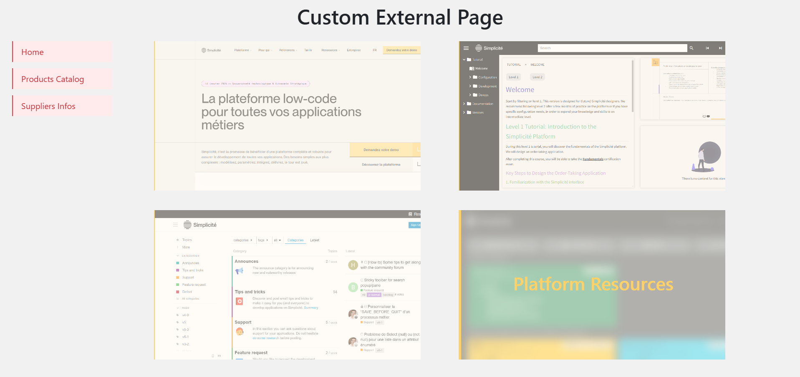

External Custom Web Pages
=========================

:::warning
This documentation is part of the **Frontend Development** category, designed to guide you through frontend customization within Simplicité.
:::

This guide covers creating standalone web pages using **External Objects** that operate independently from Simplicité's standard UI.

Native Web Pages
----------------

Create custom front-ends that interact with Simplicité's back-office while existing as dedicated pages.



These pages are rendered at `/ext/` of your Simplicité URL and can be public or private.

### Creating an External Page

#### 1. Create External Object

1. Set **Nature**: Basic
2. Include necessary resources
3. Write server-side Java code

#### 2. Java Server-Side Code

```java
package com.simplicite.extobjects.Training;

import com.simplicite.util.ExternalObject;
import com.simplicite.util.tools.HTMLTool;
import com.simplicite.util.tools.Parameters;
import com.simplicite.webapp.web.BootstrapWebPage;

public class MyExternalObject extends ExternalObject {
  private static final long serialVersionUID = 1L;

  @Override
  public Object display(Parameters params) {
    try {
      setDecoration(false);

      BootstrapWebPage wp = new BootstrapWebPage(params.getRoot(), getDisplay());

      wp.appendAjax();
      wp.appendJSInclude(HTMLTool.getResourceJSURL(this, "CLASS"));
      wp.appendCSSInclude(HTMLTool.getResourceCSSURL(this, "STYLES"));
      wp.appendHTML(HTMLTool.getResourceHTMLContent(this, "HTML"));

      wp.setReady(this.getName() + ".render({});");

      return wp.toString();
    } catch (Exception e) {
      AppLog.error(getClass(), "display", null, e, getGrant());
      return e.getMessage();
    }
  }
}
```

**Key methods**:

- `setDecoration(false)`: Full-page layout
- `appendAjax()`: Enable async communication
- `appendJSInclude/CSS/HTML()`: Load resources
- `setReady()`: Initialize JavaScript when ready

#### 3. JavaScript Client-Side Setup

```javascript
var MyExternalPage = (function($) {
  function render(params) {
    app = new Simplicite.Ajax("", "uipublic");
    // Your logic
  }
  return { render: render };
})(jQuery);
```

#### 4. Full-Page CSS

```css
#myexternalpage {
  position: absolute;
  top: 0;
  left: 0;
  width: 100vw;
  height: 100vh;
}
```

### Working with Business Objects

#### Fetching Data

```javascript
let app = new Simplicite.Ajax(params.root, "uipublic");
let product = app.getBusinessObject("DemoProduct");

product.search(function() {
  for (let i = 0; i < product.count; i++) {
    let prd = product.list[i];
    // Use product data
  }
}, null, { inlineDocuments: true });
```

#### Creating Objects

```javascript
let order = app.getBusinessObject("DemoOrder");

order.getForCreate(function() {
  order.item.demoOrdCliId = cli.row_id;
  order.item.demoOrdCliId__demoCliCode = cli.demoCliCode;
  order.item.demoOrdPrdId = prd.row_id;
  order.item.demoOrdPrdId__demoPrdReference = prd.demoPrdReference;
  order.item.demoOrdQuantity = "1";
  order.item.demoOrdComments = "Order from external page";

  order.create();
});
```

### Page Access Control

Control public/private access:

```java
@Override
public Object display(Parameters params) {
  try {
    boolean pub = isPublic();

    if (pub) {
      BootstrapWebPage wp = new BootstrapWebPage(params.getRoot(), getDisplay());
      // Configure public page
      wp.setReady(render);
      return wp.toString();
    } else {
      return javascript(render);
    }
  } catch (Exception e) {
    AppLog.error(getClass(), "display", null, e, getGrant());
    return e.getMessage();
  }
}
```

### Special Considerations

#### Resource Images

Pass images through params:

```java
JSONObject p = params.toJSONObject()
  .put("myImage", HTMLTool.getResourceImageURL(this, "<name>"));
wp.setReady(this.getName() + ".render(" + p.toString() + ");");
```

```javascript
function render(params) {
  let resourceImage = params.myImage;
  // Use image
}
```

#### Database Documents

Enable inline documents:

```javascript
product.search(function() {
  let prd = product.list[0];
  let imageSrc = `data:${prd.demoPrdPicture.mime};base64,${prd.demoPrdPicture.content}`;
}, null, { inlineDocuments: true });
```

**Search parameters**:

| Parameter      | Type              | Description                          |
|----------------|-------------------|--------------------------------------|
| `inlineDocs`   | boolean/array     | Include documents                    |
| `inlineThumbs` | boolean/array     | Include thumbnails                   |
| `inlineObjs`   | boolean           | Include object fields                |
| `metadata`     | boolean           | Update metadata                      |
| `page`         | number            | Page index                           |
| `visible`      | boolean           | Only visible fields                  |

#### Async Operations

Handle promises correctly:

```javascript
async function getProductNames() {
  let result = await new Promise((resolve, reject) => {
    product.search(function() {
      let names = product.list.map(prd => prd.demoPrdName);
      resolve(names);
    }, (err) => {
      reject(err);
    }, { inlineDocuments: true });
  });
  return result;
}

let productNames = await getProductNames();
```

Using Web Frameworks
--------------------

### Vue.js Integration

#### Method 1: Resource Files

**Server-side setup**:

```java
public class MyCustomVuePage extends ExternalObject {
  @Override
  public Object display(Parameters params) {
    try {
      boolean pub = isPublic();
      setDecoration(!pub);
      String render = getName() + ".render(" + params.toJSONObject() + ");";

      if (pub) {
        BootstrapWebPage wp = new BootstrapWebPage(params.getRoot(), getDisplay());
        wp.appendAjax();
        wp.appendVue();  // Enable Vue.js

        wp.appendJSInclude(HTMLTool.getResourceJSURL(this, "SCRIPT"));
        wp.appendCSSInclude(HTMLTool.getResourceCSSURL(this, "STYLES"));
        wp.append(HTMLTool.getResourceHTMLContent(this, "HTML"));

        wp.setReady(render);
        return wp.toString();
      } else {
        appendVue();
        return javascript(render);
      }
    } catch (Exception e) {
      AppLog.error(getClass(), "display", null, e, getGrant());
      return e.getMessage();
    }
  }
}
```

**Client-side setup**:

```javascript
var MyCustomVuePage = MyCustomVuePage || (() => {
  function render(params) {
    try {
      if (typeof Vue === 'undefined')
        throw 'Vue.js not available';

      const data = {
        coverImage: params.coverUrl
      };

      const app = typeof $ui !== 'undefined' ?
        $ui.getAjax() :
        new Simplicite.Ajax(params.root, 'uipublic');

      const vue = Vue.createApp({
        data() { return data; },
        methods: {
          myMethod() {
            // Your logic
          }
        }
      });

      // Load data
      product.search(function() {
        data.products = product.list;
        vue.mount("#mycustomvuepage");
      }, null, { inlineDocs: true });

    } catch(e) {
      $('#mycustomvuepage').text(`Error: ${e.message}`);
    }
  }

  return { render: render };
})();
```

**HTML template**:

```html
<template id="mycustomvuepage">
  <div id="header">
    <h1>{{ title }}</h1>
  </div>

  <div id="content">
    <template v-for="item in products">
      <div class="product-card" v-on:click="selectProduct(item)">
        <span>{{ item.demoPrdName }}</span>
        <span>{{ item.demoPrdUnitPrice }}€</span>
      </div>
    </template>
  </div>
</template>

<style scoped>
.product-card {
  padding: 1rem;
  border: 1px solid #ccc;
}
</style>
```

**Vue features available**:

- `v-*` directives (v-if, v-for, v-bind, v-on, etc.)
- `<template>` tags
- `<style scoped>`
- Methods and data reactivity

**Not available**:

- `ref` and `onMounted` (no imports)
- `.vue` component files
- Direct imports from 'vue'

#### Method 2: Built Project

1. Create Vue project with Node.js
2. Run `npm run build`
3. Compress `dist/` folder to `.zip`
4. Add as resource in External Object
5. Load from Java server-side code

### Other Frameworks

Available via `BootstrapWebPage`:

| Framework      | Method                 | Documentation                                    |
|----------------|------------------------|--------------------------------------------------|
| Vue            | `appendVue()`          | [Vue.js](https://vuejs.org/)                     |
| Mustache       | `appendMustache()`     | [Mustache](https://mustache.github.io/)          |
| jQuery         | `appendJQuery()`       | [jQuery](https://api.jquery.com/)                |
| Bootstrap      | `appendBootstrap()`    | [Bootstrap](https://getbootstrap.com/)           |
| Chart.js       | `appendChartjs()`      | [Chart.js](https://www.chartjs.org/)             |
| Moment.js      | `appendMoment()`       | [Moment.js](https://momentjs.com/)               |

For other frameworks, use the NPM Library approach or built project method.

### Complete Examples

Refer to demo repositories:

- [Plain web demo](https://github.com/simplicitesoftware/web-demo)
- [Vue.js demo](https://github.com/simplicitesoftware/vue-demo)
- [React demo](https://github.com/simplicitesoftware/react-demo)
- [Angular demo](https://github.com/simplicitesoftware/angular-demo)
