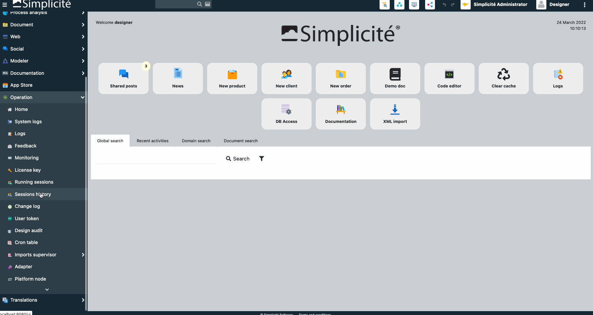

CSV -> XML Simplicité
====================

Demo
----



Adapter Code
------------

```java
package com.simplicite.adapters.Application;
import java.util.*;
import com.simplicite.util.integration.*;

public class SampleCsvToXmlAdapter extends CSVLineBasedAdapter {
	private static final long serialVersionUID = 1L;

	public String preProcess(){
		appendLog("Starting SampleCsvToXmlAdapter");
		// set CSV separator
		setSeparator(',');

		// to generate a subsequently imported XML, call super.preProcess()
		// doing so will add a starting <simplicite> tag
		return super.preProcess();
	}

	@Override
	public String processValues(long lineNumber, String[] values){
		appendLog("=== Processing line #"+lineNumber+" : "+Arrays.toString(values));

		StringBuilder xml = new StringBuilder();
		xml.append("\t<object>\n");
		xml.append("\t\t<name>DemoSupplier</name>\n");
		xml.append("\t\t<action>upsert</action>\n");
		xml.append("\t\t<data>\n");
		xml.append("\t\t\t<demoSupCode>"+values[0]+"</demoSupCode>\n");
		xml.append("\t\t\t<demoSupName>"+values[1]+"</demoSupName>\n");
		xml.append("\t\t</data>\n");
		xml.append("\t</object>\n");

		// returned String gets added to a XML subsequently imported.
		return xml.toString();
	}

	public void postProcess(){
		appendLog("End Process with status "+getStatus());
		// to generate a subsequently imported XML, call super.postProcess()
		// doing so will add a closing <simplicite> tag
		super.postProcess();
	}
}
```

CSV Input
---------

```csv
codeSupplierA,nameSupplierA
codeSupplierB,nameSupplierB
```

XML Output
----------

```xml
<?xml version="1.0" encoding="UTF-8"?>
<simplicite xmlns:xsi="http://www.w3.org/2001/XMLSchema-instance" xmlns="http://www.simplicite.fr/base" xsi:schemaLocation="http://www.simplicite.fr/base https://www.simplicite.io/resources/schemas/base.xsd">
	<object>
		<name>DemoSupplier</name>
		<action>upsert</action>
		<data>
			<demoSupCode>codeSupplierA</demoSupCode>
			<demoSupName>nameSupplierA</demoSupName>
		</data>
	</object>
	<object>
		<name>DemoSupplier</name>
		<action>upsert</action>
		<data>
			<demoSupCode>codeSupplierB</demoSupCode>
			<demoSupName>nameSupplierB</demoSupName>
		</data>
	</object>
</simplicite>
```
