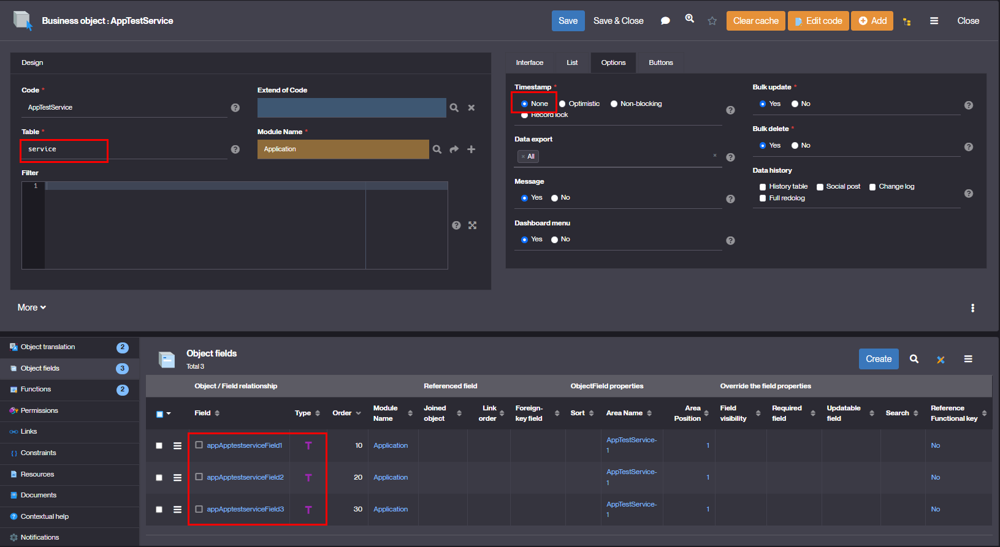
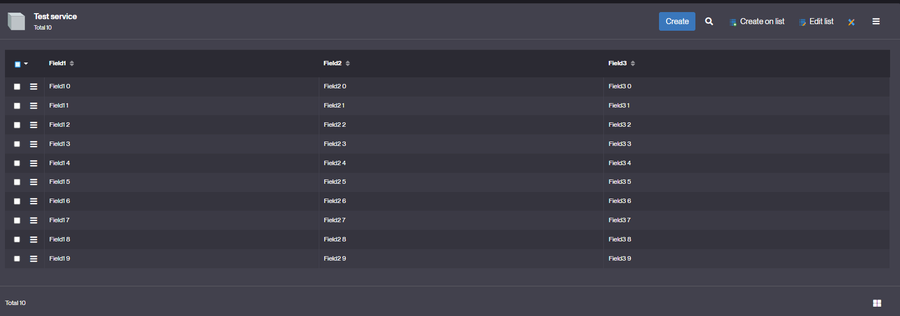

Custom service objects
======================

This document describes how to configure and implement a custom service objects.

A service obejct is a business object which interact with an remote service (e.g. a remote system API).

The `helper class `com.simplicite.util.ObjectService` offers a "framework" for implementing a such service object.

Minimalistic example
--------------------

Let's configure a minimal service object with 3 text fields:



This object is configured to be "list-only" (no form).

Then let's implement the following Java class for this object:

```java
package com.simplicite.objects.Application;

import java.util.ArrayList;
import java.util.List;

import com.simplicite.util.ObjectField;

public class AppTestService extends com.simplicite.util.ObjectService {
	private static final long serialVersionUID = 1L;

	public static final long NB_ROWS = 10;

	@Override
	public long countService() {
		return NB_ROWS;
	}

	@Override
	public List<String[]> searchService(boolean pagine) {
		List<String[]> rows = new ArrayList<>();
		for (int i = 0; i < NB_ROWS; i++) {
			String[] row = new String[getFields().size()];
			for (ObjectField f : getFields())
				row[f.getIndex(this)] = f.getDisplay() + " " + i;
			rows.add(row);
		}
		return rows;
	}
}
```

And here is the resulting list:



Note that, in all cases, the `countService` is called first by the generic UI, and then the `searchService`.

In some real-life cases cases there is no "count-only" capability offered by the remote service.
In such a case the actual "search" must be done done in the `countService` and served by the `searchService` like this:

```java
@Override
public long countService() {
	List<String[]> rows = new ArrayList<>();
	for (int i = 0; i < 10; i++) {
		String[] row = new String[getFields().size()];
		for (ObjectField f : getFields())
			row[f.getIndex(this)] = f.getDisplay() + " " + i;
		rows.add(row);
	}
	setCurrentList(rows);
	setParameter("COUNT_DONE", true);
	return rows.size();
}

@Override
public List<String[]> searchService(boolean pagine) {
	// Just in case the countService is not called called
	// This may be the case when using this object outside of the generic UI
	if (!getBooleanParameter("COUNT_DONE", false))
		countService();
	removeParameter("COUNT_DONE");

	return getCurrentList();
}
```

This basic case can be used as a minimalistic "boilerplate" for more advanced cases like a call to a JSON API with parsing/mapping, etc.
