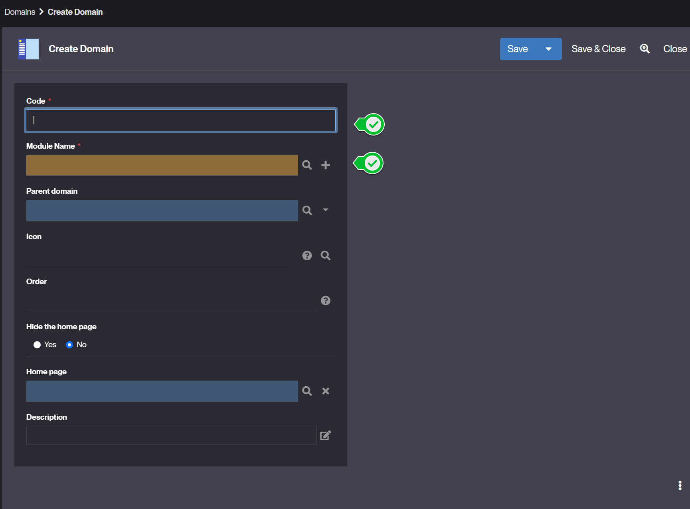
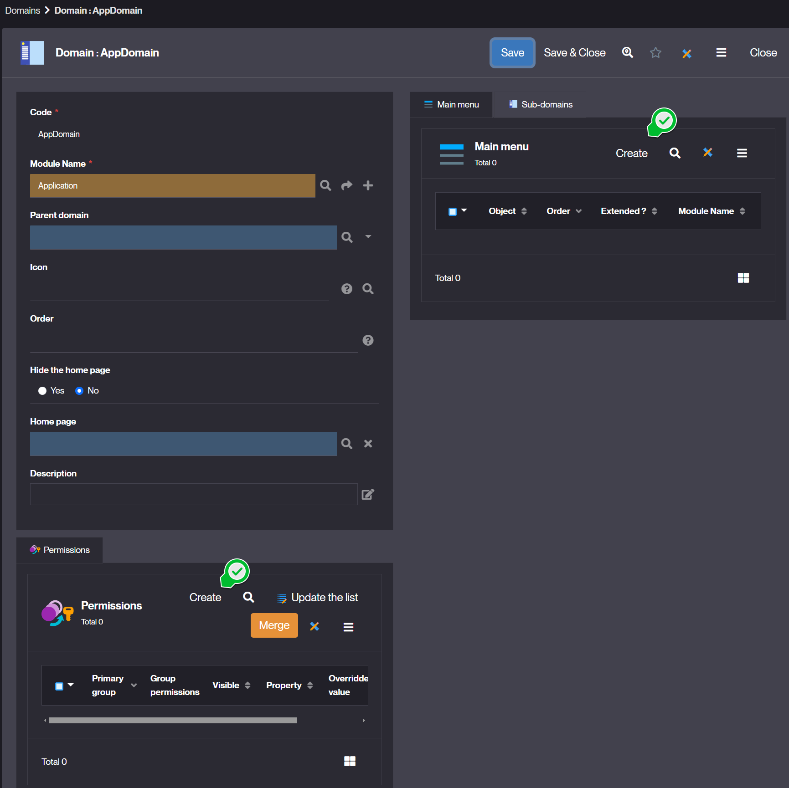

# Domains

## What is a Domain ?
In Simplicité, a Domain represents a menu in the user interface (UI). It allows users to navigate through different parts of the application by structuring access to business objects, processes, and other functionalities.  

## How to create a Domain ?

### Creating a Domain via the Module Creation Assistant 
When creating a Module, Simplicité’s Module creation assistant includes a step to create a Domain. This ensures that the Module has a visible entry in the UI menu.

1. Go to Project > Module and start creating a new Module by clicking on **Creation assistant** or from the Simplicité's home page click on **Start by creating a new module**.
2. During the process, the assistant will prompt for a menu (Domain) setup.
3. Define the Domain by specifying:
    - Domain code – The functional key of the domain.  
    - Parent Domain (if applicable) – Allows hierarchical menus.  
    - Module name – Define the [module](/make/project/module) to which it belongs. Defaults to the one currently being created.  
    - Icon – Customizes the menu’s appearance.
    - Order - order in the interface.   
    - Hide the home page - Domains can have Home page 
    - Description - to appear in generated documentation.  
Complete the module setup, and the menu will be automatically created.

### Manually Creating a Domain   

If a Domain was not created during module setup, you can manually add it later:

1. Go to Business objects > Domains.
2. Click **Create** a new Domain.
3. 
4. Fill in the required fields:
    - Domain Code – The functional key of Domain object.
    - Module name - Define the [module](/make/project/module) to which it belongs. 
    - Parent Domain (optional) – Defines a menu hierarchy.
    - Icon - Customizes the menu’s appearance.
    - Order - order the display of the domain in the menu. 
    - Hide the home page - No by default  
    - Home page - can be associated to a specific Home page. 
    - Description - to appear in generated documentation.  
Save the Domain and verify its appearance in the UI.
1. Managing Domain Access ([Permissions](/make/usersrights/permissions))  
Domains are only visible to users with the appropriate permissions.
Ensure the relevant Groups have access to the Domain.  

1. Associate Objects to the Domain by clicking on **create** in the header of Main menu list.  
The types of objects that can be included in a menu are : 
   - Business object
   - Business process 
   - Domain 
   - External object 
   - Simple view 