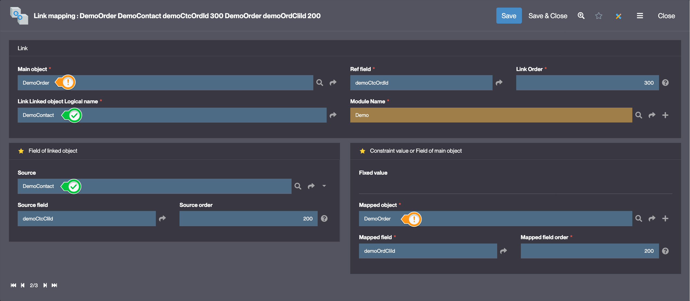

# Link Mapping

## What is a Link Mapping?

In **Simplicité**, a *Link Mapping* is a standard mechanism used to **filter or restrict selectable values in a relationship (link)** based on values already entered in a form.  
It allows you to define *context-sensitive filters* that dynamically limit choices in linked fields, improving user experience and enforcing business logic consistency.

This is typically configured on object **links** (foreign key or many-to-one references), where the available values in the target list must depend on another field value from the current object.

## When should a Link Mapping be used?

Use a Link Mapping when:

- You want to **dynamically filter a foreign key** based on a field already filled in the form.
- You need to **restrict the values** shown in a reference dropdown to only those that make sense in a given context.
- You want to implement **contextual filtering** without custom coding.

💡 *Example:* On a `Contact` form, once a `Customer` is selected, the `Order` dropdown should only display that customer's orders.  
This is achieved through a link mapping between the `DemoContact.demoCtcCliId` and `DemoOrder.demoOrdCliId`.

## How to configure a Link Mapping?

1. Go to **Business objects > Link mapping** or select the desired link in the modeler or going to **Business objects > Links**.
3. If you are on a Link go to the **Link Mapping** tab.
4. Click **Create** and configure:
   - **Source field** – The field of the linked object used as filter.
   - **Mapped field** – The field on the referenced object that should match the source field.

   

5. Save the link mapping.
6. Test the filtering behavior by filling the source field in the form – the referenced dropdown will update accordingly.

### Example

In the Simplicité Demo:

- On the `Contact` object, the `Order` only displays orders **belonging to the selected customer**.
- The link mapping restricts `DemoOrder.demoOrdCliId` to match `DemoContact.demoCtcCliId`.

## Custom Behavior with Hook

You can extend or override the default filtering logic using the hook:

```java
public void initRefSelect(ObjectDB parent) {
    // Custom filtering logic
}
