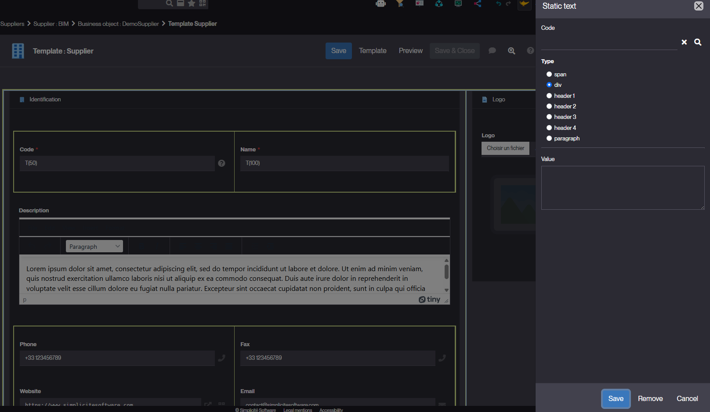
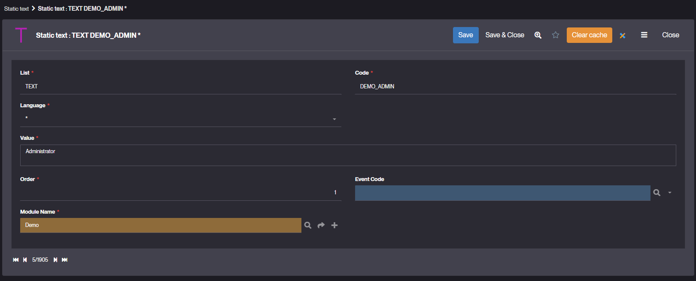

# Static Text

## What is a Static Text?
In Simplicité, a **Static Text** represents a block of text or HTML content that can be displayed in various parts of the application UI or logs. It is primarily used to present information, instructions, or custom content that remains fixed, without relying on application data or dynamic behavior.  

Static Texts can be embedded in views, forms, or logs to improve the user experience and provide contextual guidance or explanations that stay consistent regardless of the application's state or data.  

Additionally, Static Texts can serve as predefined message codes that can be referenced in the application logic. For example, you can call:  
```java
Message.formatSimpleInfo(getGrant().T("MY_MESSAGE"));
```


## How to create a Static Text ?

### Creating a Static Text via the UI  
You can create Static Texts directly in Simplicité’s template editor
  


Or 

1. Navigate to **Business objects > Static Text**.  
2. Click on **Create** to add a new Static Text.  

3. Fill in the following fields:
    - **List** – Always set to `TEXT`.  
    - **Code** – Unique identifier of the Static Text.  
    - **Language** – Language English, French and * for both.  
    - **Value** – Content to display.  
    - **Event Code** – (Optional) Used to trigger specific log events.  
    - **Order** – Controls display order when multiple Static Texts are present.  
    - **Module** – Define the [module](/make/project/module) to which the Static Text belongs.  
    
4. Save your Static Text.


## Managing Static Text Placement  

Static Texts can be displayed in different areas of the application:  
- **In Forms or Views** – Embedded within custom views or business object forms to provide contextual information or instructions.  
- **In Logs** – Added to application logs to include predefined text messages or contextual information.  




