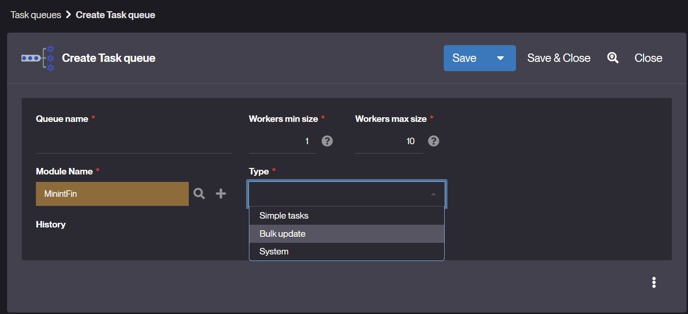
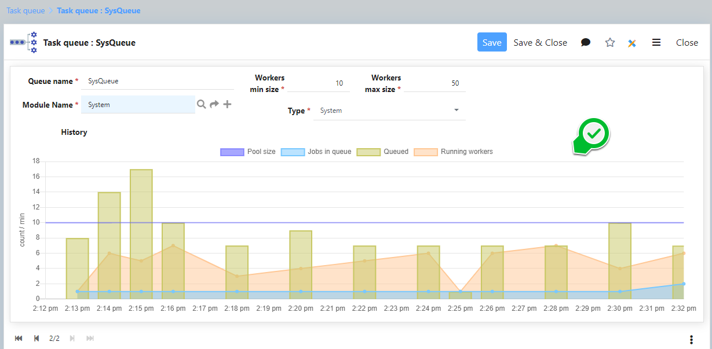

Task Queues
===========

Introduction
------------

As of Simplicité® version 6.0, the asynchronous task execution model introduces a more flexible **task queue system**, replacing the single worker pool from earlier versions.

This system allows separation between **application-level** and **system-level** background jobs, with the ability to define **custom queues** tailored to specific workload types and resource usage requirements.

Two default queues are provided:

- `AppQueue`: Handles user-defined asynchronous tasks
- `SysQueue`: Reserved for internal platform jobs

Custom queues can be created with configurable minimum and maximum worker thread pool sizes.

Configuration
-------------

You can create or configure task queues through the administration UI or via module definitions.

| Field              | Description                                                                 |
|--------------------|-----------------------------------------------------------------------------|
| Queue name         | Unique identifier for the task queue                                        |
| Module name        | Functional module the queue belongs to                                      |
| Workers min size   | Minimum number of worker threads                                            |
| Workers max size   | Maximum number of worker threads                                            |
| Type               | Type of queue workload: Simple tasks, Bulk update, or System                |
| History            | Displays runtime metrics (queue size, active threads, etc.) over time       |



Usage
-----

You can assign a queue to any:

- **Asynchronous Action**
- **Scheduled (Crontab) Job**

To push a job programmatically into a specific queue, use:

```java
JobQueue.push("queueName", "Job label", myRunnable, Thread.NORM_PRIORITY);
```

If no queue is specified, the job will be pushed to the default `AppQueue`.

Monitoring  
----------

A built-in **history and monitoring dashboard** tracks the evolution of each queue over time. The system stores the last **1,000 metrics** per queue, including:

- Queue size  
- Number of active workers  
- Timestamped metrics  

This information can help in diagnosing bottlenecks or adjusting thread pool configurations as needed.

> **Note**  
> Monitoring and queue management are accessible via the platform's administration UI.


Best Practices  
--------------

- **SysQueue** is reserved to internal platform tasks.  
- **AppQueue** is by default for your application jobs.  
- For heavy or time-sensitive jobs, define **custom queues** with adjusted thread limits.  
- Monitor queue metrics regularly to ensure proper job distribution and avoid worker starvation.  
- Avoid assigning too many jobs to the default queue to prevent delays in application-level async actions.
