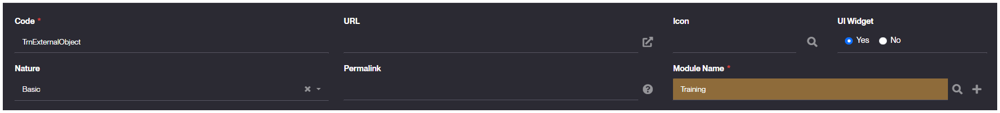
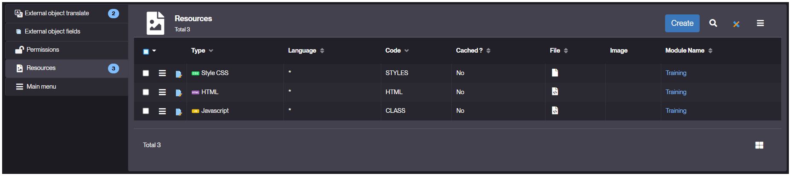

# Basic

## What is an External Objects ?

It is an object that allows for customized interactions and behaviors within Simplicité. They are objects that you will implement to serve specific needs.

In such objects you will be able to interact with Simplicité by using the [Ajax Library](https://platform.simplicite.io/current/jsdoc/index.html) to properly interact with the native part of your solution.

There are several types of *External Objects*, that all serve a certain use-case of type of need:
- Basic
- [UI page or component](/make/userinterface/externalobjects/uicomponent)
- [Web-page](/make/userinterface/externalobjects/webpage)
- JQuery web page
- [Static web site](/make/userinterface/externalobjects/staticsite)
- REST web service
- Mapped REST web service
- GraphQL web service
- PDF document
- Excel document
> We highly recommend you to choose the adapted nature for your external object in order to ensure its proper integration and workflow.

The most used are:
- **Basic:** to create all type of elements, but mostly to handle external objects that should be accessible both in **public** & **private** zones (outside or inside of Simplicité's interfaces).
- **UI page or component:** to create *widgets* that can be embedded in any [Dashboard](/make/userinterface/views/dashboard) or any **View**.
- **Web-page:** to create components rendered exclusively in the *public* zone as standalone pages still interacting dynamically with a Simplicité's instance.
- **Static web site:** to create standalone webpages that are not interacting with any Simplicité's instance.

### Structure

All **External Objects** are organized as web elements, thus are composed of 3 [resources](/make/userinterface/resources):
- **HTML** is the resource containing the *html* code of your object that defines its core structure and organization.
- **STYLES** is the resource containing the stylesheet (*css* or *less*) associated with your object's HTML.
- **CLASS** is the resource with the javascript file inside of which you will code the behaviors and interactions for your External Object.

And in addition, all external objects works with a **Java Class** that ensures both their proper setup, and the rendering of the web resources.

The **Basic** nature refers directly to the mother class `com.simplicite.util.ExternalObject` while each one of the other mentioned *Nature* above refers to a specific class in the `com.simplicite.webapp` package:
| Nature | Java Class |
| ------ | ----------- |
| UI page or component | *web.ResponsiveExternalObject* |
| Web-page | *web.WebPageExternalObject* |
| JQuery web page | *web.JQueryWebPage* |
| Static web site | *web.StaticSiteExternalObject* |
| REST web service | *services.RESTServiceExternalObject* |
| Mapped REST web service | *services.RESTMappedObjectsExternalObject* |
| GraphQL web service | *services.GraphQLExternalObject* |
| PDF document | *documents.PDFDocumentExternalObject* |
| Excel document | *documents.ExcelDocumentExternalObject* |

## How to create

1. Go to the *User Interface > External objects > Show all* menu
2. Click **Create** in the panel's header.
3. Properly fill the *Create External object* form:
    - **Code** for your external object's name.
    - **Nature** shall be **Basic**.
    - **Module Name** for the module containing your external object.
    - **UI Widget** to **Yes** if your object can be added to a [dashboard](/make/userinterface/views/dashboard) and **No** otherwise.
    > Example values:
    > 
4. Click **Save**.
5. Click **Create Resources** to create the web-resources (html|css|js) for your object.


6. (optional) Click **Edit Code** to generate the custom java class for your object.
    <details>
    <summary>Default java code</summary>

    ```java
    package com.simplicite.extobjects.Training;

    import java.util.*;

    import com.simplicite.util.*;
    import com.simplicite.util.exceptions.*;
    import com.simplicite.util.tools.*;

    /**
     * Basic external object TrnExternalObject
     */
    public class TrnExternalObject extends com.simplicite.util.ExternalObject {
        private static final long serialVersionUID = 1L;

        // Note: instead of this basic external object, a specialized subclass should be used

        /**
         * Display method
         * @param params Request parameters
         */
        @Override
        public Object display(Parameters params) {
            try {
                // Call the render Javascript method implemented in the SCRIPT resource
                // ctn is the "div.extern-content" to fill on UI
                return javascript(getName() + ".render(ctn);");
            }
            catch (Exception e) {
                AppLog.error(null, e, getGrant());
                return e.getMessage();
            }
        }
    }
    ```
    </details>

7. Click **Save** and your object is ready to be implemented.

## Configuration

| Field | Description |
| ----- | ----------- |
| Code | External Object's unique identifier |
| Nature | Type of the External Object, here **UI page or component** |
| Source Code | Java code for customized server-side behaviors |
| Class | Extended class for the Java code, here `com.simplicite.webapp.web.ResponsiveExternalObject` |
| Icon | External Object's logo |
| UI Widget | Indicates if this element shall be considered as a *Widget* or not. |

## Read More

**Tips & Advices**
- [Javascript Development](/docs/front/javascript-dev).
- [Ajax Library](/docs/front/lib-ajax).

**Details & Specificities**
- [Web Pages](/docs/front/web-page) with "Basic" Nature.
- [Code examples](/docs/front/ui-component) for *"UI component"* (walkthrough).