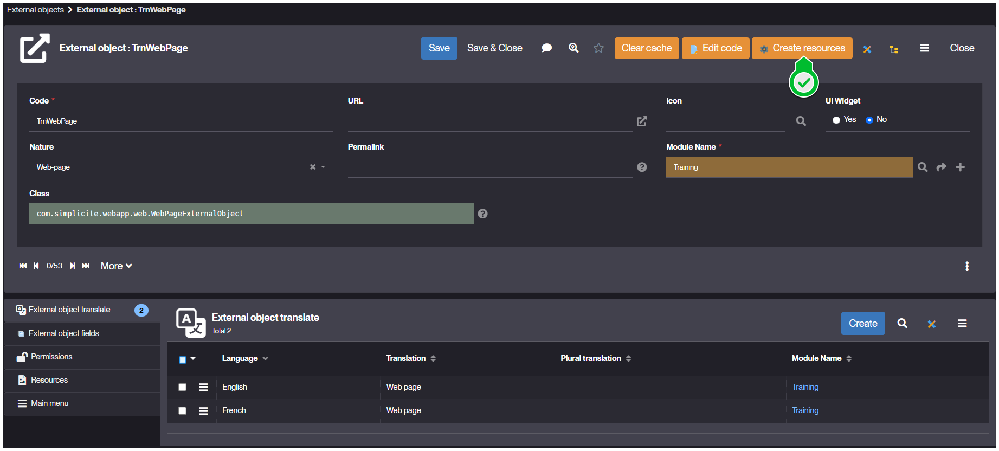
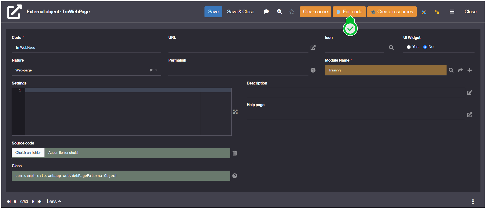

# Web Page

## What is a Web Page ?

A **Web Page** in Simplicité, is a type of [External Object](/make/userinterface/externalobjects/basic) that aims to be rendered as an interactive standalone page. Thus it is free of any peculiar interface constraints, and is supposed to be accessible to any user.

The specificity (which differentiates it from a [Static Web Site](/make/userinterface/externalobjects/staticsite)) is that such object is allowed and meant to interact with Simplicité's backend.

External objects of this type are exclusively rendered in the *public zone*, which means they can't be embedded within Simplicité's interfaces and are thus meant to be rendered at `https://<your-instance-name>/ext/<object-name>`, defaulty accessible to any user.
> If you want objects that can also be rendered in the *private zone*, you should use the [Basic](/make/userinterface/externalobjects/basic) nature for you *External Object*, and ensure to adapt the *Java Code* in adequation.

## How to create

The creation process is similar to the one for any *External Object*:

1. Go to *User Interface > External Objects > Show all*, and then click **Create**

2. During the form's filling, ensure you select *Web Page* as **Nature**.
    - **UI Widget** should be set as **No**
    - Ensure you assign the right **Module Name** for your object.
    > Example values:
    > 

3. Click **Save**.




4. From the updated object's form, click **Create Resources** to create the web [Resources](/make/userinterface/resources).
    - Ensure **CLASS** **HTML** and **STYLES** well appear in the *Resources* tab.
    > Created Resources:
    > 




5. Finally, click **Edit Code** to create the custom *Java class* code for your object.
    - You should see the **Class** field empty.
    - **Source Code** field should have the `<your-object-code>.java` file referenced.
    > Result Form:
    > 


The code for your webpage shall look like this by default:

```java
package com.simplicite.extobjects._; // replace _ with <module-name>

import java.util.*;

import com.simplicite.util.*;
import com.simplicite.util.exceptions.*;
import com.simplicite.util.tools.*;

/**
 * Standalone basic web page external object _
 */
public class _ extends com.simplicite.webapp.web.WebPageExternalObject { // replace _ with <object-code>
	private static final long serialVersionUID = 1L;

	/**
	 * Body part of the page
	 * @param params Request parameters
	 */
	@Override
	public String displayBody(Parameters params) {
		try {
			// Call the render Javascript function implemented in the SCRIPT resource
			return javascript(getName() + ".render();");
		}
		catch (Exception e) {
			AppLog.error(null, e, getGrant());
			return e.getMessage();
		}
	}
}

```
## Usage

Using *Web Page* external objects, you have two logics to implement:

1. **Client-Side logic:** using the created web-resources, implement your object as you would for any native web-page.
    - **HTML:** holds the content of your page, embedded in a `<div id="bs-main" class="container">...</div>`, and accessible from scripts by `const $content = this.ctn;`.
    - **STYLES:** where you define the stylesheet declaring all styles for your component. Using either CSS or LESS syntax.
    - **CLASS:** the javascript file where you declare all of your component's behavior and interactions, within the `async render(){ ... }` method. Which you can refine or extend by using server-side logic by calling `this.server()` that references a custom method in the *Java Code*.

2. **Server-Side logic:** here is defined your object's instantiation and global setup, in a class extending `com.simplicite.webapp.web.WebPageExternalObject`.
    - Most of it is declared within the `public Object displayBody(Parameters params){ ... }`.
    - Your page is rendered by referencing the **CLASS** resource through `javascript(getName() + ".render();");`
    - **Other Possible Structure**
        - Your page is implemented using the `com.simplicite.webapp.web.BootstrapWebPage` class with `new BootstrapWebPage(params.getRoot(), getDisplay())`.
        - Your **CLASS** javascript code is called using `String render = getName() + ".render(params.toJsonObject().toString())"` then `wp.setReady(render)` and `return wp.toString()`.
        - You can pass other types of resources to your *client-side* scripts by putting them into the `params` variable that you pass to `String render` as follows; `params.toJSONObject().put("<usableName>", HTMLTool.getResourceImageUrl(this, "<resource-name>"))`.
        - It's also here that you load your web-resources using the **BootstrapWebPage** embedded methods:
			- **CLASS** with `BootstrapWebPage.appendJSInclude(HTMLTool.getResourceJSURL(this, "CLASS"))`
			- **STYLES** with `BootstrapWebPage.appendCSSInclude(HTMLTool.getResourceCSSURL(this, "STYLES"))`
			- **HTML** with `BootstrapWebPage.append(HTMLTool.getResourceHTMLContent(this, "HTML"))`.

<details>
<summary>Code Example</summary>

```java
@Override
public Object display(Parameters params) {
	// Bootstrap page
	BootstrapWebPage wp = new BootstrapWebPage(params.getRoot(), getDisplay());

	wp.appendAjax(true);

	wp.appendJSInclude(HTMLTool.getResourceJSURL(this, "CLASS"));
	wp.appendCSSInclude(HTMLTool.getResourceCSSURL(this, "STYLES"));
	wp.appendHTML(HTMLTool.getResourceHTMLContent(this, "HTML"));

	JSONObject p = params.toJSONObject();

    String imageResource = HTMLTool.getResourceImageURL(this, "IMAGE");

    p.put("customImage", imageResource); // Add IMAGE image to params

	wp.setReady(this.getName() + ".render(" + p.toString() + ");");

	return wp.toString();
}
```
</details>

## Read More

**JavaDoc links**
- [BootstrapWebPage](https://platform.simplicite.io/current/javadoc/com/simplicite/webapp/web/BootstrapWebPage.html)
- [WebPageExternalObject](https://platform.simplicite.io/current/javadoc/com/simplicite/webapp/web/WebPageExternalObject.html)

**Other Lessons**
- [Resources](/make/userinterface/resources)
- [Static Web Sites](/make/userinterface/externalobjects/staticsite)

**JS Dev**
- [Javascript Development](/docs/front/javascript-dev).
- [Ajax Library](/docs/front/lib-ajax).