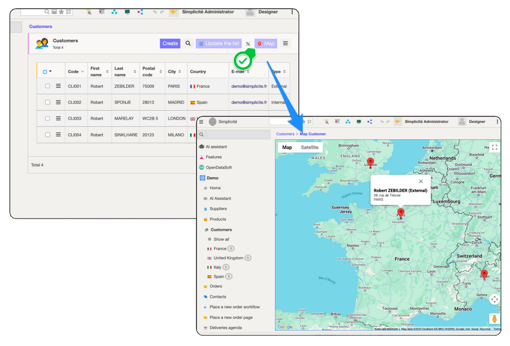

# Place Map

Place Maps are a way to easily show geolocated objects on a Google Map : 



## Configuration

Make sur you have the prerequisites:
- update the `GOOGLE_API_KEY` system parameter after [generating it with a Google Account](https://developers.google.com/maps/documentation/javascript/get-api-key)
- have a **geographical coordinates attribute** setup on your object (if working with an adress, you might have to use some tool to transform the address into coordinates, see the following example from the demo using a google maps tool and also requires a working Google API key)

And proceed to configure the placemap. You can configure up to 3 labels that will show up when clicking on a pin, the first one being considerend a title.

## Geocoding address

```java
/** Hook override: geo-locate from address fields */
@Override
public String preSave() {
    if (isMainInstance()) { // Only done for the main UI instance
        try {
            // Geocode address fields
            ObjectField coords = getField("demoCliCoords");
            ObjectField a1 = getField("demoCliAddress1");
            ObjectField a2 = getField("demoCliAddress2");
            ObjectField zc = getField("demoCliZipCode");
            ObjectField ci = getField("demoCliCity");
            ObjectField co = getField("demoCliCountry");

            if (coords.isEmpty() || a1.hasChanged() || a2.hasChanged() || zc.hasChanged() || ci.hasChanged() || co.hasChanged()) {
                String a = a1.getValue() + (a2.isEmpty() ? "" : ", " + a2.getValue()) + ", " + zc.getValue() + ", " + ci.getValue() + ", " + co.getValue();
                Location c = new GMapTool(getGrant()).geocodeOne(a);
                coords.setValue(c == null ?  "" : c.toString());
            }
        } catch (Exception e) {
            AppLog.warning(null, e, getGrant());
        }
    }
    return super.preSave();
}
```