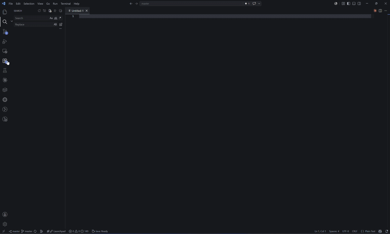
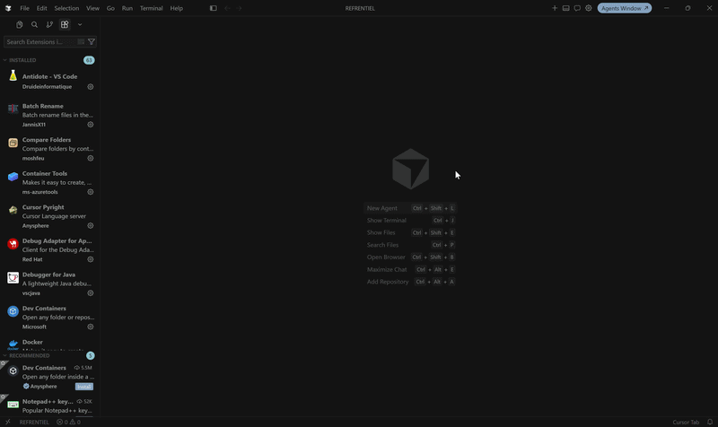
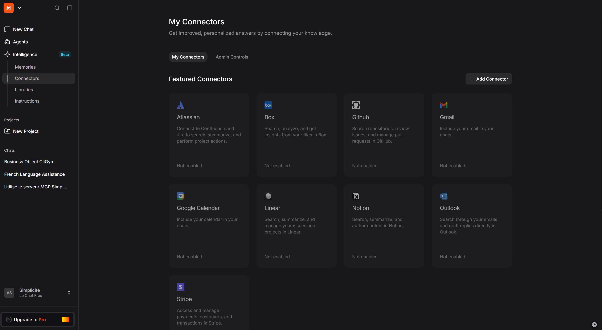
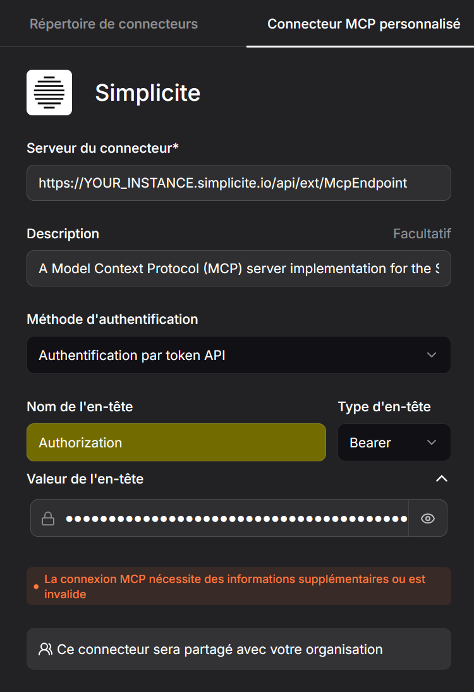

:::danger[Warning]
The Simplicite MCP Server is a [v7 feature](../../versions/release-notes/v7-0.md). It is still in **ALPHA**, features will be added and improved
This documentation is also in its early redaction stage.
:::

MCP Server
==========

An MCP Server is a lightweight bridge that exposes an application's capabilities as a set of callable tools, following the Model Context Protocol.
In Simplicité's case, this means any MCP-compatible LLM can connect to a running Simplicité instance and interact with it autonomously:
exploring a module's structure, reading and writing business objects, managing records, and even editing server-side Java code,
all through natural-language requests instead of manual configuration or scripting.

Presentation
----------

The Simplicité MCP Server exposes a set of tools to any compatible LLM, organized into three categories, enabling it to interact with a Simplicité
 application autonomously.

Discovery tools (get_ai_doc, get_md_documentation, find_object_by_name) let the LLM navigate a module: understand its structure, identify business
objects, and orient itself before acting.

Manipulation tools cover standard CRUD operations as well as designer-oriented functions such as set_object_code, edit_object_code,
and add_fields_to_object, which allow direct modification of a business object's configuration or code.

Finally, get_skill is the contextualization tool: it loads a targeted prompt into the LLM's context based on the nature of the request.

| Tool | Category | Description |
| :--- | :--- | :--- |
| `get_ai_doc` | Discovery | Compact, LLM-optimized documentation for a module, object, or enum (fields, states, actions, hooks). Preferred over `get_md_documentation`. |
| `get_md_documentation` | Discovery | Human-readable Markdown description of a module. More verbose than `get_ai_doc` — use only when more detail is needed. |
| `get_physical_mapping` | Discovery | Physical database mapping of a module. |
| `get_openapi` | Discovery | Full OpenAPI 3.x spec for a module. Use only when API endpoint details are needed. |
| `find_object_by_name` | Discovery | Resolves a user-friendly name to the technical object code. Call first when the technical name is uncertain. |
| `get_object_code` | Designer | Retrieves the full Java source of a business object. Always call before editing. |
| `set_object_code` | Designer | Replaces the full Java source of a business object. |
| `edit_object_code` | Designer | Targeted search-and-replace on a business object's Java source. Preferred over `set_object_code` for partial edits. |
| `add_fields_to_object` | Designer | Adds fields to a business object (idempotent). Handles field, object-field link, and translations in a single call. |
| `count_records` | CRUD | Counts records for a business object with optional filters. |
| `search_records` | CRUD | Searches records and returns JSON with `row_id` values. |
| `create_records` | CRUD | Creates one or more records in a single call, with optional translations. |
| `update_record` | CRUD | Updates an existing record by `row_id`. |
| `delete_record` | CRUD | Deletes a record (irreversible). |
| `call_action` | CRUD | Invokes a business logic action on an object or record. Prefer over manual field updates when an action exists. |
| `get_skill` | Contextualization | Loads a targeted business prompt into the LLM's context based on the request type. Requires the `MCP Server` module. |

Intended Workflow
--------

To interact effectively with Simplicité, the LLM should follow this lifecycle:

1. **Discovery**:
   - Call `get_ai_doc(name, type="module")` to explore a module's objects, then `get_ai_doc(name, type="object", sections=[...])`
   to get fields, states, actions, or hooks for a specific object. Fall back to `get_md_documentation` only if more detail is needed.
   - To create or edit Java logic, first call `get_object_code` to read the current source,
   then use `edit_object_code` for targeted changes or `set_object_code` for full rewrites.
2. **Identification**:
   - If the technical object name is uncertain, resolve it with `find_object_by_name` first.
   - Use `search_records` with filters to locate specific records and retrieve their `row_id`.
3. **Operation**:
   - Create objects with `create_records` (supports batch + translations in one call).
   - Add fields with `add_fields_to_object` (idempotent — safe to re-run).
   - Update or delete individual records with `update_record` / `delete_record` using the `row_id` from step 2.
   - Trigger business logic with `call_action` rather than manual field updates when an action exists for the operation.

Guiding the LLM towards best practices
-------

In theory, an LLM could handle any request by freely combining discovery and manipulation tools. In practice, Simplicité often offers several ways to
accomplish the same thing — and without guidance, the LLM may take incorrect paths or produce inconsistent, even non-functional results.

Skills solve this problem. Each skill is a targeted prompt that gives the LLM the right approach for a given type of request,
avoiding the trial-and-error exploration phase.

To use get_skill, the MCP Server module must be installed from the AppStore (under Tools). This module exposes a McpPrompt object that stores skills.
A starter dataset is provided, covering mainly maker needs (BUSINESS_OBJECT_CREATION, CROSSTAB, STATE_MODEL_CREATOR, etc.),
along with a business skill example — CRM_CONTACTS, an agent that fills in demo contacts from a customer request written in natural language.

Improving over time
--------

When an LLM handles a request, it either succeeds on the first try or requires several attempts.
In the latter case, it is asked to write the skill itself for that type of request.
The skill is then stored in McpPrompt and becomes immediately available for all similar requests going forward.
The system therefore becomes more reliable the more it is used.

Built-in server configuration
---------------

The MCP endpoint is exposed as a servlet at:

```text
YOUR_URL/mcp
```

:::warning

To expose it, the `FEATURE_FLAG` `System Parameter` needs to be updated:

```json
{
	"mcp_server": true
}
```

:::

### For Visual Studio Code Copilot



`Extensions --> MCP Servers --> Show Configuration (JSON)`

Enter `http://your_url/mcp` (or `https://your_instance.simplicite.io/mcp`)

VSC should then open `something_something/AppData/Roaming/Code/User/mcp.json`

The json needs to be updated to handle authorization.
Since OAuth2.1 is currently not supported by Simplicité, HTTP transport is bridged to STDIO using `@nimbletools/mcp-http-bridge`.

```json
{
 "servers": {
     "SimpliciteServer": {
    			"description": "Access to a Simplicité instance with user rights",
    			"command": "npx",
				"args": [
				"-y",
				"@nimbletools/mcp-http-bridge",
				"--endpoint",
				"YOUR_ENDPOINT/mcp",
				"--token",
				"YOUR_TOKEN"
				]
  		}
 },
	"inputs": []
}
```

### For Cursor



### For Claude Desktop/Claude Code

`Claude Desktop --> Settings --> Developer --> Edit Config --> claude_desktop_config.json`

```json
{
  "mcpServers": {
    "simplicite": {
      "description": "Access to a Simplicité instance with user rights",
        "command": "npx",
        "args": [
          "-y",
          "@nimbletools/mcp-http-bridge",
          "--endpoint",
          "YOUR_ENDPOINT/mcp",
          "--token",
          "YOUR_TOKEN"
          ]
      }
  }
}
```

:::tip[]

When using Claude, be careful to alloww the tools initialisation, instead of tools discovery
This will allow a better contextualization.

:::

### For Gemini CLI

Gemini CLI supports HTTP transport natively. The server can be added using the following command:

```bash
gemini mcp add "Simplicité Java MCP Server" http://YOUR_URL/mcp --transport http --header "Authorization: Bearer YOUR_TOKEN"
```

Or by manually editing `.gemini/settings.json`:

```json
{
  "mcpServers": {
    "Simplicité Java MCP Server": {
      "url": "http://YOUR_URL/mcp",
      "type": "http",
      "headers": {
        "Authorization": "Bearer YOUR_TOKEN"
      }
    }
  }
}
```

:::warning

A Pro plan is required to add a custom remote connector.

:::

### For Mistral Vibe

:::warning

Only a remote instance can be added to Mistral.

:::

:::warning

Organization admin rights are required to add a custom connector.

:::

:::warning

The connector is shared through the organization with the given configuration. If EVERYONE in the Organization should not have access to the tools in
the given instance with the given rights, **DO NOT ADD IT**.

:::

`Intelligence --> Connector --> Add Connector`





Testing
-------

Testing the tools relies on [MCP Inspector](https://modelcontextprotocol.io/docs/tools/inspector).

In a terminal:
`npx @modelcontextprotocol/inspector`

Select `Streamable HTTP` as Transport Type

Select `YOUR_URL/mcp` as URL

In `Authentification`, select `Custom headers` and enter:

```json
{
  "Authorization": "Bearer YOUR_USER_TOKEN"
}
```
