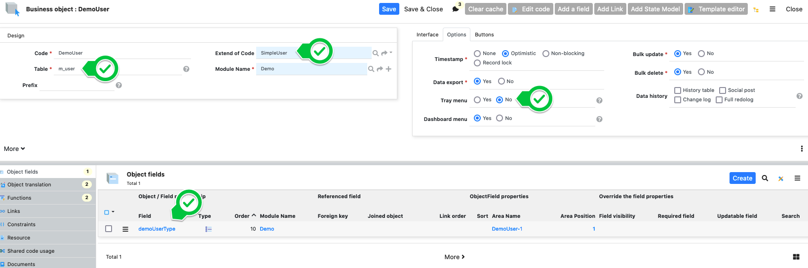
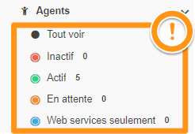

Custom User Object
==================

An out-of-the-box Simplicité comes pre-installed with a `User` object, to which the authentication mechanisms are tied. When building an application,
you'll eventually come to the point where you either need to:

1. add custom business data to the user (maybe its department, or employee number, etc)
2. make the user list available to admins
3. link the user to your business objects

The simplest option to fulfill those needs would be to simply use the `User` object and:

1. add fields to the `User` object
2. add the simplicité user administration group (`USER_ADMIN`) as a profile of your own admin group
3. link your business objects directly to the `User` object

While this is the easiest way to configure user management, it has some serious drawbacks:

- you'll have to override the `User` template to add in your fields and customize it
- you'll be stuck with a collection of Simplicité-specific fields that you don't want your admin group to see / deal with
  (language, home page, module, menu visibility, home phone, etc)
- you might not want to use Simplicité's user domain nor scope, which will be available once you grant the `USER_ADMIN` group
- you might not want your admins to use Simplicité's group system (for example if groups are automatically granted depending
  on the user's function in a business entity)
- etc.

That's why Simplicité provides `SimpleUser`, a minimal version you can extend, just as `User` does.

Configuration
-------------

In order to use a custom user object, it is necessary to create an **inheritor** of the platform `SimpleUser` object. Create an object,
like you would do normally, but then specify the following :

- **ObjectName:** `<your_custom_name>`
- **Extend of Code:** SimpleUser
- **Table:** m_user _(it will NOT respect the syntax rule, you can ignore the warning in this case)_
- **Tray Menu:** no
- add a "type" enum attribute (you can do that via using the template editor, as you'd do normally)



Custom code
-----------

The following code is added to the object to make it **really minimalistic** by hiding most of SimpleUser's fields and automating group attribution.
Add and adapt the following code to your use case:

- the package name
- the class name
- the group / type correspondence in the `postSave`

```java
package com.simplicite.objects.SimFeatures;

import java.util.*;

import com.simplicite.util.*;
import com.simplicite.util.exceptions.*;
import com.simplicite.util.tools.*;

/**
 * Business object FtCustomUser
 */
public class FtCustomUser extends com.simplicite.objects.System.SimpleUser {
    private static final long serialVersionUID = 1L;

    @Override
    public void postLoad() {
        super.postLoad();
        // hide most of the SimpleUser fields, keeping only email & login
        getField("usr_first_name").setVisibility(ObjectField.VIS_HIDDEN);
        getField("usr_last_name").setVisibility(ObjectField.VIS_HIDDEN);
        getField("usr_image_id").setVisibility(ObjectField.VIS_HIDDEN);
        //getField("usr_email").setVisibility(ObjectField.VIS_HIDDEN);
        getField("usr_lang").setVisibility(ObjectField.VIS_HIDDEN);
        getField("usr_cell_num").setVisibility(ObjectField.VIS_HIDDEN);
        getField("usr_active").setVisibility(ObjectField.VIS_HIDDEN);
        getField("usr_home_id").setVisibility(ObjectField.VIS_HIDDEN);
        getField("row_module_id").setVisibility(ObjectField.VIS_HIDDEN);

        // hide all users that were not created through this object
        setDefaultSearchSpec("ft_usr_type is not null");

        // hide states menu
        setMenuStates(false);
    }

    @Override
    public List<String> preValidate() {
        // set some mandatory SimpleUser fields
        setFieldValue("row_module_id", ModuleDB.getModuleId("ApplicationUsers"));
        // following does not work because usr_menu is not part of SimpleUser
        // This is managed in a postSave query to avoid adding a useless object field
        // setFieldValue("usr_menu", "1");
        setFieldValue("usr_active", Grant.USER_ACTIVE);

        return super.preValidate();
    }

    @Override
    public String postSave() {
        autoRespAttribution(getRowId(),getFieldValue("ftUsrType"));

        // meh practice... query instead of adding usr_menu attribute to objet
        getGrant().update("update m_user set usr_menu='1' where row_id="+getRowId());
        return super.postSave();
    }

    /**
     * customize depending on specific business rules,
     */
    private static void autoRespAttribution(String userId, String userType){
    	List<String> groups = new ArrayList();
        switch(userType){
            case "FT_ADMIN": groups.add("FT_ADMIN"); break;
            case "FT_READ": groups.add("FT_READ"); break;
        }
        setRespList(userId,groups);
    }

    private static void setRespList(String userId, List<String> newGroupsList){
        List<String> oldGroupsList = getRespList(userId);
        // remove old unused groups
        for(String oldGroup : oldGroupsList)
            if(!newGroupsList.contains(oldGroup))
                Grant.removeResponsibility(userId, oldGroup);
        // add new missing groups
        for(String newGroup : newGroupsList)
            if(!oldGroupsList.contains(newGroup))
                Grant.addResponsibility(userId, newGroup, Tool.getCurrentDate(), null, true, "ApplicationUsers");
    }


    private static List<String> getRespList(String userId){
        if(Tool.isEmpty(userId))
            return null;
        Grant g = Grant.getSystemAdmin();
        String[] groups = g.queryFirstColumn("select distinct g.grp_name from m_resp r inner join m_group as g on r.rsp_group_id=g.row_id where r.rsp_login_id="+userId);
        return groups!=null && groups.length>0 ? Arrays.asList(groups) : new ArrayList<String>();
    }
}

```

---

### Hiding states menu

To hide the states menu, use `setMenuStates(false);` in the `postLoad` hook.



### Password Reset

To give your user administrators the ability to manually reset a user's password:

- CustomUser
  - "Functions" panel > create
    - name: resetPassword
    - type: action
    - actionName > select existent > "resetPassword"
