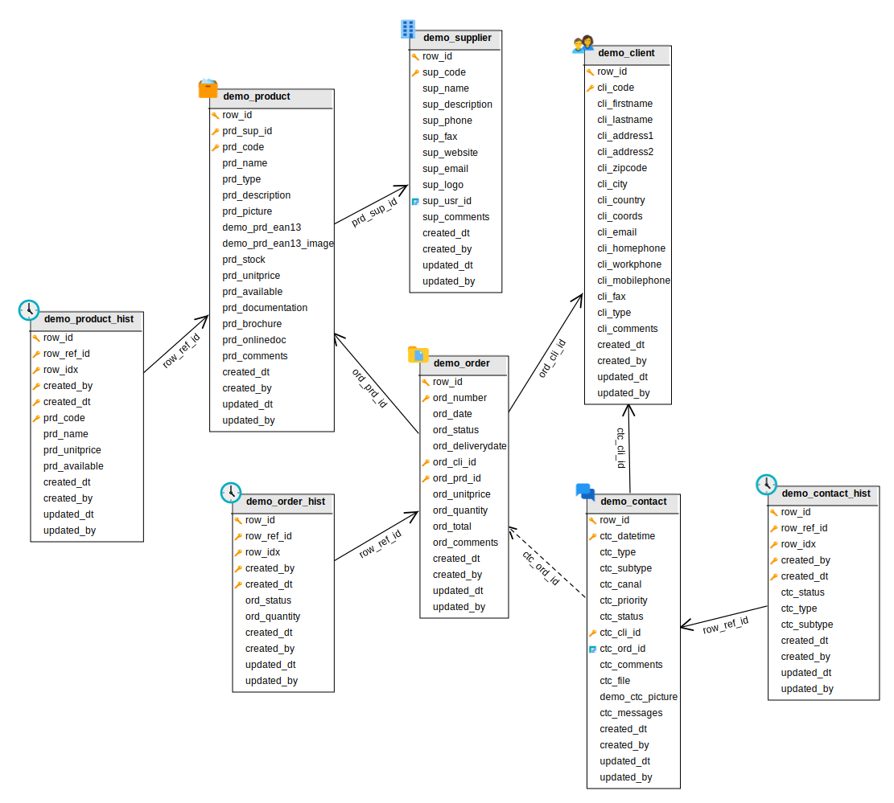

Databases
=========

MySQL 5.x / MariaDB
--------------------

### JDBC driver

With MySQL version 5.x / MariaDB, you **must** use a 5.x JDBC Driver.

### Connecting over SSL

Some MySQL 5.x / MariaDB servers must be accessed over SSL, in such a case some additional arguments are needed:

Connecting from the command line:

```text
mysql --protocol=tcp --ssl-mode=REQUIRED --host=<host> --port=<port> --database=<database> --user=<username> --password=<password> [--default-character-set=utf8]
```

JDBC URL:

```text
jdbc:mysql://<username>:<password>@<host>:<port>/<database>?autoReconnect=true&verifyServerCertificate=false&useSSL=true&requireSSL=true[&useUnicode=yes&characterEncoding=utf8&characterResultSets=utf8]
```

### Maximum packet size

You need to check and increase if needed the `max_allowed_packet` settings to be compliant with your requirement, a good minimal value is `16M`.
If you are using BLOBs for files you should set it accordingly to the maximum size of files you are supposed to handle.

### Limitations

MySQL 5.x / MariaDB have a limit of 64Kb per records (except LOBs columns)

MySQL 8.x
---------

### JDBC driver

With MySQL version 8.x, you **must** use a 8.x JDBC Driver.

### Datasource configuration

You will have to alter your `META-INF/context.xml` manually to use the new driver class `com.mysql.cj.jdbc.Driver` (instead of the deprecated `com.mysql.jdbc.Driver`)

You will also need to add an explicit time zone to your database JDBC URL, e.g. `&amp;serverTimezone=Europe/Paris`

PostgreSQL
----------

### Backslashes

Beware backslashes treatment in PostgreSQL  :

Before PostgreSQL 9.1, the configuration variable `standard_conforming_strings` was turned `off` by default.
That's why PostgreSQL did not treat backslashes literally but interpreted them.

But according to SQL standard, backslashes should be treated literally. So, from PostgreSQL 9.1,
the `standard_conforming_strings` config variable has been turned `on`.

If you want your code be portable between different database engines, you may want to have this config variable turned on.
So if you're on PostgreSQL 9.0 or lower :

```sql
alter database YOUR_DB set standard_conforming_strings=on;
```

An other means is to use the E PostgreSQL specific prefix to construct a literal query regardless server or connection configuration like `standard_conforming_strings`.

Example :

```text
set standard_conforming_strings to true;

select 'hop\'';
hop\'

select E'hop\'';
hop'
```

```text
set standard_conforming_strings to false;

select 'hop\'';
hop'

select E'hop\'';
hop'
```

### Case sensitive search

By default PostgreSQL does not provide case-insensitive search match when using standard `LIKE` comparator.

Active maintenance releases of Simplicité now use by default the non standard `ILIKE` comporator.

See [this document](https://www.postgresql.org/9.6/static/functions-matching.html) for details.

### Database linking

PostgreSQL 9.6+'s extension module `postgres_fdw` allows you to link a remote database into a local database.

To do so, connect to the local database as the `postgres` super administrator:

```text
sudo su - postgres -c "psql -d <local database name>"
```

Then issue the following commands:

```text
CREATE EXTENSION postgres_fdw;
CREATE SERVER <arbitrary remote server name> FOREIGN DATA WRAPPER postgres_fdw OPTIONS (host '<remote host name or IP>', port '<remote port>', dbname '<remote database name>');
CREATE USER MAPPING FOR CURRENT_USER SERVER <arbitrary remote server name> OPTIONS (user '<remote username>', password '<remove password>');
CREATE USER MAPPING FOR <local username> SERVER <arbitrary remote server name> OPTIONS (user '<remote username>', password '<remove password>');
CREATE SCHEMA <arbitrary local schema name>;
IMPORT FOREIGN SCHEMA <remote schema name, e.g. public> FROM SERVER <arbitrary local server name> INTO <arbitrary local schema name>;
GRANT USAGE ON SCHEMA <arbitrary local schema name> TO <local username>;
GRANT <ALL PRIVILEGES|SELECT> ON ALL TABLES IN SCHEMA <arbitrary local schema name> TO <local username>;
```

Use `ALL PRIVILEGES` for read+write access, `SELECT` for read-ony access.

Then after connecting as local user to local database:

```text
PGPASSWORD=<local password> psql -h <local host> -p <local port> -U <local username> -d <local database>
```

you can access remote tables like this `select * from <arbitrary local schema name>.<remote table name>;`

:::note
You can only import some of the remote schema's tables by appending `LIMIT (<remote table name 1>, <remote table name 2>, ...)`
to the above `IMPORT FOREIGN SCHEMA` statement. Of course you can use other linking strategies depending on your requirement.
:::

Oracle
------

### Limitations

- Varchars are limited to 4000, over 4000 Simplicité generates CLOBs columns (that are, thus, not indexable)
- Tables, aliases and columns names are limited to 30 characters

Oracle XE (express) 18c server installation
-------------------------------------------

All following activities must be done as `root`.

### Installation and configuration

Download the RPMs from [Oracle XE download site](https://www.oracle.com/database/technologies/xe-downloads.html)

```text
oracle-database-preinstall-18c-1.0-1.el7.x86_64.rpm
oracle-database-xe-18c-1.0-1.x86_64.rpm
```

Install them:

```shell
yum -y localinstall oracle-database*
```

Then setup the server (this includes setting the `<system password>` used below):

```text
/etc/init.d/oracle-xe-18c configure
```

Enable the service:

```shell
systemctl enable oracle-xe-18c
```

And start it (if not already started by setup):

```shell
systemctl start oracle-xe-18c
```

### Post-installation

Create environment file:

```shell
cat << EOF > /etc/profile.d/oraclexe.sh
ORACLE_HOME=/opt/oracle/product/18c/dbhomeXE
export ORACLE_HOME
LD_LIBRARY_PATH=${ORACLE_HOME}/lib:${LD_LIBRARY_PATH}
export LD_LIBRARY_PATH
SQLPATH=${ORACLE_HOME}/lib:${SQLPATH}
export SQLPATH
PATH=${ORACLE_HOME}/bin:${PATH}
export PATH
NLS_LANG=AMERICAN_AMERICA.UTF8
export NLS_LANG
ORACLE_SID=XE
export ORACLE_SID
EOF
chmod +x /etc/profile.d/oraclexe.sh
```

Then you can connect as `SYSDBA` either using the `oracle` account (no password needed in this case):

```text
sudo su - oracle
sqlplus / as sysdba
```

or from any other account:

```text
sqlplus system/<system password>@XE as sysdba
```

Check your default charset against the `NLS_LANG`:

```sql
sql> select value from nls_database_parameters where parameter='NLS_CHARACTERSET'
```

And adapt the `NLS_LANG` value:

```shell
NLS_LANG=AMERICAN_AMERICA.ALL32UTF8
export NLS_LANG
```

On windows to load an SQL script encoded in UTF8 thru the cmd prompt, you will have to change the default Windows code page (850) first:

```shell
chcp 65001
set NLS_LANG=.AL32UTF8
sqlplus <user>/<pwd>
sql> @script.sql
```

### Optimization

APEX is a management web UI that is managed by the Oracle server. As it requires lots of resources, it is better to disable it if not needed.

To do so, set APEX port to zero:

```sql
EXEC DBMS_XDB.SETHTTPPORT(0);
COMMIT;
```

To reactivate it if needed, reset APEX port to any non zero value (e.g. `8080`):

```sql
EXEC DBMS_XDB.SETHTTPPORT(8080);
COMMIT;
```

### Warning about express JDBC driver

Some of the versions of the Oracle express JDBC driver may cause some performance issues in high data volume contexts.

You should use an up-to-date regular version of the Oracle JDBC driver instead.

Oracle 12c instant client installation
--------------------------------------

This applies only when you **only** need an Oracle client on your machine.

### Installation

Download the 3 instant client PRM packages from [Oracle website](http://www.oracle.com/technetwork/database/features/instant-client/index-097480.html):

- basic
- sqlplus
- tools

And install them:

```text
rpm -ivh oracle-instantclient12.2-basic-12.2.0.1.0-1.x86_64.rpm oracle-instantclient12.2-sqlplus-12.2.0.1.0-1.x86_64.rpm oracle-instantclient12.2-tools-12.2.0.1.0-1.x86_64.rpm
```

### Post-installation

Create environment file:

```text
sudo vi /etc/profile.d/oracleclient.sh
sudo chmod +x /etc/profile.d/oracleclient.sh
```

With following content:

```shell
ORACLE_HOME=/usr/lib/oracle/12.2/client64
export ORACLE_HOME
LD_LIBRARY_PATH=${ORACLE_HOME}/lib:${LD_LIBRARY_PATH}
export LD_LIBRARY_PATH
PATH=${ORACLE_HOME}/bin:${PATH}
export PATH
NLS_LANG=AMERICAN_AMERICA.UTF8
export NLS_LANG
```

You can improve `sqlplus` behavior by appending options in `$ORACLE_HOME/sqlplus/admin/glogin.sql` like:

```text
set pagesize 999
set linesize 999
```

Microsoft SQLServer
-------------------

### Installation

The up-to-date instructions are in this document: [](https://docs.microsoft.com/en-us/sql/linux/sql-server-linux-setup?view=sql-server-2017)

Install the YUM repository:

```text
sudo curl -o /etc/yum.repos.d/mssql-server.repo https://packages.microsoft.com/config/rhel/7/mssql-server-preview.repo
```

Install server:

```text
sudo yum install mssql-server
```

Enable and start server:

```text
sudo systemctl enable mssql-server
sudo systemctl start mssql-server
```

### Limitations

Cumulated length of indexed columns cannot exceed 900 bytes (this makes any long text field non indexable)

Physical model
--------------

### Meta-model schema

The default database contains all tables needed by the runtime. System tables are prefixed by:

- `m_` for the core system (objects, fields, rights...)
- `bpm_` for business process and orchestration
- `social_` for all social features
- etc.

They must be accessed thru the UI or API to be updated.

Some important tables:

- `m_system`: contains global platform settings
- `m_user` and `m_resp`: contains users and responsibilities
- `m_document`: contains all the documents attached to document fields
  - This table will be huge when `DOC_DIR=BLOB` (see below)
  - Otherwise the table only contains the path to the `dbdoc` directory
- `m_log`: contains all persistent application log events and metrics
- `m_session`: contains all sessions

### Generated schema

Each module import will generate automatically its related schema:

- all tables and columns based on Business object definitions
- common indexes per business object/table:
  - the unique primary key (the `row_id` if not overridden)
  - one unique user-key based on ordered functional-key fields: syntax `<table>_<column>_uk`
  - non unique indexes on textual searchable fields: syntax `<table>_<column>_idx`
- foreign-keys per link:
  - non unique index on foreign-keys: syntax `<table>_<column>_fk`
  - integrity constraint on foreign-keys: syntax `<table>_<column>_fkc`
  - non unique index on meta-object fields (logical link to `<object>:<id>`): syntax `<table>_<column>_mo`

Example of Demo's physical data model:



The generated indexes are enough to optimize the SQL queries generated by the engine (UI searches, inner/outer joins...).
Designer can add other indexes to optimize certain complex/specific queries:

- with a shared code (type SQL) in the application module
- to be applied on each instance (with the shared code `Apply` action on UI, or the DB access, or with a CLI sql)

### Business model upgrade

The engine generates the `ALTER` of tables and columns when the name/type/length are updated during a module (re)import.
It replaces also the indexes and foreign-keys:

- The queries can be in error due to DB limitation or incoherent data, for examples:
  - altering a varchar column to date or integer is forbidden
  - or the data contains mismatching data
  - the new User-Key is non unique with existing records in table
  - the index is limited to a certain size...
- The designer must analyze the logs after installation to fix the DB/data errors before re-ALTERing.
- Or may contact the support for unsolvable problem or ask for advice.

The engine **never** `DROP`s a table or a column even if the business object/field is deleted:

- For rollback reasons in case of error
- After a successful migration, the designer/DBA have to drop the deprecated table/column

The platform can not migrate the data automatically in case of complex model refactoring.
Designer have to build and apply SQL patches to update data, for examples:

- changing a column to more complex type (ex: deprecated column varchar to a new date column)
- changing a 0,N relationship to a N,N table: all references have to be moved/inserted in the N,N
- splitting one big object/table in several objects/tables...

### DB Performances

To analyze the DB performances and the long queries, you can use the **Operation/Monitoring/Data** tab.

It offers 3 charts to monitor and detect common saturations:

- `SQL count` : counts the queries `select` and `update` in time
- `SQL times` : tracks the fluidity of access, queries/second and time/query in time
- `JDBC pool size` : monitors the connections pool to the database in time


The monitoring keeps in mind the top 10 long-queries:


When the duration is too long the query has to be analyzed with an external CLI to `EXPLAIN PLAN`:

- Some internal queries can be numerous or long but called once to load meta-data during a clear-cache (full-scan of models).
- For the others, indexes can be added has described above with a SQL shared script.

### Documents storage and migration

The `m_document` table contains all files attached to document's fields.
It can store the documents in 2 ways thru the system parameter `DOC_DIR`:

- Way **BLOB** in the database
  - `DOC_DIR` = `BLOB`
  - `DOC_LOCAL_DIR` = path to fallback directory
  - Saving the database will also save all documents
- Way **DBDOC** in a local/mounted file system
  - `DOC_DIR` = the (relative) path to the documents directory
  - this external directory and the database **must** be backed-up at the same time to ensure data consistency.

Since V6, it is possible to migrate easily from/to `BLOB` using the UI actions.

Example to migrate the documents to BLOB:


The migration is irreversible in case of error (not enough disk to write files, partition size of m_document...):

- It is imperative to first save the database and the documents for a possible rollback.
- It is a long async process running depending on the quantity of documents, a test may be done first on a copy of the production instance.
- It is strongly recommended to disable all UI/API access during the migration (if users use documents).
- It can be stopped/launched several times: each document is migrated once, the process restarts at the last migrated document.
- When all documents are migrated, the `DOC_DIR` is updated to the final value.
