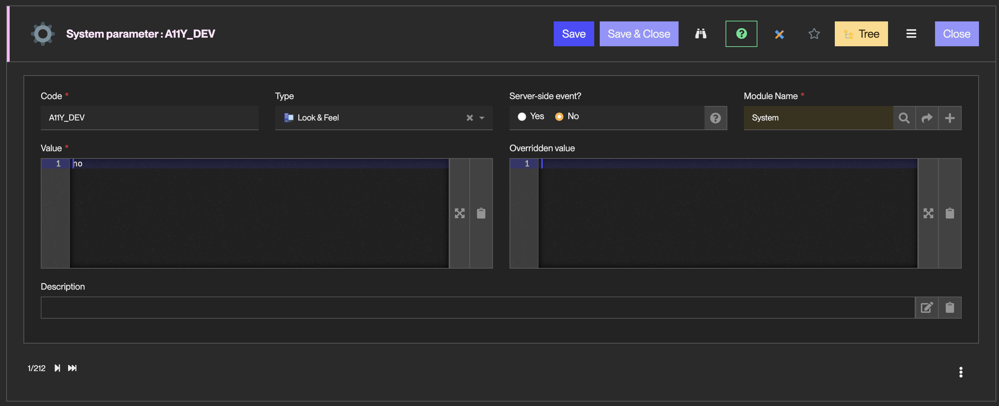
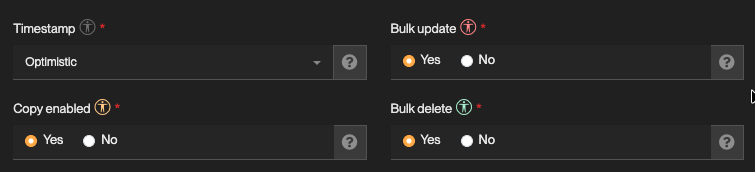
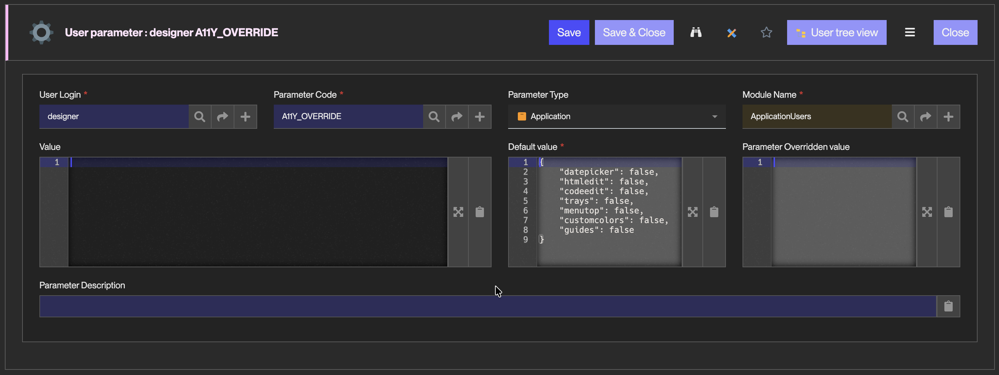

Create conform applications with Simplicité
===========================================

:::warning

Digital accessibility is a continuous work in our R&D, yet not all of our features are conform to RGAA standards, but we're working on it continuously.

Please refer to [this document](/unlisted/compliance) to know more about our position on each criteria, and check the list of most impacted components.

:::

Introduction
------------

Simplicité allows the creation of business application which 100% conform to the RGAA standards, but yet this requires to stick to a certain set of features.

While some features are completely usable in such context, others require to stick to specific settings/usages,  
and others are just not RGAA-conformant for now.

A11y Flags
---------

Simplicité embedds several features related to web-accessibility and RGAA-compliance.  

:::warning

Those are still in development, thus cannot guarantee a complete success by themselves.  
Simplicité being a low-code platform with a lot of features and capacities, it's required to  
follow the [guides](#guide-per-component) if you have strict RGAA-compliance requirements.  

:::

### Runtime `a11y-mode`

When connected to a Simplicité application, end-users can toggle the **Accessibility Mode** by clicking on the  
`.btn-a11y-mode` button in the application's header.

Its purpose is to inhibate and adapt specific UX/UI behaviors or optional-features that might block or limit users using  
Assistive Technologies to properly use a Simplicité application.

Here is the list of the handled features :  

- Form & List "float/sticky" headers
- Customized colors for action/state buttons
- Splittable work areas
- Compact mode
- Collapse menu toggle
- Masonry layout for lists
- Menu "trays" and "metrics" from StatusObjects
- Preset search (from the search dialog)
- Top Menu

:::warning

This mode doesn't do anything for the **Non-Compliant** features/components listed [below](/unlisted/designer#features-compliance).  
Plus even with this safety net, you **SHOULD** disable the features explicited as non-compliant in [those guides](#guide-per-component).  

:::

### Designer `A11Y_DEV` sysparam

As a designer, you can trigger the "Development Helper" through the system parameter `A11Y_DEV` (yes|no)  
to help you with dissociating RGAA compliant and non-compliant features.

Once activated, all fields are granted an `universal-access-circle` icon next to their label, which carries the information for  
the RGAA-compliance of the related feature :  

- **Non-Evaluated** (text-color) ; the feature has not been through complete tests with RGAA criteria for now.
- **Non-Compliant** (danger-color) ; the feature should not be used at all (if you have strict compliance requirements).
- **Partially-Compliant** (warning-color) ; the feature can be used but additional conditions and setting steps are required to ensure its compliance.
- **Compliant** (success-color) ; the feature can be used without any question regarding RGAA compliance criteria.
- if nothing shows, then the feature is just not concerned by RGAA tests and criteria, thus can be used freely.

### User `A11Y_OVERRIDE` parameter

You can then act on an intermediate level to toggle specific components/features for some users if they ask for it  
in knowledge of what that can/cannot use.  

This is only working on specific components that couldn't be complianced because of their complexity/dependences :  

- Date pickers (flatpickr is not compliant)
- HTML Editor (quill is not compliant)
- Code editors (ace is not compliant)
- Trays (because are drag-and-drop only)
- Menu Top (because chained popups aren't compliant, keyboard nav and screen-reader)
- Custom Colors (safety net for contrasts of action & enum elements)
- User Guides (because popup-oriented processes aren't compliant, keyboard nav and screen-reader)

Guide per component
-------------------

### Links

### Lists

**Raw hints** (while no proper guide is available)

- Disable docked search
- Disable the list mosaic
- Disable Edit on list
- Disable bulk update
- Disable row-

### Forms

**Raw hints** (while no proper guide is available)

- When creating a form, never split "label" and "input"
  - stick to the "label + input" rendering when setting this in the template-editor
- When using longstring fields, stick to regular rendering
- Instead of a date/time type, use a simple text with a date formating

### Business Process

**Raw hints** (while no proper guide is available)

- for `pcs_road_render`, only the _Minimal informations_ versions of each direction should be used  

### Menu

**Raw hints** (while no proper guide is available)

- Set `left.collapse: "none"` in the sysparam `MENU_SETTINGS`
- Use only the left menu, setting `top.active = false` in the sysparam `MENU_SETTINGS`
- If you have Business Objects with a status, make sure you disable both the metrics and trays.
- While the "left-only" is handled by the use `a11y-mode`, it's recommended to properly disable it while developping the application.

Features' Compliance
--------------------

:::warning

This part is based on Simplicité's [Feature Map](/docs/features), more precisely narrowed to the **Web App (use)** branch of features.  

:::

### Main components & first-depth features

There are 3 possibilities for each feature's RGAA-compliance:

- **Compliant <rgaa-c>(C)</rgaa-c>**, the feature can be activated/used in any application and respect the WAI/ARIA norms as much as the RGAA tests.
- **Partially Compliant <rgaa-pc>(PC)</rgaa-pc>**, the feature can be activated/used but needs to follow some rules/restrictions in
  its settings/integration into the app in order to respect the WAI/ARIA norms and RGAA tests.
- **Non-compliant <rgaa-nc>(NC)</rgaa-nc>**, the feature cannot be activated in apps while respecting the WAI/ARIA norms and RGAA tests.

:::info

If one application's requirements regarding RGAA compliance are strict, it is highly recommended its designers to stick to "simpler" features  
that are enlisted below as **C**, or to make sure the **PC** features that are used do follow the mentionned requirements.

:::

#### Lists

- <rgaa-c>**Multi-column ordering** : C</rgaa-c>
- <rgaa-c>**Pagination** : C</rgaa-c>
- <rgaa-pc>**List Search (\*)** : PC</rgaa-pc>
- <rgaa-c>**List Preferences** : C</rgaa-c>
- **List Exports** : _to evaluate_
- <rgaa-nc>**Bulk Actions** : NC</rgaa-nc>
- <rgaa-c>**Group-by** : C</rgaa-c>
- <rgaa-nc>**Cards Mosaic** : NC</rgaa-nc>
- <rgaa-pc>**Create on list** : PC</rgaa-pc>
- <rgaa-nc>**Update on list** : NC</rgaa-nc>

#### Forms

- <rgaa-pc>**Fields (\*)** : PC</rgaa-pc>
  - Most of regular typed fields and the shared structure of those we generate are compliant.  
    But some specific types (ace, gridtext, quill, sliders, stars, etc) aren't.
  - The addons available for regular typed fields (string, int, longstring, boolean, enum, etc) are all compliant.
- <rgaa-pc>**Templates** : PC</rgaa-pc>
- **Permalinks** : _to evaluate_
- <rgaa-pc>**Child lists (\*)** : PC</rgaa-pc>
- <rgaa-c>**Custom action with confirm fields** : C</rgaa-c>
- **Publications HTML to PDF** : _to evaluate_

#### Search

- **Global Search** : _to evaluate_
- **Object Search (\*)** : _to evaluate_
- <rgaa-c>**Menu Search** : C</rgaa-c>
- <rgaa-nc>**Form Search** : NC</rgaa-nc>
- **Modeler Search** : _to evaluate_
- **User Filters** : _to evaluate_

#### Business Processes

<rgaa-pc>Partially Compliant</rgaa-pc>

- The specific actions and DOM elements for the business process are all implemented as RGAA-compliant.
- As a Businesses Process are just a specific usage of the **Form** and **List** components,
  as long as those use only _compliant_ features then the Process is compliant too.

#### Adaptable UI

- <rgaa-pc>**Themes** : PC</rgaa-pc>
- <rgaa-pc>**Internationalization** : PC</rgaa-pc>
- <rgaa-nc>**Compact mode** : NC</rgaa-nc>
- <rgaa-c>**Zoom** : C</rgaa-c>

### Embedded components & second-depth features (*)

#### List Search

- <rgaa-c>**Search dialog** : C</rgaa-c>
- <rgaa-nc>**Predefined Search** : NC</rgaa-nc>
- <rgaa-c>**Sort Order** : C</rgaa-c>
- <rgaa-c>**Global Search** : C</rgaa-c>
- <rgaa-pc>**Search Form** : PC</rgaa-pc>
  - Only the "top" position (`obo_tpl_search_pos`) guarantees this feature's compliancy with the additional use of `a11y-mode`.

#### Fields

- <rgaa-pc>**Text fields** : PC</rgaa-pc>
  - The `QRCode` and `Icon picker` renderings are not compliant.
- <rgaa-nc>**Validated Text fields** : NC</rgaa-nc>
  - Working on it. The validation should be announced properly and an help/suggestion should be offered.
- <rgaa-c>**Boolean fields** : C</rgaa-c>
  - All renderings are compliant for these fields.
- <rgaa-pc>**LongText fields** : PC</rgaa-pc>
  - This type of fields have many possible _renderings_, including some that are not compliant because of their advanced complexity ;  
    None / Expression / Fixed font / HTML / CSS / SQL / Markdown / JSON / Text editor / Grid / Count characters / Javascript
- <rgaa-pc>**Number fields** : PC</rgaa-pc>
  - This type of fields have many possible _renderings_, including some that are not compliant ;
    Progress-bars / Stars / With calculator
- <rgaa-pc>**Date/Time fields** : NC</rgaa-pc>
  - the `flatpickr` modal is usable, and arguably accessible, but doesn't comply to all RGAA criteria yet
    although the `a11y-mode` replaces those calendars by plain text inputs with a hint on the date-format.
- <rgaa-c>**Enum fields** : C</rgaa-c>
- <rgaa-c>**File fields** : C</rgaa-c>
- <rgaa-nc>**Special fields** : NC</rgaa-nc>
  - Here are the fields' types that we include in this category : URL / Email / Phone / Color / Coordinates / Password / Notepad
  - In this list, only the types `URL`, `Email`, `Phone` and `Password` are RGAA-compliant.
- <rgaa-pc>**Image fields** : PC</rgaa-pc>
  - The component is conformant since alt is exposed and editable per image;
    real-world compliance still depends on end users providing accurate alt text
    (or explicitly marking decorative images),which falls outside what the platform can guarantee
    Complex images (charts, diagrams, infographics) can't be made compliant through alt text alone.  
  — make sure your application has no need for them, or plan a separate accessible alternative if it does.
- <rgaa-c>**Referenced Object** : C</rgaa-c>

#### Fields related features

- <rgaa-c>**Copy to clipboard** : C</rgaa-c>
- <rgaa-pc>**Simple help** : PC</rgaa-pc>
  - As the help content for a field is fully customizable, only the text-only content are compliant,
    if you insert code or HTML sections then you expose those to possible incohenrency with RGAA-criteria.
  - Both "label + input + help" and "label + input" displays have compliant helps.
- <rgaa-c>**List Filtering** : PC</rgaa-c>

#### Child Lists

- <rgaa-c>**Panel** : C</rgaa-c>
  - By nature Simplicité's panel & sub-panels are compliant
- <rgaa-c>**Virtual link** : C</rgaa-c>
  - A virtual link is displayed as an embedded list, thus its compliance is related to the [list's](#lists-1).
- **Association** : _to evaluate_
- <rgaa-nc>**Pillbox** : NC</rgaa-nc>
- <rgaa-c>**Inlined object** : C</rgaa-c>
  - An inlined object is displayed as several form elements, thus its compliance is related to the [form's](#forms-1).

#### Bulk Actions

- <rgaa-nc>**Bulk Edit** : NC</rgaa-nc>
- <rgaa-c>**Bulk Delete** : C</rgaa-c>
- **Merge** : _to evaluate_
- <rgaa-pc>**Custom List Actions** : PC</rgaa-pc>

#### Object Search

- **Advanced query search** : _to evaluate_
- <rgaa-nc>**Date/Period search** : NC</rgaa-nc>
  - Using Datetime fields (search ≠ form) so not compliant
- <rgaa-nc>**Date/Period search** : NC</rgaa-nc>
  - Using Datetime fields (search ≠ form) so not compliant
- <rgaa-nc>**Geographical search** : NC</rgaa-nc>
- <rgaa-pc>**Predefined Search** : PC</rgaa-pc>
  - Predefined searches are basically lists available mostly from homepages, specific because they  
    use a predefined set of filters. But their behavior/features are the same as a regular list.
  - Thus they have to follow the rules & settings associated with their "" object.
- **Saved Search** : _to evaluate_

#### Templates

- <rgaa-c>**Field Area** : C</rgaa-c>
- <rgaa-c>**Columns** : C</rgaa-c>
- <rgaa-c>**Tabs** : C</rgaa-c>

### Behavioral & cross-cutting features

Below are detailed some of the features that aren't visual components, but that results in specific usages for components that are mentionned above.  
The aim is to tackle down few specific features that needs to pay more attention regarding the components they use (lists, forms, modals/dialogs).

- <rgaa-pc>**Links** : PC</rgaa-pc>
  - The feature itself is compliant, but the embedded lists have few flaws that prevent their usage in apps that should be compliant.
  - If you disable the filters in those lists, then it's RGAA-compliant.
  - If you enable them, then you're gonna have non-compliances on the filters (focus-restitution, dialog opening etc).
- <rgaa-c>**List of values** : C</rgaa-c>
- <rgaa-pc>**Static text** : PC</rgaa-pc>
  - If the content is purely textual then the usage of this component is RGAA-compliant
  - If you use it with custom HTML, you have to ensure by yourself that it follows WAI-ARIA rules
- <rgaa-pc>**Actions** : PC</rgaa-pc>
  - If you want to customize your action (background, color, icon), you have to use contrasted enough colors.  
    For such thing you can refer to Simplicité's inner contrast tool, and ensure you stick to monochrome icons.

Keyboard accessibility
----------------------

### Access keys

#### Globals

- `TAB` focus the next element in the DOM order
- `SHIFT` + `TAB` focus the previous element in the DOM order
- `ESC` to close by priority:
  - focused field or rich editor
  - all modal dialogs
  - the current form
  - and go back in navigation when nothing is focused

- `ALT-H` : displays the **Home** page
- `ALT-M` : focus the main **Menu** last selection or first item
- `ALT-W` : **Wide** screen by toggling the menu
- `ALT-B` : opens the **Bookmarks** dialog
- `ALT-F` : focus the **Finder**, global search in header
- `ALT-L` : focus the first visible **List**
- `ALT-N` : focus the **Next** visible area/list (first `.js-focusable` of area)

#### Menu accessibility

- `ALT-M` : focus the main **Menu** last selection or first item
- `RIGHT` and `LEFT`: open/close a domain or a sub-menu
- `UP` and `DOWN`: previous/next menu item (same as `TAB` or `SHIFT` + `TAB`)
- `ENTER` : to execute/open the item, list or view, launch one business process...

#### Lists and forms

Horizontal navigation after a search:

- `SHIFT-LEFT` : goto previous record (on object form) or page (on object list)
- `SHIFT-RIGHT` : goto next record (on object form) or page (on object list)
- `CTRL-SHIFT-LEFT` : goto first record (on object form) or page (on object list)
- `CTRL-SHIFT-RIGHT` : goto last record (on object form) or page (on object list)

Vertical navigation in a page of list:

- `UP` / `DOWN` on list: focus table rows
  - header to focus columns and sort fields
  - search by column to change list filtering
  - records of current page
- `TAB` to visit focusable cells of rows: long text, markdown content, textarea... are focusable to be scrollable with arrow keys
- `ENTER` : to open the record (only if the form access is permitted for this line)

### Shortcuts

Shortcuts can define more access-keys.

Some designer access:

- `ALT-I` : XML import page
- `ALT-C` + `C` : clear all caches
- `ALT-X` : open the script/code editor

Useful Resources
----------------

- [Using ARIA](https://www.w3.org/TR/using-aria/)
- [ARIA in HTML](https://www.w3.org/TR/html-aria/)
- [APG Patterns](https://www.w3.org/WAI/ARIA/apg/patterns/)
