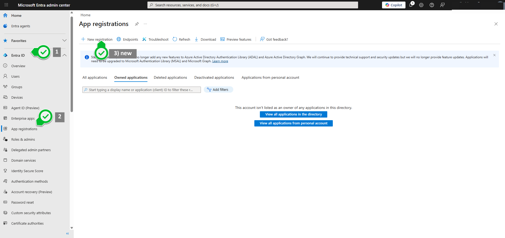
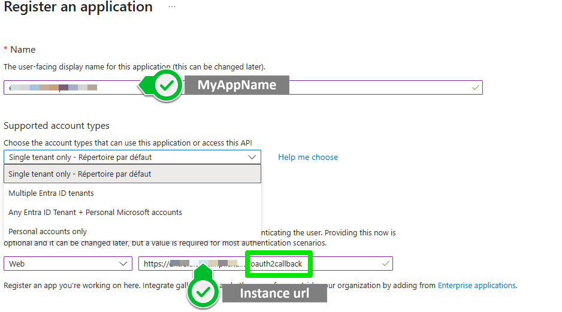
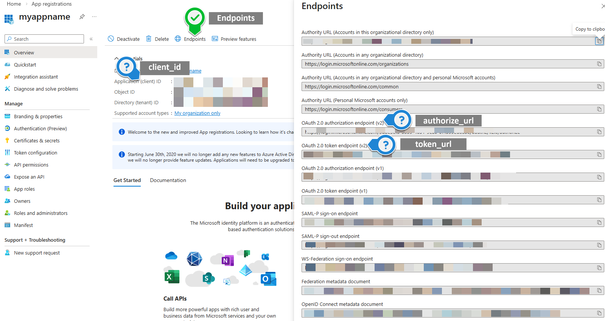
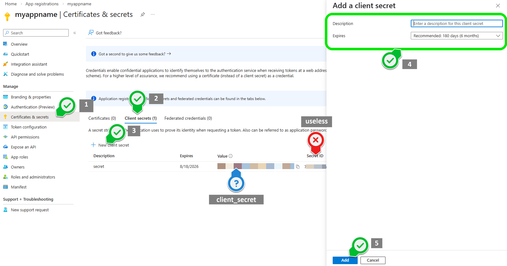
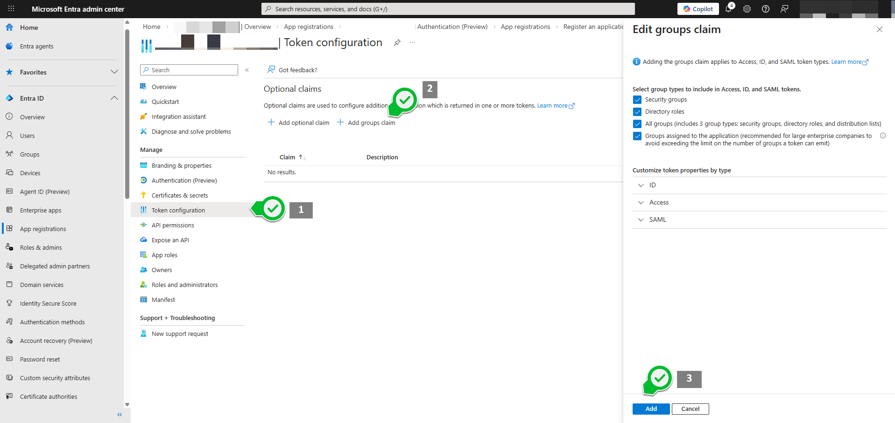
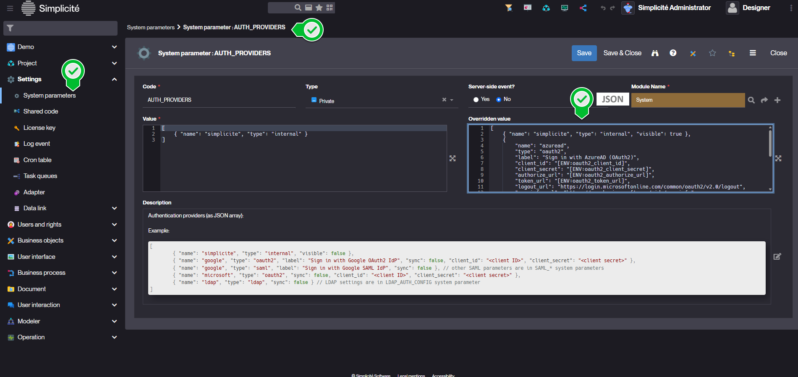
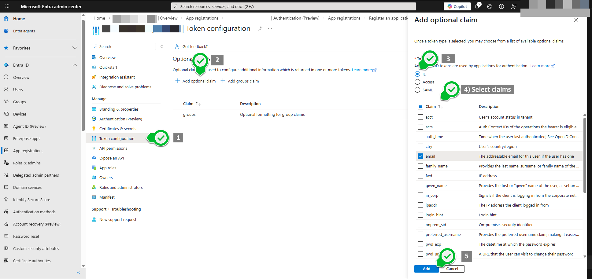

Tutorial for OAuth2 config with Entra ID or Azure AD
=====================================================

This section is a basic step-by-step tutorial for OAuth2 config with Entra ID

Prerequisites
--------------

- Simplicité instance with designer access
- A test account in your Entra ID organisation to test the login

Tutorial
--------

### 1) New app registration



### 2) Register



### 3) Locate some of the endpoint data



NB: depending on the "supported account types" selected on step 2, your authorisation and token URLs might or might not contain the tenant ID

### 4) Generate and save secret

**Warning:** The secret value only shows once, make sure to copy it



### 5) Authorise user on your app (add claims)



### 6) Add Azure as an Authentication Provider through the `AUTH_PROVIDERS` System Parameter

For [security reasons](../security.md#secrets) we recommend transmitting secrets to the platform as environment variables.

Set `oauth2_client_id` `oauth2_client_secret` `oauth2_authorize_url` and `oauth2_token_url` with the values from previous steps (blue marks)

```json
[
    { "name": "simplicite", "type": "internal", "visible": true },
    {
        "name": "azuread",
        "type": "oauth2",
        "label": "Sign in with AzureAD (OAuth2)",
        "client_id": "[ENV:oauth2_client_id]",
        "client_secret": "[ENV:oauth2_client_secret]",
        "authorize_url": "[ENV:oauth2_authorize_url]",
        "token_url": "[ENV:oauth2_token_url]",
        "logout_url": "https://login.microsoftonline.com/common/oauth2/v2.0/logout",
        "userinfo_url": "https://graph.microsoft.com/oidc/userinfo",
        "userinfo_mappings": {
            "login":"email"
        },
        "sync": true,
        "visible": true
    }
]

```



:::note[Notes]
To avoid Simplicité mapping account pictures you can map `picture` to `none` in `userinfo_mappings`:

```json
"userinfo_mappings": {
    "login":"email",
    "picture":"none"
},

```

:::

### 7) Implement some group attribution

**_This step needs customisation to fit your own scenario_**

```java
package com.simplicite.commons.Application;

import java.util.*;
import com.simplicite.util.*;
import com.simplicite.util.tools.*;

/**
 * Platform Hooks
 */
public class PlatformHooks extends com.simplicite.util.engine.PlatformHooksInterface {
    @Override
    public void preLoadGrant(Grant g) {
        if("azuread".equals(g.getSessionInfo().getProvider())){
            String userId = Grant.getUserId(g.getLogin());
            Grant.removeAllResponsibilities(userId);
            Grant.addResponsibility(userId, "DEMO_ADMIN");
            AppLog.info("Detected AzureAD login : " + g.getLogin() + " (" + userId + "). Forcing responsibilities.", null);
        }
    }
}

```

### 8) Add and map custom claims

You can add custom JWT claims and map them to user fields.

Update the `AUTH_PROVIDERS` system parameter to map these claims:

```json
[
    { "name": "simplicite", "type": "internal", "visible": true },
    {
        "name": "azuread",
        "type": "oauth2",
        "label": "Sign in with AzureAD (OAuth2)",
        "client_id": "[ENV:oauth2_client_id]",
        "client_secret": "[ENV:oauth2_client_secret]",
        "authorize_url": "[ENV:oauth2_authorize_url]",
        "token_url": "[ENV:oauth2_token_url]",
        "logout_url": "https://login.microsoftonline.com/common/oauth2/v2.0/logout",
        "userinfo_url": "https://graph.microsoft.com/oidc/userinfo",
        "userinfo_mappings": {
            "picture":"none"
        },
        "jwt_claims_mappings": {
            "login":"email"
        },
        "sync": true,
        "visible": true
    }
]
```
