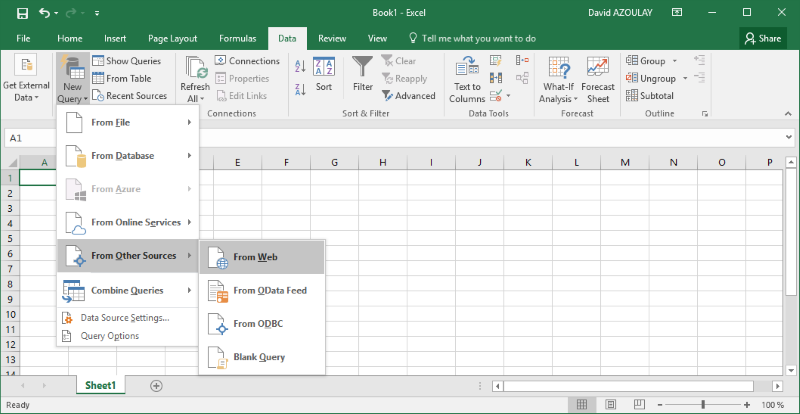
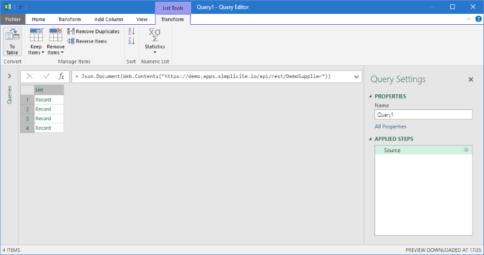
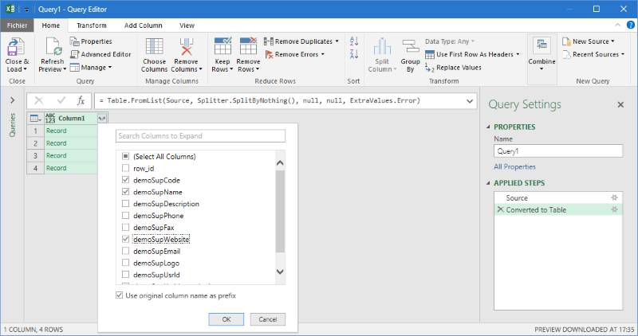
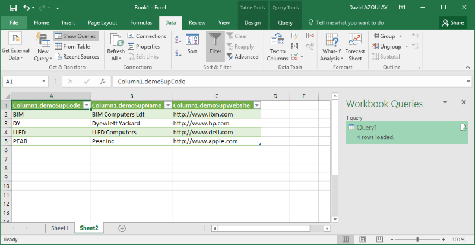

Using data in Microsoft Excel
=============================

Using web external data source
------------------------------

It is possible to use the data RAW services as an external data source. See [this document](/docs/integration/webservices/raw-services) for details.

If you are using a recent version (2016+) or an older version with the PowerQuery addon,
this approach is not ideal and you should consider using the PowerQuery and the REST services tool instead (see below).

Using PowerQuery tool
---------------------

In recent versions (2016+), Microsoft Excel includes the PowerQuery tool which allow calling REST services to load data in a spreadsheet.

For instance you can create a new web request:



Enter the REST request URL and credentials (in the "Basic" tab).

Then, in the PowerQuery tool window, in the "Transform" tab, convert the returned JSON array to a table using the "To table" button (leave the default "No delimiter" option when prompted):



Select the required columns if needed:



Finally click on the "Close & load" button in the "Home" tab, et voilà:



Note that you can optionally create a named parameter table in your spreadsheet (named `Params` in the example below) and use the values
when building the REST URL. To do so you have to change the query code using the "Advanced editor".

Example:

```
let
    Params = Excel.CurrentWorkbook(){[Name="Params"]}[Content],
    N = Params{0}[Value],
    Source = Json.Document(Web.Contents("http://demo.apps.simplicite.io/api/rest/DemoSupplier?demoSupName=" & N)),
    T1 = Table.FromList(Source, Splitter.SplitByNothing(), null, null, ExtraValues.Error),
    T2 = Table.ExpandRecordColumn(T1, "Column1", {"demoSupCode", "demoSupName"}, {"Code", "Name"})
in
    T2
```
