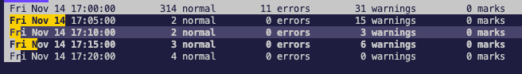
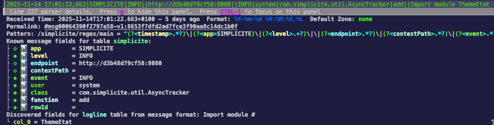
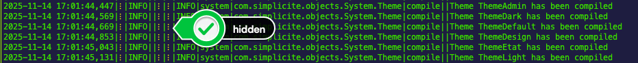

As it can be hard to make sense of logs, it can be useful to use dedicated log-viewing tools.

## LNAV

LNAV, short for Log Navigator, is an efficient log viewing CLI which gives you a very handy set of tools. Some are reviewed here, which are a good starting point, [check out more features and the full docs here](https://lnav.org/features)

### Piping

Being a CLI allows to pipe thing to it, for example logs from the I/O service:

```shell
curl -u designer:$IO_PASSWORD --form service=logs $IO_URL | lnav
```

### Log files merging

By calling lnav on multiple files, it will chronologically merge them, which can be very usefull to analyze a a long period of time split over different files, or the output of different parts of the stack in the same view (for example merging simplicité logs + tomcat logs + proxy logs).

```shell
lnav simplicite.log tomcat.log proxy.log
```

### Filtering

Press tab to open the filtering panel, and enter a regex to filter or filter out logs. Filtering the following logs (Cron and Garbage collector)
can greatly improve overall readability. You can easily deactivate a filter with the spacebar in the filtering panel (`Tab`).

```pcre
CronManager|ICORECM004|ICORECM005|MEMGC|ProcessScheduler
```

You could also install this trigger to automatically set the filter when the 

### Searching

Use `/` to search using a regex, or use [chronological navigation](https://docs.lnav.org/en/v0.13.1/hotkeys.html#chronological-navigation) to fastly navigate to the next hour for example.

### Timeline view

Press `i` to get a histogram view of the repartition of the error levels over time:



### Simplicité logs parser

To best analyze lines, lnav uses a PCRE parser that can be customized. You can install the following JSON file with `lnav -i lnav-simplicite-format.json`.

```json
{
	"$schema":"https://lnav.org/schemas/format-v1.schema.json",
	"simplicite":{
		"title":"Simplicité",
		"description":"Simplicité Low-Code Platform log format",
		"regex":{
			"main":{
				"pattern":"^(?<timestamp>.*?)\\|(?<app>SIMPLICITE)\\|(?<level>.+?)\\|\\|(?<endpoint>.*?)\\|(?<contextPath>.*?)\\|(?<event>.*?)\\|(?<user>.*?)\\|(?<class>.*?)\\|(?<function>.*?)\\|(?<rowId>.*?)\\|(?<body>.*)$"
			},
			"init":{
				"pattern":"^(?<timestamp>[^\\|]*?)\\|(?<app>SIMPLICITE)\\|(?<level>[^\\|]+?)\\|(?<body>[^\\|]*)$"
			}
		},
		"value":{
			"timestamp":{ "kind":"string" },
			"app":{ "kind":"string", "hidden":true },
			"level":{ "kind":"string" },
			"contextPath":{ "kind":"string", "hidden":true },
			"endpoint":{ "kind":"string", "hidden":true },
			"event":{ "kind":"string", "hidden":true },
			"user":{ "kind":"string", "hidden":true },
			"class":{ "kind":"string", "hidden":true },
			"function":{ "kind":"string", "hidden":true },
			"rowId":{ "kind":"string", "hidden":true }
		},
		"sample":[
			{
				"line":"2025-11-19 00:00:00,227|SIMPLICITE|INFO||http://46d6af5a5f20:8080||ICORECM005|system|com.simplicite.util.CronJob|run||Result of job deadlineActivity :"
			}
		]
	}
}
```

Having this configured helps lnav know what each part of the log line corresponds to, so you can focus on a line and press `p` to get a detailed view:



It also allow to do some redundant field hiding to get a more compact view by default. Hidden fields appear with yellow dots, and they are shown by pressing `x`:



Last and not least, having a defined format simplifies the installation of a trigger that adds the "filter-out" rule mentioned earlier.
Use the following command `lnav -i add_simplicite_filters.sql`

```sql
CREATE TRIGGER IF NOT EXISTS add_simplicite_filters
  AFTER INSERT ON lnav_events WHEN
    -- Check the event type
    jget(NEW.content, '/$schema') =
      'https://lnav.org/event-file-format-detected-v1.schema.json' AND
    -- Only create the filter when a given format is seen
    jget(NEW.content, '/format') = 'simplicite' AND
    -- Don't create the filter if it's already there
    NOT EXISTS (
      SELECT 1 FROM lnav_view_filters WHERE pattern = 'CronManager|ICORECM004|ICORECM005|MEMGC|ProcessScheduler')
BEGIN
INSERT INTO lnav_view_filters (view_name, enabled, type, pattern) VALUES
    ('log', 1, 'OUT', 'CronManager|ICORECM004|ICORECM005|MEMGC|ProcessScheduler');
END;
````
