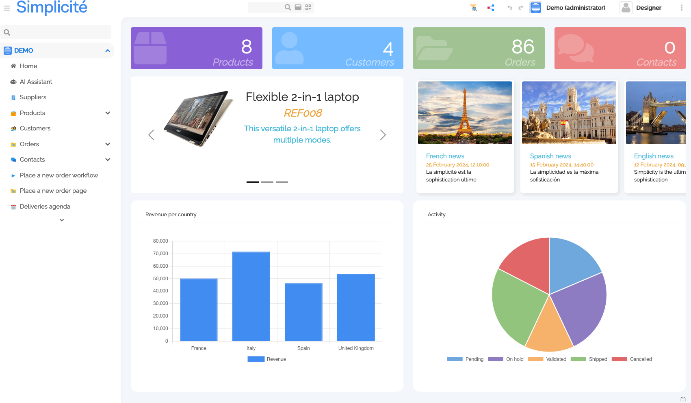
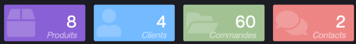
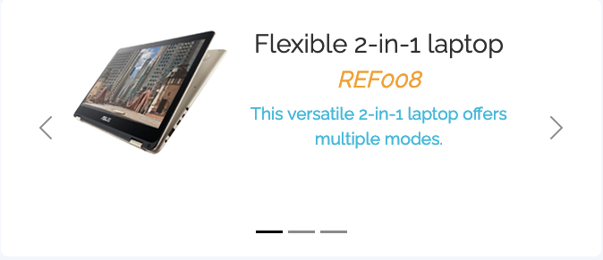
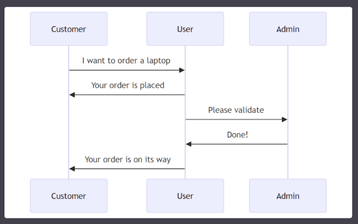

Widgets
====================

Widgets are easily configurable external objects, usually used to compose home pages.



How to integrate (reminder)
---------------------------

This is just a reminder, as widgets just build on the existing external objects

- create a view (home page, domain home, etc)
- through the view template editor, add a view area
  - type : External Page
  - source : External Object
  - External Object : "MyCounterName" (copy that name)
- create a new External Object
  - name: "MyCounterName"
  - UI Widget: Yes
  - Nature: UI Page or component
  - Class: one of the available widgets
    - `com.simplicite.webapp.web.widgets.CountersExternalObject` (as of version 6.1)
    - `com.simplicite.webapp.web.widgets.CarouselExternalObject` (as of version 6.1)
    - `com.simplicite.webapp.web.widgets.CardsExternalObject` (as of version 6.1)
    - `com.simplicite.webapp.web.widgets.MermaidExternalObject` (as of version 6.2)

Counters
--------

The **Counters** external object widget counts how many of some objects there is in the database.



Configuration is done like such in the configuration field of the external object:

- **color** must be an available CSS class, typically one of the color classes
- **name** is the functional name of the object you need to count
- **icon** is one of the available SVG icons in the app

```json
{
    "objects": [
        {
            "color": "violet",
            "name": "MyObject",
            "icon": "fas/box"
        }
    ]
}
```

Carousel
--------



The **Carousel** external object widget displays a carousel of data and is configured with the following JSON:

```json
{
    "name": "DemoProduct",
    "imageField": "demoPrdPicture",
    "titleField": "demoPrdName",
    "subTitleField": "demoPrdReference",
    "descriptionField": "demoPrdDescription",
    "filters": {
        "demoPrdFeatured": true
    },
    "height": "18rem"
}
```

Cards
-----


The **Cards** external object widget displays data as cards and is configured with the following JSON:

```json
{
    "subTitleField": "nws_human_readable_date",
    "instance": "web_WebNews",
    "imageField": "nws_image",
    "titleField": "nws_title",
    "onclick": false,
    "name": "WebNews",
    "cardWidth": "15rem",
    "rowClasses": "row-horizontal",
    "descriptionField": "nws_description"
}
```

Mermaid chart
-------------



The **Mermaid** external object widget displays a Mermaid charts from a specification.

The principle is to configure the external object with the `com.simplicite.webapp.web.widgets.MermaidExternalObject` class
and to provide the Mermaid specification either:

- statically in the settings of the external object as in the above example
- dynamically using the `getMermaidChartSpec` hook of the class

e.g.

```text
sequenceDiagram
    Customer->>User: I want to order a laptop
    User->>Customer: Your order is placed
    User->>Admin: Please validate
    Admin->>User: Done!
    User->>Customer: Your order is on its way
```
