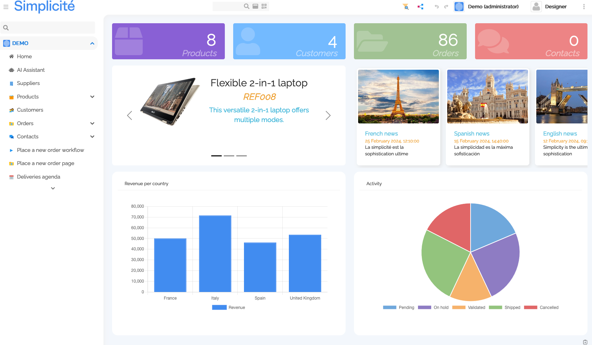
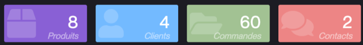
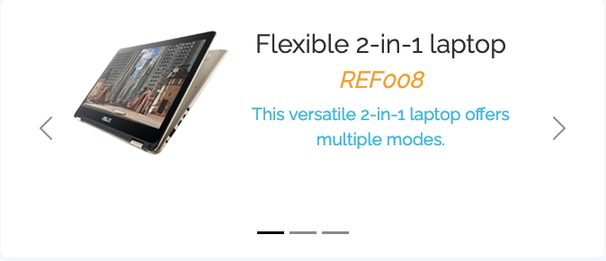
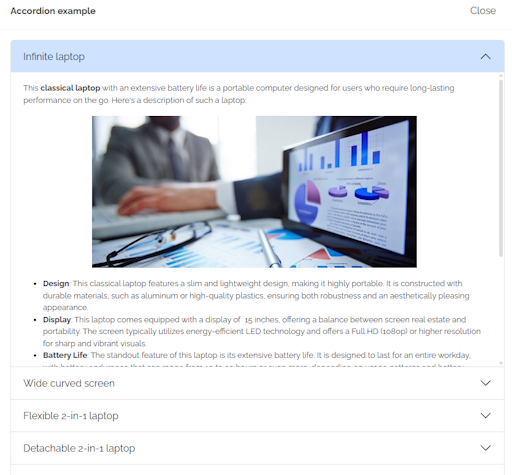
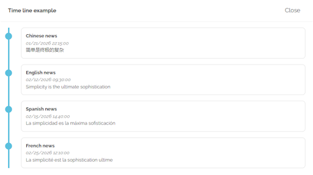
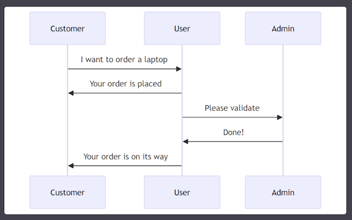
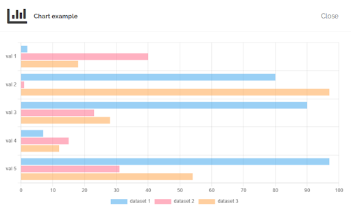

Widgets
=======

Widgets are easily configurable external objects, usually used to compose home pages.



How to integrate widgets
------------------------

This is just a reminder, as widgets just build on the existing external objects

- create a view (home page, domain home, etc)
- through the view template editor, add a view area
  - type : External Page
  - source : External Object
  - External Object : "MyCounterName" (copy that name)
- create a new External Object
  - name: "MyCounterName"
  - UI Widget: Yes
  - Nature: UI Page or component
  - Class: one of the available widgets class, see bellow

Counters
--------

The **Counters** external object widget (class: `com.simplicite.webapp.web.widgets.CountersExternalObject`)
displays the count(s)/aggregate(s) of some specified objects.



Configuration is done like such in the configuration field of the external object:

- **color** must be an available CSS class, typically one of the color classes
- **name** is the functional name of the object you need to count
- **icon** is one of the available SVG icons in the app

```json
{
    "objects": [
        {
            "color": "violet",
            "name": "MyObject",
            "icon": "fas/box"
        }
    ]
}
```

Carousel
--------



The **Carousel** external object widget (class: `com.simplicite.webapp.web.widgets.CarouselExternalObject`)
displays a carousel of data and is configured with the following JSON:

```json
{
    "name": "DemoProduct",
    "imageField": "demoPrdPicture",
    "titleField": "demoPrdName",
    "subTitleField": "demoPrdReference",
    "descriptionField": "demoPrdDescription",
    "filters": {
        "demoPrdFeatured": true
    },
    "height": "18rem"
}
```

Cards
-----


The **Cards** external object widget (class: `com.simplicite.webapp.web.widgets.CardsExternalObject`)
displays data as cards and is configured with the following JSON:

```json
{
    "name": "WebNews",
    "titleField": "nws_title",
    "subTitleField": "nws_human_readable_date",
    "imageField": "nws_image",
    "descriptionField": "nws_description",
    "onclick": false,
    "cardWidth": "15rem",
    "rowClasses": "row-horizontal"
}
```

Accordion
---------



The **Accordion** external object widget (class: `com.simplicite.webapp.web.widgets.AccordionExternalObject`)
displays data as a basic accordion and is configured with the following JSON:

```json
{
  "titleField": "demoPrdName",
  "name": "DemoProduct",
  "contentField": "demoPrdDocumentation"
}
```

Time line
---------



The **Time line** external object widget (class: `com.simplicite.webapp.web.widgets.TimelineExternalObject`)
displays data as a basic time line and is configured with the following JSON:

```json
{
  "name": "WebNews",
  "titleField": "nws_title",
  "dateField": "nws_date",
  "contentField": "nws_description",
  "filters": {
    "order__nws_date": 1
  }
}
```

Mermaid chart
-------------



The **Mermaid** external object widget (class `com.simplicite.webapp.web.widgets.MermaidExternalObject`)
displays a Mermaid charts from a specification.

The principle is to provide the Mermaid specification either statically in the settings
of the external object:

e.g.

```text
sequenceDiagram
    Customer->>User: I want to order a laptop
    User->>Customer: Your order is placed
    User->>Admin: Please validate
    Admin->>User: Done!
    User->>Customer: Your order is on its way
```

or dynamically using the `getMermaidChartSpec` hook of the class

Custom chart
------------



The **Custom chart** external object widget (class `com.simplicite.webapp.web.widgets.ChartjsExternalObject`)
displays a Chart.js custom chart from a specification.

The principle is to provide the Chart.js specifications either statically in the settings
of the external object:

e.g.

```json
{
  "options": {
    "indexAxis": "y",
    "plugins": {"legend": {"position": "bottom"}}
  },
  "type": "bar"
}
```

or dynamically using the `getChartOptions` hook of the class.

And the provide the chart data dynamically using the `data` hook of the class:

e.g.

```java
private static final int NB_DATASETS = 3;
private static final int NB_VALUES = 5;

@Override
public JSONObject data(Parameters params) {
    JSONArray labels = new JSONArray();
    for (int j = 1; j <= NB_VALUES; j++)
        labels.put("val " + j);

    JSONArray datasets = new JSONArray();
    for (int i = 0; i < NB_DATASETS; i++) {
        JSONArray vals = new JSONArray();
        for (int j = 0; j < NB_VALUES; j++)
            vals.put(Tool.randomNumber(2));

        datasets.put(new JSONObject()
            .put("label", "dataset " + (i + 1))
            .put("data", vals)
            .put("backgroundColor", COLORS[i%COLORS.length]));
    }

    return new JSONObject().put("labels", labels).put("datasets", datasets);
}
```
