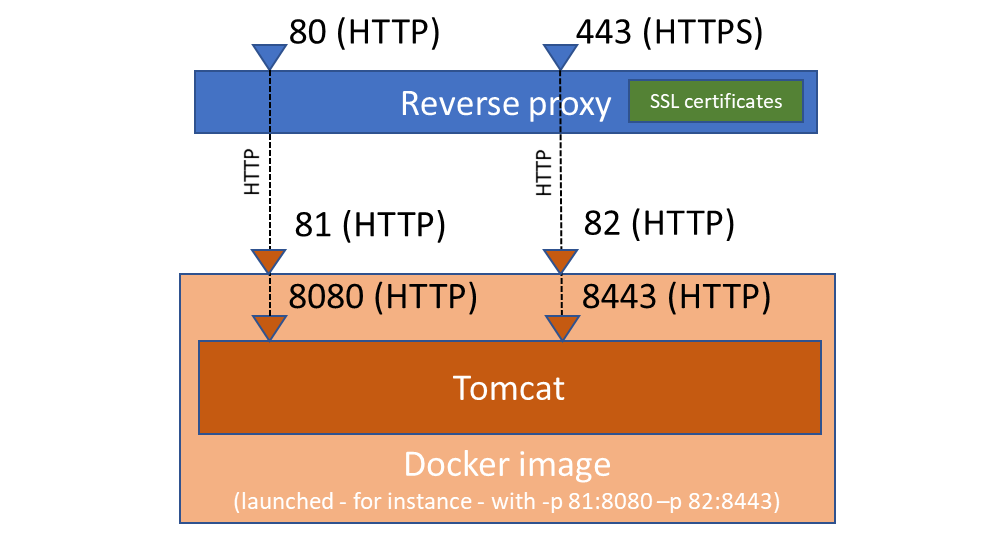
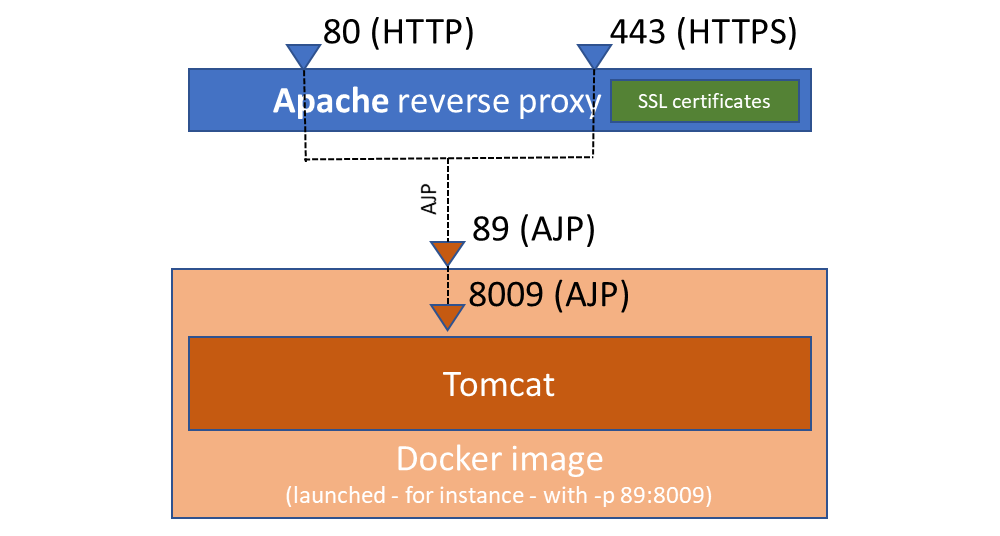
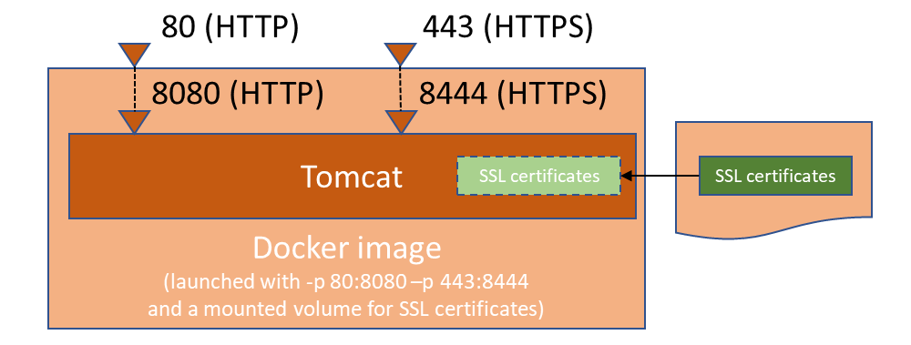

Simplicité on Docker
====================

Simplicité instances can easily be deployed on the Docker engine.

This document gives you extended information on how to use/configure such Docker-based deployments, including in advanced cases.

A simplified **[tutorial](/docs/operation/docker-tutorial)** is also available for a **step by step** procedure in the usual case.

Prerequisites
-------------

Have a Linux server with Docker-ce installed and configured (e.g. with recent Linux distributions this is straightforward as Docker is part of the distributions)
or an account at a cloud provider allowing Docker images deployments.

Take a look at the [Docker documentation](https://docs.docker.com/) for details.

Run a Simplicité platform container
-----------------------------------

### Introduction

To run a Simplicité platform container you can either use one of our **pre-built images** as is
or build a **custom image** that fits your custom needs.

### Use the pre-built platform images {#prebuiltimages}

Pre-built **platform** images including the latest Simplicité instances are available and can be run as is.

This is the best/normal approach if you don't have specific needs.

These images are available either as **server-only** images and **server +  platform** images
on our [**private** Docker registry](https://registry.simplicite.io) (use `docker login https://registry.simplicite.io` to sign in)

Please [contact us](mailto:contact@simplicitesoftware.com) to get access to these images.

### Build a custom image {#customimage}

If, for some **good reasons**, you can't use one of the above pre-built images as is you can build your own custom image:

- Pull the Simplicité Docker **platform** image from the appropriate registry: `docker pull registry.simplicite.io/platform:<tag>`
and build a new child image customizing what you need to customize (e.g. add SSL certificates, etc.)

or (not recommended except for very specific requirements and **reserved to Simplicité experts only**):

- Get the Simplicité instance template from our **private** Git repository,
please [contact us](mailto:contact@simplicitesoftware.com) to get access to this Git repository.
- Pull the Simplicité Docker **server** image from the appropriate registry: `docker pull registry.simplicite.io/server:<tag>`
and build a new child image adding the application package of the instance template (in the `app` folder of the instance template).

> **Note**: if your server has no access to internet you can still get the image manually by saving it on a server
> which has access (`docker save registry.simplicite.io/<server|platform:<tag>> > simplicite-<server|platform>[-<tag>].tar`), then transfer it
> to yor target server, then load it on this server's local docker images registry (`docker load < simplicite-<server|platform>[-<tag>].tar`)

### Basic procedure on CentOS 7 {#centos}

On an "out of the box" **CentOS 7** server you can start a clean & fresh Simplicité **sandbox** instance with the following commands in only few seconds:

First, install the standard Docker service:

```shell
sudo yum -y update
sudo yum -y install docker
sudo systemctl enable docker
sudo systemctl start docker
```

> **Note**: by default Docker is allowed to change the firewall rules to open exposed ports.
> To disable this behavior you need to edit `/usr/lib/systemd/system/docker.service` cartridge file
> and add `--iptables=false` to the `ExecStart` command.

Then pull the platform image and run an ephemeral container from this image:

```shell
sudo docker login
sudo docker pull registry.simplicite.io/platform
sudo docker run -it --rm -name <myapp> -p 80:8080 registry.simplicite.io/platform:<tag>
```

> **Note**: to make the docker container running permanently (and restarting at reboot) use `-d --restart=always` instead of `-it --rm`

The instance is then available on `http://<your server IP address or hostname>`

### Basic procedure on Debian 9 {#debian}

On an "out of the box" **Debian 9** server you can start a clean & fresh Simplicité&reg; **sandbox** instance with the following commands in only few seconds:

Install the up-to-date Docker-CE service:

```shell
sudo apt-get update
sudo apt-get -y remove docker docker-engine docker.io
sudo apt-get install -y apt-transport-https ca-certificates wget software-properties-common
wget https://download.docker.com/linux/debian/gpg
sudo apt-key add gpg
echo "deb [arch=amd64] https://download.docker.com/linux/debian $(lsb_release -cs) stable" | sudo tee -a /etc/apt/sources.list.d/docker.list
sudo apt-get update
sudo apt-get -y install docker-ce
sudo systemctl start docker
sudo systemctl enable docker
```

Pull the platform image and run an ephemeral container:

```shell
sudo docker login
sudo docker pull registry.simplicite.io/platform:<tag>
sudo docker run -it --rm -name <myapp> -p 80:8080 registry.simplicite.io/platform:<tag>
```

> **Note**: to make the docker container running permanently (and restarting at reboot) use `-d --restart=always` instead of `-it --rm`

The instance is then available on `http://<your server IP address or hostname>`

### Procedure on managed cloud platforms {#cloud}

Please refer to your cloud provider's documentation to learn how to deploy containers on their specific infrastructures.

Tags
----

There are several variants of the prebuilt images: `registry.simplicite.io/platform:<tag>`

Exposed ports
-------------

The prebuilt images are configured to exposes the following ports for different usage:

- Tomcat HTTP port `8080` for direct access or to be exposed directly as an HTTP endpoint or thru an **HTTP** reverse proxy endpoint (Apache, NGINX, ...)
- Tomcat secure HTTP port `8443` to be exposed thru an **HTTPS** reverse proxy endpoint (Apache, NGINX, ...)
- Tomcat SSL port `8444` to be exposed directly as an HTTPS endpoint, Note that this requires an additional `-e` flag
  and to mount (or replace) the appropriate JKS certificate (see below)
- Tomcat AJP port `8009` to be exposed thru an HTTP/HTTPS reverse proxy (Apache), this requires an additional `-e` flag (see below)
- Tomcat admin port `8005` for starting/stopping Tomcat from outside of the container (not supposed to be used)
- Tomcat JPDA port `8000` for remote debugging Tomcat (Tomcat is started with the `jpda` keyword), this requires an additional `-e` flag (see below)
- Tomcat JMX port `1099` for connecting a JMX monitoring tool on Tomcat (Tomcat is started with additional JVM options) and `1098`
  for RMI communication, this requires an additional `-e` flag (see below)

> **Warning**: If you expose the HTTP port `8080` thru an HTTPS reverse proxy endpoint
> or if you expose the secure HTTPS port thru an HTTP reverse proxy endpoint
> it will result in unexpected and unwanted behaviors.

The typical configuration using the above ports are the following:

With an HTTP reverse proxy:



With an AJP reverse proxy (Apache):



Without a reverse proxy:



Run variants
------------

### Run with an embedded HSQLDB database {#embeddeddatabase}

```shell
sudo docker run\
	[-it --rm | -d [--restart=always]]\
	-name <myapp>\
	-p <public port, e.g. 8080>:8080\
	[-p <secured HTTP port, e.g. 8443>:8443]\
	registry.simplicite.io/platform:<tag>
```

The database files and the documents are stored on the file system within the container,
if you do nothing in particular this embedded data is thus **ephemeral**
(it won't survive if you replace the container when upgrading the platform for instance)
this is not what you want in most cases.

If you want the embedded data to persist you **must** map the folders containing the database files and the documents
as **named** volumes.

You first need to create these named volumes (prior to first start of the container), this has to be done only once:

```shell
sudo docker volume create <myapp>_db
sudo docker volume create <myapp>_dbdoc
```

Then you need to run your container with the appropriate `-v` volumes mappings, e.g:

```shell
sudo docker run\
	(...)\
	-v <myapp>_db:/usr/local/tomcat/webapps/ROOT/WEB-INF/db\
	-v <myapp>_dbdoc:/usr/local/tomcat/webapps/ROOT/WEB-INF/dbdoc\
	registry.simplicite.io/platform[:tag]
```

> **Note**: you can also use this volume strategy with `dbdoc` only along with an external database not configured to store documents as BLOBs.
> This approach is only suitable for very particular needs (e.g. if you want to have a file system access to your documents, etc.)

### Run with an external database {#externaldatabase}

Both the server and prebuilt images allows you to start a container using an external database using the following `DB_*` environment variables:

```text
sudo docker run\
	(...)\
	-e DB_SETUP=<setup MySQL/MariaDB, PostgreSQL Oracle or SQLServer database if empty = true|false>\
	-e DB_VENDOR=<database vendor = mysql|postgresql|oracle|mssql>\
	-e DB_HOST=<hostname or IP address>\
	-e DB_PORT=<port, defaults to 3306 for mysql, 5432 for postgresql, 1521 for oracle or 1433 for mssql>\
	-e DB_USER=<database username>\
	-e DB_PASSWORD=<database username's password>\
	-e DB_NAME=<database name>\
	[-e DB_SSL=<true|false, defaults to false, only applicable to mysql and postgresql>]\
	[-e DB_MYISAM=<true|false>, use MyISAM engine for mysql, defaults to false, only taken into account during database setup>]\
	[-e DB_DOC=<BLOB|dbdoc|<custom path>, defaults to BLOB, only taken into account during database setup>]
	registry.simplicite.io/platform[:tag]
```

> **Note**: If you plan to use a database server **running on the host machine** you need to get the appropriate IP address
> to pass as `DB_HOST` environment variable (using `127.0.0.1` will **not** work unless you use `--net=host` which only makes sense in particular cases).
>
> To get this address run the following command:
>
> ```shell
> ip -4 addr show docker0 | grep -Po 'inet \K[\d.]+'
> ```
>
> The result is usually `172.17.0.1` but it may vary.
>
> Also **make sure** your database is configured to **allow connections** on this IP and its port
> and that the firewall considers the `docker0` interface as trusted, this can be ensured by:
>
> ```shell
> sudo firewall-cmd --permanent --zone=trusted --add-interface=docker0
> sudo firewall-cmd --reload
> ```

The `DOC_DIR` system parameter should be set by default to `BLOB` for external databases (this means documents are stored in the database as BLOBs).

Otherwise you **must** mapped the folder containing the documents denoted by `DOC_DIR` as a named volume.
See below, this is not recommended unless you have to handle huge volumes of documents.

### Enable SSL Tomcat connector {#ssl}

It is possible to enable a SSL connector at Tomcat level (e.g. useful if you don't use a reverse proxy):

- Enable/disable the SSL connector: `-e SSL=<true|false, defaults to false>`
- Expose the SSL port: `-p <SSL port, e.g. 8444>:8444>`
- optionally mount a custom JKS : `-v <host folder in which is myserver.jks>:/usr/local/tomcat/cert`
  - Indicate the mounted JKS path: `-e KEYSTORE_FILE=/usr/local/tomcat/cert/myserver.jks`
  - Provide JKS password `-e KEYSTORE_PASSWORD=<my keystore password, defaults to "password">`

### Enable Tomcat AJP connector {#ajp}

It is possible to enable/disable an AJP connector at Tomcat level (e.g. useful if you use an Apache reverse proxy):

- Enable/disable the AJP connector: `-e AJP=<true|false, defaults to false>`
- Expose the AJP port: `-p [127.0.0.1:]<AJP port, e.g. 8009>:8009]`

### Start Tomcat in remote debug (JPDA) mode {#jpda}

It is possible to start Tomcat in remote debug (JPDA) mode (e.g. useful in development):

- Enable/disable JPDA mode: `-e JPDA=<true|false, defaults to false>`
- Expose the JPDA port: `-p [127.0.0.1:]<JPDA port, e.g. 8000>:8000`
- Optionally suspend startup till a JPDA debugger connects: `-e JPDA_SUSPEND=<y|n, defaults to n>`

> **Note**: starting Tomcat in this mode has a huge impact on performances, never do it in production.

### Enable JMX services {#jmx}

You can enable JMX services:

- Enable/disable JMX services: `-e JMX=<true|false, defaults to false>`
- Expose the JMX port: `-p [127.0.0.1:]<JMX port, e.g. 1099>:1099]`

### Enable GZIP compression {#gzip}

You can enable/disable GZIP compression at Tomcat level: `-e GZIP=<true|false, defaults to false>`

### Enable/disable endpoints or define IP address(es) whitelists {#whitelists}

#### Enable/disable or define an IP address(es) white list on the ping endpoint {#pingwhitelist}

You can you can add an IP address(es) white list at Tomcat level for the ping endpoint (`/ping`), this endpoint is always enabled:

- Define a white list: `-e PING_WHITELIST="<comma-separated list of IP address / IP ranges regex patterns, e.g. 127.0.0.1, ::1, 172.17.0.0/24>"`

#### Enable/disable or define an IP address(es) white list on the health check endpoint {#healthwhitelist}

You can enable or disable the health check endpoint (`/health`) and you can add an IP address(es) white list at Tomcat level for this endpoint:

- Enable/disable: `-e SYSPARAM_USE_HEALTH=<true|false, defaults to the configured value of the system parameter>`
- Define a white list: `-e HEALTH_WHITELIST="<comma-separated list of IP address / IP ranges regex patterns, e.g. 127.0.0.1, ::1, 172.17.0.0/24>"`

#### Enable/disable or define an IP address(es) white list on the I/O endpoint {#iowhitelist}

You can enable or disable the I/O endpoint (`/io`) and you can define an IP address(es) white list at Tomcat level for this endpoint:

- Enable/disable: `-e SYSPARAM_USE_IO=<true|false, defaults to the configured value of the system parameter>`
- Define a white list: `-e IO_WHITELIST="<comma-separated list of IP address / IP ranges regex patterns, e.g. 127.0.0.1, ::1, 172.17.0.0/24>"`

> **Note**: When deploying several Simplicité nodes, make sure to configure a proper filtering rule and an I/O password to allow.
> these nodes to communicate with each other (e.g. for propagating a clear cache).
> This can be achieved by adding the dedicated environment variable
> `-e IO_PASSWORD=<a very complex password, can be plain text (not recommended) or hashed using configured algorithm (without salting)>`

#### Enable/disable or define an IP address(es) white list on the Git endpoint {#gitwhitelist}

You can enable or disable the Git endpoint (`/git`) and you can define an IP address(es) white list at Tomcat level for this endpoint:

- Enable/disable: `-e SYSPARAM_USE_GIT=<yes|no, defaults to the configured value of the system parameter>`
- Define a white list: `-e GIT_WHITELIST="<comma-separated list of IP address / IP ranges regex patterns, e.g. 127.0.0.1, ::1, 172.17.0.0/24>"`

#### Enable/disable or define an IP address(es) white list on the Maven repository endpoint {#mavenwhitelist}

You can enable or disable the Maven repository endpoint (`/maven`) and you can define an IP address(es) white list at Tomcat level for this endpoint:

- Enable/disable: `-e SYSPARAM_USE_MAVEN=<yes|no, defaults to the configured value of the system parameter>`
- Define a white list: `-e MAVEN_WHITELIST="<comma-separated list of IP address / IP ranges regex patterns, e.g. 127.0.0.1, ::1, 172.17.0.0/24>"`

#### Enable/disable or define an IP address(es) white list on the API endpoint {#apiwhitelist}

You can enable or disable the API endpoint (`/api`) and you can define an IP address(es) white list at Tomcat level for this endpoint:

- Enable/disable: `-e SYSPARAM_USER_API=<yes|no, defaults to the configured value of the system parameter>`
- Define a white list: `-e API_WHITELIST="<comma-separated list of IP address / IP ranges regex patterns, e.g. 127.0.0.1, ::1, 172.17.0.0/24>"`

#### Enable/disable or define an IP address(es) white list on the UI endpoint {#uiwhitelist}

You can enable or disable the UI endpoint (`/ui`) and you can define an IP address(es) white list at Tomcat level for this endpoint:

- Enable/disable: `-e SYSPARAM_USER_UI=<yes|no, defaults to yes>`
- Define a white list: `-e UI_WHITELIST="<comma-separated list of IP address / IP ranges regex patterns, e.g. 127.0.0.1, ::1, 172.17.0.0/24>"`

### Enable CORS {#cors}

You can have CORS enforced at Tomcat level:

- Enable/disable CORS: `-e CORS=<true|false, defaults to false>`
- Set CORS origins: `-e CORS_ORIGINS=<origin URLs, defaults to *>`
- Enable/disable CORS "with credentials": `-e CORS_CREDENTIALS=<true|false, defaults to true>`

> **Warning**: if you set "with credentials" to `true` you **must** set explicit origins, any origin (`*`)
> is not permitted by CORS specifications in this case.

### Disable websockets {#websockets}

On some networks you can't use websockets, they can be enabled/disabled using `-e WEBSOCKETS=<true|false, defaults to true>]`

### Disable Java compiler {#compiler}

In some cases (e.g. for security reasons) it may be required to explicitly disable the Java compiler,
to do so it is possible to use `-e COMPILER=<true|false, defaults to true>]`

Note that this means that any Java compiled class must be provided otherwise,
e.g. by mounting/copying externally built JARs in the `WEB-INF/lib` of the webapp.

### Force overridden values of system parameters at startup {#sysparams}

It is possible to set the overridden value of system parameters at startup by using
`-e SYSPARAM_<system param name>=<overridden system param value>` environment variables.

### Developer mode {#developer-mode}

If you plan to act as a developer on the container (e.g. use development-oriented features such as code formatting, etc.)
you **must** add the `DEV_MODE` environment variable: `-e DEV_MODE=true`

In particular, this environment variable enables access to the JDK `sun.com.tools` packages (compiler, ...).
This only makes sense if you are using a JDK and not a JRE for which these package are not preset anyway.

### Force the server URL {#server-url}

It is possible to force a custom server URL (e.g. when exposed through a reverse proxy that does not send public URL information to Tomcat)
by using `-e SERVER_URL=<a custom public URL>`

> **Warning**: this will prevent exposing the instance on several public URLs.
This is to be considered as a workaround for poorly configurable/configured reverse proxies.

### Run with volumes for server and platform logs {#logs}

The logs folders of both the server and the platform are stored on the file system within the container,
if you do nothing in particular these folders are thus **ephemeral**
(they won't survive if you replace the container when upgrading the platform for instance).

If you want the log folders to persist you **must** map the 2 log folders as a **named** volumes.

You first need to create these named volumes (prior to first start of the container), this has to be done only once:

```shell
sudo docker volume create <myapp>_server_logs
sudo docker volume create <myapp>_platform_logs
```

Then you need to run your container with the appropriate `-v` volumes mapping, e.g:

```shell
sudo docker run (...) -name <myapp>\
	-v <myapp>_server_logs:/usr/local/tomcat/logs\
	-v <myapp>_platform_logs:/usr/local/tomcat/webapps/ROOT/WEB-INF/log\
	registry.simplicite.io/platform[:tag]
```

### Run with a volume for modules' Git repository {#modulesgit}

The Git repository of the modules are stored on the file system within the container,
if you do nothing in particular these Git repository are thus **ephemeral**
(they won't survive if you replace the container when upgrading the platform for instance).

If you want your modules' Git repository to persist you **must** map the Git base folder as a **named** volume.

You first need to create this named volume (prior to first start of the container), this has to be done only once:

```shell
sudo docker volume create <myapp>_git
```

Then you need to run your container with the appropriate `-v` volume mapping, e.g:

```shell
sudo docker run (...) -name <myapp>\
	-v <myapp>_git:/usr/local/tomcat/webapps/ROOT/WEB-INF/git\
	registry.simplicite.io/platform[:tag]
```

### Add remote Git credentials {#gitcredentials}

If you use a remote Git repositories managements platform such as GitHub or GitLab you can use remote SSH URIs and provide credentials as SSH keys,
see bellow.

If you prefer HTTP(S) remote URIs you can pass a username and password using `-e REMOTE_GIT_USERNAME=<username> -e REMOTE_GIT_PASSWORD=<password>`.

### Add an SSH key {#sshkey}

It is  possible to provide a SSH private key to be added by passing this environment variable:
`-e SSH_PRIV_KEY="<your well formatted SSH private key>`

:::tip

By default the key is assumed to be a RSA key (resulting in a `id_rsa` file name) but an alternative type can
be specified using `-e SSH_PRIV_KEY_TYPE="<type, e.g. ed25519>"` (resulting in a `id_<type>` file name e.g. `id_ed25519`).

:::

It is also possible to provide a list of IP addresses or host names to be added to the known hosts file by passing this environment variable:
`-e SSH_KNOWN_HOSTS="<space-separated list of host names, e.g github.com gitlab.com>"`

:::note

**Alternatively** it is possible to read-only mount your local `.ssh` directory (that contains your SSH key, authorized SSH keys, ...)
by adding this kind of mount argument: `-v /path/to/your/ssh/dir:/usr/local/tomcat/.ssh:ro`

:::

### Run on a specific time zone {#timezone}

It is possible to specify in which timezone Tomcat will run by using `-e TOMCAT_TIMEZONE=<time zone string e.g. Europe/Paris>`.

If not specified it will run in the `UTC` time zone.

You can also use the OS-level `TZ` environment variable (but make sure to use a value known by the JVM, e.g. `Europe/Paris` not `CEST`).

> **Warning**: if you specify a custom timezone in your container and use an external database, make sure
> the database's timezone matches your custom timezone.
> For most databases flavors this can be achieved by setting the `TZ` environment variable.

### Enable/disable Tomcat logging of JVM arguments, environment variables or properties {#tomcatstartuplogging}

It is possible to enable/disable the way **Tomcat** logs the following elements during its startup process:

- JVM arguments: `-e TOMCAT_LOG_ARGS=<true|false, defaults to false>`
- Environment variables: `-e TOMCAT_LOG_ENV=<true|false, defaults to false>`
- Properties: `-e TOMCAT_LOG_PROPS=<true|false, defaults to false>`

### Logging {#logging}

#### Enable/disable console/file log appenders {#logappenders}

It is possible to enable/disable the console/file appenders of the standard
application logging using **Log4J** (i.e. managed by `AppLog` and configurable log events):

- Console appender: `-e LOG4J_CONSOLE=<true|false, defaults to true>`
- File appender: `-e LOG4J_FILE=<true|false, defaults to true>`

#### Customize logging levels {#logginglevels}

It is possible to adjust the logging levels:

- Standard application logging using **Log4J** (i.e. managed by `AppLog` and configurable log events):
  `-e LOG4J_ROOT_LEVEL=<Log4J logging level for console and file: all|trace|debug|info|warn|error|fatal|off, defaults to debug>`
- Default **Java logging** (used by some 3rd party libs and during early stage platform startup phase):
  - `-e LOGGING_CONSOLE_LEVEL=<default logging level for console: FINEST|FINER|FINE|CONFIG|INFO|WARNING|SEVERE|OFF, defaults to FINE>`
  - `-e LOGGING_FILE_LEVEL=<default logging level for file: FINEST|FINER|FINE|CONFIG|INFO|WARNING|SEVERE|OFF, defaults to FINE>`

### Cleaning work/log dirs {#tomcatcleaning}

It is possible to enable/disable cleaning the work and/or log dirs at startup:

- Clean work dirs: `-e TOMCAT_CLEAN_WORK_DIRS=<true|false, defaults to true>`
- Clean log dirs: `-e TOMCAT_CLEAN_LOG_DIRS=<true|false, defaults to false>`

### Adjust advanced Tomcat settings {#tomcatadvancedsettings}

It is possible to adjust some advanced Tomcat settings:

- Maximum HTTP header size: `-e TOMCAT_MAXHTTPHEADERSIZE=<max header size in bytes, defaults to 8192>`
- Maximum POST request body size: `-e TOMCAT_MAXPOSTSIZE=<max POST request body size, defaults to -1 which means no limit>`
- Maximum threads: `-e TOMCAT_MAXTHREADS=<max number of threads, defaults to 200>`
- Maximum connections: `-e TOMCAT_MAXCONNECTIONS=<max number of connections, defaults to 8192>`
- Same site cookies policy: `-e TOMCAT_SAME_SITE_COOKIES=<unset|lax|strict, defaults to lax>`
- Use secure cookies: `-e TOMCAT_SECURE_COOKIES=<true|false, defaults to true, note that false is needed for same site cookies policy = unset>`

### Set custom JVM options {#jvmoptions}

It is also possible to pass other custom options to the JVM by using `-e JAVA_OPTS=<java options>`

E.g. content of `JAVA_OPTS`:

- `-Xms<min memory e.g. 256m> -Xmx<max memory e.g. 1024m>` to adjust min/max allocated memory
- `-Dhttp.proxyHost=<HTTP proxy hostname or IP address> -Dhttp.proxyPort=<HTTP proxy port>`
  `-Dhttps.proxyHost=<HTTPS proxy hostname or IP address> -Dhttps.proxyPort=<HTTPS proxy port>` to set the JVM's default HTTP/HTTPS proxy
- Etc.

### Run behind a reverse proxy {#reverseproxy}

the exposed HTTP ports `8080`/`8443` are designed to be used with an HTTP/HTTPS reverse proxy such as NGINX, Traefik, Apache, Lighttpd, ...:

- `8080` **must** be used for **HTTP** endpoints
- `8443` **must** be used for **HTTPS** endpoints

> **Warning**: If you use the `8080` port with an HTTPS endpoint or the `8443` port with an HTTP endpoint it will not work as expected.

The exposed AJP port `8009` is designed to be used with a Apache reverse proxy (for both HTTP and HTTPS endpoints).

So depending on the reverse proxy you plan to use you have to use either
`-p [<listen host, e.g. 127.0.0.1>:]<local port e.g. 8080>:8080 -p [<listen host, e.g. 127.0.0.1>:]<local port e.g. 8443>:8443`
or `-p [<listen host, e.g. 127.0.0.1>:]<local AJP port, e.g. 8009>:8009` in you `docker run` command.

#### Example of a reverse proxy configuration using NGINX

In this **very basic example** all plain HTTP traffic is redirected to HTTPS. The SSL certificates are handled by NGINX
and thus the container's `8443` port (exposed here using `-p 8443:8443`) is the only one used.

```text
server {
    listen 80;
    server_name myapp.myhost.mydomain;
    location / {
        return 301 https://myapp.myhost.mydomain$request_uri;
    }
}
server {
    listen 443 ssl;
    server_name myapp.myhost.mydomain;
    ssl_certificate /etc/ssl/myhost.mydomain.crt;
    ssl_certificate_key /etc/ssl/myhost.mydomain.key;
    location / {
        proxy_redirect off;
        proxy_buffering off;
        proxy_read_timeout 86400s;
        proxy_send_timeout 86400s;
        proxy_set_header Host $http_host;
        proxy_set_header X-Real-IP $remote_addr;
        proxy_set_header X-Forwarded-For $proxy_add_x_forwarded_for;
        proxy_set_header X-Forwarded-Proto https;
        proxy_pass http://localhost:8443;
        proxy_http_version 1.1;
        proxy_set_header Upgrade $http_upgrade;
        proxy_set_header Connection "upgrade";
    }
}
```

#### Example of a reverse proxy configuration using Traefik

In this **very basic example** all plain HTTP traffic is redirected to HTTPS. The SSL certificates are handled by Traefik
and thus the container's `8443` port (exposed here using `-p 8443:8443`) is the only one used.

```text
[entryPoints]
  [entryPoints.http]
  address = ":80"
    [entryPoints.http.redirect]
    entryPoint = "https"
  [entryPoints.https]
  address = ":443"
    [entryPoints.https.tls]
      [[entryPoints.https.tls.certificates]]
      certFile = "/etc/ssl/myhost.mydomain.crt"
      keyFile = "/etc/ssl/myhost.mydomain.key"

[backends]
  [backends.myapp]
    [backends.myapp.servers.server1]
       url = "http://127.0.0.1:8443"

[frontends]
  [frontends.myapp_ssl]
     backend = "myapp"
     entrypoints = ["https"]
     passHostHeader = true
     [frontends.myapp.routes.route1]
       rule = "Host:myapp.myhost.mydomain"
```

### Advanced configurations

#### Add a custom certificate {#addcertificate}

If you need to add a custom certificate (e.g. a CA certificate or a database certificate) to the image you must build a derived image from
one of our image using a `Dockerfile` like:

For **CentOS** based-images:

```dockerfile
FROM registry.simplicite.io/platform:[<centos-based tag>]
COPY mycertificate.pem /etc/pki/ca-trust/source/anchors/
RUN /bin/update-ca-trust extract
```

For **Alpine** based images:

```dockerfile
FROM registry.simplicite.io/platform:[<alpine-based tag>]
COPY mycertificate.pem /usr/local/share/ca-certificates/
RUN update-ca-certificates
```

### Apply system customizations after system initial deployment and subsequent system upgrades {#systemcustomization}

If you need to alter the system configuration after initial deployment and after each subsequent system upgrade you can
mount a custom XML patch file like this `-v my-custom-file.xml:/usr/local/tomcat/webapps/ROOT/WEB-INF/patch/V5/customization.xml`
or by building a custom image:

```dockerfile
FROM registry.simplicite.io/platform:[<alpine-based tag>]
COPY my-custom-file.xml /usr/local/tomcat/webapps/ROOT/WEB-INF/patch/V5/customization.xml
```

This custom XML patch is applied at the end of the system patching procedure.

### Build a custom image with non root webapp context path {#nonrootimage}

The default `registry.simplicite.io/platform` images deploys the webapp on the root context `/`,
if you want to deploy the webapp on a non root context (e.g. `/myapp`)
you can build a custom image using the following `Dockerfile`:

```Dockerfile
ARG tag=latest
FROM registry.simplicite.io/platform:$tag
ARG ctx=simplicite
RUN mv /usr/local/tomcat/webapps/ROOT /usr/local/tomcat/webapps/$ctx && \
    sed -i "s/\/ROOT\//\/$ctx\//g" /usr/local/tomcat/webapps/$ctx/META-INF/context.xml && \
    sed -i "s/\/ROOT\//\/$ctx\//g" /usr/local/tomcat/webapps/$ctx/WEB-INF/classes/log4j2.xml && \
    sed -i "s/\/ROOT\//\/$ctx\//g" /usr/local/tomcat/webapps/$ctx/WEB-INF/classes/logging.properties && \
    sed -i "s/webapps\/ROOT/webapps\/$ctx/g" /usr/local/tomcat/run.sh
```

And the following build command:

```shell
sudo docker build -t <image tag> --build-arg tag=<the tag of the base image> --build-arg ctx=<a non root context, e.g. myapp> .
```

### Add a local email server (for development only) {#smtpserver}

If required **in development**, you can start a local Postfix SMTP server within the container by using `-e LOCAL_SMTP_SERVER=true`.

Using this feature requires that you build a custom image including the Postfix Package:

For CentOS-based images:

```text
FROM registry.simplicite.io/platform:<tag>
RUN yum -y install postfix && yum clean all && rm -rf /var/cache/yum
RUN sed -i 's/^inet_protocols = all/inet_protocols = ipv4/' /etc/postfix/main.cf
```

For Debian-based image:

```text
FROM registry.simplicite.io/platform-4.0.Pxx-alpine
RUN apk add --update postfix && rm -rf /var/cache/apk/*
```

> **Note**: starting a Postfix process within the container is **not suitable for production** where an external SMTP service must be used instead.

### Add custom Maven dependencies {#adddependencies}

If you need additional libraries that are not -yet - integrated in Simplicité you can build a custom images with additional Maven dependencies
using the embedded `adddeps.sh` script.

For instance, given the following Dockerfile:

```text
FROM registry.simplicite.io/platform:<tag>
USER simplicite
ARG maven=3.9.9
ARG deps
RUN wget -qO- https://www-eu.apache.org/dist/maven/maven-3/$maven/binaries/apache-maven-$maven-bin.tar.gz | tar xfz - && \
    MAVEN_HOME=/usr/local/tomcat/apache-maven-$maven ./adddeps.sh $deps && \
    rm -fr /usr/local/tomcat/apache-maven-$maven
USER root
```

you can add the dependencies like this:

```text
docker build  (...) --build-arg deps="<group ID 1>:<artifact ID 1>:<version 1> (...) <group ID 1>:<artifact ID 1>:<version 1>" .
```

> Note that only the **non conflicting** JAR libraries denoted by the dependencies will be added to the platform's JAR libraries.
You need to check carefully the build logs to see which libraries were ignored.

Run with Docker Compose tool
----------------------------

You can use the Docker Compose tool to start an database container and a Simplicité instace container.

### Prerequisites

The only packages you need are Docker and the Docker Compose tool:

```shell
sudo yum install docker docker-compose
```

Then you can enable and start the Docker daeamon and login to DockerHub with an account allowed to pull the **private** pre-built images `registry.simplicite.io/platform:<tag>`:

```shell
sudo systemctl enable docker
sudo systemctl start docker
sudo docker login
```

### HSQLDB {#dockercompose-hsqldb}

Create the following `docker-compose.yml` file:

```yaml
services:
  web:
    image: registry.simplicite.io/platform:<tag>
    restart: always
    container_name: <myapp>
    ports:
      - 80:8080
    environment:
      GZIP: "<true|false>"
    volumes:
      - <myapp>-db:/usr/local/tomcat/webapps/ROOT/WEB-INF/db
      - <myapp>-dbdoc:/usr/local/tomcat/webapps/ROOT/WEB-INF/dbdoc
      - <myapp>-git:/usr/local/tomcat/webapps/ROOT/WEB-INF/git
volumes:
  <myapp>-db:
  <myapp>-dbdoc:
  <myapp>-git:
```

> **Note**: set `GZIP` to `true` if you don't have a reverse proxy in charge of compression.

Start the containers by:

```shell
sudo docker-compose up [-d]
```

> **Note**: if you want to enable SSL you need to add items in the service's ports, environment and volumes sections:
>
> ```yaml
> services:
>   web:
>     image: registry.simplicite.io/platform:<tag>
>     restart: always
>     container_name: <myapp>
>     ports:
>       - 80:8080
>       - 443:8444
>     environment:
>       GZIP: "<true|false>"
>       SSL: "true"
>       KEYSTORE_FILE: "/usr/local/tomcat/cert/myapp.jks"
>       KEYSTORE_PASSWORD: "mypassword"
>     volumes:
>       - <myapp>-db:/usr/local/tomcat/webapps/ROOT/WEB-INF/db
>       - <myapp>-dbdoc:/usr/local/tomcat/webapps/ROOT/WEB-INF/dbdoc
>       - <myapp>-git:/usr/local/tomcat/webapps/ROOT/WEB-INF/git
>       - /etc/ssl:/usr/local/tomcat/cert:ro
> volumes:
>   <myapp>-db:
>   <myapp>-dbdoc:
>   <myapp>-git:
> ```
>
> In the above example the server certificate's keystore file as located as `/etc/ssl/myapp.jks` on the host machine and
> its password is `mypassword`. See [this document](/docs/misc/java-ssl) to learn how to build such a keystore file.

### MySQL/MariaDB {#dockercompose-mysql}

Create the following `docker-compose.yml` file:

```yaml
services:
  db:
    image: mysql:latest
    # or image: mariadb:latest (if you prefer MariaDB)
    restart: always
    container_name: <myapp>-database
    command: --character-set-server=utf8mb4 --collation-server=utf8mb4_unicode_ci
    environment:
      MYSQL_ROOT_PASSWORD: "simplicite"
      MYSQL_DATABASE: "simplicite"
      MYSQL_USER: "simplicite"
      MYSQL_PASSWORD: "simplicite"
    #Uncomment this if you want to access the database from the local host
    #ports:
    #- 127.0.0.1:3306:3306
    volumes:
    - <myapp>-db:/var/lib/mysql
  web:
    image: registry.simplicite.io/platform:<tag>
    restart: always
    container_name: <myapp>-webapp
    environment:
      GZIP: "<true|false>"
      DB_SETUP: "true"
      DB_VENDOR: "mysql"
      DB_HOST: db
      DB_USER: "simplicite"
      DB_PASSWORD: "simplicite"
      DB_NAME: "simplicite"
      DB_WAIT: 10
    ports:
     - 80:8080
    volumes:
    - <myapp>-git:/usr/local/tomcat/webapps/ROOT/WEB-INF/git
    depends_on:
    - db
volumes:
  <myapp>-db:
  <myapp>-git:
```

Start the containers by:

```shell
sudo docker-compose up [-d]
```

> **Note**: if you want to enable SSL see above, set `GZIP` to `true` if you don't have a reverse proxy in charge of compression.

### PostgreSQL {#dockercompose-postgresql}

Create the following `docker-compose.yml` file:

```yaml
services:
  db:
    image: postgres:latest
    restart: always
    container_name: <myapp>-database
    environment:
      POSTGRES_USER: "simplicite"
      POSTGRES_PASSWORD: "simplicite"
      POSTGRES_DB: "simplicite"
    #Uncomment this if you want to access the database from the local host
    #ports:
    #- 127.0.0.1:5432:5432
    volumes:
    - <myapp>-db:/var/lib/postgresql/data
  web:
    image: registry.simplicite.io/platform:<tag>
    restart: always
    container_name: <myapp>-webapp
    environment:
      GZIP: "<true|false>"
      DB_SETUP: "true"
      DB_VENDOR: "postgresql"
      DB_HOST: db
      DB_USER: "simplicite"
      DB_PASSWORD: "simplicite"
      DB_NAME: "simplicite"
      DB_WAIT: 10
    ports:
     - 80:8080
    volumes:
    - <myapp>-git:/usr/local/tomcat/webapps/ROOT/WEB-INF/git
    depends_on:
    - db
volumes:
  <myapp>-db:
  <myapp>-git:
```

Start the containers by:

```shell
sudo docker-compose up [-d]
```

> **Note**: if you want to enable SSL see above, set `GZIP` to `true` if you don't have a reverse proxy in charge of compression.

### Upgrade containers {#dockercompose-upgrades}

The commands to upgrade containers managed by Docker Compose tool are:

```shell
sudo docker-compose pull
sudo docker-compose up [-d]
sudo docker image prune -a -f
```

**Important**:

Make sure to properly backup your data (database and documents fileststem if not using BOLOB mode) **before** upgrading the containers.

If, for any reason, you need to revert the upgrade you **must** restore the data in its previous state **prior** to restarting the old containers.

As a matter of fact any Simplicité platform upgrade is likely to alter the content and the structure of the core system.

Downgrading to a previous Simplicite container on an upgraded database may thus result in an undetermined state which may cause unpredicatable issues:

- Starting a previous minor (e.g; 5.0.x to 5.1.0) or major version (4.0 to 5.0.0) Simplicité container on an upgraded database will prevent
  the webapp to start (you will get a fatal error message indicating this explicitly).
- If the upgrade/downgrade is done from and to revisions of the same minor version (e.g. 5.0.3 to 5.0.4) the risks of blocking issues is very limited so
  the webapp will start but you may still experiment some unpredictable issues.

Note that you may also experiment issues when downgrading the database container but this is out of the scope of this document.

Backuping the data (database dump + document database filesystem archive if not using BLOB mode)
is **always** the right thing to do before **any** container upgrade (Simplicité container and/or database container).

Run on a Kubernetes cluster
---------------------------

See [this document](/docs/operation/kubernetes).

Troubleshooting
---------------

### Cookies-related issues

See [this document](/docs/operation/tomcat-operation#troubleshooting) for details on the cookies-related default configuration
and how to override it in some particular cases (e.g. in case of `Unknown Simplicite OAuth2 code`
message when accessing the UI over plain HTTP).

See above for details on how to fine tune this using environment variables.

### Upgrade issues

If after an upgrade of Docker-ce on your host machine it refuses to start with the following message:

```text
ERROR: ZONE_CONFLICT: 'docker0' already bound to a zone
```

Try this:

```shell
sudo firewall-cmd --zone=trusted --remove-interface=docker0
sudo firewall-cmd --zone=trusted --remove-interface=docker0 --permanent
```

Andd restart docker:

```shell
sudo systemctl start docker
```

### DNS

If you experience network issues within your container it may be a DNS configuration issue
that you can solve by adding an explict DNS serveur IP address e.g. `--dns=8.8.8.8` (public DNS by Google) or any private DNS relevant in your case.

### Mail service

It is possible to pass a `MAIL_SERVICE` environment variable to override the equivalent system parameter, e.g.

- As "flat" JSON for simple `docker run`:

```text
-e MAIL_SERVICE='{"mail.from": "noreply@simplicite.fr", "mail.debug": "true", "mail.transport.protocol": "smtp", "mail.smtp.host": "...",
"mail.smtp.port": "587", "mail.smtp.auth": "true", "mail.smtp.starttls.enable": "true", "mail.smtp.user": "...", "password": "..."}'
```

- Or as YAML in a docker-compose descriptor:

```yaml
(...)
    environment:
      MAIL_SERVICE: |
        mail.from: "noreply@simplicite.fr"
        mail.debug: "true"
        mail.transport.protocol: "smtp"
        mail.smtp.host: "..."
        mail.smtp.port: "587"
        mail.smtp.auth: "true"
        mail.smtp.starttls.enable: "true"
        mail.smtp.user: "..."
        password: "..."
(...)
```
