Simplicité with Portainer & Traefik
====================================

Portainer is a container management platform that enables efficient deployment and operation of Docker containers.
This document demonstrates how to use Portainer to deploy Simplicité instances with automated configuration and management.

- **minimal manual configuration**
- SSL certificates auto-setup with Let's Encrypt at `my-simplicite-app.my.domain`
- HTTP -> HTTPS redirection
- Traefik's reverse proxy dashboard activated and available at `traefik.my.domain` behind basic auth
- Portainer available at `portainer.my.domain`
- allow remote debugging


The whole installation process can be done in under 30 minutes.

```mermaid
sequenceDiagram
    actor Admin as Administrator
    participant DNS as DNS Provider
    participant Server as Almalinux Server
    participant Docker as Docker Engine
    participant Traefik as Traefik Container
    participant LE as Let's Encrypt
    participant Portainer as Portainer Container
    participant DevInst as Simplicité Container

    rect mermaid-rect-green-200
        note right of Admin: Install process
        Admin->>DNS: Configure wildcard DNS record → Server IP

        Admin->>Server: Configure system, firewall (HTTP/HTTPS/SSH), Docker, etc
        Admin->>Server: Configure Portainer and Traefik
        Admin->>Docker: Run Portainer and Traefik
        Docker-->>Traefik: Start Traefik container
        Docker-->>Portainer: Start Portainer container

        Traefik-->>LE: Request certificates for traefik/portainer subdomains
        LE-->>Traefik: Issue and store certificates in acme.json
        Admin->>Portainer: Configure portainer (Simplicité registry & templates)
    end

    rect mermaid-rect-blue-300
        note right of Admin: Deploy Simplicité process
        Admin->>Portainer: Deploy Simplicité
        Portainer-->>Docker: Deploy container
        Docker-->>DevInst: Start Simplicité container
        Traefik-->>LE: Request certificates for Instance
        LE-->>Traefik: Issue and store certificates in acme.json
        Admin->>DevInst: Connect
    end
```



:::info
For on premise environments, many adaptations should be done to this doc:

- registry proxy
- let's encrypt alternative, or http-only configuration
- custome app templates
- etc

Those adaptations are out of scope of this document.
:::

1 - Requirements
----------------

### Simplicité images access

No matter the infrastructure, to deploy Simplicité images, access to a registry serving those images is mandatory.
In most cases, Simplicité's official registry should be used. Check credentials by connecting to the [registry's UI](https://registry-ui.simplicite.io/).

### Server

:::warning
As of February 2026, there are
[compatibility problems between Almalinux 10 and Docker](https://forums.rockylinux.org/t/docker-installation-failed-on-rhel-10/20024),
prefer Almalinux 9 instead.
:::

The following commands have been tested on **Almalinux 9**, which is the OS we use and recommend.
_Non RHEL-compatible unix OS will need some command adaptations (`dnf` -> `apt` etc.)._

Sizing of the server should be made according to the needs, see [Sizing doc](/docs/operation/sizing) if necessary.
The minimal recommended configuration would be:

- 2 vCores
- 4 GB
- 50 GB storage
- 250 Mbit bandwidth
- your SSH key

### Wildcard domain

A [wildcard DNS record](https://en.wikipedia.org/wiki/Wildcard_DNS_record) configured on the server's IP adress.

```text
*.<my-app-server.my-domain.com> IN A <IP adress>
```

This domain is used for all services:

- SSH connection : `ssh.my-app-server.my-domain.com` (_a subdomain like `ssh.my-app...` or `anything.my-app...` is needed
because the DNS record is configured with the wildcard_)
- Portainer access : `https://portainer.my-app-server.my-domain.com`
- Traefik access : `https://traefik.my-app-server.my-domain.com`
- Deployed apps : `https://test-instance.my-app-server.my-domain.com`

Once configured, SSH connect to the server using the domain name (**not the IP**), to make sure it is configured properly.

```shell
ssh almalinux@ssh.my-app-server.my-domain.com
```

2 - System configuration
------------------------

### Firewall

Install a local firewall with HTTP, HTTPS and SSH enabled. is **highly recommended**, for instance by issuing the following commands:

```shell
sudo dnf -y install firewalld && sudo dnf clean all
sudo systemctl enable firewalld
sudo systemctl start firewalld
sudo firewall-cmd --add-service=ssh --permanent
sudo firewall-cmd --add-service=http --permanent
sudo firewall-cmd --add-service=https --permanent
sudo firewall-cmd --remove-service=cockpit --permanent
sudo firewall-cmd --reload
```

The configuration is verifiable with `sudo firewall-cmd --list-all`

### System time

Adjust the system date and timezone.

```shell
sudo timedatectl set-timezone Europe/Paris
```

### SSH connection method

By default, **password authentication should be disabled** on almalinux if you deployed your server with a SSH key.
Check your configuration and update it if necessary.

```shell
sudo sshd -T | grep passwordauthentication
```

### System updates

The system **must** be up-to-date **before proceeding**, and portainer [needs SELinux to be disabled](https://docs.portainer.io/faqs/installing/my-host-is-using-selinux.-can-i-use-portainer):

```shell
sudo dnf update -y
sudo sed -i 's/SELINUX=enforcing/SELINUX=disabled/g' /etc/selinux/config
sudo reboot
```

:::info

The system **must** be kept up-to-date by either executing the above command regularly, or by setting up automatic updates. If you activate
automatic reboot, make sur you have some kind of VM backup setup.

```shell
sudo dnf install dnf-automatic -y
sudo sed -i 's/^reboot=.*/reboot=when-needed/' /etc/dnf/automatic.conf
sudo systemctl enable --now dnf-automatic.timer
```

- edit automatic updates execution time (defaults to 6am) with `sudo systemctl edit --full dnf-automatic.timer`
- if there are any problems with automatic updates, logs should be available through `sudo journalctl -u dnf-automatic.service`

:::

3 - Docker Install
------------------

Portainer needs Docker as a requirement, so it will be installed after usual upgrades.
Based on [docker CentOS install docs](https://docs.docker.com/engine/install/centos/) (adapted)

```shell
sudo dnf config-manager --add-repo=https://download.docker.com/linux/centos/docker-ce.repo
sudo dnf install -y docker-ce docker-ce-cli containerd.io docker-buildx-plugin docker-compose-plugin
sudo systemctl start docker
sudo systemctl enable docker
sudo usermod -aG docker almalinux # add your current user to docker group
exit # we need to exit and log back in for the docker group to take effect
```

Check that everything runs smooth

```shell
docker run hello-world # check everything is running smoothly
```

4 - Portainer install with lets encrypt and traefik
---------------------------------------------------

This is an adaptation of Portainer's doc "[Deploying Portainer behind Traefik Proxy](https://docs.portainer.io/advanced/reverse-proxy/traefik)"

### Portainer configuration directory

The configuration basically needs 3 files:

- the docker compose configuration for portainer and traefik
- the variables for this configuration in an `.env` file
- an `acme.json` file for Let's encrypt to work with

```shell
mkdir portainer-and-traefik
cd portainer-and-traefik
touch .env
touch docker-compose.yml
touch acme.json
chmod 600 acme.json
```

### Portainer variables

:::warning
**Do not** use the following configuration as is, make sure to adapt all variables.
:::

Create and adapt the following file with `vi .env`

```shell
WILDCARD_DOMAIN="my.domain" # wildcard domain (*.my.domain) configured on this server's IP, WITHOUT the wildcard
ACME_MAIL="mail@my.domain" # email for the generation of SSL certificates with Let's Encrypt.
TRAEFIK_DASHBOARD_ACTIVE="true"
TRAEFIK_DASHBOARD_BASICAUTH="user_name:http-basic-auth-pwd" # cf tip below
```

:::tip
To generate the basic auth user / pwd, you can use the following command line (doubling the `$` is required)

```shell
htpasswd -bn your_user_name your_super_complex_password | sed 's/\$/$$/g'
```

:::

### Portainer compose file

Copy and paste the configuration with `vi docker-compose.yml`

```yaml
services:
  traefik:
    container_name: traefik
    image: "traefik:latest"
    restart: unless-stopped
    ports:
      - "80:80"
      - "443:443"
    networks:
      - proxy
    volumes:
      - "/var/run/docker.sock:/var/run/docker.sock:ro"
      - "./acme.json:/acme.json"
    command:
      - --api.insecure=true
      - --api.dashboard=${TRAEFIK_DASHBOARD_ACTIVE}
      - --entrypoints.web.address=:80
      - --entrypoints.web.http.redirections.entrypoint.to=websecure
      - --entryPoints.web.http.redirections.entrypoint.scheme=https
      - --entrypoints.websecure.address=:443
      - --entrypoints.websecure.asdefault=true
      - --log.level=INFO
      - --accesslog=true
      - --providers.docker
      - --providers.docker.network=proxy
      - --providers.docker.exposedByDefault=false
      - --providers.docker.defaultRule=Host(`{{ index .Labels "simplicite.subdomain"}}.${WILDCARD_DOMAIN}`)
      - --certificatesresolvers.leresolver.acme.httpchallenge=true
      - --certificatesresolvers.leresolver.acme.email=${ACME_MAIL}
      - --certificatesresolvers.leresolver.acme.storage=./acme.json
      - --certificatesresolvers.leresolver.acme.httpchallenge.entrypoint=web
    labels:
      - traefik.enable=true
      - traefik.http.routers.mydashboard.rule=Host(`traefik.${WILDCARD_DOMAIN}`)
      - traefik.http.routers.mydashboard.tls.certresolver=leresolver
      - traefik.http.routers.mydashboard.entrypoints=websecure
      - traefik.http.routers.mydashboard.service=api@internal
      - traefik.http.routers.mydashboard.middlewares=myauth
      - traefik.http.middlewares.myauth.basicauth.users=${TRAEFIK_DASHBOARD_BASICAUTH}
  portainer:
    image: portainer/portainer-ce:latest
    command: -H unix:///var/run/docker.sock
    restart: unless-stopped
    networks:
      - proxy
    volumes:
      - /var/run/docker.sock:/var/run/docker.sock
      - portainer_data:/data
    labels:
      # Frontend
      - "traefik.enable=true"
      - "traefik.http.routers.frontend.rule=Host(`portainer.${WILDCARD_DOMAIN}`)"
      - "traefik.http.routers.frontend.entrypoints=websecure"
      - "traefik.http.services.frontend.loadbalancer.server.port=9000"
      - "traefik.http.routers.frontend.service=frontend"
      - "traefik.http.routers.frontend.tls.certresolver=leresolver"
      # Edge
      - "traefik.http.routers.edge.rule=Host(`edge.${WILDCARD_DOMAIN}`)"
      - "traefik.http.routers.edge.entrypoints=websecure"
      - "traefik.http.services.edge.loadbalancer.server.port=8000"
      - "traefik.http.routers.edge.service=edge"
      - "traefik.http.routers.edge.tls.certresolver=leresolver"
networks:
  proxy:
    name: proxy
volumes:
  portainer_data:
```

:::info
The Traefik container and the Simplicité instances have to run in the same Docker network, that's why a "proxy" network
is created where all containers will be placed.
:::

### Portainer start

Running the start command will fetch images, start containers, get certificates, etc.

```shell
docker compose up -d
```

Verify that you have access to `traefik.my.domain` and `portainer.my.domain`

5 - Configure Portainer
------------------------

### Portainer admin user

Access `https://portainer.my.domain` **right after starting the service**

:::warning
It's only configurable for a limited amount of time
:::

### Simplicité registry

Go to `Administration > Registries` and create a **Custom Registry** with your dedicated Simplicité registry user and password
mentioned in the [requirements](#simplicité-images-access).
(_Reminder: you can check your credentials work by testing them on [registry-ui](https://registry-ui.simplicite.io)_)

```text
registry.simplicite.io
```


### Docker compose Simplicité templates

Go to `Administration > Settings > General` and configure **App Templates** with the Simplicité Templates:

```text
https://cdn.jsdelivr.net/gh/simplicitesoftware/resources@latest/public/portainer_templates/templates.json
```


6 - Start a Simplicité instance
-------------------------------

### From templates

Select an app template (click on the line) or customize a template ("copy as custom"):


And then fill the values (the host URL must correspond to the wildcard domain for let's encrypt to work as intended)


### From stacks

1. take a look at the [templates on Github](https://github.com/simplicitesoftware/resources/tree/master/public/portainer_templates)
2. Go to Stacks (effectively docker compose configurations) > Add stack

### JPDA Remote debugging

To enable JPDA remote debugging add the following environment variables and open an access to port `8000`.
Assign a different port to each instance (8001, 8002, 8003...).

```yaml
services:
  test:
    (...)
    ports:
      - 8001:8000 # expose port 8000
    environment:
      (...)
      JPDA: "true"
      JPDA_SUSPEND: "<y|n, defaults to n>" # true to wait for debugger
    (...)
```

:::warning
At the moment, there seems to be no way of routing VSCode's JPDA packets over traefik.
Our only option is thus to expose the port directly, without going through traefik.
Remember that there is a firewall installed, and it might need configuration.
:::

### VSCode tools

To use [developer mode](/docs/docs/operation/docker.md#developer-mode) for development-oriented features and
for the [Simplicité VSCode tools extension](/docs/docs/devops/external-editor.md#simplicité-extension),
add the following `DEV_MODE` environment variable.

```yaml
services:
  test:
    (...)
    environment:
      (...)
      DEV_MODE: true
      (...)
```

Backups
-------

### Temporality

Be mindfull of execution times: VM backups might abort instance backups, which might abort the app's processes
(the app usually needs to be stopped make an instance backup).

|                          | Comment                                                                                                                                                           | Recommended time | Execution control    |
|--------------------------|-------------------------------------------------------------------------------------------------------------------------------------------------------------------|------------------|----------------------|
| App daily executions     |                                                                                                                                                                   | 12am             | Simplicité           |
| Instance backups         | Example events where you might need a backup: Bad upgrade, catastrophic Simplicité configuration choices, bad file manipulation, database corruption, etc.        | 2am              | Server crontab       |
| Instance backups backups | It's good practice to backup the instance backups on another server, making sure it's in another region, in the event of catastrophic datacenter-level accidents. | 2am              | Server crontab       |
| VM Backups               | Periodical VM backups are recommended, especially when [automatic system updates](#system-updates) are enabled.                                                   | 4am              | VM Provider          |
| System update            | Happens after VM backups                                                                                                                                          | 6am              | Server dnf-automatic |

### Backup script

This is a backup script example for a Simplicité + PostgreSQL stack.

Each backed up project uses a variables-definitions `backup-myproject.sh` script that call a unified `backup.sh` script.
`backup-myproject.sh` should be called by cron (`crontab -e`).

```text
0 2 * * * /home/almalinux/backups/backup-myapp.sh 1>/dev/null 2>&1
```

<details>
<summary>See scripts</summary>

`backup-myproject.sh` script:

```shell
#!/bin/bash
set -euo pipefail

### PROJECT VARIABLES

BACKUP_ROOT="/home/almalinux/backups"

# --- portainer stack info
COMPOSE_PROJECT="xxx"
APP_SERVICE="xxx"
APP_DBDOC_VOLUME="xxx"
PSQL_SERVICE="xxx"
PSQL_DBNAME="xxx"
PSQL_DBUSER="xxx"

# --- Minimum free space required
THRESHOLD_GB=20
MOUNTPOINT="/"
MAIL_TO="xxx"

{
    echo "===== Backup run $(date) ====="
    source "$(dirname "$0")/backup.sh"
    # optionally, send $TGZ to an object storage
    echo "===== Done ====="
} 2>&1 | tee -a "$BACKUP_ROOT/backup-$COMPOSE_PROJECT.log"
```

`backup.sh` script:

```shell
#!/bin/bash

set -euo pipefail

echo "🤖 Running backup.sh"

# --- Required variables ---
REQUIRED_VARS=(
    BACKUP_ROOT
    COMPOSE_PROJECT
    APP_SERVICE
    APP_DBDOC_VOLUME
    PSQL_SERVICE
    PSQL_DBNAME
    PSQL_DBUSER
    THRESHOLD_GB
    MOUNTPOINT
    MAIL_TO
)

MISSING=()
for VAR in "${REQUIRED_VARS[@]}"; do
    # The “-” avoids unbound variable errors under `set -u`
    if [[ -z "${!VAR-}" ]]; then
        MISSING+=("$VAR")
    fi
done

if (( ${#MISSING[@]} > 0 )); then
    echo "❌ Error: the following required variables are not set or empty:"
    for VAR in "${MISSING[@]}"; do
        echo "  - $VAR"
    done
    echo "Please check your configuration script before running backup.sh."
    exit 1
fi

echo "ℹ️  All required variables are defined."


# --- Get available space in GB (integer) ---
AVAILABLE_GB=$(df -BG --output=avail "$MOUNTPOINT" | tail -1 | tr -dc '0-9')

# --- Check threshold ---
if (( AVAILABLE_GB < THRESHOLD_GB )); then
    {
        echo "⚠️  Low disk space alert on $(hostname)"
        echo "Mount point: $MOUNTPOINT"
        echo "Available: ${AVAILABLE_GB}GB"
        echo "Required:  ${THRESHOLD_GB}GB minimum"
        echo "Date: $(date)"
    } > "$TMP_LOG"

    # Send email (requires mailutils / postfix / sendmail configured)
    mail -s "[ALERT] Low disk space on $(hostname)" "$MAIL_TO" < "/tmp/disk_space_check.log"

    echo "ℹ️  ALERT sent: only ${AVAILABLE_GB}GB left on $MOUNTPOINT"
    exit 1
else
    echo "ℹ️  Disk space OK: ${AVAILABLE_GB}GB available on $MOUNTPOINT"
fi


# === CONFIG & PREP ===
BACKUPNAME="${COMPOSE_PROJECT}-$(date +%Y-%m-%d_%H-%M).bak"
BACKUPDIR="${BACKUP_ROOT}/${BACKUPNAME}"
TGZ="${BACKUPNAME}.tgz"

mkdir -p "$BACKUPDIR"

echo "ℹ️  Starting backup for project: $COMPOSE_PROJECT"

# === STOP SERVICE ===
echo "ℹ️  Stopping service: $APP_SERVICE"
sudo docker compose -p "$COMPOSE_PROJECT" stop "$APP_SERVICE"

# === DATABASE DUMP ===
echo "ℹ️  Creating database dump..."
sudo docker compose -p "$COMPOSE_PROJECT" exec -T "$PSQL_SERVICE" \
  sh -c "pg_dump -U \"$PSQL_DBUSER\" \"$PSQL_DBNAME\" > /var/lib/backup/database.dump"

sudo docker compose -p "$COMPOSE_PROJECT" cp \
  "$PSQL_SERVICE:/var/lib/backup/database.dump" "$BACKUPDIR/database.dump"

# === DBDOC VOLUME COPY ===
echo "ℹ️  Backing up dbdoc volume..."
sudo docker run -v "$APP_DBDOC_VOLUME:/data" --name helper busybox true
sudo docker cp helper:/data "$BACKUPDIR/dbdoc" || true
sudo docker rm -f helper 2>/dev/null || true
sudo chown -R $USER:$USER "$BACKUPDIR"

# === RESTART SERVICE ===
echo "ℹ️  Restarting service: $APP_SERVICE"
sudo docker compose -p "$COMPOSE_PROJECT" start "$APP_SERVICE"

# === CREATE ARCHIVE ===
echo "ℹ️  Creating archive..."
cd "$BACKUP_ROOT"
tar -czf "$TGZ" "$BACKUPNAME"
rm -rf "$BACKUPNAME"

echo "✅ Backup completed successfully: $TGZ"
```

</details>
