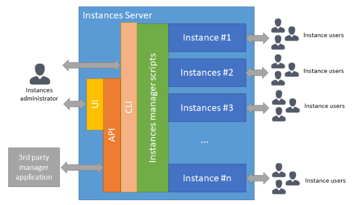

Simplicité; Instances Manager for CentOS
========================================

:::warning

This document applies to the **legacy** Simplicité Instances Manager (SIM) software for **CentOS 7** (this OS is not maintained anymore).

:::

Introduction
------------

### Architecture

The SIM offers a command line interface (CLI), a web services interface (API), built on top of the CLI, and a web user interface (UI),
built on top of the API, to manage several Simplicité instances on a server:



Using the CLI offers the full features of the SIM, the API and the UI offers only a subset of the CLI features.

### Features

The SIM offers the following features:

- Get SIM configuration and statistics
- Upgrade SIM software
- List instances
- Add new instances
- Backup instances
- Rename instances
- Copy instances
- Upgrade instances
- Start instances
- Stop instances
- Reset instance
- Delete instances
- Get instances' configuration
- Get instances' health-check data
- Get instances'default I/O credentials
- Get instances' action history
- View or download instance logs
- Get instance access logs report
- Download instances' data
- Mark instance as protected
- Mark instance as automatically upgraded
- Mark instance as automatically backed up
- Process SonarQube analysis on instance's module
- Run unit tests on a instance

All above actions are triggered manually using the CLI, the API or thee UI.

The following actions are triggered by a system-level task scheduler (cron table);

- Automatic upgrade of instances marked as automatically upgraded
- Automatic backup of instances marked as automatically backed up

Note that the automatic backup can be configured to export the backup files to a remote storage.
Otherwise the backup files are only stored locally on the SIM server.

Implementing pre/post action hooks (see bellow) allow you to customize the standard features of the SIM.

UI usage
--------

The instances manager UI is available on `<base URL>/ui`.

The UI offers uses the API documented bellow and thus offers equivalent - but somehow limited by a simplified user experience - services.

To create a new instance, enter an instance name (or leave empty for an automatic name) then select the version from the **_Create_** button:

To manage an existing instance, click on one instance in the list, then select the action from the **_Action_** button:

The **_Monitor_** action opens a new tab and allow to monitor a given instance by tracking record of recurring health checks:

API usage
---------

The instances manager API is available on `<base URL>/api`.

The API services are using HTTP `GET` methods only and URL-encoded parameters only. All API responses are JSON-encoded.

For all API services, you can get a pretty printed JSON response by appending `&prettyprint=true`.

By default the authentication method is HTTP basic auth (username + password), but client certificate authentication can also be used.
The examples bellow are using the `curl` command HTTP client, `<credentials>` is thus either:

- `-u <username>:<password>` for username + password authentication method
- `--cert-type pem --cert <path to your certificate file> --key <path to your certificate key file>` for client certificate authentication method

### Manager API

#### Get API configuration

```text
curl -k -s <credentials> <base URL>/api[?action=config]
```

The `action` parameter can be omitted in this case as `config` is the default action.

#### Get available versions

```text
curl -k -s <credentials> <base URL>/api?action=versions
```

### Instances API

#### List instances

```text
curl -k -s <credentials> <base URL>/api?action=list[&param=<version>]
```

The parameters are:

- `param` (optional) the version for filtering. If you don't provide an explicit value no version-based filtering is done.

#### Create instance

```text
curl -k -s <credentials> <base URL>/api?action=add[&name=<instance name>][&param=<version (or instance name to clone)>][&options[<option name>]=<option value>]
```

The parameters are:

- `name` (optional) the name of the instance to create, **must** be strictly alphanumerical and of length 3 to 20.
   If you don't provide an explicit name, a random name (10 alphanumerical characters) is generated and used.
- `param` (optional) the version of the instance (e.g. ``) or the name of an existing instance to clone (e.g. `sft65drt7y`).
   If you don't provide an explicit version, the configured default version is used.
- `options[]` (optional) the options array for instance creation:
  - `options[database]` overrides default database (`hsqldb`, `mysql`, `postgresql` depends on which databases engine are available on the server)
  - `options[protected]` overrides default protected flag (`yes` or `no`)
  - `options[auto_save]` overrides default automatic save flag (`yes`or `no`)
  - `options[auto_update]` overrides default automatic update flag (`yes`or `no`)

#### Stop instance

```text
curl -k -s <credentials> <base URL>/api?action=stop&name=<instance name>[&force=<true|false>]
```

The parameters are:

- `name` (**required**) the name of the instance to stop.
- `force` (optional) use "force" stopping strategy (`true`) or standard strategy (`false`= default)

#### Start instance

```text
curl -k -s <credentials> <base URL>/api?action=start&name=<instance name>
```

The parameters are:

- `name` (**required**) the name of the instance to start.

#### Instance health check

```text
curl -k -s <credentials> <base URL>/api?action=health&name=<instance name>
```

The parameters are:

- `name` (**required**) the name of the instance to get health check for.

#### Instance I/O credentials

```text
curl -k -s <credentials> <base URL>/api?action=iocredentials&name=<instance name>
```

The parameters are:

- `name` (**required**) the name of the instance to get I/O credentials from.

#### Instance last logs

```text
curl -k -s <credentials> <base URL>/api?action=logs&name=<instance name>
```

The parameters are:

- `name` (**required**) the name of the instance to get logs for.

#### Download instance logs

```text
curl -k -s <credentials> <base URL>/api?action=download&param=logs&name=<instance name>
```

The parameters are:

- `name` (**required**) the name of the instance to download logs for.

#### Get access logs report

```text
curl -k -s <credentials> <base URL>/api?action=accesslogs&name=<instance name>
```

The parameters are:

- `name` (**required**) the name of the instance to get access logs report for.

#### Upgrade instance

```text
curl -k -s <credentials> <base URL>/api?action=upgrade&name=<instance name>
```

The parameters are:

- `name` (**required**) the name of the instance to upgrade.

#### Upgrade all automatic upgrade instances

```text
curl -k -s <credentials> <base URL>/api?action=upgradeall
```

#### Reset instance

```text
curl -k -s <credentials> <base URL>/api?action=reset&name=<instance name>
```

The parameters are:

- `name` (**required**) the name of the instance to reset.

:::warning
A reset will erase all existing configuration and data.
:::

#### Delete instance

```text
curl -k -s <credentials> <base URL>/api?action=del&name=<instance name>[&force=<true|false>]
```

The parameters are:

- `name` (**required**) the name of the instance to delete.
- `force` (optional) use "force" deletion strategy (`true`) or standard strategy (`false`= default)

#### Clone instance

```text
curl -k -s <credentials> <base URL>/api?action=clone&name=<instance name>&param=<cloned instance name>
```

The parameters are:

- `name` (**required**) the name of the instance to clone.
- `param` (**required**) the name of the cloned instance.

#### Rename instance

```text
curl -k -s <credentials> <base URL>/api?action=rename&name=<instance name>&param=<new instance name>
```

The parameters are:

- `name` (**required**) the name of the instance to rename.
- `param` (**required**) the new name of the instance.

#### Save instance on server

```text
curl -k -s <credentials> <base URL>/api?action=save&name=<instance name>
```

The parameters are:

- `name` (**required**) the name of the instance to save.

#### Save all automatic save instances on server

```text
curl -k -s <credentials> <base URL>/api?action=saveall
```

#### Download instance data

```text
curl -k -s <credentials> <base URL>/api?action=download&param=data&name=<instance name>
```

The parameters are:

- `name` (**required**) the name of the instance to download data for.

#### Download instance webapp

```text
curl -k -s <credentials> <base URL>/api?action=download&param=webapp&name=<instance name>
```

The parameters are:

- `name` (**required**) the name of the instance to download webapp for.

#### Download full instance

```text
curl -k -s <credentials> <base URL>/api?action=download&name=<instance name>
```

The parameters are:

- `name` (**required**) the name of the instance to download.

Once downloaded you can simply unzip the instance and launch it locally:

**Windows**:

```dos
@echo off

set JAVA_HOME=<path to your JDK home, e.g. %CD%\jdk-1.8.0>
set PATH=%JAVA_HOME%\bin;%PATH%

set TOMCAT_ROOT=<path to your instance, e.g. %CD%\tomcat>
set TOMCAT_ADMIN_PORT=8005
set TOMCAT_HTTP_PORT=8080
set TOMCAT_HTTPS_PORT=8443

set JAVA_OPTS=%JAVA_OPTS% -server -Dserver.vendor=tomcat -Dserver.version=9 -Dfile.encoding=UTF-8 -Dgit.basedir=%TOMCAT_ROOT%\webapps\ROOT\WEB-INF\git
set JAVA_OPTS=%JAVA_OPTS%  -Dtomcat.adminport=%TOMCAT_ADMIN_PORT% -Dtomcat.httpport=%TOMCAT_HTTP_PORT% -Dtomcat.httpsport=%TOMCAT_HTTPS_PORT%
if not exist %TOMCAT_ROOT%\work mkdir %TOMCAT_ROOT%\work
if not exist %TOMCAT_ROOT%\temp mkdir %TOMCAT_ROOT%\temp
if not exist %TOMCAT_ROOT%\logs mkdir %TOMCAT_ROOT%\logs
cd %TOMCAT_ROOT%\bin
.\startup.bat
exit
```

**Linux**:

```shell
#!/bin/bash

export JAVA_HOME=<path to your JDK home, e.g. `pwd`/jdk-1.8.0>
export PATH=$JAVA_HOME/bin:$PATH

export TOMCAT_ROOT=<path to your instance, e.g. `pwd`/tomcat>
export TOMCAT_ADMIN_PORT=8005
export TOMCAT_HTTP_PORT=8080
export TOMCAT_HTTPS_PORT=8443

export JAVA_OPTS="$JAVA_OPTS -server -Dserver.vendor=tomcat -Dserver.version=9 -Dfile.encoding=UTF-8 -Dgit.basedir=$TOMCAT_ROOT/webapps/<instance|'ROOT'>/WEB-INF/git"
export JAVA_OPTS="$JAVA_OPTS -Dtomcat.adminport=$TOMCAT_ADMIN_PORT -Dtomcat.httpport=$TOMCAT_HTTP_PORT -Dtomcat.httpsport=$TOMCAT_HTTPS_PORT"
[ ! -d $TOMCAT_ROOT/work ] && mkdir $TOMCAT_ROOT/work
[ ! -d $TOMCAT_ROOT/temp ] && mkdir $TOMCAT_ROOT/temp
[ ! -d $TOMCAT_ROOT/logs ] && mkdir $TOMCAT_ROOT/logs
cd $TOMCAT_ROOT/bin
./startup.sh
```

#### Instance actions history

```text
curl -k -s <credentials> <base URL>/api?action=history&name=<instance name>
```

The parameters are:

- `name` (**required**) the name of the instance to get action history for.

CLI usage
---------

The `sim` CLI offers the following actions:

### CLI actions

#### Usage

```text
sim
```

or

```text
sim --help
```

#### Get configuration

```text
sim config
```

#### Get available versions

```text
sim versions
```

#### Upgrade SIM and retrieve latest templates

```text
sim refresh
```

On a standard SIM deployment, this is done automatically on a regular basis using a dedicated cron task (by default every day during the night).

#### List instances

```text
sim list [<version|single keyword> or SQL:<sql where clause>]
```

Example of SQL where clause (`i` is the table alias for `instances` and `v` the table alias for `versions`):

```text
sim list "SQL:i.version in ('4.0', '5') and i.status = 'started' and i.version_date < v.date"
```

#### List one single instance

```text
sim get <name>
```

#### Add an instance

```text
sim add <name> [<version> [<database>]]
```

If version is omitted the default version is used

If database is omitted the default database is used (note that if you want to specify a database you **must** specify the version)

#### Save an instance

```text
sim save <name>
```

:::note
During the save action the Tomcat process, if running, is suspended to ensure saved data consistency.
:::

#### Reset an instance

```text
sim reset <name> <version>
```

:::warning
A reset action will erase all existing configuration and business data.
:::

#### Delete an instance

```text
sim delete|rm <name>
```

#### Clone an instance

```text
sim clone|cp <name to clone> <cloned name>
```

#### Rename an instance

```text
sim rename|mv <name> <new name>
```

#### Stop/start an instance

```text
sim stop <name>
sim start <name>
```

#### Upgrade an instance

```text
sim upgrade|up <name>
```

#### View last logs of an instance

```text
sim logs <name>
```

#### Download an instance

```text
sim download <name> <type: all|webapp|data|logs>
```

#### Get access logs report for an instance

```text
sim accesslogs <name>
```

#### Control the Tomcat server of an instance (only applicable on a started instance)

```text
sim tomcat-<status|stop|start|debug> <name>
```

Using `debug` is similar to `start` except that the Tomcat server is then started in JPDA debug mode.
The JPDA port is available in the `JPDA_ADDRESS` environment variable.
This port is temporary allowed thru the firewall.

:::warning
Starting Tomcat in debug mode must only be done when required, it slows down your instance and makes it vulnerable.
It is only suitable for punctual debugging.
:::

#### Run ant task for an instance

```text
sim ant-<task: purgelogs|purgejobs|purgesupervisions|purgerecyclebin|purgeexports|purgetempfiles|purgeall|buildindex|...> <name> [<param>]
```

#### Protect/unprotect an instance

```text
sim protect <name>
sim unprotect <name>
```

#### Activate/deactivate nightly upgrade on an instance

```text
sim autoupdate <name>
sim noautoupdate <name>
```

#### Activate/deactivate auto-save on an instance

```text
sim autosave <name>
sim noautosave <name>
```

#### Set/reset custom URL of an instance

```text
sim seturl <name> <custom URL>
sim reseturl <name>
```

#### Set version of an instance

```text
sim setversion <name> <version>
```

:::warning
Only a higher version than current instance version is possible. If set to lower version, the instance will not start anymore.
:::

#### Set status of an instance

```text
sim setstatus <name> <started|stopped>
```

:::warning
The status is set by start/stop actions, use this **only** if there was an unexpected issue and the status is incorrect vs actual instance's status.
:::

#### Get health check of an instance

Only to get a return code:

```text
sim health|healthcheck <name>
```

Or get full health check data:

```text
sim status <name>
```

Or simple ping status:

```text
sim ping <name>
```

#### Show process of an instance

```text
sim ps <name>
```

#### Start shell for instance

```text
sim shell|sh <name>
```

#### Connect to instance's database

```text
sim database|db <name> [<input file>]
```

The client tool used to connect to database depends on the database vendor (e.g. `mysql` client is used for MySQL/MariaDB, `psql` for PostgreSQL, ...)

:::note
With embedded HSQLDB the instance must be stopped before connecting to database.
:::

#### Instance monitoring

```text
sim monitor <name> [<interval in seconds, defaults to 60>]
```

Monitoring is done by calling instance's `/health` endpoint. Each time a monitoring error/warning is detected
a call to the optional hook `monitoring.sh` is done with a reason argument.

#### Run a unit tests shared code on an instance

```text
sim unitttests <name> <unit test shared code name>
```

#### SonarQube analysis for instance's module(s)

```text
sim sonar <name> [<module 1> [<modules 2> ...]]
```

If no module is specified all modules are analysed.

:::note
A SonarQube server must be installed and configured.
:::

#### Advanced CLI usage examples

This example gets status of all instances of a given version:

```text
for NAME in `sim ls 5 | awk '{print $1}'`; do sim health $NAME | grep status; done
```

This example stops all instances with matching names:

```text
sim ls myinstances* | awk '{print $1}' | xargs -L 1 sim stop
```

This more advanced example upgrades all started instances of version `4.0` or `5` that needs upgrade:

```text
sim list "SQL:i.version in ('4.0', '5') and i.status = 'started' and i.version_date < v.date" | awk '{print $1}' | xargs -L 1 sim upgrade
```

Etc.

Hooks
-----

It is possible to extend the manager behavior using the following script hooks (located in `<manager home>/hooks`):

```text
pre-add.sh
post-add.sh
pre-reset.sh
post-reset.sh
pre-upgrade.sh
post-upgrade.sh
pre-save.sh
post-save.sh
pre-start.sh
post-start.sh
pre-stop.sh
post-stop.sh
pre-del.sh
post-del.sh
monitoring.sh
```

All hooks receive as argument their caller script's arguments (e.g. instance name, version and options for `pre/post-add.sh`).

:::note
If your usage of the hooks is to add/alter elements to instances' Tomcat (configuration files, additional Java JARs or static web components, ...)
you need to do it in the `pre/post-add.sh` but also in the `pre/post-upgrade.sh` (and maybe also in the `pre/post-reset.sh`) as upgrade (and reset)
actions reinstall Tomcat.
:::

### Examples

This `post-start.sh` hook looks for a license XML key named `license-<instance-name>.xml`
in the `licensekeys` folder located in the base `$APPS_HOME` folder,
if present this file is loaded on the instance's  I/O endpoint using the appropriate credentials
(which are available as environment variables):

```shell
#!/bin/bash

XML=$APPS_HOME/licensekeys/license-$USER.xml
if [ -f $XML ]
then
	echo "Importing $XML file..."
	RES=`curl -s -u $SERVICE_USER:$SERVICE_PASSWORD --form service=xmlimport --form file=@$XML $SERVICE_URL`
	if [ "$RES" = "OK" ]
	then
		mv -f $XML $XML.`date +%Y%m%d%H%M%S`
		echo "Done"
	else
		echo "Failed to import $XML: $RES"
	fi
else
	echo "No $XML file"
fi
```

:::note
This license key example can easily be transposed to any data import on the I/O endpoint.
:::

Configuration
-------------

### Global settings

The global settings are set as environment variables in the `<manager home>/config.sh` file.

#### Core settings

##### Manager settings

- `APPS_BASEURL` (**mandatory**) manager base URL, e.g. `mymanager.simplicite.io`
- `APPS_USERNAME` (optional) manager username (defaults to `simplicite`)
- `APPS_PASSWORD` (optional but highly recommended), manager password (defaults to `simplicite`)
- `APPS_ROOTCONTEXT` (optional) deploy instances as root context `true/false` (defaults to `true`)
- `APPS_DEFAULTVERSION` (optional) default Simplicité version
- `APPS_DATABASES` (optional) managed database types (comma-separated list of `hsqldb`, `mysql`, `postgresql`, `oracle` and `mssql` (defaults to `hsqldb,mysql,postgres`)
- `APPS_DEFAULTDATABASE` (optional) default database type (one of above list items, defaults to `hsqldb`)
- `APPS_MAXINSTANCES` maximum number of instances, `0` means no limit (defaults to `0`)
- `APPS_ALLOWDOWNLOAD` (optional) allow download of instances (`yes/no`, defaults to `yes`)
- `APPS_DEFAULTPROTECTED` (optional) create instances protected by default? (`yes/no`, defaults to `no`)
- `APPS_DEFAULTAUTOSAVE` (optional) create instances auto-saved by default? (`yes/no`, defaults to `no`)
- `APPS_DEFAULTAUTOUPDATE` (optional) create instances auto-updated by default? (`yes/no`, defaults to `yes`)
- `APPS_GOOGLE_API_KEY` (optional) Google API key to use on instances (defaults to `none`)
- `APPS_REALMNAME` (optional), authentication realm name (defaults to `Simplicite Instance Manager`)
- `APPS_EMAIL` (optional), support email address (defaults to `support@simplicite.io`)

##### System settings

:::warning
These system settings **SHOULD NOT** be changed unless you know precisely what you are doing.
:::

- `APPS_USER` Linux user used by the manager (defaults to `simplicite`)
- `APPS_GROUP` Linux group used by the manager (defaults to `simplicite`)
- `APPS_HOME` Home directory in which the manager is located (defaults to `/var/simplicite`)

##### Reverse proxy settings

- `APPS_HTTPSERVER` Reverse proxy used by the manager (`nginx/traefik`, defaults to `nginx`)

##### SSL settings

- `APPS_SSL` (optional) use SSL ? 'true/false/force` (defaults to `true`)
- `APPS_SERVER_CERT` (mandatory if use SSL = `true`) server certificate (stored in `/etc/ssl`)
- `APPS_SERVER_KEY` (mandatory if use SSL = `true`) server certificate's key (stored in `/etc/ssl`)
- `APPS_SERVER_CA_CERT` (optional) CA certificate to use for server (stored in `/etc/ssl`)
- `APPS_CLIENT_CA_CERT` (optional) CA certificate to use for client authentication on manager UI & API (stored in `/etc/ssl`)
- `APPS_CLIENT_CA_PATH` (optional) path of CA certificate to use for above client authentication check

#### Backup settings

- `APPS_SAVE_DIR` custom location for local directory used by manual save actions (defaults to `$APPS_HOME/save`,
  **MUST** be changed if the size of the `$APPS_HOME` is not adapted for the volumes of the backup files)
- `APPS_SAVE_DIR_DEPTH` depth (in days) of local save directory files (defaults to `0` which means no limit, minimum value is `1`)
- `APPS_SAVEALL_DIR` custom location for local directory used by automatic save action (defaults to `$APPS_SAVE_DIR`)
- `APPS_SAVEALL_REMOVE_LOCAL` (optional) remove local automatic save files after transfer? `true/false` (defaults to `false`)

The following parameters only applies to the upgrade action (manual or automatic):

- `APPS_SAVEBEFOREUPGRADE` do an automatic save action before any upgrade
- `APPS_BACKUPBEFOREUPGRADE` do a backup before any upgrade = copies the `tomcat` directory of the instance as `tomcat.upgrade.bak`

##### SCP destination

- `APPS_SCP_SERVER` (optional) server to copy backups to using SCP protocol (with private/public SSH keys)
- `APPS_SCP_USER` (optional) user for SCP server
- `APPS_SCP_PATH` (optional) path on SCP server

##### FTP destination

- `APPS_FTP_SERVER` (optional) server to copy backups to using FTP protocol
- `APPS_FTP_USER` (optional) user for FTP server
- `APPS_FTP_PASSWORD` (optional) user for FTP server
- `APPS_FTP_PATH` (optional) path on FTP server

##### OpenStack object storage container destination

- `APPS_OS_CONTAINER` (optional) **main** URL of the OpenStack container to copy backups to using HTTP protocol
- `APPS_OS_PREFIX` (optional) prefix to prepend to the name of stored files in the **main** container
- `APPS_OS_CONTAINER_ALT` (optional) **secondary** URL of the OpenStack container to copy backups to using HTTP protocol
- `APPS_OS_PREFIX_ALT` (optional) prefix to prepend to the name of stored files in the **secondary** container
- `APPS_OS_AUTH_URL` (optional) OpenStack authentication URL
- `APPS_OS_TENANT_NAME` (optional) OpenStack tenant
- `APPS_OS_USERNAME` (optional) OpenStack user
- `APPS_OS_PASSWORD` (optional) OpenStack password

##### Google Cloud object storage bucket destination

- `APPS_GS_BUCKET` (optional) name of the Google Cloud storage bucket to copy backups to using the `gsutil` tool (which needs to be configured manually)

##### AWS S3 object storage bucket destination

- `APPS_S3_BUCKET` (optional) name of the AWS S3 storage bucket to copy backups to using the `aws s3` tool (which needs to be configured manually)

#### E-mail settings

- `APPS_MAILSERVER` (optional) mail server IP address or host name (no default)
- `APPS_MAILPORT` (optional) mail server port (no default)
- `APPS_MAILUSER` (optional) mail service username (no default)
- `APPS_MAILPASSWORD` (optional) mail service password (no default)

#### SonarQube settings

- `APPS_SONARURL` (optional) SonarQube server URL (defaults to `https://sonarqube.io`)
- `APPS_SONARLOGIN` (optional) login or security token to connect to SonarQube server (no default)
- `APPS_SONARPASSWORD` (optional) password to connect to SonarQube server, not required if the above is a security token  (no default)
- `APPS_SONARORG` (optional) organization name, not applicable to SonarQube _community edition_ (no default)

#### Databases settings

##### MySQL settings

- `APPS_MYSQL_HOST` (optional) database server IP address or hostname (defaults to `localhost`)
- `APPS_MYSQL_PORT` (optional) database server port (defaults to `3306`)
- `APPS_MYSQL_ADMINUSER` (optional) database administrator user (defaults to `root`)
- `APPS_MYSQL_ADMINPASSWORD` (optional) database administrator password (defaults to empty string)

##### PostgreSQL settings

- `APPS_POSTGRESQL_HOST` (optional) database server IP address or hostname (defaults to `localhost`)
- `APPS_POSTGRESQL_PORT` (optional) database server port (defaults to `5432`)
- `APPS_POSTGRESQL_ADMINUSER` (optional) database administrator user (defaults to `postgres`)
- `APPS_POSTGRESQL_ADMINPASSWORD` (optional) database administrator password (defaults to `postgres`)

##### Oracle settings

- `APPS_ORACLE_HOST` (optional) database server IP address or hostname (defaults to `localhost`)
- `APPS_ORACLE_PORT` (optional) database server port (defaults to `1521`)
- `APPS_ORACLE_ADMINUSER` (optional) database administrator user (defaults to `sys`)
- `APPS_ORACLE_ADMINPASSWORD` (optional) database administrator password (defaults to `manager`)

Note that other Oracle-related environment variable can be set here if not set otherwise, e.g:

```shell
ORACLE_HOME=/u01/app/oracle/product/11.2.0/xe
LD_LIBRARY_PATH=${ORACLE_HOME}/lib:${LD_LIBRARY_PATH}
SQLPATH=${ORACLE_HOME}/lib:${SQLPATH}
PATH=${ORACLE_HOME}/bin:${PATH}
NLS_LANG=AMERICAN_AMERICA.UTF8
ORACLE_SID=XE
```

##### SQLServer settings

- `APPS_MSSQL_HOST` (optional) database server IP address or hostname (defaults to `localhost`)
- `APPS_MSSQL_PORT` (optional) database server port (defaults to `1433`)
- `APPS_MSSQL_ADMINUSER` (optional) database administrator user (defaults to `SA`)
- `APPS_MSSQL_ADMINPASSWORD` (optional) database administrator password (defaults to empty string)

Note that other SQLServer-related environment variable can be set here if not set otherwise:

```shell
MSSQL_HOME=/opt/mssql-tools
PATH=${MSSQL_HOME}/bin:${PATH}
```

### Version-level settings

The version-level settings are set as environment variables in the `<manager home>/version-<version>.sh` file (**without** the `export` keyword)

#### JVM settings

- `APPS_JDK` (**mandatory**) JDK to use (must point to a JDK root folder such as `/usr/lib/jvm/java-1.8.0`)
- `APPS_ENCODING` (**mandatory**) encoding to use with considered version (should be `UTF-8` unless your version's
  template is specifically packaged for another encoding)
- `APPS_TOMCATMINMEM` (optional) minimum JVM memory in Mb (defaults to `128`)
- `APPS_TOMCATMAXMEM` (optional) maximum JVM memory in Mb (defaults to `512`)

#### Auto-patching at instance startup

- `APPS_AUTOUPGRADE` (optional) use built-in system patches application at instance's startup instead of legacy patches import
(defaults to `true` for versions 4.0 and more recent and to `false` for versions lower than 4.0)

:::note
This feature is different from the fact that the instance is marked as nightly updated.
:::

This `APPS_AUTOUPGRADE` setting just refers to the way an instance is being updated by the SIM:

- `false` = **legacy** mode = the SIM updates the webapp and imports the patches thru the I/O interface of the instance
- `true` = **auto-patching** mode = the SIM only updates the webapp and the patches are applied by the instance itself at startup

### Instance-level settings

The instance-level settings are set as environment variables in the `<instance home>/.simplicite` file.

:::warning
These variables are set upon creation of the instance based on the global configuration.
In general they should not be changed manually unless you know what you are doing.
:::

Example:

```text
SERVICE_CONTEXT=
SERVICE_TOMCATMINMEM=256
SERVICE_TOMCATMAXMEM=1024
SERVICE_URL=http://localhost:10078/io
SERVICE_USER=designer
SERVICE_PASSWORD=d98990faa918c84584ef
SERVICE_DATABASE=oracle
SERVICE_DATABASE_HOST=localhost
SERVICE_DATABASE_PORT=1521
SERVICE_ORACLE_SID=XE
SERVICE_AUTOUPGRADE=true
SERVICE_DEBUG=false
SERVICE_DEBUG_ORIGIN=192.168.0.0
```

#### SonarQube

You can add the following variables for instance-specific SonarQube analysis settings:

- `SERVICE_SONARPROJECT` to override the default project name/key prefix for the analysed modules (defauts to `<base URL>-<instance name>`).
  Note that the module name is appended to this as `-<module name>` in all cases.
- `SERVICE_SONARURL` URL of SonarQube server URL (defaults to `$APPS_SONARURL`)
- `SERVICE_SONARLOGIN` URL of SonarQube login (defaults to `$APPS_SONARLOGIN`)
- `SERVICE_SONARPASSWORD` URL of SonarQube password (defaults to `$APPS_SONARPASWORD`)
- `SERVICE_SONARORG` URL of SonarQube server (defaults to `$APPS_SONARORG`)

#### Git credentials

If you are not using SSH keys and SSH URIs for your remote Git repositories, you can set the username and a password of your remote using:

- `SERVICE_REMOTE_GIT_USERNAME` remote Git username
- `SERVICE_REMOTE_GIT_PASSWORD` remote Git password

Note that you can also define a username and a password in each configuration of your modules,
these global variables are only used as fallback if no explicit username and password are defined.
