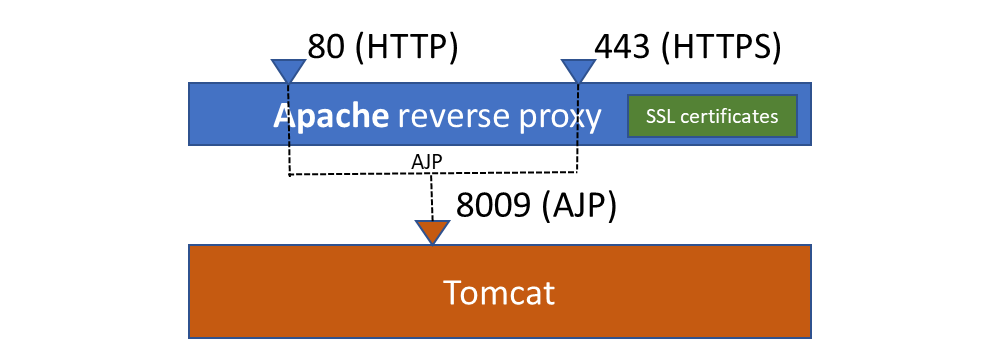
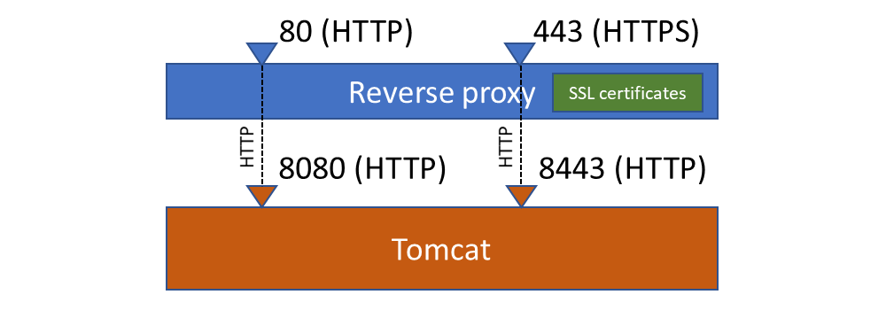
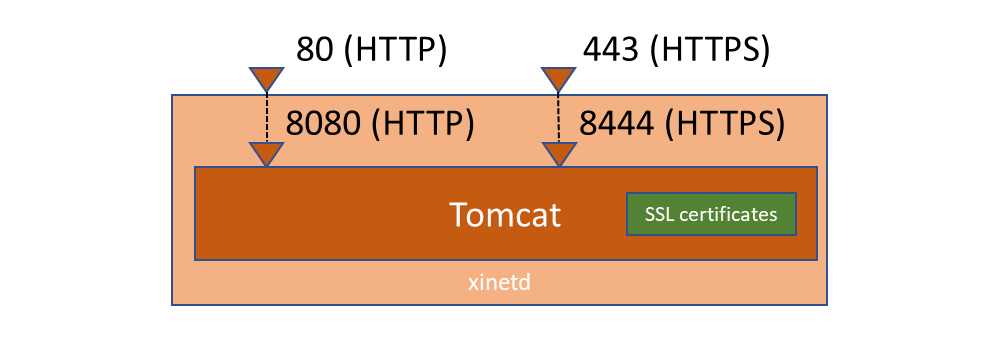

Tomcat installation on Linux server
===================================

> **Warning**: before choosing this "traditional" installation procedure you should consider other approaches
such as using [Docker containers](/docs/operation/docker).

This document corresponds to a manual step-by-step installation on an out of the box **Linux CentOS 7**.

However the procedure should be rather similar with other modern Linux distributions of the RedHat family (RedHat ES, Fedora, ...).
It should also be easily transposable to Debian flavored Linux distribution.

If you are looking for installation guideline for a Windows server installation, please refer
to [this document](/docs/operation/tomcat-installation-windows).

Prerequisites
-------------

As `root` or using `sudo`, install all required packages and do all required system configurations:

### System encoding

Adjust `LANG` environment variable to appropriate value (e.g. `en_US.UTF8` for UTF-8 or `en_US` for ISO-8859-1) in `/etc/sysconfig/i18n`.

### Time zone for system date

Set appropriate timezone (change `Europe/Paris` to your timezone):

```bash
rm /etc/localtime
ln -s /usr/share/zoneinfo/Europe/Paris /etc/localtime
```

### Network time

Install the NTP daemon:

```bash
yum install ntp
```

Enable and start it:

```bash
systemctl enable ntpd.service
systemctl start ntpd.service
```

### Random entropy generator

Install a entropy generator (useful for all random-related stuff including SSL and Tomcat's sessions)

```bash
yum install epel-release
yum install haveged
```

Enable it and start it:

```bash
systemctl enable haveged
systemctl start haveged
```

### OpenJDK

```bash
yum install java-latest-openjdk [java-latest-openjdk-devel]
```

Check (or change) the Java version used by the server:

```bash
alternatives --config java
```

### Apache Ant

Install Ant from Apache website as distribution's version is quite old and has too many dependencies

```bash
wget http://www-eu.apache.org/dist/ant/binaries/apache-ant-1.10.1-bin.tar.gz
sudo mv apache-ant-1.10.1 /opt/
tar xvfz apache-ant-1.10.1-bin.tar.gz
sudo ln -s /opt/apache-ant-1.10.1 /opt/ant
sudo sh -c 'echo ANT_HOME=/opt/ant >> /etc/environment'
sudo ln -s /opt/ant/bin/ant /usr/bin/ant
```

Log out and log back in, to reload the environment variables defined in /etc/environment.
Check ant version

```text
ant -version
```

### Databases

Install the package for the chosen database engine:

#### HSQLDB

Nothing to do (HSQLDB JAR is part of the application's libraries)

#### MariaDB (or MySQL)

Install the server and the JDBC driver:

```bash
yum install mariadb-server mysql-connector-java
```

Or on older distributions providing MySQL instead of MariaDB:

```bash
yum install mysql-server mysql-connector-java
```

Check and adjust if needed the maximum packet size, e.g. set `max_allowed_packet = <n>M` (where `<n>` is `16` or `32` or above)
in `/etc/my.cnf` (in section `[mysqld]`)

#### PostgreSQL

Install the server and the JDBC driver:

```bash
yum install postgresql-server postgresql-jdbc
```

### Application account

Create a dedicated account:

```bash
useradd simplicite
```

Connect this account:

```bash
su - simplicite
```

### Tomcat

Clone the **preconfigured** Tomcat package (which is just an out of the box Tomcat package with administration webapps removed,
with some settings fine-tuned and with some additional jars in the `lib` folder) with appropriate credentials:

```text
git clone https://<username>[:<password>]@platform.git.simplicite.io/tomcat.git
```

Make sure the `tomcat/temp` folder is present and writeable, this is **mandatory** for images thumbnails generation.

Then, make sure the `tomcat/logs` folder is present and writeable, this is **mandatory** for logging.

Add aliases in the `simplicite` user's `.bashrc` or in a global `/etc/profile.d/simplicite.sh` :

```bash
alias vi=vim
alias rm='rm -i'
alias cp='cp -i'
alias mv='mv -i'
alias dir='ls -alF'
alias tomcat='sudo /etc/init.d/tomcat'
export TOMCAT_ROOT=$HOME/tomcat
alias tt="tail -100f $TOMCAT_ROOT/logs/catalina.out"
alias ts="tail -100f $TOMCAT_ROOT/webapps/ROOT/WEB-INF/log/simplicite.log"
export ANT_OPTS="$ANT_OPTS -Dtomcat.root=$TOMCAT_ROOT -Dtomcat.host=localhost -Dtomcat.httpport=8080 -Dtomcat.httpsport=8443 -Dtomcat.sslport=8444 -Dtomcat.ajpport=8009 -Dtomcat.adminport=8005 -Dservice.url=http://localhost:8080/io"
```

### Others

Optionally, you can add extra useful packages (back as `root`):

	yum install vim git wget lynx nmap ...

Option 1 - Expose Tomcat using an Apache AJP reverse proxy
----------------------------------------------------------

As `root`, install apache with SSL module :

	yum install httpd mod_ssl

Add this to `/etc/httpd/conf/httpd.conf` for an HTTP endpoint:

```apache
ProxyPass /[<myapp>/] ajp://localhost:8009/[<myapp>/] [secret=<AJP secret if applicable>]
```

Where `<myapp>` is the actual deployment context path of your webapp if your it is not deployed as root webapp.

You can also add the same directive for an HTTPS endpoint.

This corresponds to the following configuration:



Enable and start Apache:

	systemctl enable httpd.service
	systemctl start httpd.service

> **Note**: if you get HTTP `503` error on this page you can try running the following command as `root`: `chcon -Rt httpd_sys_content_t /var/www`

Create `/etc/init.d/tomcat` script with following content:

```bash
#!/bin/sh
#
# Tomcat Control Script
#
# chkconfig: 2345 85 25
#
# description:  Start up the tomcat engine.

# Source function library.
. /etc/init.d/functions

RETVAL=$?

JAVA_OPTS="-Xms512m -Xmx1024m -Dplatform.autoupgrade=true"
export JAVA_OPTS
TOMCAT_HOME="/home/simplicite/tomcat"
TOMCAT_USER="simplicite"

case "$1" in
start)
	echo $"Starting tomcat engine"
	cd $TOMCAT_HOME/bin
	/bin/su $TOMCAT_USER startup.sh
	;;
stop)
	echo $"Stopping tomcat engine"
	cd $TOMCAT_HOME/bin
	/bin/su $TOMCAT_USER shutdown.sh
	;;
*)
	echo $"Usage: $0 {start|stop}"
	exit 1
	;;
esac

exit $RETVAL
```

Adjust `JAVA_OPTS` to suitable settings for your environment.

Make this script executable:

	chmod +x /etc/init.d/tomcat

Enable and start Tomcat:

	chkconfig tomcat on
	/etc/init.d/tomcat start

Option 2 - Expose Tomcat using a NGINX HTTP reverse proxy
---------------------------------------------------------

As `root`, install NGINX :

	yum install epel-release
	yum install nginx

> **Note**: check [this page](http://wiki.nginx.org/Install) for details on NGINX installation

Add a new `tomcat.conf` configuration file in `/etc/nginx/conf.d` with following content:

```nginx
server {
    listen 80;
    server_name <server name>;
    access_log /var/log/nginx/<server name>.log main;
    location /[<myapp>] {
        # Uncomment this block if you need to enable CORS
        #if ($request_method = 'OPTIONS') {
        #    add_header Access-Control-Allow-Origin $http_origin;
        #    add_header Access-Control-Allow-Credentials true;
        #    add_header Access-Control-Allow-Headers Content-Type,Authorization,X-Requested-With,X-HTTP-Method-Override,X-Simplicite-Authorization;
        #    add_header Access-Control-Allow-Methods GET,POST,PUT,DELETE,HEAD,OPTIONS;
        #    add_header Access-Control-Max-Age 1728000;
        #    add_header Content-Type text/plain;
        #    add_header Content-Length 0;
        #    return 204;
        #}
        if ($request_method ~ '(GET|POST)') {
        #    Uncomment these 3 lines if you need to enable CORS
        #    add_header Access-Control-Allow-Origin $http_origin always;
        #    add_header Access-Control-Allow-Credentials true always;
        #    Uncomment these 3 lines if you need to enable CSP and other security directives (make sure to add specific directives for external services your application may use e.g. Google Maps, ..)
        #    add_header Content-Security-Policy "default-src 'self'; img-src 'self' data:; script-src 'self' 'unsafe-inline' 'unsafe-eval' blob:; style-src 'self' 'unsafe-inline'; font-src 'self' data:" always;
        #    add_header X-Frame-Options SAMEORIGIN always;
        #    add_header X-XSS-Protection "1; mode=block" always;
        }
        proxy_redirect off;
        proxy_buffering off;
        proxy_read_timeout 86400s;
        proxy_send_timeout 86400s;
        proxy_set_header Host $http_host;
        proxy_set_header X-Real-IP $remote_addr;
        proxy_set_header X-Forwarded-For $proxy_add_x_forwarded_for;
        proxy_set_header X-Forwarded-Proto https;
        proxy_redirect off;
        proxy_pass http://localhost:8080[/<myapp>];
        proxy_http_version 1.1;
        proxy_set_header Upgrade $http_upgrade;
        proxy_set_header Connection "upgrade";
    }
    #
}
```

Where `<myapp>` is the actual deployment context path of your webapp if your it is not deployed as root webapp.

You can duplicate the above block to expose also an HTTPS endpoint on port `443` with **additional** appropriate SSL certificates directives.

This corresponds to the following configuration:



Note that a default `robots.txt` file is deployed at the root of the web application to prevent any indexation from regular indexation robots.
This avoids useless public sessions to be created by these robots. But sometimes you may also need to handle your web monitoring tool(s) requests
for the same reason. To do so you need to find a way to recognize your web monitoring tool(s) requests (usually from its user agent string
or from its origin IP, etc.) and redirect all traffic to the `/health` health-check page.

E.g. for a monitoring tool whose user agent starts with `MyMonitorTool` you can add this to your NGINX configuration (before the `location /<webapp>` bloc):

```nginx
    if ($request_uri != "/health") {
        set $monitor A;
    }
    if ($http_user_agent ~* "^NodeUptime.*$") {
        set $monitor "${monitor}B";
    }
    if ($monitor = AB) {
        rewrite ^/.*$ /health permanent;
    }
```

Change/add these configuration items in the main NGINX configuration file as `root`:

	vi /etc/nginx/nginx.conf

```
http {
(...)
	client_max_body_size 100M;
	gzip on;
	gzip_types text/plain text/css text/javascript text/xml application/json application/javascript application/x-javascript;
	server_names_hash_bucket_size 128;
(...)
}
```

Enable and start NGINX:

	systemctl enable nginx.service
	systemctl start nginx.service

The rest is the same as above for Apache.

> **Note**: SELinux may be causing HTTP `502` errors, check [this post](http://stackoverflow.com/questions/27435655/nginx-proxy-pass-not-working-in-selinux) for a solution that works.
> A quick solution being to run the following command as `root`: `setsebool httpd_can_network_connect 1 -P`

Option 3 - Expose Tomcat using the xinetd daemon
------------------------------------------------

The xinetd daemon allows to expose Tomcat HTTP (`8080`) and HTTPS (`8444`) ports as default HTTP (`80`) and HTTPS (`443`) ports.

In this case Apache and/or NGINX **must** be inhibited.

As `root`, install xinetd :

```bash
yum istall xinetd
```

Create `/etc/xinetd.d/tomcat-http` as follows:

```text
service http
{
	disable = no
	socket_type = stream
	user = root
	wait = no
	redirect = 127.0.0.1 8080
}
```

Create `/etc/xinetd.d/tomcat-https` as follows:

```text
service https
{
	disable = no
	socket_type = stream
	user = root
	wait = no
	redirect = 127.0.0.1 8444
}
```

This corresponds to the following configuration:



Enable and start xinetd:

```bash
systemctl enable xinetd
systemctl start xinted
```

The `/etc/init.d/tomcat` script (and associated commands) is the same as when using above Apache reverse proxy option.

Option 4 - Expose Tomcat using the jsvc daemon
----------------------------------------------

Tomcat provides a tool (that needs to be compiled) to allow it to use default HTTP (`80`) and HTTPS (`443`) ports.

In this case Apache and/or NGINX **must** be inhibited.

As `root`, install the gcc compiler:

```bash
yum install gcc make
```

Compile `jsvc`:

```bash
cd tomcat/bin
tar xvfz commons-daemon-native.tar.gz
cd commons-daemon-x.y.z-native-src/unix
./configure --with-java=/usr/lib/jvm/java
gmake
mv jsvc ../..
```

Add this to `tomcat/bin/daemon.sh` if not present in the options section:

```text
	--catalina-out )
		CATALINA_OUT="$2"
		shift; shift;
		continue
	;;
```

Change ports in `tomcat/conf/server.xml`: `8080`to `80` and `8444` to `443`.

This corresponds to the following configuration:


Create `/etc/init.d/tomcat` script with following content:

```bash
#!/bin/sh
#
# Tomcat for Control Script
#
# chkconfig: 2345 85 25
#
# description:  Start up the Tomcat engine.

# Source function library.
. /etc/init.d/functions

RETVAL=$?

JAVA_OPTS="-Xms512m -Xmx1024m -Dplatform.autoupgrade=true"
export JAVA_OPTS
TOMCAT_HOME="/home/simplicite/tomcat"
TOMCAT_USER="simplicite"
TOMCAT_JVM="/usr/lib/jvm/java"
TOMCAT_LOG="/var/log/tomcat.log"
TOMCAT_PID="/var/run/tomcat.pid"
OPTS="--java-home $TOMCAT_JVM --tomcat-user $TOMCAT_USER --catalina-out $TOMCAT_LOG --catalina-pid $TOMCAT_PID"

case "$1" in
start)
	echo $"Starting tomcat engine"
	cd $TOMCAT_HOME/bin
	./daemon.sh $OPTS start
	;;
stop)
	echo $"Stopping tomcat engine"
	cd $TOMCAT_HOME/bin
	./daemon.sh $OPTS stop
	;;
*)
	echo $"Usage: $0 {start|stop}"
	exit 1
	;;
esac

exit $RETVAL
```

Adjust `JAVA_OPTS` to suitable settings for your environment.

Make this script executable:

```bash
chmod +x /etc/init.d/tomcat
```

Enable and start Tomcat:

```bash
chkconfig tomcat on
/etc/init.d/tomcat start
```

Notes
-----

### Max upload size

By default the maximum file upload allowed (from a POST request by Tomcat is of 2Mb. In most cases you need to increase this to match
the value of the `MAX_UPLOAD_SIZE` system parameter (which defaults to 100Mb). To do so you need to set the `maxPostSize` of the Tomcat Connector accordingly.

If you are using NGINX as reverse proxy you must also add `client_max_body_size 100M` to the `/etc/nginx/nginx.conf` file.

### GZip compression

By default, the GZip compression is **not** activated on Tomcat HTTP(S) connector(s). You can activate it
by adding `compression="on" compressableMimeType="text/html,text/plain,text/xml,text/json,text/css,text/javascript,application/javascript,application/json"`
to your connector(s).

Add this only on HTTP(S) connector(s), not on the AJP connector.

Don't add this if your connectors are accessed by a web server configured as a reverse proxy, in this case the GZip compression
**must** be configured at the web server (Apache or NGINX) level.

For Apache acting as AJP reverse proxy add this to `/etc/httpd/conf/httpd.conf` to enable compression:

```apache
(...)
DeflateCompressionLevel 9
AddOutputFilterByType DEFLATE text/html
AddOutputFilterByType DEFLATE text/plain
AddOutputFilterByType DEFLATE text/css
AddOutputFilterByType DEFLATE text/javascript
AddOutputFilterByType DEFLATE text/xml
AddOutputFilterByType DEFLATE application/json
AddOutputFilterByType DEFLATE application/javascript
AddOutputFilterByType DEFLATE application/x-javascript
(...)
```

For NGINX acting as HTTP reverse proxy the compression configuration is described above.
