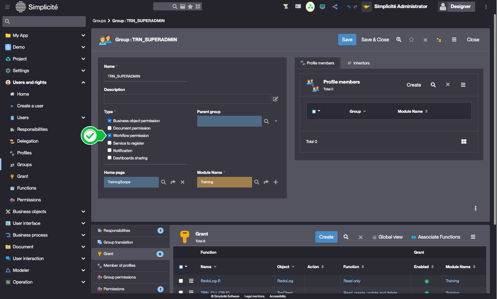
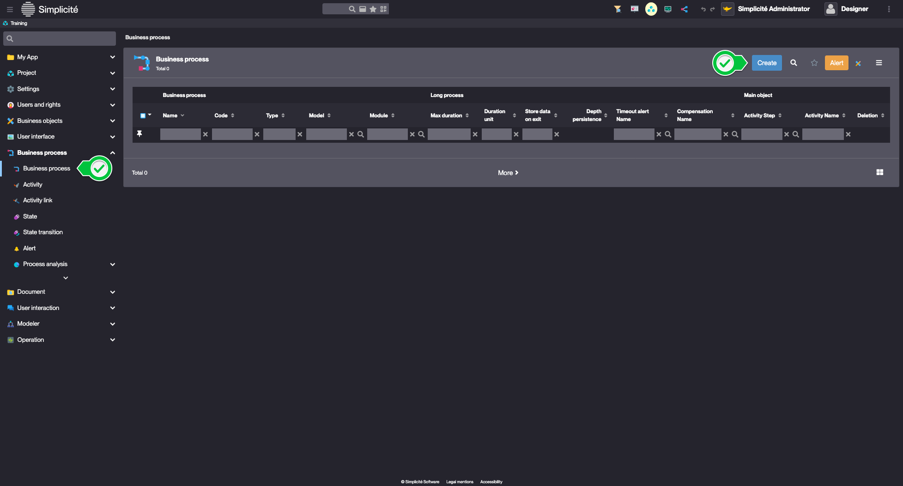
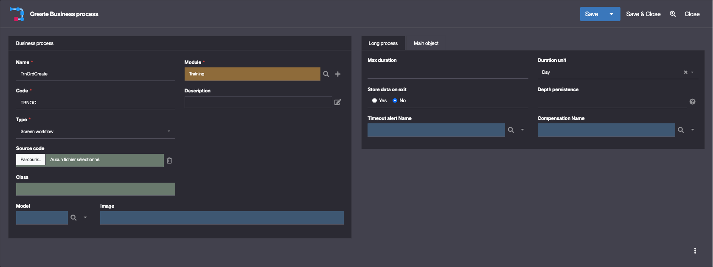
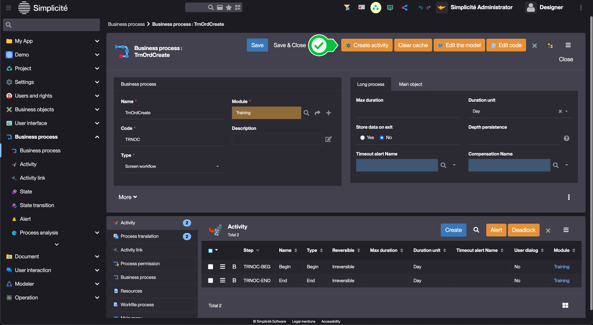
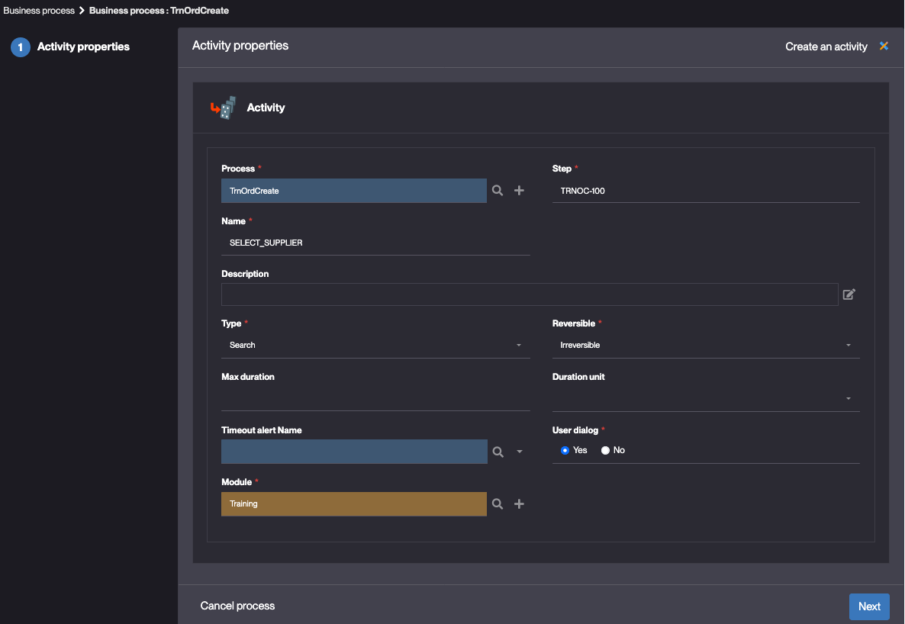
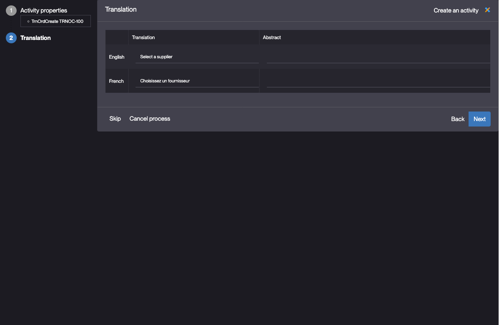

# Building the "Order Management" Training App : Implementing a business process

> Prerequisite : [You have a basic understanding of the Simplicité platform, and the steps in "2. Expanding your app" are completed](/category/2-expanding-your-app)

## What is a business process ?

A process is a sequence of screens that guides the user through a specific process. It can be used to create, update, delete, or approve data... [Learn more](/make/businessprocess/business-process)

## Creating a screen workflow to create an order

:::warning
Before starting, make sure the `TRN_SUPERADMIN` Group has the `Workflow permission` type :
    
:::

To create a screen workflow to create an order, follow the steps below :

1. In the **Business process > Business process** menu, click **Create**
    
2. Fill in the **Business process** fields like so :
    - Name : **TrnOrdCreate**
    - Code : **TRNOC**
    - Module : **Training**	
	<details>
            <summary>Configuration</summary>

            
    </details>
3. Click **Save**
4. In the **Activity** panel, click **Create**

### Creating the "Select a supplier" Activity

1. Click **Create Activity**
	
2. Fill in the **Activity** fields like so :
	- Step : **TRNOC-100** (*`TRNOC` being the Process code - `100` being the Activity's order*)
	- Name : **SELECT_SUPPLIER**
	- Type : **Search**
	<details>
            <summary>Configuration</summary>

            
    </details>
3. Click **Next**
4. Fill in the Activity's **Translation** like so :
	- English : **Select a supplier**
	<details>
            <summary>Configuration</summary>

            
    </details>
5. Click **Next**


Add 4 activities and link them together:
* Activity for selecting the customer who places the order
* Activity for selecting the supplier
* Activity for selecting the product in stock. Must be filtered by supplier selected before.
* Activity to create the order with predefined options

Enable permissions to activities.

## Human task
It allows to configure a long process wizard like for task tracking. The process may have a limited time to process as well as all activities. For our example, this allows you to add a process for order processing by the supplier with different statuses and processing times to be respected.


# Complex workflow

## Scripting
The default behavior of the process can be replaced via hooks in the Java script of the business process.

## Conditional link / Routing
You can add a condition on the activity transition to configure conditional behavior.  
Use `[DEFAULT]` to configure the default link.  

### Exercise
Display a message to the user if the chosen supplier does not have a product in stock using the preValidate hook.  
```java
	@Override
	public Message preValidate(ActivityFile context) {
		Message m = new Message();
		AppLog.info("DEBUG contex:"+context.toJSONObject(), getGrant());
		String step = context.getActivity().getStep();
		if("PRDSEL".equals(step)){
			ObjectDB prd = getGrant().getTmpObject("TrnProduct");
			synchronized(prd.getLock()){
				prd.setFieldFilter("trnProSupId",context.getDataValue("Field", "row_id"));
				prd.setFieldFilter("trnProStock", 0);
				List<String[]> rows = prd.search();
				if (Tool.isEmpty(rows)){
					AppLog.info("DEBUG empty", getGrant());
					m.raiseError("TRN_ERR_QTE_NEG");
					return m; 
				}
			} 
			
		}
		return super.preValidate(context);
	}
```

## Activity transition
You can add transitions between activities with a specific action (button).
For example, add a button to ignore the product selection.  

## Redirection
Using data from the Forward group, you can configure the redirection of the activity.
With a `Forward` `Page` you can, for example, add a redirection in the end activity to the new order you have just created.

Use a data parameter from the `Forward` group to use row_id in the url.

## Alerts
You can set up alerts by email, social, log ... in the Business Process/Alerts menu.
These alerts can be called up from the workflow to alert the user to updates, for example.
(This can also be useful in the status diagram).
Since version 5.3, it is advisable to use the **Notifications** module to alert users to data updates/creations/deletions.


### Exercise
Add a alert of type social,message to all customers whose orders have been cancelled.
