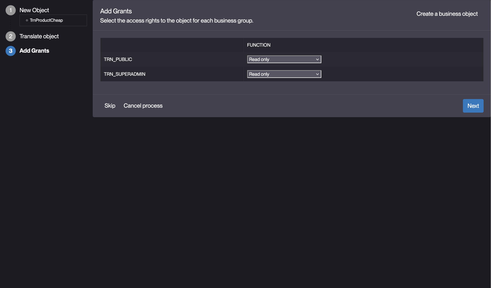
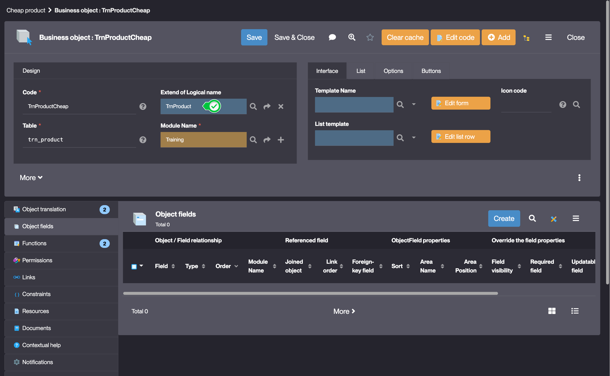
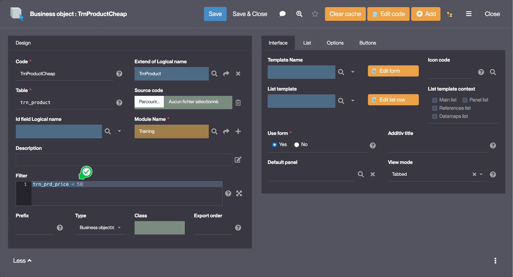
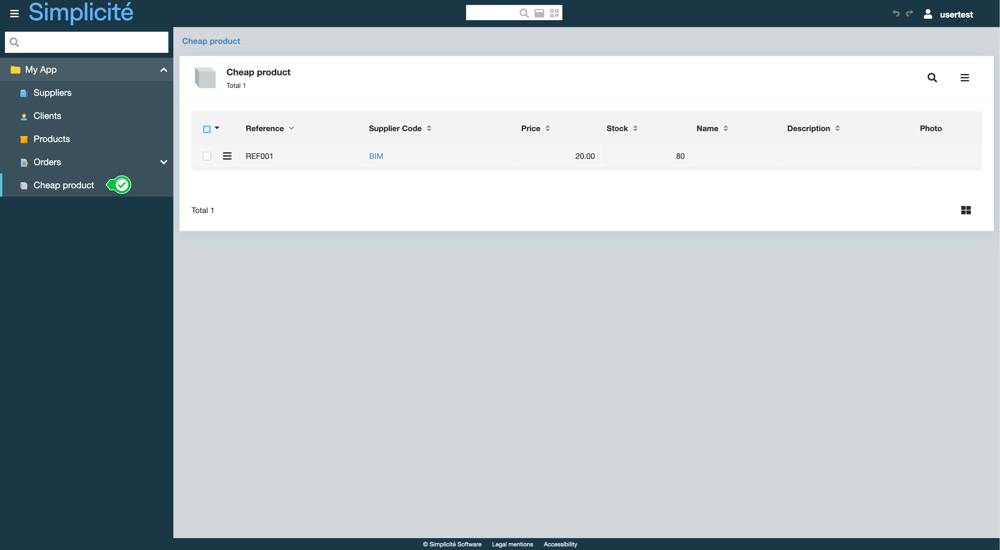

# Building the "Order Management" Training App : Creating an inherited object

> Prerequisite : [You have a basic understanding of the Simplicité platform, and the steps in "2. Expanding your app" are completed](/category/2-expanding-your-app)

## What is inheritance ?

Inheritance is a mechanism that allows a Business Object to inherit properties and methods from another Business Object. In Simplicité, inheritance can be used to customize a System Object, display filtered lists... [Learn more](/make/businessobjects/business-objects.md#configuration)

## Creating an inheritor of TrnProduct

Let's use the inheritance pattern to access a list of "cheap" Products (price ranging from 10 to 50€).

To do so, follow the steps below :
1. In the **Business objects > Business objects** menu, click **Creation assistant** 
    > For a detailed guide, see [Add an object](/tutorial/expanding/addobjects)
2. Create a Business object :
    - Code : **TrnProductCheap**
    - Table : **trn_product** (the table is the same as the parent object's)
3. Click **Next**
4. Create a Translation for the object :
    - English : **Cheap products|Cheap product**
5. Grant a Read only function to the *TRN_SUPERADMIN* Group
     
<!--

    
Screenshot

    

-->
6. Follow all the steps of the creation process
7. In the **Extend of Logical name** field of **TrnProductCheap**, select **TrnProduct**  
    
8. Click **More** on the Objects form  
    
9. Set the following value in the **Filter** field : `trn_prd_price < 50`   
    
10. Click **Save**

## Test the newly created inheritor with `usertest` 

1. Clear the platform's cache and log in using *usertest*
    > For a detailed step-by-step, see : [Testing the User](/tutorial/getting-started/user#activating-and-testing-the-user)

:::tip[Success]
The `Cheap product` menu entry is visible and the list of Products with a price lower than 50 is displayed when clicked  

::::