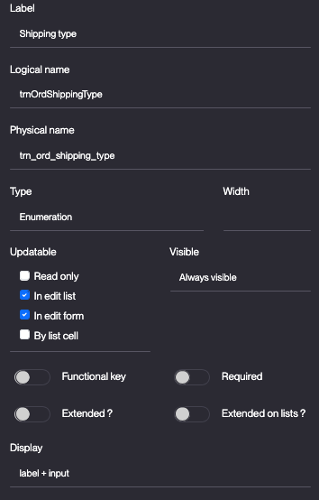
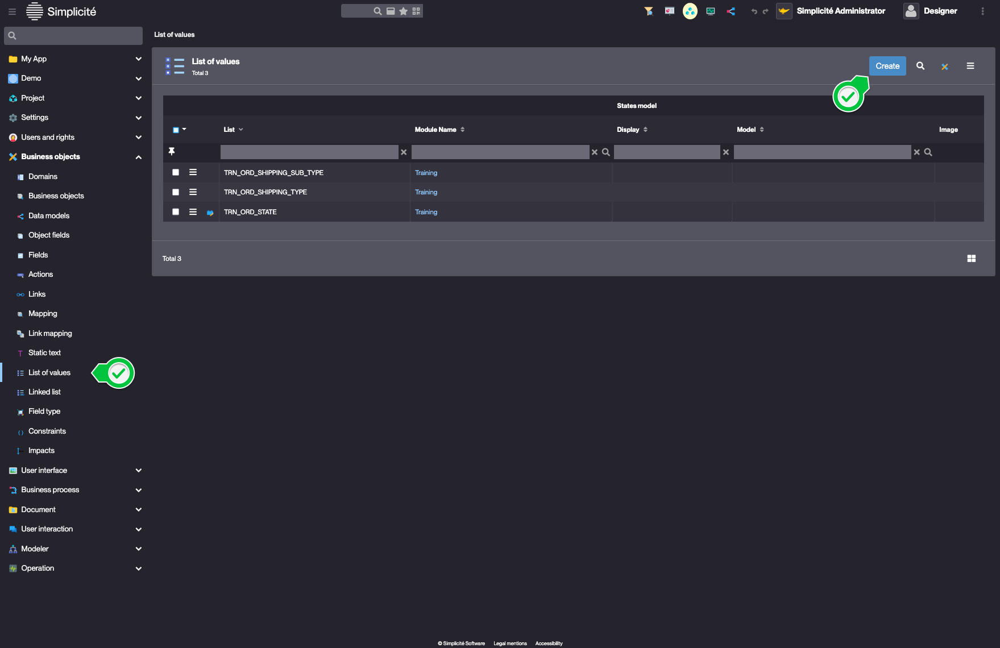
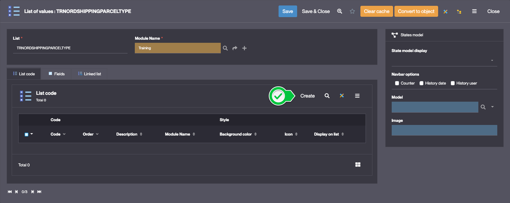
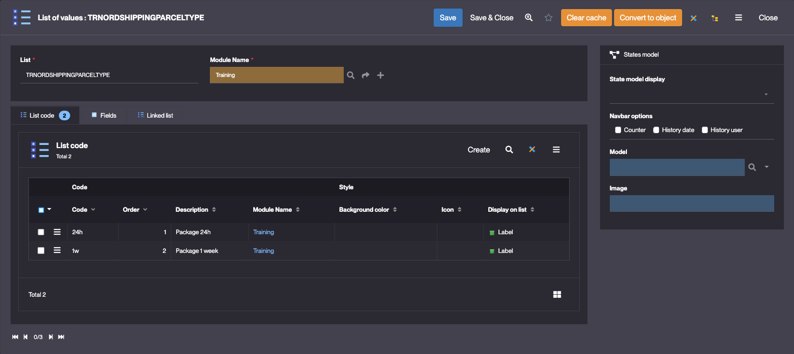
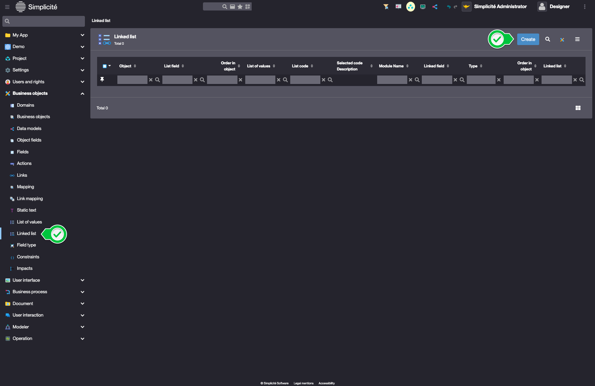
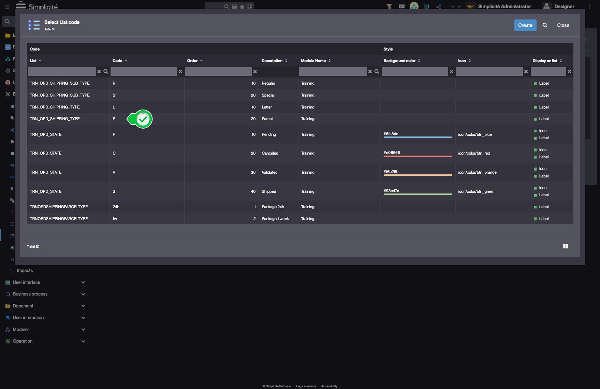
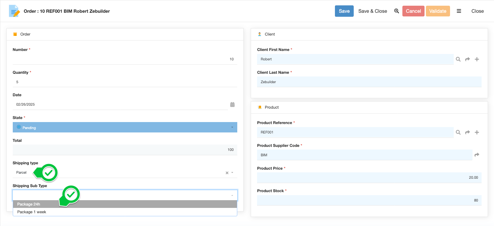

# Building the "Order Management" Training App : Creating a dynamic dropdown - Linked lists

> Prerequisite : [You have a basic understanding of the Simplicité platform, and the steps in "2. Expanding your app" are completed](/category/2-expanding-your-app)

## What is a Linked list ?

Linked lists allow you to create dynamic dropdown menus where the available options in one field change based on what's selected in another field... [Learn more](/docs/make/businessobjects/linkedlist.md)

## Creating a *Shipping type* and *Shipping sub-type* field for the Order

To do so, follow the step below :

1. Open the `TrnOrder` template editor
    > For a detailed step by step, see [Add a field](/docs/tutorial/getting-started/attribute.md)
2. Add a `Shipping type` enumeration field with the following values : 

    | Code | Value |
    | ---- | ----- |
    | L | Letter |
    | P | Parcel |

    

        
Configuration

        
    

    > For a detailed step by step, see [Add an enumeration field](/docs/tutorial/expanding/states.md#add-enum)

3. Add a `Shipping Sub Type` enumeration field with the following values : 

    | Code | Value |
    | ---- | ----- |
    | R | Regular |
    | S | Special |

    

        
Configuration

        
    

4. In the **Business objects > List of values** menu, click **Create**
    
5. Name the list: `TRNORDSHIPPINGPARCELTYPE`
6. Click **Save**
7. In the **List code** panel, click **Create**
    
8. Fill in the **List code** information like so: 
    - Code: **24h**
    - Description: **Package 24h**
9. Update the *English* **Translated list value**
    
10. Click **Save & Close**

Repeat the steps 7 -> 10 to create the code : `1w` : **Package 1 week** 

## Linking `P` list code to the *Parcel specific* list

1. In the **Business objects > Linked list** menu, click **Create**

2. Fill in the form like so :
    - Object reference : select the **trnOrdShippingType** field
    - List of values : **TRN_ORD_SHIPPING_TYPE**, code **P**
    
    - Linked object reference : select **trnOrdShippingSubType**
    - Linked list : **TRNORDSHIPPINGPARCELTYPE**

3. Click **Save & Close**

Repeat these steps to link `L` to the **TRN_ORD_SHIPPING_SUB_TYPE** List

## Test the Linked list with `usertest` 
1. Clear the platform's cache and log in using *usertest*
    > For a detailed step-by-step, see : [Testing the User](/tutorial/getting-started/user#activating-and-testing-the-user)

:::tip[Success]

On an Order's form, when selecting the "Parcel" shipping type, "Package 24h" and "Package 1 week" options are available in the *Shipping sub type* field

::::